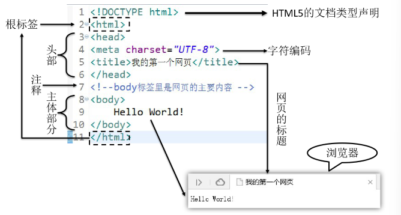
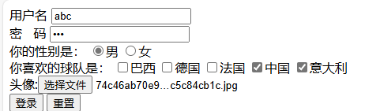
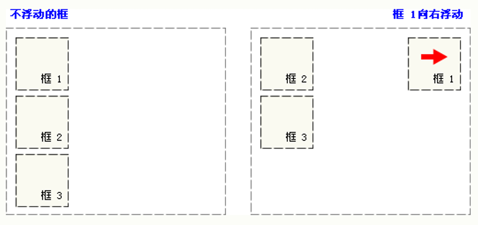
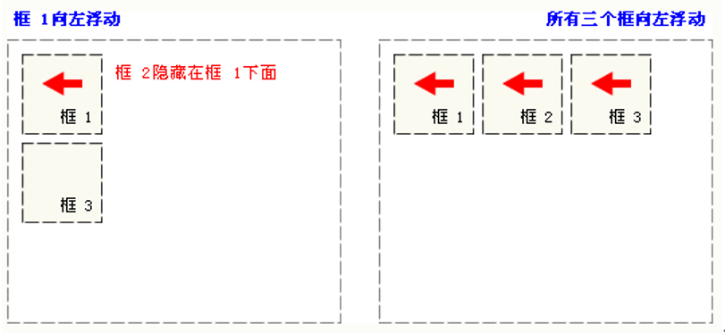
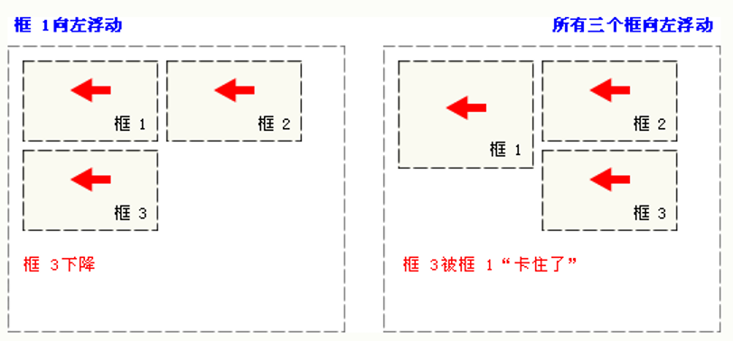
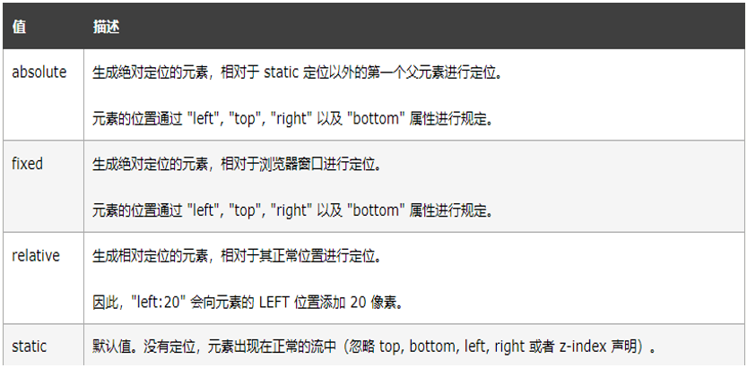
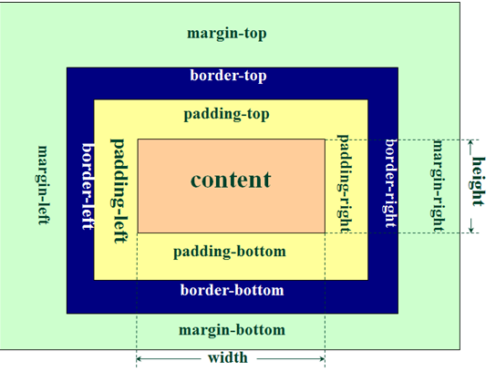

## HTML&CSS

### html5

是超文本标记语言

#### 基础结构

+ **文档类型声明**

  + html4：`<!DOCTYPE HTML PUBLIC "-//W3C//DTD HTML 4.01 Transitional//EN"
    "http://www.w3.org/TR/html4/loose.dtd">`

  + html5：`<!DOCTYPE html>`

+ **根标签**：`<html> </html>`

+ **头部元素**：`<head> </head>`

+ **主体元素**：`<body> </body>`

+ **注释**：`<!-- 注释内容 -->`



> **HTML规则：**
>
> 1. 无论是单 / 双标签都要正确关闭
> 2. 标签以及注释都不能嵌套
> 3. 属性必须有值，值必须加引号,H5中属性名和值相同时可以省略属性值
> 4. HTML中不严格区分字符串使用单双引号
> 5. HTML标签不严格区分大小写,但是不能大小写混用
> 6. 自定义标签无效


#### html标签

##### 常见标签

+ **标题标签**：`<h1> </h1> ... <h6> </h6>`

+ **段落标签**：`<p> </p>`

+ **换行标签**：`<br>`

  + 如果想添加分隔线,可以使用`<hr>`

+ **列表标签**：

  + 有序

    + 

      ```html
      <ol>
          <li>JAVA</li>
          <li>python</li>
          ...
      </ol>
      ```

  + 无序

    + 

      ```html
      <ul>
          <li>JAVA</li>
          ...
      </ul>
      ```

+ **超链接标签**：`<a href=''> </a>`

  + href用于定义链接
    + 可以使用绝对路径,以`/`开头,始终以一个固定路径作为基准路径作为出发点
    + 也可以使用相对路径,以当前文件所在路径为出发点
    + `href`中也可以定义完整的URL
  + target用于定义打开方式
    + `_blank` 在新窗口中打开目标资源
    + `_self`  在当前窗口中打开目标资源

+ **多媒体标签**：

  + **图片**：``
    + src定义图片的链接
    + title定义鼠标悬停时显示的文字
    + alt定义图片加载失败时显示的提示文字
  + **音频**：`<audio src='' />`
    + src定义目标声音资源
    + autoplay控制打开页面时是否自动播放
    + controls控制是否展示控制面板
    + loop控制是否进行循环播放

+ **表格标签**

  + `<table> </table>` 代表表格

  + `<thead> </thead>` 代表表头 可以省略不写

  + `<tbody> </tbody>` 代表表体 可以省略不写

  + `<tfoot> </tfoot>` 代表表尾  可以省略不写

  + `<tr> </tr>` 代表一行

  + `<td> </td>` 代表行内的一格，
    + **rowspan**属性实现上下跨行
    + **colspan**属性实现左右的跨列

  + `<th> </th>` 标签 自带加粗和居中效果的td

+ **布局**
  + `<div> </div>`  俗称"块",主要用于划分页面结构,做**页面布局**
  + `<span> </span>` 俗称"层",主要用于划分元素范围,配合CSS做页面元素样式的修饰
+ **特殊字符**：特殊含义的字符,需要通过转移字符来表示


##### 表单标签

+ `<form> </form>`,其内部用于定义可以让用户输入信息的表单项标签

  + `action`属性，用于定义信息提交的服务器的地址
  + `method`，用于定义信息的提交方式
    + `get`， 数据会缀到url后,以?作为参数开始的标识,多个参数用&隔开
    + ``post`，数据会通过请求体发送,不会在缀到url后

+ `<input/>`,主要的表单项标签,可以用于定义表单项

  + `name`属性,用于定义提交的参数名
  + `type`，用于定义表单项类型
    + `text`   文本框
    + `password`  密码框
    + `submit` 提交按钮
    + `reset`    重置按钮
    + `radio`  单选框
      + name属性相同的radio为一组，组内互斥
      + checked="checked"默认被选中
        + 如果属性名和属性值一样的话，可以省略属性值，只写checked即可
    + `checkbox`  复选框
      + checked="checked"默认被选中
    + `hidden` 不会显示到页面上，但是提交表单时会一起被提交。用来设置一些需要和表单一起提交但是不希望用户看到的数据
    + `file`  上传文件

+ 下拉框

  + 

    ```html
    你喜欢的运动是：
    <select name="interesting">
        <option value="swimming">游泳</option>
        <option value="running">跑步</option>
        <option value="shooting" selected="selected">射击</option>
        <option value="skating">溜冰</option>
    </select>
    ```

+ 按钮

  + 

    ```html
    <button type="button">普通按钮</button>或<input type="button" value="普通按钮"/>
    <button type="reset">重置按钮</button>或<input type="reset" value="重置按钮"/>
    <button type="submit">提交按钮</button>或<input type="submit" value="提交按钮"/>
    ```

+ 多行文本框：`<textarea name=''> </textarea>`

  + 没有value属性，如果要设置默认值需要写在开始和结束标签之间


**例子**：

```html
<!DOCTYPE html>
<html lang="en">
  <head>
    <meta charset="UTF-8" />
    <title>Document</title>
  </head>
  <body>
    <form action="" method="get">
      用户名 <input type="text" name="username" /> 
      <br />
      密&nbsp;&nbsp;&nbsp;码 <input type="password" name="password" /> 
      <br />
      你的性别是：
      <input type="radio" name="sex" value="boy" />男
      <input type="radio" name="sex" value="girl" checked="checked" />女
      <br />
      你喜欢的球队是： <input type="checkbox" name="team" value="Brazil" />巴西
      <input type="checkbox" name="team" value="German"  />德国
      <input type="checkbox" name="team" value="France" />法国
      <input type="checkbox" name="team" value="China" checked />中国
      <input type="checkbox" name="team" value="Italian" />意大利
      <br>
      头像:<input type="file" name="file"/>
      <br>
      <input type="submit" value="登录" />
      <input type="reset" value="重置" />
    </form>
  </body>
</html>

```



```
提交后url栏显示：
http://127.0.0.1:5500/HTML/%E8%A1%A8%E5%8D%95.html?username=abc&password=123&sex=boy&team=China&team=Italian&file=74c46ab70e9bda99d26189915df6d6bc5c84cb1c.jpg
```


### css

#### 引入方式

+ **行内式**
  + html代码和css样式代码交织在一起，css样式代码仅对当前元素有效
+ **内嵌式**
  + 需要在head标签中,通过一对style标签定义CSS样式
  + 样式的作用范围控制要依赖选择器
  + 样式代码中注释的方式为  /*   */
+ **连接式/外部样式表**
  + 创建单独的css文件存放样式代码
  + 在head标签中,通过`<link href="" rel="stylesheet" type="text/css"/>`引入外部CSS样式


#### css选择器

+ 元素选择器
  + `元素名 { }`
+ id选择器
  + `#元素id属性值 { }`
+ class选择器
  + `.class属性值 {}`
  + class属性值可以有多个


#### css浮动

CSS 的 Float（浮动）使元素脱离文档流，按照指定的方向（左或右发生移动），直到它的外边缘碰到包含框或另一个浮动框的边框为止。

+ 当把框 1 向右浮动时，它脱离文档流并且向右移动，直到它的右边缘碰到包含框的右边缘



+ 当框 1 向左浮动时，它脱离文档流并且向左移动，直到它的左边缘碰到包含框的左边缘。因为它不再处于文档流中，所以它不占据空间，实际上覆盖住了框 2，使框 2 从视图中消失。如果把所有三个框都向左移动，那么框 1 向左浮动直到碰到包含框，另外两个框向左浮动直到碰到前一个浮动框。



+ 如果包含框太窄，无法容纳水平排列的三个浮动元素，那么其它浮动块向下移动，直到有足够的空间。如果浮动元素的高度不同，那么当它们向下移动时可能被其它浮动元素“卡住”



浮动样式名：`float`

+ left 元素向左浮动
+ right 元素向右浮动
+ none 默认，元素不浮动


#### css定位



+ **绝对**定位后元素会**让出原来位置**,其他元素可以占用
+ **relative** 相对于自己原来的位置进行地位，相对定位后**保留原来的位置**,其他元素不会移动到该位置
+ **fixed** 定位在浏览器窗口固定位置,不会随着页面的上下移动而移动，元素定位后会**让出原来的位置**

> 块级元素垂直排列，行内元素水平排列


#### css盒子模型

所有HTML元素可以看作盒子。

+ Margin(外边距) - 清除边框外的区域，外边距是透明的。
+ Border(边框) - 围绕在内边距和内容外的边框。
+ Padding(内边距) - 清除内容周围的区域，内边距是透明的。
+ Content(内容) - 盒子的内容，显示文本和图像。




## js

### js基础语法


### 事件绑定


### BOM


### DOM


### 正则


## xml_tomcat_http

