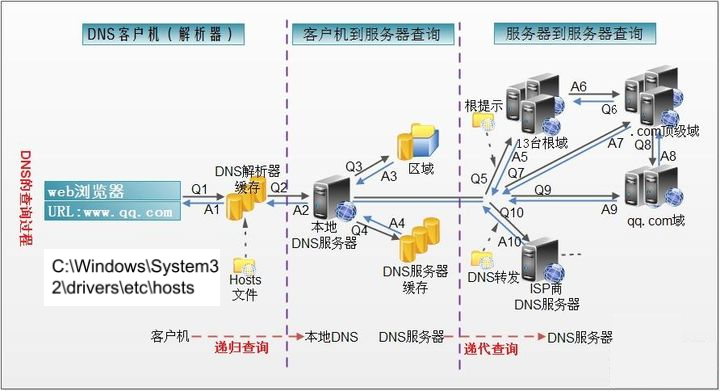

# 概述

Java提供的网络类库，可以实现无痛的网络连接，联网的底层细节被隐藏在 Java 的本机安装系统里，由 JVM 进行控制。

网络编程目的：直接或间接地通过网络协议与其它计算机实现数据交换，进行通讯

## 软件架构

**`C/S`架构** ：全称为`Client/Server`结构，是指客户端和服务器结构。常见程序有QQ、美团app、360安全卫士等软件。

**`B/S`架构** ：全称为`Browser/Server`结构，是指浏览器和服务器结构。常见浏览器有IE、谷歌、火狐等。

## 网络通信要素

### IP地址和域名

IP地址用来给网络中的一台计算机设备做唯一的编号。

IP地址的分类方式：

1. 方式一：IPV4、IPV6
   1. IPV4
   2. IPV6，为了扩大地址空间，通过IPv6重新定义地址空间，采用128位地址长度，共16个字节，写成8个无符号整数，每个整数用四个十六进制位表示，数之间用冒号（：）分开。比如：`ABCD:EF01:2345:6789:ABCD:EF01:2345:6789`
2. 方式二：公网地址( 万维网使用）和 私有地址( 局域网使用）
   1. 192.168.开头的就是私有地址，范围即为192.168.0.0--192.168.255.255
   2. 本地回环地址(hostAddress)：`127.0.0.1`  
   3. 主机名(hostName)：`localhost`

因为IP地址数字不便于记忆，因此出现了域名。域名容易记忆，当在连接网络时输入一个主机的域名后，域名服务器(DNS，Domain Name System，域名系统)负责将域名转化成IP地址，这样才能和主机建立连接。 

> 先找本地hosts，是否有输入的域名地址，没有的话，再通过DNS服务器找主机

1. 在浏览器中输入www . qq .com 域名，操作系统会先检查自己本地的`hosts文件`是否有这个网址映射关系，如果有，就先调用这个IP地址映射，完成域名解析。
2. 如果hosts里没有这个域名的映射，则查找`本地DNS解析器缓存`，是否有这个网址映射关系，如果有，直接返回，完成域名解析。
3. 如果hosts与本地DNS解析器缓存都没有相应的网址映射关系，首先会找`TCP/IP`参数中设置的首选DNS服务器，在此叫它`本地DNS服务器`，此服务器收到查询时，如果要查询的域名，包含在本地配置区域资源中，则返回解析结果给客户机，完成域名解析，此解析具有权威性。
4. 如果要查询的域名，不由本地DNS服务器区域解析，但该服务器已`缓存`了此网址映射关系，则调用这个IP地址映射，完成域名解析，此解析不具有权威性。
5. 如果本地DNS服务器本地区域文件与缓存解析都失效，则根据本地DNS服务器的设置（是否设置转发器）进行查询，如果未用转发模式，本地DNS就把请求发至13台根DNS，根DNS服务器收到请求后会判断这个域名(.com)是谁来授权管理，并会返回一个负责该顶级域名服务器的一个IP。本地DNS服务器收到IP信息后，将会联系负责.com域的这台服务器。这台负责.com域的服务器收到请求后，如果自己无法解析，它就会找一个管理.com域的下一级DNS服务器地址(`http://qq.com`)给本地DNS服务器。当本地DNS服务器收到这个地址后，就会找（`http://qq.com`)域服务器，重复上面的动作，进行查询，直至找到`www.qq.com`主机。
6. 如果用的是转发模式，此DNS服务器就会把请求转发至上一级DNS服务器，由上一级服务器进行解析，上一级服务器如果不能解析，或找根DNS或把转请求转至上上级，以此循环。不管是本地DNS服务器用是是转发，还是根提示，最后都是把结果返回给本地DNS服务器，由此DNS服务器再返回给客户机。

### 端口号

网络的通信，本质上是两个进程（应用程序）的通信。

**端口号**就可以唯一标识设备中的进程（应用程序）。

**端口号：用两个字节表示的整数，它的取值范围是0~65535**。

- 公认端口：0~1023。被预先定义的服务通信占用，如：HTTP（80），FTP（21），Telnet（23）
- 注册端口：1024~49151。分配给用户进程或应用程序。如：Tomcat（8080），MySQL（3306），Oracle（1521）。
- 动态/ 私有端口：49152~65535。

如果端口号被另外一个服务或应用所占用，会导致当前程序启动失败。

### 网络通信协议

# 传输协议：TCP与UDP

# 网络编程API

# TCP网络编程

# UDP网络编程

# URL编程

