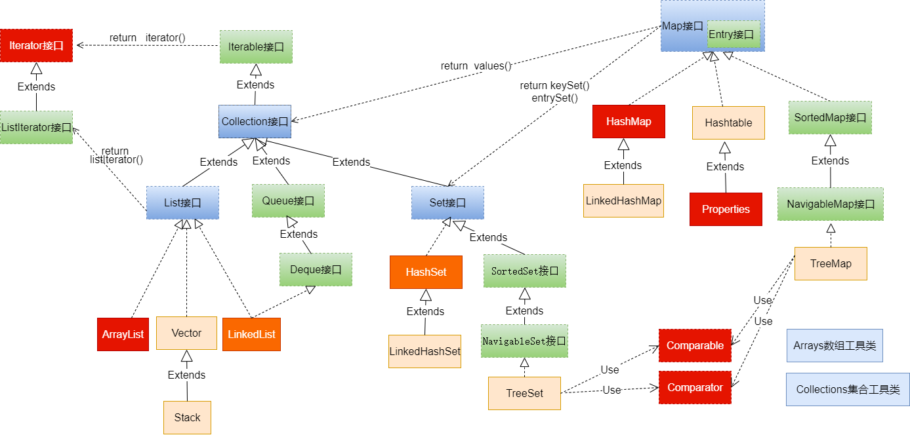
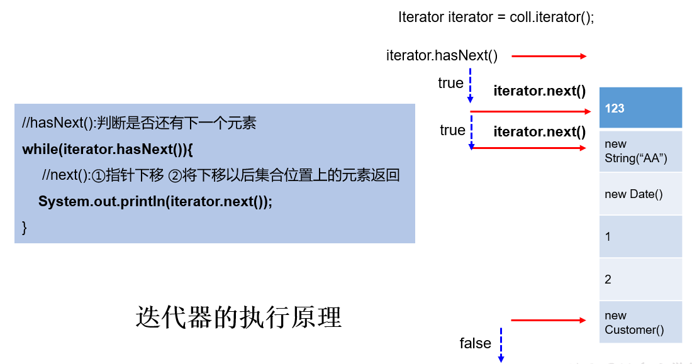
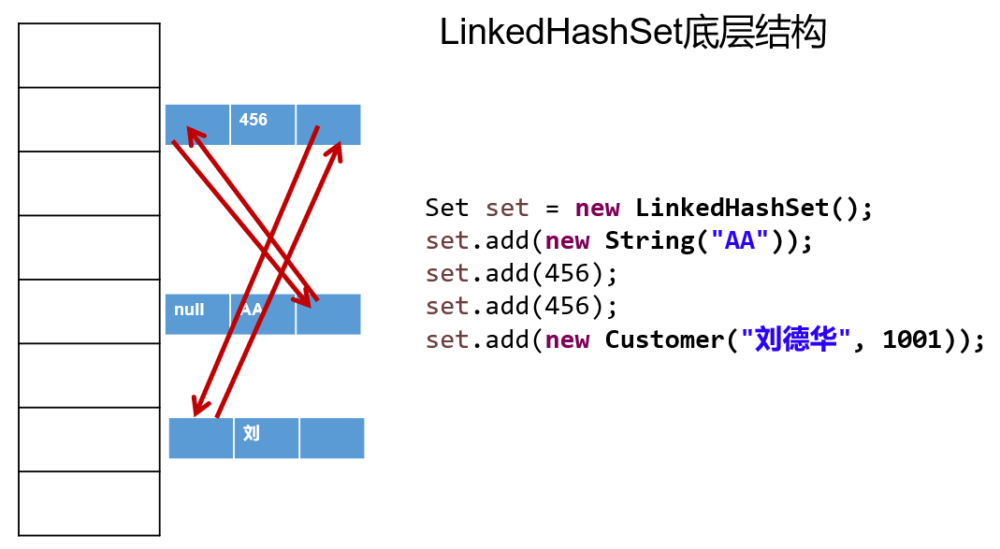
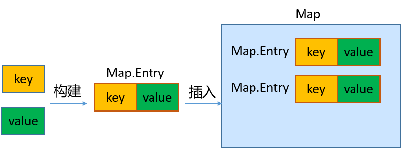

# 集合概述

Java 集合可分为 Collection 和 Map 两大体系：

- Collection接口：用于存储一个一个的数据，也称`单列数据集合`。
  - List子接口：用来存储有序的、可以重复的数据（主要用来替换数组，"动态"数组）
    - 实现类：ArrayList(主要实现类)、LinkedList、Vector
  - Set子接口：用来存储无序的、不可重复的数据（类似于高中讲的"集合"）
    - 实现类：HashSet(主要实现类)、LinkedHashSet、TreeSet
- Map接口：用于存储具有映射关系“key-value对”的集合，即一对一对的数据，也称`双列数据集合`。
  - HashMap(主要实现类)、LinkedHashMap、TreeMap、Hashtable、Properties

- JDK提供的集合API位于java.util包内

- 集合框架图：



# Collection接口及方法

- JDK不提供此接口的任何直接实现，而是提供更具体的子接口（如：Set和List）去实现。
- Collection 接口是 List和Set接口的父接口，该接口里定义的方法既可用于操作 Set 集合，也可用于操作 List 集合。

## 添加

1. add(E obj)：添加元素对象到当前集合中
2. addAll(Collection other)：添加other集合中的所有元素对象到当前集合中

add和addAll的区别：

```java
import org.junit.Test;

import java.util.ArrayList;
import java.util.Collection;

public class TestCollectionAdd {

    @Test
    public void testAddAll(){
        Collection c1 = new ArrayList();
        c1.add(1);
        c1.add(2);
        System.out.println("c1 = " + c1); // c1 = [1, 2]

        Collection c2 = new ArrayList();
        c2.add(1);
        c2.add(2);
        System.out.println("c2 = " + c2); // c2 = [1, 2]

        Collection other = new ArrayList();
        other.add(1);
        other.add(2);
        other.add(3);
        System.out.println("other = " + other); // other = [1, 2, 3]

        c1.addAll(other);
        System.out.println("c1集合元素的个数：" + c1.size());//5
        System.out.println("c1.addAll(other) = " + c1); // c1.addAll(other) = [1, 2, 1, 2, 3]

        c2.add(other);
        System.out.println("c2集合元素的个数：" + c2.size());//3
        System.out.println("c2.add(other) = " + c2); // c2.add(other) = [1, 2, [1, 2, 3]]
    }
}
```

## 判断

1. int size()：获取当前集合中实际存储的元素个数
2. boolean isEmpty()：判断当前集合是否为空集合
3. boolean contains(Object obj)：判断当前集合中是否存在一个与obj对象equals返回true的元素
4. boolean containsAll(Collection coll)：判断coll集合中的元素是否在当前集合中都存在。即coll集合是否是当前集合的“子集”
5. boolean equals(Object obj)：判断当前集合与obj是否相等

## 删除

1. void clear()：清空集合元素
2. boolean remove(Object obj) ：从当前集合中删除第一个找到的与obj对象equals返回true的元素。
3. boolean removeAll(Collection coll)：从当前集合中删除所有与coll集合中相同的元素。
4. boolean retainAll(Collection coll)：从当前集合中删除两个集合中不同的元素，使得当前集合仅保留与coll集合中的元素相同的元素，即当前集合中仅保留两个集合的交集，

## 其他

1. Object[] toArray()：返回包含当前集合中所有元素的数组
2. hashCode()：获取集合对象的哈希值
3. iterator()：返回迭代器对象，用于集合遍历

# Iterator（迭代器）接口

## Iterator接口

- 在程序开发中，经常需要遍历集合中的所有元素。针对这种需求，JDK专门提供了一个接口`java.util.Iterator`。
  - Collection接口与Map接口主要用于`存储`元素
  - `Iterator`，被称为迭代器接口，本身并不提供存储对象的能力，主要用于`遍历`Collection中的元素


- Collection接口继承了java.lang.Iterable接口，该接口有一个iterator()方法，那么所有实现了Collection接口的集合类都有一个iterator()方法，用以返回一个实现了Iterator接口的对象。
  - `public Iterator iterator()`: 获取集合对应的迭代器，用来遍历集合中的元素的。
  - 集合对象每次调用iterator()方法都得到一个全新的迭代器对象，默认游标都在集合的第一个元素之前。

- Iterator接口的常用方法如下：
  - `public E next()`:返回迭代的下一个元素。
  - `public boolean hasNext()`:如果仍有元素可以迭代，则返回 true。

- 注意：在调用it.next()方法之前必须要调用it.hasNext()进行检测。若不调用，直接调用it.next()会抛出`NoSuchElementException异常`。

```java
import org.junit.Test;
import java.util.ArrayList;
import java.util.Collection;
import java.util.Iterator;

public class TestIterator {

    @Test
    public void test01(){
        Collection coll = new ArrayList();
        coll.add("小李广");
        coll.add("扫地僧");
        coll.add("石破天");

        Iterator iterator = coll.iterator();//获取迭代器对象
        while(iterator.hasNext()) {//判断是否还有元素可迭代
            System.out.println(iterator.next());//取出下一个元素
        }
    }
}

```

## 迭代器的执行原理



使用Iterator迭代器删除元素：java.util.Iterator迭代器中有一个方法：void remove() ;

```java
Iterator iter = coll.iterator();//回到起点
while(iter.hasNext()){
    Object obj = iter.next();
    if(obj.equals("Tom")){
        iter.remove();
    }
}
```

- Iterator可以删除集合的元素，但是遍历过程中通过迭代器对象的remove方法，不是集合对象的remove方法。
- 如果还未调用next()或在上一次调用 next() 方法之后已经调用了 remove() 方法，再调用remove()都会报IllegalStateException。
- 在JDK8.0时，Collection接口有了removeIf 方法，即可以根据条件删除。

```java
import org.junit.Test;
import java.util.ArrayList;
import java.util.Collection;
import java.util.Iterator;
import java.util.function.Predicate;

public class TestIteratorRemove {
    @Test
    public void test01(){
        Collection coll = new ArrayList();
        coll.add(1);
        coll.add(2);
        coll.add(3);
        coll.add(4);
        coll.add(5);
        coll.add(6);

        Iterator iterator = coll.iterator();
        while(iterator.hasNext()){
            Integer element = (Integer) iterator.next();
            if(element % 2 == 0){
                iterator.remove();
            }
        }
        System.out.println(coll); // [1, 3, 5]
    }

    @Test
    public void test02(){
        Collection coll = new ArrayList();
        coll.add("小李广");
        coll.add("扫地僧");
        coll.add("石破天");
        coll.add("佛地魔");
        System.out.println("coll = " + coll);

        coll.removeIf(new Predicate() {
            @Override
            public boolean test(Object o) {
                String str = (String) o;
                return str.contains("地");
            }
        });
        System.out.println("删除包含\"地\"字的元素之后coll = " + coll);
        // 删除包含"地"字的元素之后coll = [小李广, 石破天]
    }
}

```

## foreach循环

foreach循环（也称增强for循环）是 JDK5.0 中定义的一个高级for循环，专门用来`遍历数组和集合`的。

foreach循环用于遍历Collection和数组。通常只进行遍历元素，不要在遍历的过程中对集合元素进行增删操作。

语法格式：

```java
for(元素的数据类型 局部变量 : Collection集合或数组){ 
  	//操作局部变量的输出操作
}
```

> 对于集合的遍历，增强for的内部原理其实是个Iterator迭代器

```java
import org.junit.Test;
import java.util.ArrayList;
import java.util.Collection;

public class TestForeach {
    @Test
    public void test01(){
        Collection coll = new ArrayList();
        coll.add("小李广");
        coll.add("扫地僧");
        coll.add("石破天");
        //foreach循环其实就是使用Iterator迭代器来完成元素的遍历的。
        for (Object o : coll) {
            System.out.println(o);
        }
    }
    @Test
    public void test02(){
        int[] nums = {1,2,3,4,5};
        for (int num : nums) {
            System.out.println(num);
        }
        System.out.println("-----------------");
        String[] names = {"张三","李四","王五"};
        for (String name : names) {
            System.out.println(name);
        }
    }

    @Test
    public void test03(){
        String[] str = new String[5];
        for (String myStr : str) {
            myStr = "demo";
            System.out.println(myStr); //demo
        }
        for (int i = 0; i < str.length; i++) {
            System.out.println(str[i]); // null
        }
        /*
        增强for循环会依次将数组str中的每个元素赋值给临时变量myStr。
        myStr只是一个临时变量，它存储的是数组元素的副本，而不是数组元素本身的引用。
        当执行myStr = "demo";时，只是将临时变量myStr指向了新的字符串对象"demo"，并没有改变数组str中元素的引用。
        所以，在增强for循环中打印myStr时，会输出"demo"，但数组str中的元素仍然是null
         */
    }
}
```

# Collection子接口：List

## List接口特点

- 鉴于Java中数组用来存储数据的局限性，通常使用`java.util.List`替代数组
- List集合类中`元素有序`、且`可重复`，集合中的每个元素都有其对应的顺序索引。
- JDK API中List接口的实现类常用的有：`ArrayList`、`LinkedList`和`Vector`。

## List接口方法

List除了从Collection集合继承的方法外，List 集合里添加了一些`根据索引`来操作集合元素的方法。

- 插入元素
  - `void add(int index, Object ele)`:在index位置插入ele元素
  - boolean addAll(int index, Collection eles):从index位置开始将eles中的所有元素添加进来
- 获取元素
  - `Object get(int index)`:获取指定index位置的元素
  - List subList(int fromIndex, int toIndex):返回从fromIndex到toIndex位置的子集合
- 获取元素索引
  - int indexOf(Object obj):返回obj在集合中首次出现的位置
  - int lastIndexOf(Object obj):返回obj在当前集合中末次出现的位置
- 删除和替换元素
  - `Object remove(int index)`:移除指定index位置的元素，并返回此元素

  - `Object set(int index, Object ele)`:设置指定index位置的元素为ele

> 注意：在JavaSE中List名称的类型有两个，一个是java.util.List集合接口，一个是java.awt.List图形界面的组件，别导错包了。

## List接口实现类：ArrayList

- ArrayList 是 List 接口的`主要实现类`

- 本质上，ArrayList是对象引用的一个”变长”数组

- Arrays.asList(…) 方法返回的 List 集合，既不是 ArrayList 实例，也不是 Vector 实例。 Arrays.asList(…) 返回值是一个固定长度的 List 集合

## List接口实现类：LinkedList

+ 对于频繁的插入或删除元素的操作，建议使用LinkedList类，效率较高。这是由底层采用链表（双向链表）结构存储数据决定的。

+ 特有方法：

  - void addFirst(Object obj)

  - void addLast(Object obj)	

  - Object getFirst()

  - Object getLast()

  - Object removeFirst()

  - Object removeLast()

## List接口实现类：Vector

- Vector 是一个`古老`的集合，JDK1.0就有了。大多数操作与ArrayList相同，区别之处在于Vector是`线程安全`的。
- 在各种List中，最好把`ArrayList作为默认选择`。当插入、删除频繁时，使用LinkedList；Vector总是比ArrayList慢，所以尽量避免使用。
- 特有方法：
  - void addElement(Object obj)
  - void insertElementAt(Object obj,int index)
  - void setElementAt(Object obj,int index)
  - void removeElement(Object obj)
  - void removeAllElements()

# Collection子接口：Set

## Set接口概述

- Set接口是Collection的子接口，Set接口相较于Collection接口没有提供额外的方法
- Set 集合不允许包含相同的元素。
- Set集合支持的遍历方式和Collection集合一样：foreach和Iterator。
- Set的常用实现类有：HashSet、TreeSet、LinkedHashSet。

## Set接口实现类：HashSet

### HashSet概述

- HashSet 是 Set 接口的主要实现类，大多数时候使用 Set 集合时都使用这个实现类。

- HashSet 按 Hash 算法来存储集合中的元素，因此具有很好的存储、查找、删除性能。

- HashSet 具有以下`特点`：
  - 不能保证元素的排列顺序
  - HashSet 不是线程安全的
  - 集合元素可以是 null

- HashSet 集合`判断两个元素相等的标准`：两个对象通过 `hashCode()` 方法得到的哈希值相等，并且两个对象的 `equals() `方法返回值为true。

- 对于存放在Set容器中的对象，**对应的类一定要重写hashCode()和equals(Object obj)方法**，以实现对象相等规则。

- HashSet集合中元素的无序性，不等同于随机性。这里的无序性与元素的添加位置有关。具体来说：我们在添加每一个元素到数组中时，具体的存储位置是由元素的hashCode()调用后返回的hash值决定的。导致在数组中每个元素不是依次紧密存放的，表现出一定的无序性。

### HashSet添加元素的过程

- 第1步：当向 HashSet 集合中存入一个元素时，HashSet 会调用该对象的 hashCode() 方法得到该对象的 hashCode值，然后根据 hashCode值，通过某个散列函数决定该对象在 HashSet 底层数组中的存储位置。

- 第2步：如果要在数组中存储的位置上没有元素，则直接添加成功。

- 第3步：如果要在数组中存储的位置上有元素，则继续比较：

  - 如果两个元素的hashCode值不相等，则添加成功；
  - 如果两个元素的hashCode()值相等，则会继续调用equals()方法：
    - 如果equals()方法结果为false，则添加成功。
    - 如果equals()方法结果为true，则添加失败。

> 第2步添加成功，元素会保存在底层数组中。
>
> 第3步两种添加成功的操作，由于该底层数组的位置已经有元素了，则会通过`链表`的方式继续链接，存储。

```java
import org.junit.Test;
import java.util.HashSet;
import java.util.Objects;

public class TestHashSet {
    @Test
    public void test01(){
        HashSet set = new HashSet();
        set.add("张三");
        set.add("张三");
        set.add("李四");
        set.add("王五");
        set.add("王五");
        set.add("赵六");

        System.out.println("set = " + set);
        // set = [李四, 张三, 王五, 赵六]
    }

    @Test
    public void test02(){
        HashSet set = new HashSet();
        set.add(new MyDate(2021,1,1));
        set.add(new MyDate(2021,1,1));
        set.add(new MyDate(2022,2,4));
        set.add(new MyDate(2022,2,4));
        
        System.out.println("set = " + set);
        // set = [MyDate{year=2022, month=2, day=4}, MyDate{year=2021, month=1, day=1}]
    }
}


class MyDate {
    private int year;
    private int month;
    private int day;

    public MyDate(int year, int month, int day) {
        this.year = year;
        this.month = month;
        this.day = day;
    }

    @Override
    public boolean equals(Object o) {
        if (this == o) return true;
        if (o == null || getClass() != o.getClass()) return false;
        MyDate myDate = (MyDate) o;
        return year == myDate.year &&
                month == myDate.month &&
                day == myDate.day;
    }

    @Override
    public int hashCode() {
        return Objects.hash(year, month, day);
    }

    @Override
    public String toString() {
        return "MyDate{" +
                "year=" + year +
                ", month=" + month +
                ", day=" + day +
                '}';
    }
}
```

### 重写hashCode()方法的基本原则

- 在程序运行时，同一个对象多次调用 hashCode() 方法应该返回相同的值。
- 当两个对象的 equals() 方法比较返回 true 时，这两个对象的 hashCode() 方法的返回值也应相等。
- 对象中用作 equals() 方法比较的 Field，都应该用来计算 hashCode 值。


> 注意：如果两个元素的 equals() 方法返回 true，但它们的 hashCode() 返回值不相等，hashSet 将会把它们存储在不同的位置，但依然可以添加成功。

### 重写equals()方法的基本原则

- 重写equals方法的时候一般都需要同时复写hashCode方法。通常参与计算hashCode的对象的属性也应该参与到equals()中进行计算。

- 开发中直接调用IDEA里的快捷键自动重写equals()和hashCode()方法即可。

- 为什么用IDEA复写hashCode方法，有31这个数字？
  - 首先，选择系数的时候要选择尽量大的系数。因为如果计算出来的hash地址越大，所谓的“冲突”就越少，查找起来效率也会提高。（减少冲突）
  - 其次，31只占用5bits,相乘造成数据溢出的概率较小。
  - 再次，31可以 由i*31== (i<<5)-1来表示,现在很多虚拟机里面都有做相关优化。（提高算法效率）
  - 最后，31是一个素数，素数作用就是如果我用一个数字来乘以这个素数，那么最终出来的结果只能被素数本身和被乘数还有1来整除！(减少冲突)


## Set接口实现类：LinkedHashSet

- LinkedHashSet 是 HashSet 的子类，不允许集合元素重复。

- LinkedHashSet 根据元素的 hashCode 值来决定元素的存储位置，但它同时使用`双向链表`维护元素的次序，这使得元素看起来是以`添加顺序`保存的。

- LinkedHashSet`插入性能略低`于 HashSet，但在`迭代访问` Set 里的全部元素时有很好的性能。




## Set接口实现类：TreeSet

- TreeSet 是 SortedSet 接口的实现类，TreeSet 可以按照添加的元素的指定的属性的大小顺序进行遍历。
- TreeSet底层使用`红黑树`结构存储数据
- 新增的方法如下： (了解)
  - Comparator comparator()
  - Object first()
  - Object last()
  - Object lower(Object e)
  - Object higher(Object e)
  - SortedSet subSet(fromElement, toElement)
  - SortedSet headSet(toElement)
  - SortedSet tailSet(fromElement)
- TreeSet 两种排序方法：`自然排序`和`定制排序`。默认情况下，TreeSet 采用自然排序。
  - `自然排序`：TreeSet 会调用集合元素的 compareTo(Object obj) 方法来比较元素之间的大小关系，然后将集合元素按升序(默认情况)排列。
    - 如果试图把一个对象添加到 TreeSet 时，则该对象的类必须实现 Comparable 接口。
    - 实现 Comparable 的类必须实现 compareTo(Object obj) 方法，两个对象即通过 compareTo(Object obj) 方法的返回值来比较大小。
  - `定制排序`：如果元素所属的类没有实现Comparable接口，或不希望按照升序(默认情况)的方式排列元素或希望按照其它属性大小进行排序，则考虑使用定制排序。定制排序，通过Comparator接口来实现。需要重写compare(T o1,T o2)方法。
    - 利用int compare(T o1,T o2)方法，比较o1和o2的大小：如果方法返回正整数，则表示o1大于o2；如果返回0，表示相等；返回负整数，表示o1小于o2。
    - 要实现定制排序，需要将实现Comparator接口的实例作为形参传递给TreeSet的构造器。
- 因为只有相同类的两个实例才会比较大小，所以向 TreeSet 中添加的应该是`同一个类的对象`。

举例：

```java
public class TreeSetTest {
    /*
     * 自然排序：针对User类的对象
     * */
    @Test
    public void test1(){
        TreeSet set = new TreeSet();

        set.add(new User("Tom",12));
        set.add(new User("Rose",23));
        set.add(new User("Jerry",2));
        set.add(new User("Eric",18));
        set.add(new User("Tommy",44));
        set.add(new User("Jim",23));
        set.add(new User("Maria",18));
//        set.add("Tom"); //java.lang.ClassCastException

        Iterator iterator = set.iterator();
        while(iterator.hasNext()){
            System.out.println(iterator.next());
        }

        System.out.println(set.contains(new User("Jim", 23))); //true
    }

    /*
     * 定制排序
     * */
    @Test
    public void test2(){
        //按照User的姓名的从小到大的顺序排列
        Comparator comparator = new Comparator() {
            @Override
            public int compare(Object o1, Object o2) {
                if(o1 instanceof User && o2 instanceof User){
                    User u1 = (User)o1;
                    User u2 = (User)o2;

                    return u1.name.compareTo(u2.name);
                }
                throw new RuntimeException("输入的类型不匹配");
            }
        };
        TreeSet set = new TreeSet(comparator);

        set.add(new User("Tom",12));
        set.add(new User("Rose",23));
        set.add(new User("Jerry",2));
        set.add(new User("Eric",18));
        set.add(new User("Tommy",44));
        set.add(new User("Jim",23));
        set.add(new User("Maria",18));

        Iterator iterator = set.iterator();
        while(iterator.hasNext()){
            System.out.println(iterator.next());
        }
    }
}

class User implements Comparable{
    String name;
    int age;

    public User() {
    }

    public User(String name, int age) {
        this.name = name;
        this.age = age;
    }

    @Override
    public String toString() {
        return "User{" +
                "name='" + name + '\'' +
                ", age=" + age +
                '}';
    }
    /*
    举例：按照age从小到大的顺序排列，如果age相同，则按照name从大到小的顺序排列
    * */
    public int compareTo(Object o) {
        if(this == o){
            return 0;
        }

        if(o instanceof User){
            User user = (User)o;
            int value = this.age - user.age;
            if(value != 0){
                return value;
            }
            return -this.name.compareTo(user.name);
        }
        throw new RuntimeException("输入的类型不匹配");
    }
}

```

# Map接口

## Map接口概述

Java提供了专门的集合框架用来存储映射关系的对象，即`java.util.Map`接口。

- Map与Collection并列存在。用于保存具有`映射关系`的数据：key-value
  - Map 中的 key 和  value 都可以是任何引用类型的数据。但常用String类作为Map的“键”。
  - Map 中的 `key用Set来存放`，`不允许重复`，即同一个 Map 对象所对应的类，须重写hashCode()和equals()方法
  - key 和 value 之间存在单向一对一关系，即通过指定的 key 总能找到唯一的、确定的 value，不同key对应的`value可以重复`。value所在的类要重写equals()方法。
  - key和value构成一个entry。所有的entry彼此之间是`无序的`、`不可重复的`。



- Map接口的常用实现类：`HashMap`、`LinkedHashMap`、`TreeMap`和``Properties`。其中，HashMap是 Map 接口使用`频率最高`的实现类。

## Map接口常用方法

- **添加、修改操作：**
  - Object put(Object key,Object value)：将指定key-value添加到(或修改)当前map对象中
  - void putAll(Map m):将m中的所有key-value对存放到当前map中
- **删除操作：**
  - Object remove(Object key)：移除指定key的key-value对，并返回value
  - void clear()：清空当前map中的所有数据
- **元素查询的操作：**
  - Object get(Object key)：获取指定key对应的value
  - boolean containsKey(Object key)：是否包含指定的key
  - boolean containsValue(Object value)：是否包含指定的value
  - int size()：返回map中key-value对的个数
  - boolean isEmpty()：判断当前map是否为空
  - boolean equals(Object obj)：判断当前map和参数对象obj是否相等
- **元视图操作的方法：**
  - Set keySet()：返回所有key构成的Set集合
  - Collection values()：返回所有value构成的Collection集合
  - Set entrySet()：返回所有key-value对构成的Set集合

## Map接口实现类：HashMap

### HashMap概述

- HashMap是 Map 接口`使用频率最高`的实现类。
- HashMap是线程不安全的。允许添加 null 键和 null 值。
- 存储数据采用的哈希表结构，底层使用`一维数组`+`单向链表`+`红黑树`进行key-value数据的存储。元素的存取顺序不能保证一致。
- HashMap `判断两个key相等的标准`是：两个 key 的hashCode值相等，通过 equals() 方法返回 true。
- HashMap `判断两个value相等的标准`是：两个 value 通过 equals() 方法返回 true。

举例：

```java
public class SingerTest1 {
    public static void main(String[] args) {

        //创建一个HashMap用于保存歌手和其歌曲集
        HashMap singers = new HashMap();
        
        String singer1 = "周杰伦";
        ArrayList songs1 = new ArrayList();
        songs1.add("双节棍");
        songs1.add("本草纲目");
        songs1.add("夜曲");
        songs1.add("稻香");
        singers.put(singer1,songs1);

        String singer2 = "陈奕迅";
        List songs2 = Arrays.asList("浮夸", "十年", "红玫瑰", "好久不见", "孤勇者");
        singers.put(singer2,songs2);

        //遍历map
        Set entrySet = singers.entrySet();
        for(Object obj : entrySet){
            Map.Entry entry = (Map.Entry)obj;
            String singer = (String) entry.getKey();
            List songs = (List) entry.getValue();

            System.out.println("歌手：" + singer);
            System.out.println("歌曲有：" + songs);
        }
//        歌手：周杰伦
//        歌曲有：[双节棍, 本草纲目, 夜曲, 稻香]
//        歌手：陈奕迅
//        歌曲有：[浮夸, 十年, 红玫瑰, 好久不见, 孤勇者]

    }
}
```

```java
import org.junit.Test;

import java.util.HashMap;
import java.util.HashSet;

//方式2：改为HashSet实现
public class SingerTest2 {
    @Test
    public void test1() {

        Singer singer1 = new Singer("周杰伦");
        Singer singer2 = new Singer("陈奕迅");

        Song song1 = new Song("双节棍");
        Song song2 = new Song("本草纲目");
        Song song3 = new Song("夜曲");
        Song song4 = new Song("浮夸");
        Song song5 = new Song("十年");
        Song song6 = new Song("孤勇者");

        HashSet h1 = new HashSet();// 放歌手一的歌曲
        h1.add(song1);
        h1.add(song2);
        h1.add(song3);

        HashSet h2 = new HashSet();// 放歌手二的歌曲
        h2.add(song4);
        h2.add(song5);
        h2.add(song6);

        HashMap hashMap = new HashMap();// 放歌手和他对应的歌曲
        hashMap.put(singer1, h1);
        hashMap.put(singer2, h2);

        for (Object obj : hashMap.keySet()) {
            System.out.println(obj + "=" + hashMap.get(obj));
        }
//        陈奕迅=[《十年》, 《孤勇者》, 《浮夸》]
//        周杰伦=[《双节棍》, 《本草纲目》, 《夜曲》]

    }
}

//歌曲
class Song implements Comparable{
    private String songName;//歌名

    public Song() {
        super();
    }

    public Song(String songName) {
        super();
        this.songName = songName;
    }

    public String getSongName() {
        return songName;
    }

    public void setSongName(String songName) {
        this.songName = songName;
    }

    @Override
    public String toString() {
        return "《" + songName + "》";
    }

    @Override
    public int compareTo(Object o) {
        if(o == this){
            return 0;
        }
        if(o instanceof Song){
            Song song = (Song)o;
            return songName.compareTo(song.getSongName());
        }
        return 0;
    }


}
//歌手
class Singer implements Comparable{
    private String name;
    private Song song;

    public Singer() {
        super();
    }

    public Singer(String name) {
        super();
        this.name = name;

    }

    public String getName() {
        return name;
    }

    public void setName(String name) {
        this.name = name;
    }

    public Song getSong() {
        return song;
    }

    public void setSong(Song song) {
        this.song = song;
    }

    @Override
    public String toString() {
        return name;
    }

    @Override
    public int compareTo(Object o) {
        if(o == this){
            return 0;
        }
        if(o instanceof Singer){
            Singer singer = (Singer)o;
            return name.compareTo(singer.getName());
        }
        return 0;
    }
}
```

## Map接口实现类：LinkedHashMap

- LinkedHashMap 是 HashMap 的子类
- 存储数据采用的哈希表结构+链表结构，在HashMap存储结构的基础上，使用了一对`双向链表`来`记录添加元素的先后顺序`，可以保证遍历元素时，与添加的顺序一致。
- 通过哈希表结构可以保证键的唯一、不重复，需要键所在类重写hashCode()方法、equals()方法。

```java
public class TestLinkedHashMap {
    public static void main(String[] args) {
        LinkedHashMap map = new LinkedHashMap();
        map.put("王五", 13000.0);
        map.put("张三", 10000.0);
        //key相同，新的value会覆盖原来的value
        //因为String重写了hashCode和equals方法
        map.put("张三", 12000.0);
        map.put("李四", 14000.0);
        //HashMap支持key和value为null值
        String name = null;
        Double salary = null;
        map.put(name, salary);

        Set entrySet = map.entrySet();
        for (Object obj : entrySet) {
            Map.Entry entry = (Map.Entry)obj;
            System.out.println(entry);
        }
//        王五=13000.0
//        张三=12000.0
//        李四=14000.0
//        null=null
    }
}
```

## Map接口实现类：TreeMap

- TreeMap存储 key-value 对时，需要根据 key-value 对进行排序。TreeMap 可以保证所有的 key-value 对处于`有序状态`。
- TreeSet底层使用`红黑树`结构存储数据
- TreeMap 的 Key 的排序：
  - `自然排序`：TreeMap 的所有的 Key 必须实现 Comparable 接口，而且所有的 Key 应该是同一个类的对象，否则将会抛出 ClasssCastException
  - `定制排序`：创建 TreeMap 时，构造器传入一个 Comparator 对象，该对象负责对 TreeMap 中的所有 key 进行排序。此时不需要 Map 的 Key 实现 Comparable 接口
- TreeMap判断`两个key相等的标准`：两个key通过compareTo()方法或者compare()方法返回0。

举例：

```java

public class TestTreeMap {
    /*
     * 自然排序举例
     * */
    @Test
    public void test1(){
        TreeMap map = new TreeMap();

        map.put("CC",45);
        map.put("MM",78);
        map.put("DD",56);
        map.put("GG",89);
        map.put("JJ",99);

        Set entrySet = map.entrySet();
        for(Object entry : entrySet){
            System.out.println(entry);
        }

    }

    /*
     * 定制排序
     *
     * */
    @Test
    public void test2(){
        //按照User的姓名的从小到大的顺序排列

        TreeMap map = new TreeMap(new Comparator() {
            @Override
            public int compare(Object o1, Object o2) {
                if(o1 instanceof User && o2 instanceof User){
                    User u1 = (User)o1;
                    User u2 = (User)o2;

                    return u1.name.compareTo(u2.name);
                }
                throw new RuntimeException("输入的类型不匹配");
            }
        });

        map.put(new User("Tom",12),67);
        map.put(new User("Rose",23),"87");
        map.put(new User("Jerry",2),88);
        map.put(new User("Eric",18),45);
        map.put(new User("Tommy",44),77);
        map.put(new User("Jim",23),88);
        map.put(new User("Maria",18),34);

        Set entrySet = map.entrySet();
        for(Object entry : entrySet){
            System.out.println(entry);
        }
    }
}

class User implements Comparable{
    String name;
    int age;

    public User(String name, int age) {
        this.name = name;
        this.age = age;
    }

    public User() {
    }

    @Override
    public String toString() {
        return "User{" +
                "name='" + name + '\'' +
                ", age=" + age +
                '}';
    }
    /*
    举例：按照age从小到大的顺序排列，如果age相同，则按照name从大到小的顺序排列
    * */
    @Override
    public int compareTo(Object o) {
        if(this == o){
            return 0;
        }

        if(o instanceof User){
            User user = (User)o;
            int value = this.age - user.age;
            if(value != 0){
                return value;
            }
            return -this.name.compareTo(user.name);
        }
        throw new RuntimeException("输入的类型不匹配");
    }
}
```

## Map接口实现类：Hashtable

- Hashtable是Map接口的`古老实现类`，JDK1.0就提供了。不同于HashMap，Hashtable是线程安全的。
- Hashtable实现原理和HashMap相同，功能相同。底层都使用哈希表结构（数组+单向链表），查询速度快。
- 与HashMap一样，Hashtable 也不能保证其中 Key-Value 对的顺序
- Hashtable判断两个key相等、两个value相等的标准，与HashMap一致。
- 与HashMap不同，Hashtable 不允许使用 null 作为 key 或 value。

### Hashtable和HashMap的区别

1. HashMap:底层是一个哈希表（jdk7:数组+链表;jdk8:数组+链表+红黑树）,是一个线程不安全的集合,执行效率高
2. Hashtable:底层也是一个哈希表（数组+链表）,是一个线程安全的集合,执行效率低
3. HashMap集合:可以存储null的键、null的值；Hashtable集合,不能存储null的键、null的值
4. Hashtable和Vector集合一样,在jdk1.2版本之后被更先进的集合(HashMap,ArrayList)取代了。
5. Hashtable的子类Properties（配置文件）依然常用，Properties集合是一个唯一和IO流相结合的集合

## Map接口实现类：Properties

- Properties 类是 Hashtable 的子类，该对象用于处理属性文件

- 由于属性文件里的 key、value 都是字符串类型，所以 Properties 中要求 key 和 value 都是字符串类型

- 存取数据时，建议使用setProperty(String key,String value)方法和getProperty(String key)方法

举例：

```java
public class TestProperties {
    @Test
    public void test01() {
        Properties properties = System.getProperties();
        String fileEncoding = properties.getProperty("file.encoding");
        System.out.println("fileEncoding = " + fileEncoding); // fileEncoding = UTF-8
    }
    @Test
    public void test02() {
        Properties properties = new Properties();
        properties.setProperty("user","songhk");
        properties.setProperty("password","123456");
        System.out.println(properties); // {password=123456, user=songhk}
    }

    @Test
    public void test03() throws IOException {
        Properties pros = new Properties();
        pros.load(new FileInputStream("jdbc.properties"));
        String user = pros.getProperty("user"); 
        System.out.println(user); // root
    }
}

```

```properties
user=root
```

# Collections工具类

参考操作数组的工具类：Arrays。Collections 是一个操作 Set、List 和 Map 等集合的工具类。

## 常用方法

Collections 中提供了一系列静态的方法对集合元素进行排序、查询和修改等操作，还提供了对集合对象设置不可变、对集合对象实现同步控制等方法（均为static方法）：

**排序操作：**

- reverse(List)：反转 List 中元素的顺序
- shuffle(List)：对 List 集合元素进行随机排序
- sort(List)：根据元素的自然顺序对指定 List 集合元素按升序排序
- sort(List，Comparator)：根据指定的 Comparator 产生的顺序对 List 集合元素进行排序
- swap(List，int， int)：将指定 list 集合中的 i 处元素和 j 处元素进行交换

**查找**

- Object max(Collection)：根据元素的自然顺序，返回给定集合中的最大元素
- Object max(Collection，Comparator)：根据 Comparator 指定的顺序，返回给定集合中的最大元素
- Object min(Collection)：根据元素的自然顺序，返回给定集合中的最小元素
- Object min(Collection，Comparator)：根据 Comparator 指定的顺序，返回给定集合中的最小元素
- int binarySearch(List list,T key)在List集合中查找某个元素的下标，但是List的元素必须是T或T的子类对象，而且必须是可比较大小的，即支持自然排序的。而且集合也事先必须是有序的，否则结果不确定。
- int binarySearch(List list,T key,Comparator c)在List集合中查找某个元素的下标，但是List的元素必须是T或T的子类对象，而且集合也事先必须是按照c比较器规则进行排序过的，否则结果不确定。
- int frequency(Collection c，Object o)：返回指定集合中指定元素的出现次数

**复制、替换**

- void copy(List dest,List src)：将src中的内容复制到dest中
- boolean replaceAll(List list，Object oldVal，Object newVal)：使用新值替换 List 对象的所有旧值
- 提供了多个unmodifiableXxx()方法，该方法返回指定 Xxx的不可修改的视图。

**添加**

- boolean addAll(Collection  c,T... elements)将所有指定元素添加到指定 collection 中。

**同步**

- Collections 类中提供了多个 synchronizedXxx() 方法，该方法可使将指定集合包装成线程同步的集合，从而可以解决多线程并发访问集合时的线程安全问题：

# 泛型

## 泛型例子

### 在集合中使用泛型

集合类在设计阶段`/`声明阶段不能确定这个容器到底实际存的是什么类型的对象，所以**在JDK5.0之前只能把元素类型设计为Object，JDK5.0时Java引入了“参数化类型（Parameterized type）”的概念，允许我们在创建集合时指定集合元素的类型**。比如：`List<String>`，这表明该List只能保存字符串类型的对象。


### 在比较器中使用泛型

`java.lang.Comparable`接口和`java.util.Comparator`接口，是用于比较对象大小的接口。这两个接口只是限定了当一个对象大于另一个对象时返回正整数，小于返回负整数，等于返回0，但是并不确定是什么类型的对象比较大小。JDK5.0之前只能用Object类型表示，使用时既麻烦又不安全，因此 JDK5.0 给它们增加了泛型


### 相关使用说明


## 自定义泛型结构


## 泛型在继承上的体现


## 通配符的使用


# List接口原理分析


# Set接口原理分析


# Map接口原理分析


# 面试题：HashMap的相关问题

