# 面向对象概述

**面向对象**，是软件开发中的一类编程风格、开发范式。除了面向对象，还有**面向过程**、**指令式编程**和**函数式编程**

# 类和对象

类：具有相同特征的事物的抽象描述，是抽象的、概念上的定义。

对象：实际存在的该类事物的每个个体，是具体的，因而也称为**实例**(instance) 。

## 类的定义

格式：

```java
[修饰符] class 类名{
	属性声明;
	方法声明;
}
```

## 对象的创建

格式：

```java
类名 对象名 = new 类名();

new 类名()//也称为匿名对象
// 经常将匿名对象作为实参传递给一个方法调用。
```

# 对象内存解析

```java
class Person { //类：人
	String name;
	int age;
	boolean isMale;
}

public class PersonTest { //测试类
	public static void main(String[] args) {
		Person p1 = new Person();
		p1.name = "赵同学";
		p1.age = 20;
		p1.isMale = true;
        
		Person p2 = new Person();
		p2.age = 10;
        
		Person p3 = p1;
		p3.name = "郭同学";
	}
}
```

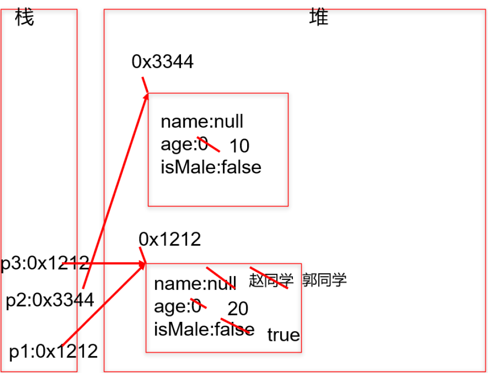

> 说明：
>
> + 堆：凡是new出来的结构(对象、数组)都放在堆空间中。
> + 对象的属性存放在堆空间中。
> + 对象名中存储的是对象地址，直接打印对象名和数组名都是显示“类型@对象的hashCode值"

# 类的成员之一：成员变量（field）

语法格式：

```java
[修饰符1] class 类名{
	[修饰符2] 数据类型 成员变量名 [= 初始化值];
}
```

> 必须在类中、方法外

变量的分类：

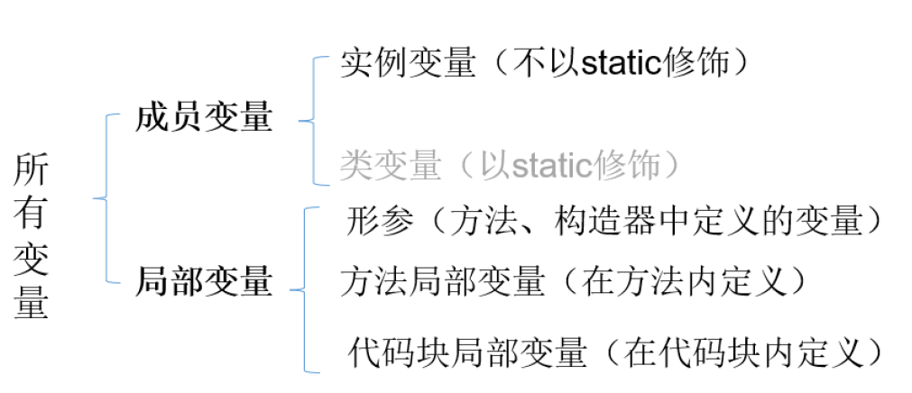

成员变量VS局部变量：

1. 声明位置和方式 
   1. 实例变量：在类中方法外 
   2. 局部变量：在方法体{}中或方法的形参列表、代码块中
2. 在内存中存储的位置不同
   1. 实例变量：堆
   2. 局部变量：栈
3. 生命周期
   1. 实例变量：和对象的生命周期一样，随着对象的创建而存在，随着对象被GC回收而消亡， 而且每一个对象的实例变量是独立的。
   2. 局部变量：和方法调用的生命周期一样，每一次方法
      被调用而在存在，随着方法执行的结束而消亡， 而且每一次方法调用都是独立。
4. 作用域
   1. 实例变量：通过对象就可以使用，本类中直接调用，其他类中“对象.实例变量” 
   2. 局部变量：出了作用域就不能使用
5. 修饰符
   1. 实例变量：public、protected、缺省、private、final、static、volatile、transient等 
   2. 局部变量：final
6. 默认值
   1. 实例变量：有默认值
   2. 局部变量：没有，必须手动初始化。形参靠实参初始化。

**当一个对象被创建时，会对其中各种类型的成员变量自动进行初始化赋值**。

# 类的成员之二：方法

## 方法的声明与调用

Java里的方法不能独立存在，所有的方法必须定义在类里。

声明方法格式：

```java
[修饰符] 返回值类型 方法名([形参列表])[throws 异常列表]{
	方法体的功能代码
}
```

根据修饰符中是否有static，可以将方法分为静态方法和非静态方法。

> 如果返回值为void，可以不写return，也可以直接写`return ;`
>
> return语句后面不能再写其他代码了，否则报错

调用方法格式：

```java
对象.方法名([实参列表])
```

> 方法先声明 后使用。
>
> 方法可以直接调用类的属性和方法。
>
> 不能在方法中定义方法。

## 方法的重载

1. 方法重载：在同一个类中，允许存在一个以上的**同名方法**，只要它们的**参数列表不同**即可。
   1. 参数列表不同，意味着 **参数个数** 或 **参数类型** 或 **参数顺序** 的不同
2. 重载的特点：与修饰符、返回值类型无关，只看参数列表，且参数列表必须不同。调用时，根据方法参数列表的不同来区别。
3. 重载方法调用：JVM通过方法的参数列表，调用匹配的方法。
   1. 先找个数、类型最匹配的
   2. 再找个数和类型可以兼容的，如果同时多个方法可以兼容将会报错

> 判 断与 `void show(int a,char b,double c){}` 构成重载的有：
>
> ```
> a)void show(int x,char y,double z){}    // no
> b)int show(int a,double c,char b){}     // yes
> c) void show(int a,double c,char b){}   // yes
> d) boolean show(int c,char b){}         // yes
> e) void show(double c){}                // yes
> f) double show(int x,char y,double z){} // no
> g) void shows(){double c}               // no
> ```


## 可变个数的形参

在JDK 5.0 中提供了Varargs(variable number of arguments)机制。即当定义一个方法时，形参的类型可以确定，但是形参的个数不确定，那么可以考虑使用可变个数的形参。

```java
//JDK 5.0以前：采用数组形参来定义方法，传入多个同一类型变量
public static void test(int a ,String[] books);
//JDK5.0：采用可变个数形参来定义方法，传入多个同一类型变量
public static void test(int a ,String...books);
```

特点：

1. 方法参数部分指定类型的参数个数是可变多个：0个，1个或多个
2. 可变个数形参的方法与同名的方法之间，彼此构成重载
3. 可变参数方法的使用与方法参数部分使用数组是一致的，二者不能同时声明，否则报错。
4. 方法的参数部分有可变形参，需要放在形参声明的最后
5. 在一个方法的形参中，最多只能声明一个可变个数的形参


## 方法的参数传递机制

Java里方法的参数传递方式只有一种： **值传递**。 即将实际参数值的副本（复制品）传入方法内，而参数本身不受影响。

+ 形参是基本数据类型：将实参基本数据类型变量的“数据值”传递给形参
+ 形参是引用数据类型：将实参引用数据类型变量的“地址值”传递给形参

> 参数传递内存分析：
>
> ```java
> //栈：每个方法在调用时，都会有以栈帧的方法压入栈中。栈帧中保存了当前方法中声明的变量：方法内声明的，形参
> //堆：存放new出来的"东西"：对象（成员变量在对象中）、数组实体（数组元素）。
> //注意：变量前如果声明有类型，那么这就是一个新的刚要定义的变量。如果变量前没有声明类型，那就说明此变量
> 在之前已经声明过。
> public class TransferTest3 {
>     
>     public static void main(String args[]) {
>         TransferTest3 test = new TransferTest3();
>         test.first();
>     }
>     
>     public void first() {
>         int i = 5;
>         Value v = new Value();
>         v.i = 25;
>         second(v, i);
>         System.out.println(v.i);
>     }
>     
>     public void second(Value v, int i) {
>         i = 0;
>         v.i = 20;
>         Value val = new Value();
>         v = val;
>         System.out.println(v.i + " " + i);
>     }
> }
> 
> class Value {
> 	int i = 15;
> }
> ```
>
> 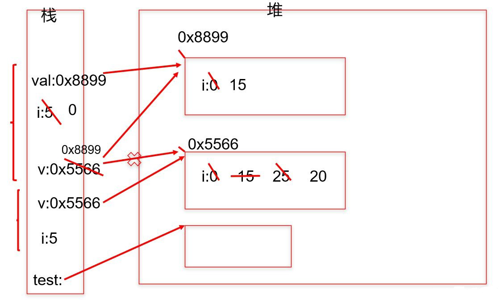

> 参数传递题目：
>
> ```java
> public class Test {
>     
>     public static void main(string[] args) {
>         int a=10;
>         int b=10;
> 		method(a,b);//需要在method方法被调用之后，仅打印出a=100,b=200。请写出method方法的代码
>      	System.out.println("a="+a);
>         System.out.println("b="+b);
>     }
>     
> //代码编写处
> }
> ```
>
> ```java
> //法一：
> public static void method(int a, int b) {
>     // 在不改变原本题目的前提下，如何写这个函数才能在main函数中输出a=100，b=200？
>     a = a * 10;
>     b = b * 20;
>     System.out.println(a);
>     System.out.println(b);
>     System.exit(0);
> }
> //法二：
> public static void method(int a, int b) {
>     PrintStream ps = new PrintStream(System.out) {
>         @Override
>         public void println(String x) {
>             if ("a=10".equals(x)) {
>                 x = "a=100";
>             } else if ("b=10".equals(x)) {
>                 x = "b=200";
>             }
>             super.println(x);
>         }
>     };
>     System.setOut(ps);
> }
> ```
>
> 

## 递归

方法自己调用自己的现象就称为递归。

分类：

+ 直接递归：方法自身调用自己。
+ 间接递归：A()方法调用B()方法，B()方法调用C()方法，C()方法调用A()方法。

> 1. 递归调用会占用大量的系统堆栈，内存耗用多，在递归调用层次多时速度要比循环慢的多
> 2. 在要求高性能的情况下尽量避免使用递归，递归调用既花时间又耗内存。


## 方法调用内存分析

+ 方法没有被调用的时候，都在方法区中的字节码文件(.class)中存储。
+ 方法被调用的时候，需要进入到栈内存中运行。方法每调用一次就会在栈中有一个入栈动作，即给当前方法开辟一块独立的内存区域，用于存储当前方法的局部变量的值。
+ 当方法执行结束后，会释放该内存，称为出栈。

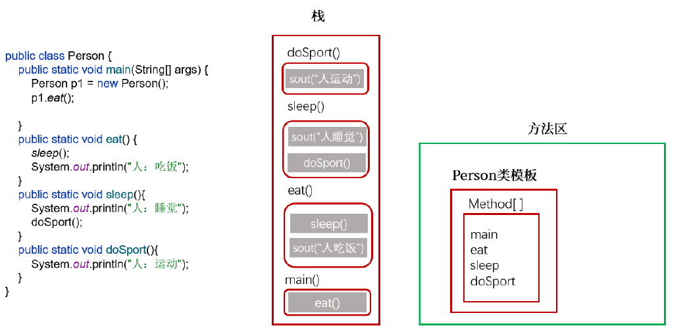

# 类的成员之三：构造器

Java给我们提供了构造器（Constructor) ，也称为构造方法。能在new对象时，直接为当前对象的某个或所有成员变量直接赋值。

语法格式：

```java
[修饰符] class 类名{
    [修饰符] 构造器名(){
        // 实例初始化代码
    }
    [修饰符] 构造器名(参数列表){
        // 实例初始化代码
    }
}
```

+ 构造器名必须与它所在的类名必须相同。
+ 它没有返回值，所以不需要返回值类型，也不需要void。
+ 构造器的**修饰符只能是权限修饰符**，不能被其他任何修饰。比如，不能被static、final、synchronized、abstract、native修饰，不能有return语句返回值。
+ 当没有显式的声明类中的构造器时，系统会默认提供一个无参的构造器并且该构造器的修饰符默认与类的修饰符相同。
+ 当显式的定义类的构造器以后，系统就不再提供默认的无参的构造器了。
+ 构造器是可以重载的。

# 类的成员之四：代码块

如果成员变量想要初始化的值不是一个硬编码的常量值，而是需要通过复杂的计算或读取文件、或读取运行环境信息等方式才能获取的一些值，此时，可以考虑代码块（或初始化块）。

- 代码块作用：对Java类或对象进行初始化
- 代码块(或初始化块)的`分类`：

  - 一个类中代码块若有修饰符，则只能被static修饰，称为静态代码块(static block)

  - 没有使用static修饰的，为非静态代码块。

## 静态代码块

如果想要为静态变量初始化，可以直接在静态变量的声明后面直接赋值，也可以使用静态代码块。

语法格式：

```java
【修饰符】 class 类{
	static{
        静态代码块
    }
}
```

1. 可以有输出语句。

  2. 可以对类的属性、类的声明进行初始化操作。

  3. 不可以对非静态的属性初始化。即：不可以调用非静态的属性和方法。

  4. 若有多个静态的代码块，那么按照从上到下的顺序依次执行。

  5. 静态代码块的执行要先于非静态代码块。

  6. 静态代码块随着类的加载而加载，且只执行一次。

## 非静态代码块

和构造器一样，也是用于实例变量的初始化等操作。

如果多个重载的构造器有公共代码，并且这些代码都是先于构造器其他代码执行的，那么可以将这部分代码抽取到非静态代码块中，减少冗余代码。

语法格式：

```java
【修饰符】 class 类{
    {
        非静态代码块
    }
    【修饰符】 构造器名(){
    	// 实例初始化代码
    }
    【修饰符】 构造器名(参数列表){
        // 实例初始化代码
    }
}
```

1. 可以有输出语句。

  2. 可以对类的属性、类的声明进行初始化操作。

  3. 除了调用非静态的结构外，还可以调用静态的变量或方法。

  4. 若有多个非静态的代码块，那么按照从上到下的顺序依次执行。

  5. 每次创建对象的时候，都会执行一次。且**先于构造器执行。**

> 分析加载顺序：
>
> ```java
> public class demo1 {
>     public static void main(String[] args) {
>         Zi zi = new Zi();
>     }
> }
> class Fu{
>     private static int i = getNum("（1）i");
>     private int j = getNum("（2）j");
>     static{
>         print("（3）父类静态代码块");
>     }
>     {
>         print("（4）父类非静态代码块，又称为构造代码块");
>     }
>     Fu(){
>         print("（5）父类构造器");
>     }
>     public static void print(String str){
>         System.out.println(str + "->" + i);
>     }
>     public static int getNum(String str){
>         print(str);
>         return ++i;
>     }
> }
> class Zi extends Fu{
>     private static int k = getNum("（6）k");
>     private int h = getNum("（7）h");
>     static{
>         print("（8）子类静态代码块");
>     }
>     {
>         print("（9）子类非静态代码块，又称为构造代码块");
>     }
>     Zi(){
>         print("（10）子类构造器");
>     }
>     public static void print(String str){
>         System.out.println(str + "->" + k);
>     }
>     public static int getNum(String str){
>         print(str);
>         return ++k;
>     }
> }
> //        （1）i->0
> //        （3）父类静态代码块->1
> //        （6）k->0
> //        （8）子类静态代码块->1
> //        （2）j->1
> //        （4）父类非静态代码块，又称为构造代码块->2
> //        （5）父类构造器->2
> //        （7）h->1
> //        （9）子类非静态代码块，又称为构造代码块->2
> //        （10）子类构造器->2
> 
> ```
>
> 

# 对象数组

数组的元素可以是基本数据类型，也可以是引用数据类型。当元素是引用类型中的类时，称为对象数组。

对象数组内存解析：

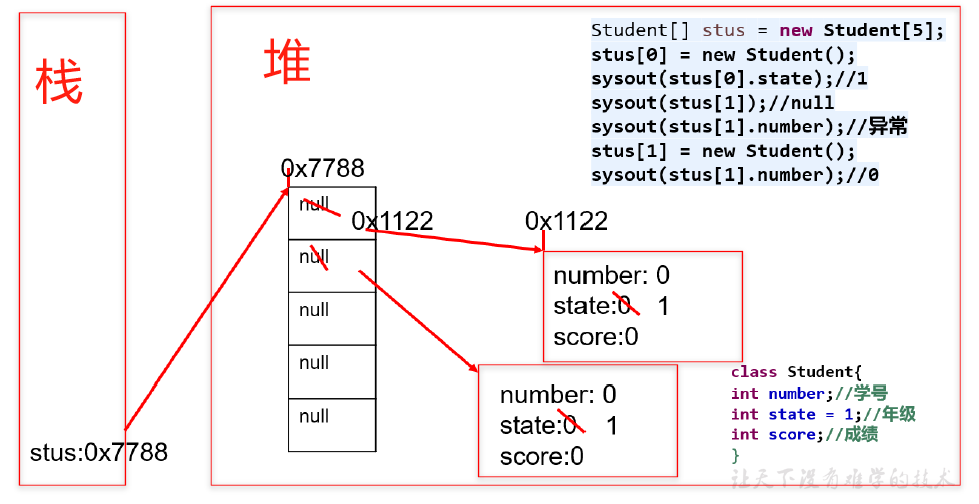


# JavaBean

JavaBean是一种Java语言写成的可重用组件

所谓JavaBean，是指符合如下标准的Java类：

+ 类是公共的
+ 有一个无参的公共的构造器
+ 有属性，且有对应的get、set方法

# 面向对象特征一：封装

面向对象的开发原则要遵循**“ 高内聚、低耦合”**。

+ 高内聚：类的内部数据操作细节自己完成，不允许外部干涉；
+ 低耦合：仅暴露少量的方法给外部使用，尽量方便外部调用。

封装性的设计思想：把该隐藏的隐藏起来，该暴露的暴露出来。

## 权限修饰符（四种）

实现封装就是控制类或成员的可见性范围。这就需要依赖访问控制修饰符。

权限修饰符： public 、protected 、缺省、private，访问范围如下：

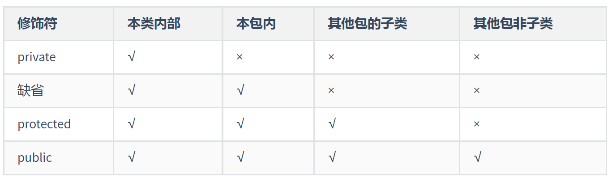

具体修饰的结构：

+ **外部类**：public、缺省
+ **成员变量、成员方法、构造器、成员内部类**：public、protected、缺省、private

注意：

1. **外部类**要跨包使用必须是public，否则仅限于本包使用
   1. 外部类的权限修饰符如果缺省，只能在本包使用
2. **成员的权限修饰符：**
   1. 本包下使用：成员的权限修饰符可以是public、protected、缺省
   2. 跨包使用：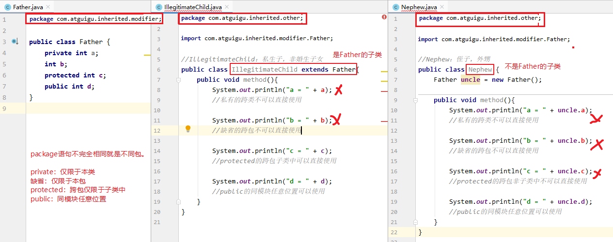
   3. 跨包使用时，如果类的权限修饰符缺省，成员权限修饰符>类的权限修饰符也没有意义

## 成员变量私有化

私有化类的成员变量，提供公共的get和set方法，对外暴露获取和修改属性的功能。

好处：

+ 让使用者只能通过事先预定的方法来访问数据，从而可以在该方法里面加入控制逻辑，限制对成员变量的不合理访问。还可以进行数据检查，从而有利于保证对象信息的完整性。
+ 便于修改，提高代码的可维护性。在内部修改了，外部根本感觉不到它的修改。
  + 例如：Java8->Java9，String从char[]转为byte[]内部实现，而对外的方法不变，使用者根本感觉不到它内部的修改。

> 对于final的实例变量，不提供set()方法。
>
> 对于static final的成员变量，习惯上使用public修饰。

# 面向对象特征二：继承

## 继承语法及细节

多个类中存在相同属性和行为时，将这些内容抽取到单独一个类中，那么多个类中无需再定义这些属性和行为，只需要和抽取出来的类构成`继承关系`。

好处：

+ 继承的出现减少了代码冗余，提高了代码的复用性。
+ 继承的出现，更有利于功能的扩展。

+ 继承的出现让类与类之间产生了`is-a`的关系，父类更通用、更一般，子类更具体。

语法格式：

```java
[修饰符] class 类A {
	...
}

[修饰符] class 类B extends 类A {
	...
}
```

> 类B，称为子类、派生类(derived class)、SubClass
>
> 类A，称为父类、超类、基类(base class)、SuperClass

继承的细节说明

+ 子类会继承父类所有的实例变量和实例方法
  + 当子类对象被创建时，在堆中给对象申请内存时，子类和父类声明的这些实例变量都要分配内存。
  + 当子类对象调用方法时，编译器会先在子类模板中看该类是否有这个方法，如果没找到，会看它的父类甚至父类的父类是否声明了这个方法，遵循`从下往上`找的顺序，找到了就停止，一直到根父类都没有找到，就会报编译错误。
+ **子类不能直接访问父类中私有的(private)的成员变量和方法**
  + 子类虽会继承父类私有(private)的成员变量，但子类不能对继承的私有成员变量直接进行访问，可通过继承的get/set方法进行访问
+ Java只支持单继承，不支持多重继承
  + 一个类只能有一个父类，不可以有多个直接父类。
  + 一个父类可以同时拥有多个子类
  + 顶层父类是Object类。所有的类默认继承Object，作为父类。


## 方法的重写

父类的所有方法子类都会继承，子类可以对从父类中继承来的方法进行改造，称为方法的`重写 (override、overwrite)`。也称为方法的`重置`、`覆盖`。

> @Override使用说明：
>
> 写在方法上面，用来检测是不是满足重写方法的要求。这个注解就算不写，只要满足要求，也是正确的方法覆盖重写。建议保留，这样编译器可以帮助检查格式，也可以让阅读源代码的程序员清晰的知道这是一个重写的方法。

方法重写的要求：

1. 子类重写的方法`必须`和父类被重写的方法具有相同的`方法名称`、`参数列表`。

2. 子类重写的方法的返回值类型`不能大于`父类被重写的方法的返回值类型。（例如：Student < Person）。
   1. 如果返回值类型是基本数据类型和void，那么必须是相同


3. 子类重写的方法使用的访问权限`不能小于`父类被重写的方法的访问权限。（public > protected > 缺省 > private）
   1.  父类私有方法不能重写
   2. 跨包的父类缺省的方法也不能重写


4. 子类方法抛出的异常`不能大于`父类被重写方法的异常
5. 子类与父类中同名同参数的方法必须同时声明为非static的(即为重写)，或者同时声明为static的（不是重写）。因为static方法是属于类的，子类无法覆盖父类的方法。

> 重载&重写：
>
> ```java
> public class TestOverloadOverride {
>     public static void main(String[] args) {
>         Son s = new Son();
>         s.method(1);//只有一个形式的method方法
> 
>         Daughter d = new Daughter();
>         d.method(1);
>         d.method(1,2);//有两个形式的method方法
>     }
> }
> 
> class Father{
>     public void method(int i){
>         System.out.println("Father.method");
>     }
> }
> class Son extends Father{
>     public void method(int i){//重写
>         System.out.println("Son.method");
>     }
> }
> class Daughter extends Father{
>     public void method(int i,int j){//重载
>         System.out.println("Daughter.method");
>     }
> }
> ```

# 面相对象特征三：多态

## 多态的形式

对象的多态性：**父类的引用指向子类的对象**

语法格式：

```java
父类类型 变量名 = 子类对象；
```

> 父类类型：指子类继承的父类类型，或者实现的接口类型

多态的理解：

Java引用变量有两个类型：`编译时类型`和`运行时类型`。编译时类型由`声明`该变量时使用的类型决定，运行时类型由`实际赋给该变量的对象`决定。**编译时，看左边；运行时，看右边。**

+ 若编译时类型和运行时类型不一致，就出现了对象的多态性(Polymorphism)
+ 多态情况下，“看左边”：看的是父类的引用（父类中不具备子类特有的方法）。“看右边”：看的是子类的对象（实际运行的是子类重写父类的方法）
+ 多态的使用前提：类的继承、方法的重写

为什么需要多态：

+ 开发中，有时在设计一个数组、或一个成员变量、或一个方法的形参、返回值类型时，无法确定它具体的类型，只能确定它是某个系列的类型。

多态的利弊：

+ **好处**：变量引用的子类对象不同，执行的方法就不同，实现动态绑定。代码编写更灵活、功能更强大，可维护性和扩展性更好了。符合开闭原则。
+ **弊端**：一个引用类型变量如果声明为父类的类型，但实际引用的是子类对象，那么该变量就不能再访问子类中添加的属性和方法。

## 虚方法调用

+ 在Java中虚方法是指在编译阶段不能确定方法的调用入口地址，在运行阶段才能确定的方法，即可能被重写的方法。
+ 子类中定义了与父类同名同参数的方法，在多态情况下，将此时父类的方法称为虚方法，父类根据赋给它的不同子类对象，动态调用属于子类的该方法。这样的方法调用在编译期是无法确定的。

> 拓展：
>
> `静态链接（或早起绑定）`：当一个字节码文件被装载进JVM内部时，如果被调用的目标方法在编译期可知，且运行期保持不变时。这种情况下将调用方法的符号引用转换为直接引用的过程称之为静态链接。那么调用这样的方法，就称为非虚方法调用。比如调用静态方法、私有方法、final方法、父类构造器、本类重载构造器等。
>
> `动态链接（或晚期绑定）`：如果被调用的方法在编译期无法被确定下来，也就是说，只能够在程序运行期将调用方法的符号引用转换为直接引用，由于这种引用转换过程具备动态性，因此也就被称之为动态链接。调用这样的方法，就称为虚方法调用。比如调用重写的方法（针对父类）、实现的方法（针对接口）。

## 成员变量没有多态性

+ 若子类重写了父类方法，就意味着子类里定义的方法彻底覆盖了父类里的同名方法，系统将不可能把父类里的方法转移到子类中。
+ 对于实例变量则不存在这样的现象，即使子类里定义了与父类完全相同的实例变量，这个实例变量依然不可能覆盖父类中定义的实例变量

```java
public class demo1 {
    public static void main(String[] args) {
        Base b = new Sub();
        System.out.println(b.a); // 1
        System.out.println(((Sub)b).a); // 2

        Sub s = new Sub();
        System.out.println(s.a); // 2
        System.out.println(((Base)s).a); // 1
    }
}
class Base{
    int a = 1;
}
class Sub extends Base{
    int a = 2;
}
```

## 向上转型和向下转型

多态会有把子类对象赋值给父类变量，这个时候，在`编译期间`，就会出现类型转换的现象。

使用父类变量接收了子类对象之后，就`不能调用`子类拥有，而父类没有的方法了。这也是多态带来的一点"麻烦"。所以，想要调用子类特有的方法，必须做类型转换，使得`编译通过`。

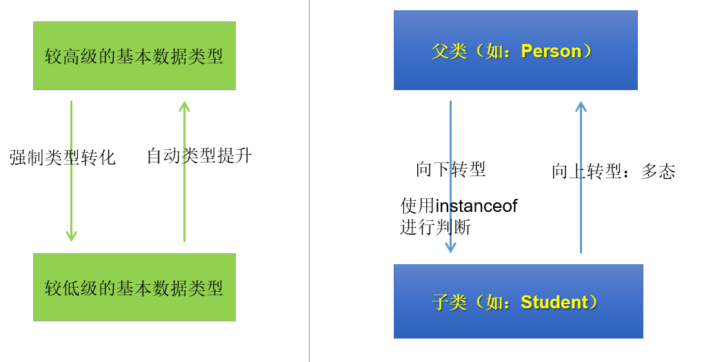

向上转型：自动完成

向下转型：（子类类型）父类变量


### instanceof关键字

为了避免ClassCastException的发生，Java提供了 `instanceof` 关键字，给引用变量做类型的校验。如下代码格式：

```java
//检验对象a是否是数据类型A的对象，返回值为boolean型
对象a instanceof 数据类型A 
```

- 只要用instanceof判断返回true的，那么强转为该类型就一定是安全的，不会报ClassCastException异常。
- 如果对象a属于类A的子类B，a instanceof A值也为true。
- 要求对象a所属的类与类A必须是子类和父类的关系，否则编译错误。

```java
public class TestInstanceof {
    public static void main(String[] args) {
        Pet[] pets = new Pet[2];
        pets[0] = new Dog();//多态引用
        pets[0].setNickname("小白");
        pets[1] = new Cat();//多态引用
        pets[1].setNickname("雪球");

        for (int i = 0; i < pets.length; i++) {
            pets[i].eat();

            if(pets[i] instanceof Dog){
                Dog dog = (Dog) pets[i];
                dog.watchHouse();
            }else if(pets[i] instanceof Cat){
                Cat cat = (Cat) pets[i];
                cat.catchMouse();
            }
        }
    }
}
```

# 子类对象实例化全过程

## 类中属性赋值顺序

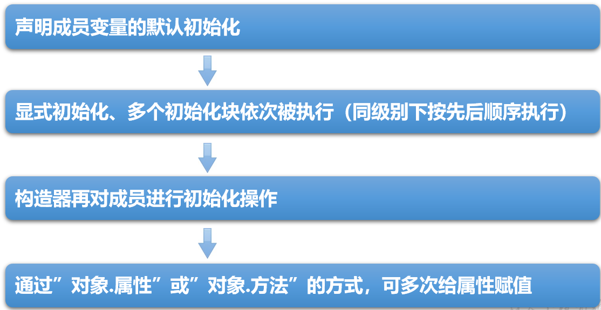


# 关键字：package、import

## package

package，称为包，用于指明该文件中定义的类、接口等结构所在的包。

语法格式：

```java
package 顶层包名.子包名 ;
```

+ 一个源文件只能有一个声明包的package语句
+ package语句作为Java源文件的第一条语句出现。若缺省该语句，则指定为无名包。
+ 包对应于文件系统的目录，package语句中用 “.” 来指明包(目录)的层次。
+ 同一个包下可以声明多个结构（类、接口），但是不能定义同名的结构（类、接口）。不同的包下可以定义同名的结构（类、接口）

JDK中主要的包介绍：

1. java.lang ----包含一些Java语言的核心类，如String、Math、Integer、 System和Thread，提供常用功能
2. java.net ----包含执行与网络相关的操作的类和接口。 
3. java.io ----包含能提供多种输入`/`输出功能的类。 
4. java.util ----包含一些实用工具类，如定义系统特性、接口的集合框架类、使用与日期日历相关的函数。 
5. java.text ----包含了一些java格式化相关的类 
6. java.sql ----包含了java进行JDBC数据库编程的相关类`/`接口 
7. java.awt ----包含了构成抽象窗口工具集（abstract window toolkits）的多个类，这些类被用来构建和管理应用程序的图形用户界面(GUI)。

## import

语法格式：

```java
import 包名.类名;
```

+ import语句，声明在包的声明和类的声明之间。
+ 如果需要导入多个类或接口，那么就并列显式多个import语句即可
+ 如果使用 `a.*`  导入结构，表示可以导入a包下的所有的结构。
+ 如果导入的类或接口是java.lang包下的，或者是当前包下的，则可以省略此import语句。
+ **如果已经导入java.a包下的类，那么如果需要使用a包的子包下的类的话，仍然需要导入。**
+ 如果在代码中使用不同包下的同名的类，那么就需要使用类的全类名的方式指明调用的是哪个类。
+ import static 组合的使用：调用指定类或接口下的静态的属性或方法


# 关键字：this、super

## this

- 在方法（实例方法、非static的方法）内部使用，表示调用该方法的对象

- 在构造器内部使用，表示该构造器正在初始化的对象。

- this可以调用的结构：成员变量、方法和构造器

什么时候使用this：

+ 实例方法 或者 构造器 中使用当前对象的成员

  + 在实例方法或构造器中，如果使用当前类的成员变量或成员方法可以在其前面添加this，增强程序的可读性。不过，习惯省略this。
  + 当形参与成员变量同名时，如果在方法内或构造器内需要使用成员变量，必须添加this来表明该变量是类的成员变量。即可以用this来区分`成员变量`和`局部变量`。
  + 使用this访问属性和方法时，如果在本类中未找到，会从父类中查找

+ 同一个类中构造器互相调用

  + this()：调用本类的无参构造器
  + this(实参列表)：调用本类的有参构造器
  + 不能出现递归调用。比如，调用自身构造器。因此如果一个类中声明了n个构造器，则最多有 n - 1个构造器中使用了"this(形参列表)"
  + this()和this(实参列表)只能声明在构造器首行。因此在类的一个构造器中，最多只能声明一个"this(参数列表)"


## super

在Java类中使用super来调用父类中的指定操作：

- super可用于访问父类中定义的成员变量
- super可用于调用父类中定义的成员方法
- super可用于在子类构造器中调用父类的构造器

注意：

- 当子父类出现同名成员时，可以用super表明调用的是父类中的成员
- super的追溯不仅限于直接父类
- super和this的用法相像，this代表本类对象的引用，super代表父类的内存空间的标识

super的使用场景：

+ 子类调用父类被重写的方法
  + 前提是权限修饰符允许
+ 子类中调用父类中同名的成员变量
  + 如果子类实例变量和父类实例变量重名，并且父类的该实例变量在子类仍然可见，在子类中要访问父类声明的实例变量需要在父类实例变量前加super.，否则默认访问的是子类自己声明的实例变量
  + 如果父子类实例变量没有重名，只要权限修饰符允许，在子类中完全可以直接访问父类中声明的实例变量，也可以用this.实例访问，也可以用super.实例变量访问

> 总结：起点不同（就近原则）
>
> * **变量前面没有super.和this.**
>   * 在构造器、代码块、方法中如果出现使用某个变量，先查看是否是当前块声明的`局部变量`，
>   * 如果不是局部变量，先从当前执行代码的`本类去找成员变量`
>   * 如果从当前执行代码的本类中没有找到，会往上找`父类声明的成员变量`（权限修饰符允许在子类中访问的）
>
> * **变量前面有this.** 
>   * 通过this找成员变量时，先从当前执行代码的==本类去找成员变量==
>   * 如果从当前执行代码的本类中没有找到，会往上找==父类声明的成员变量（==权限修饰符允许在子类中访问的）
>
> * **变量前面super.** 
>   * 通过super找成员变量，直接从当前执行代码的直接父类去找成员变量（权限修饰符允许在子类中访问的）
>   * 如果直接父类没有，就去父类的父类中找（权限修饰符允许在子类中访问的）
>
> **注意： 应该避免子类声明和父类重名的成员变量**

+ 子类构造器中调用父类构造器
  1. 子类继承父类时，不会继承父类的构造器。只能通过“super(形参列表)”的方式调用父类指定的构造器。
  2. 规定：“super(形参列表)”，必须声明在构造器的首行。
  3. 在构造器的首行，"this(形参列表)" 和 "super(形参列表)"只能二选一。
  4.  如果在子类构造器的首行既没有显示调用"this(形参列表)"，也没有显式调用"super(形参列表)"，则子类此构造器默认调用"super()"，即调用父类中空参的构造器。
  5. 只会找直接父类的对应构造器，找不到就报错

> 常见错误：
>
> 如果子类构造器中既未显式调用父类或本类的构造器，且父类中又没有空参的构造器，则`编译出错`。

# 关键字：static

如果想让一个成员变量被类的所有实例所共享，就用static修饰即可，称为类变量（或类属性）。

使用范围：

- 在Java类中，可用static修饰属性、方法、代码块、内部类

被修饰后的成员具备以下特点：

- 随着类的加载而加载
- 优先于对象存在
- 修饰的成员，被所有对象所共享
- 访问权限允许时，可不创建对象，直接被类调用


## 静态变量

语法格式：

```java
[修饰符] class 类{
	[其他修饰符] static 数据类型 变量名;
}
```

- 静态变量的默认值规则和实例变量一样。
- 静态变量值是所有对象共享。

- 静态变量在本类中，可以在任意方法、代码块、构造器中直接使用。
- 如果权限修饰符允许，在其他类中可以通过“`类名.静态变量`”直接访问，也可以通过“`对象.静态变量`”的方式访问。
- 静态变量的`get/set`方法也静态的，当局部变量与静态变量`重名时`，使用“`类名.静态变量`”进行区分。

### 内存解析

```java
public class TestStaticVariable {
    public static void main(String[] args) {
        //静态变量total的默认值是0
        System.out.println("Employee.total = " + Employee.getTotal());

        Employee e1 = new Employee("张三");
        Employee e2 = new Employee("李四");
        System.out.println(e1);//静态变量company的默认值是null
        System.out.println(e2);//静态变量company的默认值是null
        System.out.println("Employee.total = " + Employee.getTotal());//静态变量total值是2

        Employee.company = "尚硅谷";
        System.out.println(e1);//静态变量company的值是尚硅谷
        System.out.println(e2);//静态变量company的值是尚硅谷

        //只要权限修饰符允许,虽然不推荐，但是也可以通过“对象.静态变量”的形式来访问
        e1.company = "超级尚硅谷";

        System.out.println(e1);//静态变量company的值是超级尚硅谷
        System.out.println(e2);//静态变量company的值是超级尚硅谷
    }
}
```

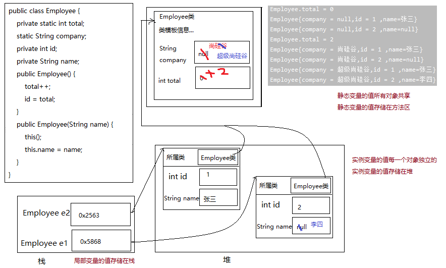


## 静态方法

语法格式：

```java
[修饰符] class 类{
	[其他修饰符] static 返回值类型 方法名(形参列表){
        方法体
    }
}
```

- 静态方法在本类的任意方法、代码块、构造器中都可以直接被调用。
- 只要权限修饰符允许，静态方法在其他类中可以通过“类名.静态方法“的方式调用。也可以通过”对象.静态方法“的方式调用。
- 在static方法内部只能访问类的static修饰的属性或方法，不能访问类的非static的结构。
- 静态方法可以被子类继承，但不能被子类重写。
- 静态方法的调用都只看编译时类型。
- 因为不需要实例就可以访问static方法，因此static方法内部不能有this，也不能有super。如果有重名问题，使用“类名.”进行区别。

# 关键字：final

## final 修饰类

表示这个类不能被继承，没有子类。提高安全性，提高程序的可读性。

+ 如：String类、System类、StringBuffer类

```java
final class Eunuch{//太监类
	
}
```

## final 修饰方法

表示这个方法不能被子类重写。

+ 如：Object类中的getClass()

## final 修饰变量

final修饰某个变量（成员变量或局部变量），一旦赋值，它的值就不能被修改，即常量，常量名建议使用大写字母。

+ 如：final double MY_PI = 3.14;

> 如果某个成员变量用final修饰后，没有set方法，并且必须初始化（可以显式赋值、或在初始化块赋值、实例变量还可以在构造器中赋值）

```java
public final class Test {
    public static int totalNumber = 5;
    public final int ID;

    public Test() {
        ID = ++totalNumber; // 可在构造器中给final修饰的“变量”赋值
    }
    public static void main(String[] args) {
        Test t = new Test();
        System.out.println(t.ID);
    }
}

```

> 排错：
>
> ```java
> public class Something {
>     public int addOne(final int x) {
>         // return ++x;
>         return x + 1;
>     }
> }
> ```
>
> ```java
> public class Something {
>     public static void main(String[] args) {
>         Other o = new Other();
>         new Something().addOne(o);
>     }
>     public void addOne(final Other o) {
>         // o = new Other();
>         o.i++;
>     }
> }
> class Other {
>     public int i;
> }
> 
> ```
>
> 

# Object类的使用

类 `java.lang.Object`是类层次结构的根类，即所有其它类的父类。每个类都使用 `Object` 作为超类。

## Object类的方法

### equals()

== ：

+ 基本类型比较值:只要两个变量的值相等，即为true。
+ 引用类型比较引用(是否指向同一个对象)：只有指向同一个对象时，==才返回true。
  + 用“==”进行比较时，符号两边的`数据类型必须兼容`(可自动转换的基本数据类型除外)，否则编译出错

equals()：

+ 只能比较引用类型，Object类源码中equals()的作用与“==”相同：比较是否指向同一个对象。
+ 当用equals()方法进行比较时，对类File、String、Date及包装类（Wrapper Class）来说，是比较类型及内容而不考虑引用的是否是同一个对象。
  + 原因：在这些类中重写了Object类的equals()方法。
+ 当自定义使用equals()时，可以重写。用于比较两个对象的“内容”是否都相等

> **面试题：**==和equals的区别
>
> - == 既可以比较基本类型也可以比较引用类型。对于基本类型就是比较值，对于引用类型就是比较内存地址
>
> - equals的话，它是属于java.lang.Object类里面的方法，如果该方法没有被重写过默认也是==;我们可以看到String等类的equals方法是被重写过的，而且String类在日常开发中用的比较多，久而久之，形成了equals是比较值的错误观点。
>
> - 具体要看自定义类里有没有重写Object的equals方法来判断。
>
> - 通常情况下，重写equals方法，会比较类中的相应属性是否都相等。

### toString()

默认情况下，toString()返回的是“对象的运行时类型 @ 对象的hashCode值的十六进制形式"

在进行String与其它类型数据的连接操作时，自动调用toString()方法

```java
Date now=new Date();
System.out.println(“now=”+now);  //相当于
System.out.println(“now=”+now.toString()); 

// 如果直接System.out.println(对象)，默认会自动调用这个对象的toString()
```

可以根据需要在用户自定义类型中重写toString()方法，如String 类重写了toString()方法，返回字符串的值。

### clone()

创建对象的副本。它会返回一个与原对象内容相同的对象。这个副本与原对象是独立的，对副本的修改不会影响原对象。

### finalize()

- 当对象被回收时，系统自动调用该对象的 finalize() 方法。（不是垃圾回收器调用的，是本类对象调用的）
  - 永远不要主动调用某个对象的finalize方法，应该交给垃圾回收机制调用。
- 当某个对象没有任何引用时，JVM就认为这个对象是垃圾对象，就会在之后不确定的时间使用垃圾回收机制来销毁该对象，在销毁该对象前，会先调用 finalize()方法。 
- 子类可以重写该方法，目的是在对象被清理之前执行必要的清理操作。比如，在方法内断开相关连接资源。
  - 如果重写该方法，让一个新的引用变量重新引用该对象，则会重新激活对象。
- 在JDK 9中此方法已经被`标记为过时`的。

### getClass()

获取对象的运行时类型

> 因为Java有多态现象，所以一个引用数据类型的变量的编译时类型与运行时类型可能不一致，因此如果需要查看这个变量实际指向的对象的类型，需要用getClass()方法

### hashCode()

返回每个对象的hash值

## native关键字的理解

使用native关键字说明这个方法是原生函数，也就是这个方法是用`C/C++`等非Java语言实现的，并且`被编译成了DLL`，由Java去调用。

为什么要用native方法：

+ Java使用起来非常方便，然而有些层次的任务用java实现起来不容易，或者对程序的效率很在意时，例如：Java需要与一些底层操作系统或某些硬件交换信息时的情况。native方法正是这样一种交流机制：它为我们提供了一个非常简洁的接口，而且我们无需去了解Java应用之外的繁琐的细节。

native method的存在并不会对其他类调用这些本地方法产生任何影响，实际上调用这些方法的其他类甚至不知道它所调用的是一个本地方法。JVM将控制调用本地方法的所有细节。


# 单例模式

所谓类的单例设计模式，就是采取一定的方法保证在整个的软件系统中，对某个类**只能存在一个对象实例**，并且该类只提供一个取得其对象实例的方法

## 饿汉式

```java
class Singleton {
    // 1.私有化构造器
    private Singleton() {
    }

    // 2.内部提供一个当前类的实例
    // 4.此实例也必须静态化
    private static Singleton single = new Singleton();

    // 3.提供公共的静态的方法，返回当前类的对象
    public static Singleton getInstance() {
        return single;
    }
}

```

## 懒汉式

```java
class Singleton {
    // 1.私有化构造器
    private Singleton() {
    }
    // 2.内部提供一个当前类的实例
    // 4.此实例也必须静态化
    private static Singleton single;
    // 3.提供公共的静态的方法，返回当前类的对象
    public static Singleton getInstance() {
        if(single == null) {
            single = new Singleton();
        }
        return single;
    }
}

```


## 饿汉式VS懒汉式

饿汉式：

- 特点：`立即加载`，即在使用类的时候已经将对象创建完毕。
- 优点：实现起来`简单`；没有多线程安全问题。
- 缺点：当类被加载的时候，会初始化static的实例，静态变量被创建并分配内存空间，从这以后，这个static的实例便一直占着这块内存，直到类被卸载时，静态变量被摧毁，并释放所占有的内存。因此在某些特定条件下会`耗费内存`。

懒汉式：

- 特点：`延迟加载`，即在调用静态方法时实例才被创建。
- 优点：实现起来比较简单；当类被加载的时候，static的实例未被创建并分配内存空间，当静态方法第一次被调用时，初始化实例变量，并分配内存，因此在某些特定条件下会`节约内存`。
- 缺点：在多线程环境中，这种实现方法是完全错误的，`线程不安全`，根本不能保证单例的唯一性。


## 单例模式的优点及应用

由于单例模式只生成一个实例，减少了`系统性能开销`，当一个对象的产生需要比较多的资源时，如读取配置、产生其他依赖对象时，则可以通过在应用启动时直接产生一个单例对象，然后永久驻留内存的方式来解决。

# main方法

由于JVM需要调用类的main()方法，所以该方法的访问权限必须是public，又因为JVM在执行main()方法时不必创建对象，所以该方法必须是static的，该方法接收一个String类型的数组参数，该数组中保存执行Java命令时传递给所运行的类的参数。 

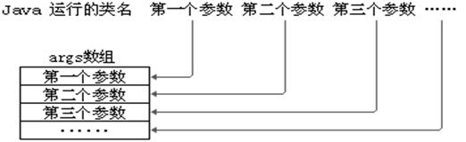

# 抽象类和抽象方法


# 接口


# 内部类


# 枚举类


# 注解


# 包装类


