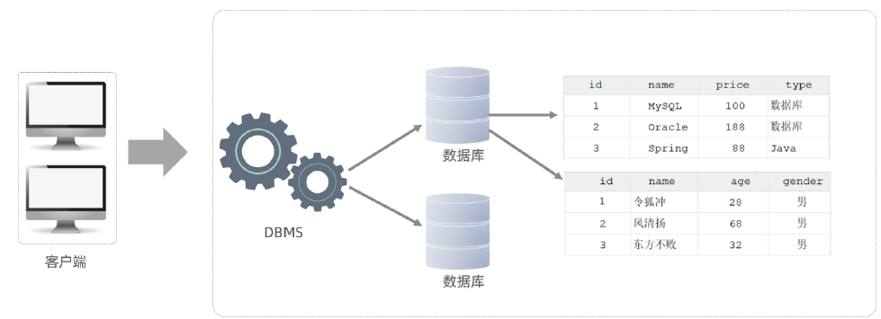
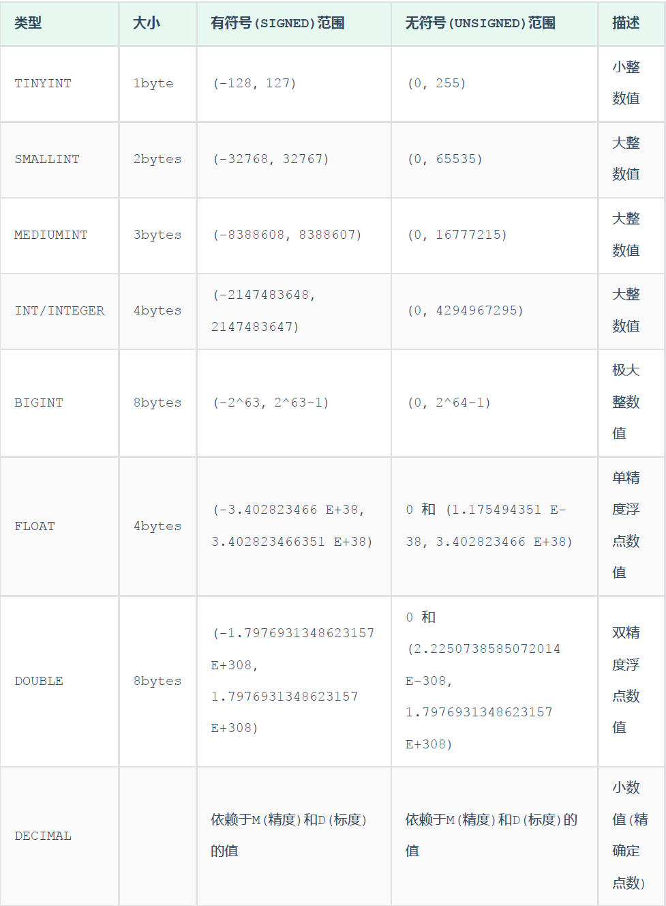
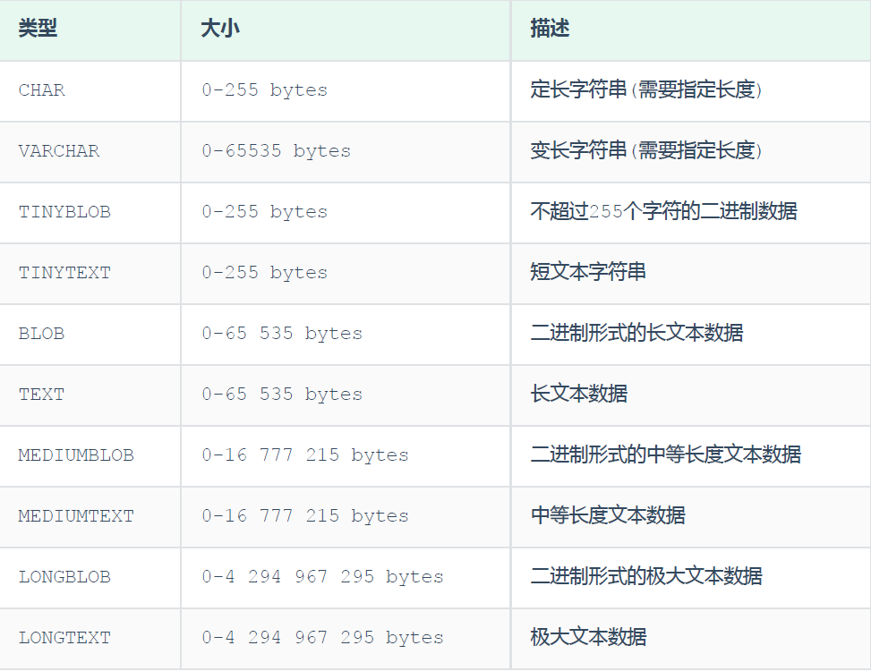
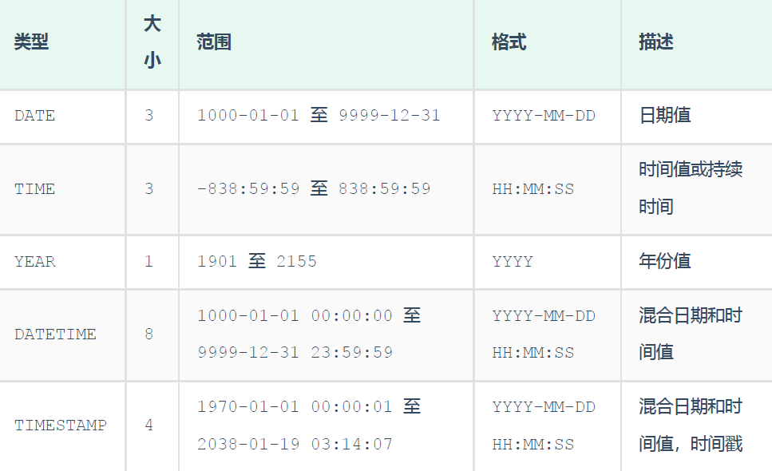
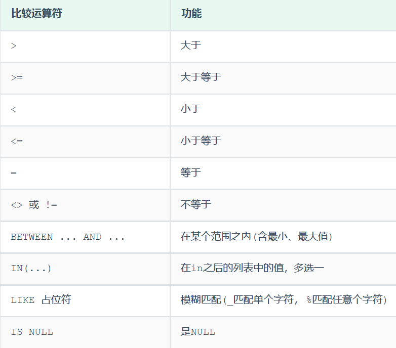
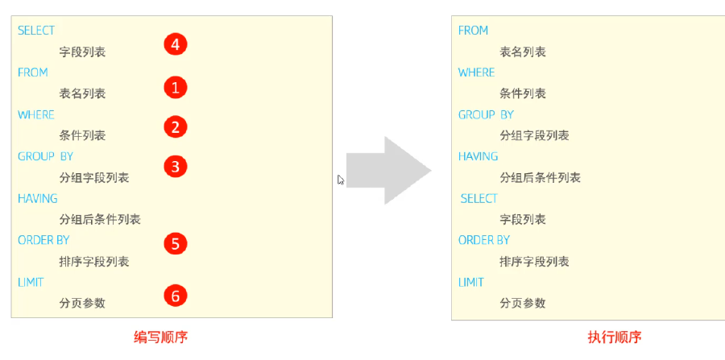
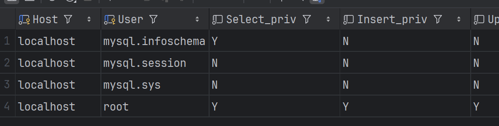

## mysql概述

### DB & DBMS &SQL &DBA

| 名称                   | 解释                                                         |
| ---------------------- | ------------------------------------------------------------ |
| 数据库（DB）           | 存储数据的仓库                                               |
| 数据库管理系统（DBMS） | 操纵和管理数据库的大型软件                                   |
| SQL                    | 操作关系型数据库的编程语言，定义了一套操作关系型数据库统一标准 |
| DBA                    | 数据库管理员                                                 |


### 客户端连接mysql

- MySQL  Command Line Client 
- CMD（使用这种方式需要在MySQL安装完后配置PATH）
  - mysql [-h 127.0.0.1] [-P 3306] -u root -p


### 数据模型

- 关系型数据库
  - 概念：建立在关系模型基础上，由多张相互连接的二维表组成的数据库
- 数据模型
  - 
  - 客户端连接DBMS，客户端编写SQL语句并由DBMS解析来操作DB中的表及表中数据。
  - mysql是一个DBMS


## SQL

全称 Structured Query Language，结构化查询语言

### SQL通用语法

- 可以 单行/多行 书写，以分号结尾
- SQL不区分大小写，关键字一般大写

- SQL注释：
  - 单行注释：`-- 注释内容 `  或者 `# 注释内容` 
  - 多行注释： `/* 注释内容 */`


### SQL分类

#### DDL

数据定义语言，用来定义数据库对象（数据库、表、字段）

- **数据库操作**
  - 查询所有数据库：`show databases ;`
  - 查询当前数据库：`select database() ;`
  - 创建数据库：`create database [ if not exists ] 数据库名 [ default charset 字符集 ] [ collate 排序规则 ] ;`
  - 删除数据库：`drop database [ if exists ] 数据库名 ; `
  - 切换数据库（要操作某一个数据库下的表，需要通过该指令，切换到对应的数据库下） ：`use 数据库名`
  - 例子：
    - 创建demo1数据库，使用默认数据集：`create database demo1 ;`
    - 创建demo2数据库并指定字符集：`create database demo2 default charset utf8mb4 ;`
    - 使用demo2数据库：`use demo2;`
  
- **表操作**
  - **查询创建**
    
    - 查询当前数据库所有表：`show tables ;`
    
    - 查询指定表结构（可以查看到指定表的字段，字段的类型、是否为NULL，是否存在默认值等信息）：`desc 表名 ;`
    
    - 查询指定表的建表语句：`show create table 表名;`
    
      - ```sql
        create table tb_user(
        	id int comment '编号',
        	name varchar(50) comment '姓名',
        	age int comment '年龄',
        	gender varchar(1) comment '性别'
        ) comment '用户表';
        ```
    
  - **数据类型**
  
    - 在建表语句中，指定字段的数据类型常见分三类：数值类型、字符串类型、日期时间类型
    - 数值类型
      - 
    - 字符串类型
      - 
      - char是定长字符串，指定长度多长，就占用多少个字符，和字段值的长度无关 。而varchar是变长字符串，指定的长度为最大占用长度。相对来说，char的性能会更高些。
    - 日期时间类型
      - 
  
  - **修改**
  
    - 添加字段：`ALTER TABLE 表名 ADD 字段名 类型 (长度) [ COMMENT 注释 ] [ 约束 ];`
    - 修改数据类型：`ALTER TABLE 表名 MODIFY 字段名 新的数据类型(长度) ;`
    - 修改字段名和字段类型：`ALTER TABLE 表名 CHANGS 旧字段名 新字段名 类型(长度) [ COMMENT 注释 ] [ 约束 ];`
    - 删除字段：`ALTER TBALE  表名 DROP 字段名 ;`
    - 修改表名：`ALTER TABLE 表名 RENAME TO 新表名 ;`
  
  - **删除**
  
    - 删除表（删除一张不存在的表会报错）：`DROP TABLE [ IF EXISTS ] 表名;`
    - 删除指定表并创建新表：`TRUNCATE TABLE 表名;`
  
  - 案例：
  
    - 设计一张员工信息表
  
      - ```
        1. 编号（纯数字）
        2. 员工工号 (字符串类型，长度不超过10位)
        3. 员工姓名（字符串类型，长度不超过10位）
        4. 性别（男/女，存储一个汉字）
        5. 年龄（正常人年龄，不可能存储负数）
        6. 身份证号（二代身份证号均为18位，身份证中有X这样的字符）
        7. 入职时间（取值年月日即可）
        ```
  
      - ```sql
        create table emp(
        	id int comment '编号',
        	workno varchar(10) comment '工号',
        	name varchar(10) comment '姓名',
        	gender char(1) comment '性别',
        	age tinyint unsigned comment '年龄',
        	idcard char(18) comment '身份证号',
        	entrydate date comment '入职时间'
        ) comment '员工表';
        ```
  
    - 为emp表增加一个新的字段”昵称”为nickname，类型为varchar(20)：`ALTER TABLE emp ADD nickname varchar(20) COMMENT '昵称' ;`
  
    - 将emp表的nickname字段修改为username，类型为varchar(30)：`ALTER TABLE emp CHANGE nickname username varchar(30) COMMENT '昵称';`
  
    - 将emp表的字段username删除：`ALTER TABLE emp DROP username ;`
  
    - 将emp表的表名修改为 employee：`ALTER TABLE emp RENAME TO employee ;`


#### DML

Data Manipulation Language(数据操作语言)，用来对数据库中表的数据记录进行**增、删、改**操作。

- **添加数据**
  - 给指定字段添加数据（字符串、日期类型数据用引号包含）：`INSERT INTO 表名 (字段名1, 字段名2, ...) VALUES (值1, 值2, ...);`
  - 给全部字段添加数据：`INSERT INTO 表名 VALUES (值1, 值2, ...);`
  - 批量添加数据：
    - `INSERT INTO 表名 (字段名1, 字段名2, ...) VALUES (值1, 值2, ...), (值1, 值2, ...), (值1, 值2, ...) ;`
    - `INSERT INTO 表名 VALUES (值1, 值2, ...), (值1, 值2, ...), (值1, 值2, ...) ;`

- **修改数据**（没有where条件的话修改整张表）：`UPDATE 表名 SET 字段名1 = 值1 , 字段名2 = 值2 , .... [ WHERE 条件 ] ;`

- **删除数据**（没有where条件的话删除整张表所有数据）：`DELETE FROM 表名 [ WHERE 条件 ] ;`

  - 不能删除某个字段的值（一般使用update语句设置字段为NULL）

- 案例

  - 给employee表所有的字段添加数据 ：

    - ```
      insert into employee(id,workno,name,gender,age,idcard,entrydate) values(1,'1','Itcast','男',10,'123456789012345678','2000-01-01');
      insert into employee values(2,'2','张无忌','男',18,'123456789012345670','2005-01-01');
      ```

  - 批量插入数据到employee表：`insert into employee values(3,'3','韦一笑','男',38,'123456789012345670','2005-01-01'),(4,'4','赵敏','女',18,'123456789012345670','2005-01-01');`

  - 修改id为1的数据, 将name修改为小昭, gender修改为 女：`update employee set name = '小昭' , gender = '女' where id = 1;`

  - 删除gender为女的员工：`delete from employee where gender = '女';`


#### DQL

Data Query Language(数据查询语言)，数据查询语言，用来查询数据库中表的记录

DQL语句语法结构：

```sql
SELECT
	字段列表
FROM
	表名列表
WHERE
	条件列表
GROUP BY
	分组字段列表
HAVING
	分组后条件列表
ORDER BY
	排序字段列表
LIMIT
	分页参数
```


- **基本查询**

  - 查询多个字段（*代表所有字段)
    - `SELECT 字段1, 字段2, 字1 段3 ... FROM 表名 ;`
    - `SELECT * FROM 表名 ;`
  - 字段设置别名
    - `SELECT 字段1 [ AS 别名1 ] , 字段2 [ AS 别名2 ] ... FROM 表名;`
    - `SELECT 字段1 [ 别名1 ] , 字段2 [ 别名2 ] ... FROM 表名;`
  - 去除重复记录：`SELECT DISTINCT 字段列表 FROM 表名;`

- **条件查询**：`SELECT 字段列表 FROM 表1 名 WHERE 条件列表 ;`

  - 常见的比较运算符：
    - 
  - 常见的逻辑运算符：
    - 

- **聚合函数**（NULL值不参与任何聚合函数运算）：`SELECT 聚合函数(字段列表) FROM 表名 ;`

  - 常见的聚合函数：

    - | 函数  | 功能     |
      | ----- | -------- |
      | count | 统计数量 |
      | max   | 最大值   |
      | min   | 最小值   |
      | avg   | 平均值   |
      | sum   | 求和     |

- **分组查询**（支持多字段分组）：`SELECT 字段列表 FROM 表名 [ WHERE 条件 ] GROUP BY 分组字段名 [ HAVING 分组后过滤条件 ];`

  - where 和having的区别
    - 执行时机不同：where是分组之前进行过滤，不满足where条件，不参与分组；而having是分组之后对结果进行过滤。
    - 判断条件不同：where不能对聚合函数进行判断，而having可以。

- **排序查询**：`SELECT 字段列表 FROM 表名 ORDER BY 字段1 排1 序方式1 , 字段2 排序方式2 ;`

  - ASC : 升序(默认值)
  - DESC: 降序
  - 如果是多字段排序，当第一个字段值相同时，才会根据第二个字段进行排序 ;

- **分页查询**：`SELECT 字段列表 FROM 表名 LIMIT 起始索引, 查询记录数 ;`

  - 起始索引从`0`开始，`起始索引 = （查询页码 - 1）* 每页显示记录数`。
  - 分页查询是数据库的方言，不同的数据库有不同的实现，`MySQL`中是`LIMIT`。
  - 如果查询的是第一页数据，起始索引可以省略，直接简写为` limit 10`。

- 案例

  - 员工表样例：

    - ```sql
      create table emp
      (
          id          int              null comment '编号',
          workno      varchar(10)      null comment '工号',
          name        varchar(10)      null comment '姓名',
          gender      char             null comment '性别',
          age         tinyint unsigned null comment '年龄',
          idcard      char(18)         null comment '身份证号',
          workaddress varchar(50)      null comment '工作地址',
          entrydate   date             null comment '入职时间'
      )
          comment '员工表';
      ```

  - 查询公司员工的上班地址有哪些(不要重复)：`select distinct workaddress '工作地址' from emp;`

  - 查询身份证号最后一位是X的员工信息

    - `select * from emp where idcard like '%X';`
    - `select * from emp where idcard like '_________________X';`

  - 查询年龄等于18 或 20 或 40 的员工信息

    - `select * from emp where age = 18 or age = 20 or age =40;`
    - `select * from emp where age in(18,20,40);`

  - 查询年龄在15岁(包含) 到 20岁(包含)之间的员工信息

    - ```
      select * from emp where age >= 15 && age <= 20;
      select * from emp where age >= 15 and age <= 20;
      select * from emp where age between 15 and 20;
      ```

  - 统计该企业员工数量

    - ```
      select count(*) from emp; -- 统计的是总记录数
      select count(idcard) from emp; -- 统计的是idcard字段不为null的记录数
      select count(1) from emp; # 涉及到SQL 优化
      ```

  - 统计西安地区员工的年龄之和：`select sum(age) from emp where workaddress = '西安';`

  - 根据性别分组 , 统计男性员工 和 女性员工的平均年龄：`select gender, avg(age) from emp group by gender ;`

  - 查询年龄小于45的员工 , 并根据工作地址分组 , 获取员工数量大于等于3的工作地址：`select workaddress, count(*) address_count from emp where age < 45 group by workaddress having address_count >= 3;`

  - 统计各个工作地址上班的男性及女性员工的数量：`select workaddress, gender, count(*) '数量' from emp group by gender , workaddress;`

    - ```
      北京,女,4
      北京,男,4
      上海,男,2
      上海,女,1
      天津,女,1
      江苏,男,2
      西安,女,1
      西安,男,1
      
      ```

  - 根据年龄对公司的员工进行升序排序 , 年龄相同 , 再按照入职时间进行降序排序：`select * from emp order by age asc , entrydate desc;`

  - 查询第2页员工数据, 每页展示10条记录：`select * from emp limit 10,10;`

  - 查询性别为 男 ，并且年龄在 20-40 岁(含)以内的姓名为三个字的员工：`select * from emp where gender = '男' and ( age between 20 and 40 ) and name like '___';`

  - 统计员工表中, 年龄小于60岁的 , 男性员工和女性员工的人数：`select gender, count(*) from emp where age < 60 group by gender;`

  - 查询所有年龄小于等于35岁员工的姓名和年龄，并对查询结果按年龄升序排序，如果年龄相同按入职时间降序排序：`select name , age from emp where age <= 35 order by age asc , entrydate desc;`

  - 查询性别为男，且年龄在20-40 岁(含)以内的前5个员工信息，对查询的结果按年龄升序排序，年龄相同按入职时间升序排序：`select * from emp where gender = '男' and age between 20 and 40 order by age asc ,entrydate asc limit 5 ;`


#### 执行顺序




#### DCL

Data Control Language(数据控制语言)，用来管理数据库用户、控制数据库的访问权限。

这部分主要是DBA使用

- **管理用户**
  - 查询用户：`select * from mysql.user;`
    - 
    - Host代表当前用户访问的主机, 如果为localhost, 仅代表只能够在当前本机访问，是不可以远程访问的。 User代表的是访问该数据库的用户名。在MySQL中需要通过Host和User来唯一标识一个用户。
  - 创建用户：`CREATE USER '用户名'@'主机名' IDENTIFIED BY '密码';`
  - 修改用户密码：`ALTER USER '用户名'@'主机名' IDENTIFIED WITH mysql_native_password BY '新密码' ;`
  - 删除用户：`DROP USER '用户名'@'主机名' ;`
- **权限控制**
  - 查询权限：`SHOW GRANTS  FOR '用户名'@'主机名' ;`
  - 授予权限：`GRANT 权限列表 ON 数据库名.表名 TO '用户名'@'主机名';`
  - 撤销权限：`REVOKE 权限列表 ON 数据库名.表名 FROM '用户名'@'主机名';`
- 案例
  - 创建用户user1, 只能够在当前主机localhost访问, 密码123456 ：`create user 'user1'@'localhost' identified by '123456';`
  - 创建用户user2, 可以在任意主机访问该数据库, 密码123456：`create user 'user2'@'%' identified by '123456';`
  - 授予 'user2'@'%' 用户test数据库所有表的所有操作权限：`grant all on test.* to 'user2'@'%';`
  - 撤销 'user2'@'%' 用户的test数据库的所有权限：`revoke all on test.* from 'user1'@'%';`


## 函数

