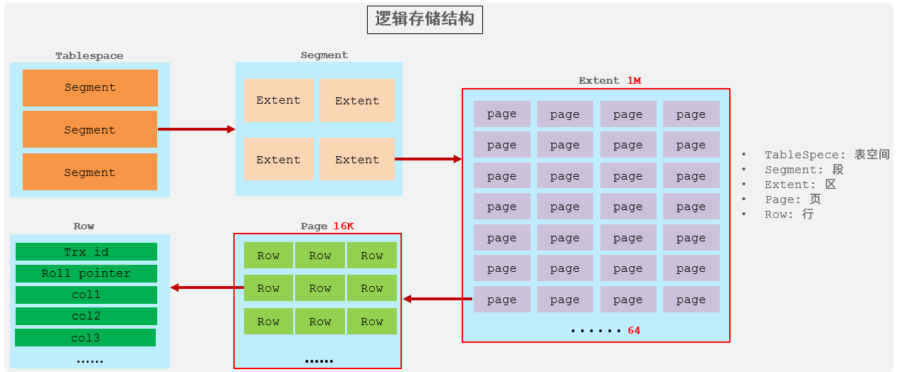
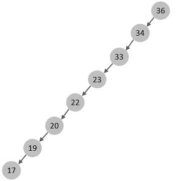
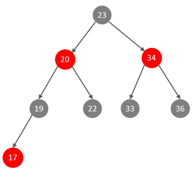
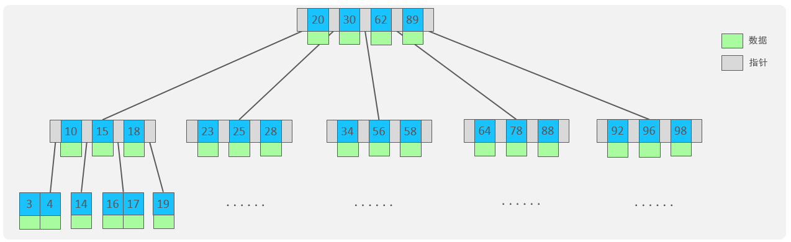
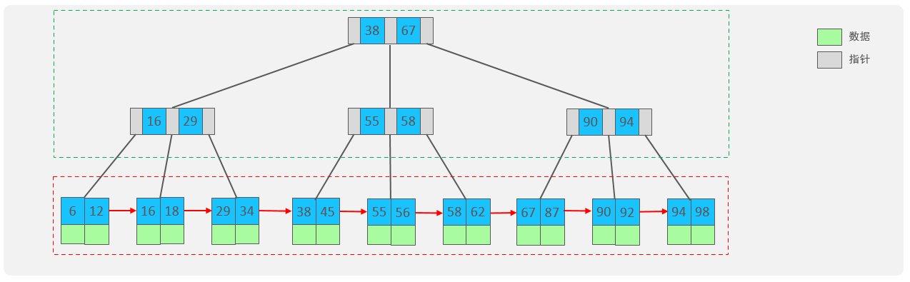
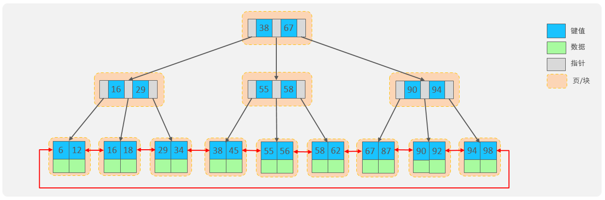
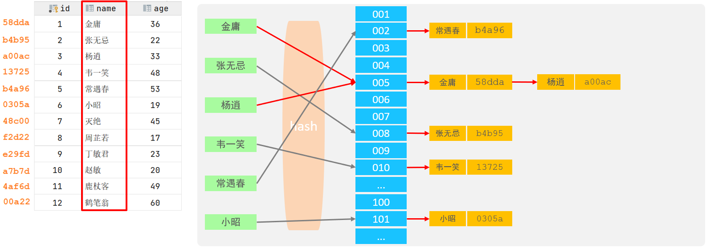
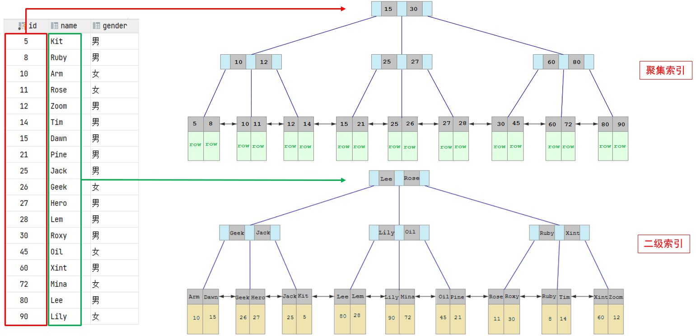
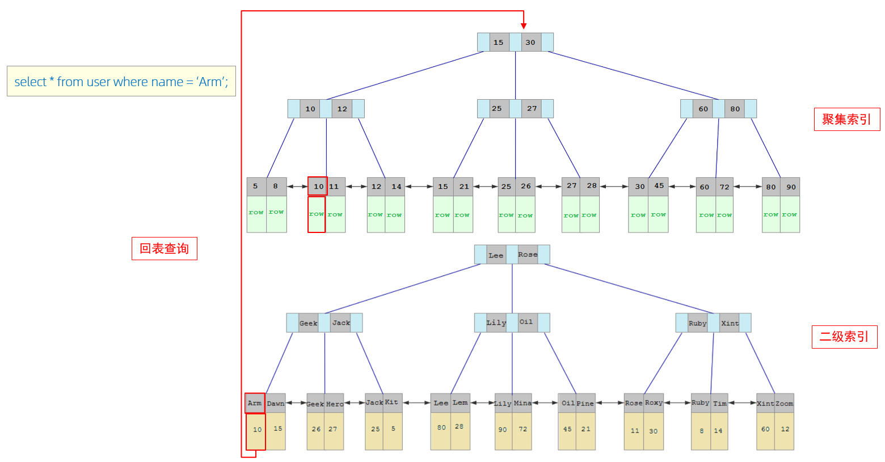
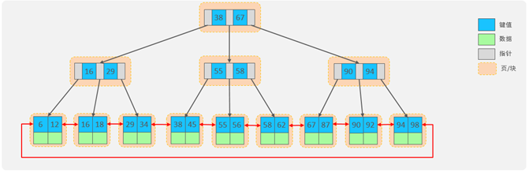

# 存储引擎

## MySQL体系结构


+ 连接层

最上层是一些客户端和链接服务，包含本地sock 通信和大多数基于客户端/服务端工具实现的通信。主要完成一些类似于连接处理、授权认证、及相关的安全方案。在该层上引入了线程池的概念，为通过认证安全接入的客户端提供线程。同样在该层上可以实现基于SSL的安全链接。服务器也会为安全接入的每个客户端验证它所具有的操作权限。

+ 服务层

第二层架构主要完成大多数的核心服务功能，如SQL接口，并完成缓存的查询，SQL的分析和优化，部分内置函数的执行。所有跨存储引擎的功能也在这一层实现，如 过程、函数等。在该层，服务器会解析查询并创建相应的内部解析树，并对其完成相应的优化如确定表的查询的顺序，是否利用索引等，最后生成相应的执行操作。如果是select语句，服务器还会查询内部的缓存，如果缓存空间足够大，这样在解决大量读操作的环境中能够很好的提升系统的性能。

+ 引擎层

存储引擎层， 存储引擎真正的负责了MySQL中数据的存储和提取，服务器通过API和存储引擎进行通信。不同的存储引擎具有不同的功能，可以根据自己的需选取合适的存储引擎。数据库中的索引是在存储引擎层实现的。

+ 存储层

数据存储层， 主要是将数据(如: redolog、undolog、数据、索引、二进制日志、错误日志、查询日志、慢查询日志等)存储在文件系统之上，并完成与存储引擎的交互。和其他数据库相比，MySQL有点与众不同，它的架构可以在多种不同场景中应用并发挥良好作用。主要体现在存储引擎上，插件式的存储引擎架构，将查询处理和其他的系统任务以及数据的存储提取分离。这种架构可以根据业务的需求和实际需要选择合适的存储引擎。

## 存储引擎介绍

存储引擎就是存储数据、建立索引、更新/查询数据等技术的实现方式 。存储引擎是基于表的，而不是基于库的，所以存储引擎也可被称为表类型。可以在创建表的时候，来指定选择的存储引擎，如果没有指定将自动选择默认的存储引擎。

+ 建表时指定存储引擎

```sql
CREATE TABLE 表名(
    字段1 字段1类型 [ COMMENT 字段1注释 ] ,
    ......
    字段n 字段n类型 [COMMENT 字段n注释 ]
) ENGINE = INNODB [ COMMENT 表注释 ] ;
```

+ 查询当前数据库支持的存储引擎

```sql
show engines;
```

### 各存储引擎特点

#### InnoDB

mysql的默认存储引擎

特点：

+ DML操作遵循ACID模型，支持事务；
+ 行级锁，提高并发访问性能；
+ 支持外键FOREIGN KEY约束，保证数据的完整性和正确性；

文件：

xxx.ibd：xxx代表的是表名，innoDB引擎的每张表都会对应这样一个表空间文件，存储该表的表结构（frm-早期的 、sdi-新版的）、数据和索引。

如果该参数开启，代表对于InnoDB引擎的表，每一张表都对应一个ibd文件:

```sql
mysql> show variables like 'innodb_file_per_table';
+-----------------------+-------+
| Variable_name         | Value |
+-----------------------+-------+
| innodb_file_per_table | ON    |
+-----------------------+-------+
1 row in set (0.01 sec)

mysql> 
```

在win系统中，MySQL的数据存放目录： `C:\ProgramData\MySQL\MySQL Server 8.0\Data` ， 这个目录下有很多文件夹，不同的文件夹代表不同的数据库，文件夹下面的每个.ibd文件代表每张数据库表。

逻辑存储结构：



+ **表空间** : InnoDB存储引擎逻辑结构的最高层，ibd文件其实就是表空间文件，在表空间中可以包含多个Segment段。
+ **段** : 表空间是由各个段组成的， 常见的段有数据段、索引段、回滚段等。InnoDB中对于段的管理，都是引擎自身完成，不需要人为对其控制，一个段中包含多个区。
+ **区** : 区是表空间的单元结构，每个区的大小为1M。 默认情况下， InnoDB存储引擎页大小为16K， 即一个区中一共有64个连续的页。
+ **页** : 页是组成区的最小单元，页也是InnoDB 存储引擎磁盘管理的最小单元，每个页的大小默认为 16KB。为了保证页的连续性，InnoDB 存储引擎每次从磁盘申请 4-5 个区。
+ **行** : InnoDB 存储引擎是面向行的，也就是说数据是按行进行存放的，在每一行中除了定义表时所指定的字段以外，还包含两个隐藏字段。

#### MyISAM

mysql早期的默认存储引擎

特点：

+ 不支持事务，不支持外键
+ 支持表锁，不支持行锁
+ 访问速度快

文件：

+ xxx.sdi：存储表结构信息
+ xxx.MYD: 存储数据
+ xxx.MYI: 存储索引

#### MeMory

表数据存储在内存中的，由于受到硬件问题、或断电问题的影响，只能将这些表作为临时表或缓存使用。

特点：

+ 内存存放
+ hash索引（默认）

文件：

+ xxx.sdi：存储表结构信息


### 存储引擎区别

| 特点         | InnoDB              | MyISAM | Memory |
| ------------ | ------------------- | ------ | ------ |
| 存储限制     | 64TB                | 有     | 有     |
| 事务安全     | 支持                | -      | -      |
| 锁机制       | 行锁                | 表锁   | 表锁   |
| B+tree 索引  | 支持                | 支持   | 支持   |
| Hash 索引    | -                   | -      | 支持   |
| 全文索引     | 支持 (5.6 版本之后) | 支持   | -      |
| 空间使用     | 高                  | 低     | N/A    |
| 内存使用     | 高                  | 低     | 中等   |
| 批量插入速度 | 低                  | 高     | 高     |
| 支持外键     | 支持                | -      | -      |

> InnoDB引擎与MyISAM引擎的区别 ?
>
> ①. InnoDB引擎, 支持事务, 而MyISAM不支持。
>
> ②. InnoDB引擎, 支持行锁和表锁, 而MyISAM仅支持表锁, 不支持行锁。
>
> ③. InnoDB引擎, 支持外键, 而MyISAM是不支持的。


### 存储引擎选择

在选择存储引擎时，应该根据应用系统的特点选择合适的存储引擎。对于复杂的应用系统，还可以根据实际情况选择多种存储引擎进行组合。

+ InnoDB: 是Mysql的默认存储引擎，支持事务、外键。如果应用对事务的完整性有比较高的要求，在并发条件下要求数据的一致性，数据操作除了插入和查询之外，还包含很多的更新、删除操作，那么InnoDB存储引擎是比较合适的选择。
+ MyISAM ： 如果应用是以读操作和插入操作为主，只有很少的更新和删除操作，并且对事务的完整性、并发性要求不是很高，那么选择这个存储引擎是非常合适的。
+ MEMORY：将所有数据保存在内存中，访问速度快，通常用于临时表及缓存。MEMORY的缺陷就是对表的大小有限制，太大的表无法缓存在内存中，而且无法保障数据的安全性。

# 索引

## 索引特点

| 优势                                                         | 劣势                                                         |
| ------------------------------------------------------------ | ------------------------------------------------------------ |
| 提高数据检索的效率，降低数据库的 IO 成本                     | 索引列也是要占用空间的。                                     |
| 通过索引列对数据进行排序，降低数据排序的成本，降低 CPU 的消耗 | 索引大大提高了查询效率，同时却也降低更新表的速度，如对表进行 INSERT、UPDATE、DELETE 时，效率降低。 |


## 索引结构

### 概述

MySQL的索引是在存储引擎层实现的，不同的存储引擎有不同的索引结构，主要包含以下几种：

| 索引结构               | 描述                                                         |
| ---------------------- | ------------------------------------------------------------ |
| B+Tree 索引            | 最常见的索引类型，大部分引擎都支持 B + 树索引                |
| Hash 索引              | 底层数据结构是用哈希表实现的，只有精确匹配索引列的查询才有效，不支持范围查询 |
| R - tree (空间索引)    | 空间索引是 MyISAM 引擎的一个特殊索引类型，主要用于地理空间数据类型，通常使用较少 |
| Full - text (全文索引) | 是一种通过建立倒排索引，快速匹配文档的方式。类似于 Lucene, Solr, ES |


不同的存储引擎对于索引结构的支持：

| 索引        | InnoDB           | MyISAM | Memory |
| ----------- | ---------------- | ------ | ------ |
| B+tree 索引 | 支持             | 支持   | 支持   |
| Hash 索引   | 不支持           | 不支持 | 支持   |
| R-tree 索引 | 不支持           | 支持   | 不支持 |
| Full-text   | 5.6 版本之后支持 | 支持   | 不支持 |


### 二叉树

如果mysql采用二叉树索引结构，如果主键是顺序插入的，则会形成一个单向链表：



在大数据量情况下，层级较深，检索速度慢。

可以选择红黑树，红黑树是一颗自平衡二叉树，那这样即使是顺序插入数
据，最终形成的数据结构也是一颗平衡的二叉树：



由于红黑树也是一颗二叉树，所以也会存在大数据量情况下，层级较深，检索速度慢。

所以，在MySQL的索引结构中，并没有选择二叉树或者红黑树，而选择的是B+Tree


### B-Tree

B-Tree，B树是一种多叉路衡查找树，相对于二叉树，B树每个节点可以有多个分支，即多叉。

以一颗最大度数（树的度数指的是一个节点的子节点个数）为5(5阶)的b-tree为例，那这个B树每个节点最多存储4个key，5个指针：



特点：

+ 一旦节点存储的key数量到达5，就会裂变，中间元素向上分裂。
+ 在B树中，非叶子节点和叶子节点都会存放数据。


### B+Tree

B+Tree是B-Tree的变种

以一颗最大度数为4（4阶）的b+tree为例：



绿色框框起来的部分，是索引部分，仅仅起到索引数据的作用，不存储数据；红色框框起来的部分，是数据存储部分，在其叶子节点中要存储具体的数据。

与 B-Tree相比，主要有以下三点区别：

+ 所有的数据都会出现在叶子节点。
+ 叶子节点形成一个单向链表。
+ 非叶子节点仅仅起到索引数据作用，具体的数据都是在叶子节点存放的。

MySQL索引数据结构对经典的B+Tree进行了优化。在原B+Tree的基础上，增加一个指向相邻叶子节点的链表指针，就形成了带有顺序指针的B+Tree，提高区间访问的性能，利于排序。




### Hash



特点

+ Hash索引只能用于对等比较(=，in)，不支持范围查询（between，>，< ，...）
+ 无法利用索引完成排序操作
+ 查询效率高，通常(不存在hash冲突的情况)只需要一次检索就可以了，效率通常要高于B+tree索引

在MySQL中，支持hash索引的是Memory存储引擎。 而InnoDB中具有自适应hash功能，hash索引是InnoDB存储引擎根据B+Tree索引在指定条件下自动构建的。


> 为什么InnoDB存储引擎选择使用B+tree索引结构?
>
> + 相对于二叉树，层级更少，搜索效率高；
> + 对于B-tree，无论是叶子节点还是非叶子节点，都会保存数据，这样导致一页中存储的键值减少，指针跟着减少，要同样保存大量数据，只能增加树的高度，导致性能降低；
> + 相对Hash索引，B+tree支持范围匹配及排序操作；


## 索引分类

### 索引分类

在MySQL数据库，将索引的具体类型主要分为：主键索引、唯一索引、常规索引、全文索引

| 分类     | 含义                                                 | 特点                     | 关键字   |
| -------- | ---------------------------------------------------- | ------------------------ | -------- |
| 主键索引 | 针对于表中主键创建的索引                             | 默认自动创建，只能有一个 | PRIMARY  |
| 唯一索引 | 避免同一个表中某数据列中的值重复                     | 可以有多个               | UNIQUE   |
| 常规索引 | 快速定位特定数据                                     | 可以有多个               |          |
| 全文索引 | 全文索引查找的是文本中的关键词，而不是比较索引中的值 | 可以有多个               | FULLTEXT |


### 聚集索引&二级索引

在InnoDB存储引擎中，根据索引的存储形式，分为以下两种：

| 分类                       | 含义                                                       | 特点                 |
| -------------------------- | ---------------------------------------------------------- | -------------------- |
| 聚集索引 (Clustered Index) | 将数据存储与索引放到了一块，索引结构的叶子节点保存了行数据 | 必须有，而且只有一个 |
| 二级索引 (Secondary Index) | 将数据与索引分开存储，索引结构的叶子节点关联的是对应的主键 | 可以存在多个         |

**聚集索引选取规则**:

+ 如果存在主键，主键索引就是聚集索引。
+ 如果不存在主键，将使用第一个唯一（UNIQUE）索引作为聚集索引。
+ 如果表没有主键，且没有合适的唯一索引，则InnoDB会自动生成一个rowid作为隐藏的聚集索引。

聚集索引和二级索引的具体结构如下：



> 聚集索引的叶子节点下挂的是这一行的数据 。
> 二级索引的叶子节点下挂的是该字段值对应的主键值。

具体的查找过程：



> 具体步骤：
>
> 1. 由于是根据name字段进行查询，所以先根据name='Arm'到name字段的二级索引中进行匹配查找。在二级索引中只能查找到 Arm 对应的主键值 10
> 2. 由于查询返回的数据是*，所以此时，还需要根据主键值10，到聚集索引中查找10对应的记录，最终找到10对应的行row。
> 3. 拿到这一行的数据，直接返回。
>
> 这种先到二级索引中查找数据，找到主键值，然后再到聚集索引中根据主键值，获取
> 数据的方式，就称之为回表查询。


> 一、以下两条SQL语句，那个执行效率高? 
> A. select * from user where id = 10 ; B. select * from user where name = 'Arm' ;
>
> A 语句的执行性能要高于B 语句。因为A语句直接走聚集索引，直接返回数据。 而B语句需要先查询name字段的二级索引，然后再查询聚集索引，也就是需要进行回表查询。

> 二、InnoDB主键索引的B+tree高度为多高呢?
>
> 假设一行数据大小为1k，一页中可以存储16行这样的数据。InnoDB的指针占用6个字节的空
> 间，主键即使为bigint，占用字节数为8。
>
> 
>
> 高度为2：
> 	n * 8 + (n + 1) * 6 = 16*1024 , 算出n约为 1170
> 	1171* 16 = 18736
> 	也就是说，如果树的高度为2，则可以存储 18000 多条记录。
> 高度为3：
> 	1171 * 1171 * 16 = 21939856
> 	也就是说，如果树的高度为3，则可以存储 2200w 左右的记录。


## 索引语法

+ 创建索引

```sql
CREATE [ UNIQUE | FULLTEXT ] INDEX index_name ON table_name (
index_col_name,... ) ;
```

+ 查看索引

```sql
SHOW INDEX 1 FROM table_name ;
```

+ 删除索引

```sql
DROP INDEX index_name ON table_name ;
```


### 测试

+ 创建表并插入数据

```sql
create table tb_user(
                        id int primary key auto_increment comment '主键',
                        name varchar(50) not null comment '用户名',
                        phone varchar(11) not null comment '手机号',
                        email varchar(100) comment '邮箱',
                        profession varchar(11) comment '专业',
                        age tinyint unsigned comment '年龄',
                        gender char(1) comment '性别 , 1: 男, 2: 女',
                        status char(1) comment '状态',
                        createtime datetime comment '创建时间'
) comment '系统用户表';


INSERT INTO test.tb_user (name, phone, email, profession, age, gender, status, createtime) VALUES ('吕布', '17799990000', 'lvbu666@163.com', '软件工程', 23, '1', '6', '2001-02-02 00:00:00');
INSERT INTO test.tb_user (name, phone, email, profession, age, gender, status, createtime) VALUES ('曹操', '17799990001', 'caocao666@qq.com', '通讯工程', 33, '1', '0', '2001-03-05 00:00:00');
INSERT INTO test.tb_user (name, phone, email, profession, age, gender, status, createtime) VALUES ('赵云', '17799990002', '17799990@139.com', '英语', 34, '1', '2', '2002-03-02 00:00:00');
INSERT INTO test.tb_user (name, phone, email, profession, age, gender, status, createtime) VALUES ('孙悟空', '17799990003', '17799990@sina.com', '工程造价', 54, '1', '0', '2001-07-02 00:00:00');
INSERT INTO test.tb_user (name, phone, email, profession, age, gender, status, createtime) VALUES ('花木兰', '17799990004', '19980729@sina.com', '软件工程', 23, '2', '1', '2001-04-22 00:00:00');
INSERT INTO test.tb_user (name, phone, email, profession, age, gender, status, createtime) VALUES ('大乔', '17799990005', 'daqiao666@sina.com', '舞蹈', 22, '2', '0', '2001-02-07 00:00:00');
INSERT INTO test.tb_user (name, phone, email, profession, age, gender, status, createtime) VALUES ('露娜', '17799990006', 'luna_love@sina.com', '应用数学', 24, '2', '0', '2001-02-08 00:00:00');
INSERT INTO test.tb_user (name, phone, email, profession, age, gender, status, createtime) VALUES ('程咬金', '17799990007', 'chengyaojin@163.com', '化工', 38, '1', '5', '2001-05-23 00:00:00');
INSERT INTO test.tb_user (name, phone, email, profession, age, gender, status, createtime) VALUES ('项羽', '17799990008', 'xiaoyu666@qq.com', '金属材料', 43, '1', '0', '2001-09-18 00:00:00');
INSERT INTO test.tb_user (name, phone, email, profession, age, gender, status, createtime) VALUES ('白起', '17799990009', 'baiqi666@sina.com', '机械工程及其自动化', 27, '1', '2', '2001-08-16 00:00:00');
INSERT INTO test.tb_user (name, phone, email, profession, age, gender, status, createtime) VALUES ('韩信', '17799990010', 'hanxin520@163.com', '无机非金属材料工程', 27, '1', '0', '2001-06-12 00:00:00');
INSERT INTO test.tb_user (name, phone, email, profession, age, gender, status, createtime) VALUES ('荆轲', '17799990011', 'jingke123@163.com', '会计', 29, '1', '0', '2001-05-11 00:00:00');
INSERT INTO test.tb_user (name, phone, email, profession, age, gender, status, createtime) VALUES ('兰陵王', '17799990012', 'lanlinwang666@126.com', '工程造价', 44, '1', '1', '2001-04-09 00:00:00');
INSERT INTO test.tb_user (name, phone, email, profession, age, gender, status, createtime) VALUES ('狂铁', '17799990013', 'kuangtie@sina.com', '应用数学', 43, '1', '2', '2001-04-10 00:00:00');
INSERT INTO test.tb_user (name, phone, email, profession, age, gender, status, createtime) VALUES ('貂蝉', '17799990014', '84958948374@qq.com', '软件工程', 40, '2', '3', '2001-02-12 00:00:00');
INSERT INTO test.tb_user (name, phone, email, profession, age, gender, status, createtime) VALUES ('妲己', '17799990015', '2783238293@qq.com', '软件工程', 31, '2', '0', '2001-01-30 00:00:00');
INSERT INTO test.tb_user (name, phone, email, profession, age, gender, status, createtime) VALUES ('芈月', '17799990016', 'xiaomin2001@sina.com', '工业经济', 35, '2', '0', '2000-05-03 00:00:00');
INSERT INTO test.tb_user (name, phone, email, profession, age, gender, status, createtime) VALUES ('嬴政', '17799990017', '8839434342@qq.com', '化工', 38, '1', '1', '2001-08-08 00:00:00');
INSERT INTO test.tb_user (name, phone, email, profession, age, gender, status, createtime) VALUES ('狄仁杰', '17799990018', 'jujiamlm8166@163.com', '国际贸易', 30, '1', '0', '2007-03-12 00:00:00');
INSERT INTO test.tb_user (name, phone, email, profession, age, gender, status, createtime) VALUES ('安琪拉', '17799990019', 'jdodm1h@126.com', '城市规划', 51, '2', '0', '2001-08-15 00:00:00');
INSERT INTO test.tb_user (name, phone, email, profession, age, gender, status, createtime) VALUES ('典韦', '17799990020', 'ycaunanjian@163.com', '城市规划', 52, '1', '2', '2000-04-12 00:00:00');
INSERT INTO test.tb_user (name, phone, email, profession, age, gender, status, createtime) VALUES ('廉颇', '17799990021', 'lianpo321@126.com', '土木工程', 19, '1', '3', '2002-07-18 00:00:00');
INSERT INTO test.tb_user (name, phone, email, profession, age, gender, status, createtime) VALUES ('后羿', '17799990022', 'altycj2000@139.com', '城市园林', 20, '1', '0', '2002-03-10 00:00:00');
INSERT INTO test.tb_user (name, phone, email, profession, age, gender, status, createtime) VALUES ('姜子牙', '17799990023', '37483844@qq.com', '工程造价', 29, '1', '4', '2003-05-26 00:00:00');


```

+ 为name字段（可能会重复）创建索引

```sql
create index idx_user_name on  tb_user(name);
```

+ 为name字段（非空、唯一）创建索引

```sql
create unique index idx_user_iphone on tb_user(phone);
```

+ 为profession、age、status创建联合索引

```sql
create index idx_user_pro_age_sta on tb_user(profession,age,status)
```

+ 为email建立合适的索引来提升查询效率

```sql
create index idx_user_email on tb_user(email)
```


+ 查看tb_user表的所有的索引数据

```sql
show index from tb_user
```

| Table    | Non\_unique | Key\_name                | Seq\_in\_index | Column\_name | Collation | Cardinality | Sub\_part | Packed | Null | Index\_type | Comment | Index\_comment | Visible | Expression |
| :------- | :---------- | :----------------------- | :------------- | :----------- | :-------- | :---------- | :-------- | :----- | :--- | :---------- | :------ | :------------- | :------ | :--------- |
| tb\_user | 0           | PRIMARY                  | 1              | id           | A         | 24          | null      | null   |      | BTREE       |         |                | YES     | null       |
| tb\_user | 0           | idx\_user\_iphone        | 1              | phone        | A         | 24          | null      | null   |      | BTREE       |         |                | YES     | null       |
| tb\_user | 1           | idx\_user\_name          | 1              | name         | A         | 24          | null      | null   |      | BTREE       |         |                | YES     | null       |
| tb\_user | 1           | idx\_user\_pro\_age\_sta | 1              | profession   | A         | 16          | null      | null   | YES  | BTREE       |         |                | YES     | null       |
| tb\_user | 1           | idx\_user\_pro\_age\_sta | 2              | age          | A         | 22          | null      | null   | YES  | BTREE       |         |                | YES     | null       |
| tb\_user | 1           | idx\_user\_pro\_age\_sta | 3              | status       | A         | 24          | null      | null   | YES  | BTREE       |         |                | YES     | null       |
| tb\_user | 1           | idx\_user\_email         | 1              | email        | A         | 24          | null      | null   | YES  | BTREE       |         |                | YES     | null       |


## SQL性能分析

### SQL执行频率

MySQL 客户端连接成功后，通过 `show [session|global] status` 命令可以提供服务器状态信
息。

通过如下指令，可以查看当前数据库的INSERT、UPDATE、DELETE、SELECT的访问频次：

```sql
-- session 是查看当前会话 ;
-- global 是查询全局数据 ;
SHOW GLOBAL STATUS LIKE 'Com_______';
```

| Variable\_name | Value |
| :------------- | :---- |
| Com\_binlog    | 0     |
| Com\_commit    | 0     |
| Com\_delete    | 0     |
| Com\_import    | 0     |
| Com\_insert    | 24    |
| Com\_repair    | 0     |
| Com\_revoke    | 0     |
| Com\_select    | 521   |
| Com\_signal    | 0     |
| Com\_update    | 0     |
| Com\_xa\_end   | 0     |

> 可以查看到当前数据库到底是以查询为主，还是以增删改为主，从而为数据库优化提供参考据。 
>
> 如果是以增删改为主，可以不对其进行索引的优化。 如果是以查询为主，就要考虑对数据库的索引进行优化了。
>
> 假如以查询为主，该如何定位针对那些查询语句进行优化？可以借助于慢查询日志。


### 慢查询日志

慢查询日志记录了所有执行时间超过指定参数（long_query_time，单位：秒，默认10秒）的所有SQL语句的日志。

MySQL的慢查询日志默认没有开启，可以查看一下系统变量 `slow_query_log`

```sql
show variables like 'slow_query_log'
```

| Variable\_name   | Value |
| :--------------- | :---- |
| slow\_query\_log | OFF   |

如果要开启慢查询日志，需要在MySQL的配置文件（/etc/mysql/my.cnf）中配置如下信息：

```sql
[mysqld]
# 开启MySQL慢日志查询开关
slow_query_log=1
# 设置慢日志的时间为2秒，SQL语句执行时间超过2秒，就会视为慢查询，记录慢查询日志
long_query_time=2
```

配置完毕之后，通过以下指令重新启动MySQL:

```sql
systemctl restart mysqld
```

再次执行命令可以看到慢查询日志已打开：

```sql
show variables like 'slow_query_log'
```

| Variable\_name   | Value |
| :--------------- | :---- |
| slow\_query\_log | ON    |

查看慢查询日志的位置：

```sql
SHOW VARIABLES LIKE 'slow_query_log_file';
```

| Variable\_name         | Value                            |
| :--------------------- | :------------------------------- |
| slow\_query\_log\_file | /var/lib/mysql/ubuntu-1-slow.log |

#### 测试

+ 创建tb_sku表并插入大量数据

```sql
CREATE TABLE `tb_sku` (
  `id` int(11) NOT NULL AUTO_INCREMENT COMMENT '商品id',
  `sn` varchar(100) NOT NULL COMMENT '商品条码',
  `name` varchar(200) NOT NULL COMMENT 'SKU名称',
  `price` int(20) NOT NULL COMMENT '价格（分）',
  `num` int(10) NOT NULL COMMENT '库存数量',
  `alert_num` int(11) DEFAULT NULL COMMENT '库存预警数量',
  `image` varchar(200) DEFAULT NULL COMMENT '商品图片',
  `images` varchar(2000) DEFAULT NULL COMMENT '商品图片列表',
  `weight` int(11) DEFAULT NULL COMMENT '重量（克）',
  `create_time` datetime DEFAULT NULL COMMENT '创建时间',
  `update_time` datetime DEFAULT NULL COMMENT '更新时间',
  `category_name` varchar(200) DEFAULT NULL COMMENT '类目名称',
  `brand_name` varchar(100) DEFAULT NULL COMMENT '品牌名称',
  `spec` varchar(200) DEFAULT NULL COMMENT '规格',
  `sale_num` int(11) DEFAULT '0' COMMENT '销量',
  `comment_num` int(11) DEFAULT '0' COMMENT '评论数',
  `status` char(1) DEFAULT '1' COMMENT '商品状态 1-正常，2-下架，3-删除',
  PRIMARY KEY (`id`) USING BTREE
) ENGINE=InnoDB DEFAULT CHARSET=utf8mb4 COMMENT='商品表';

```

```sql
-- 执行以下SQL
select * from tb_user;
select count(*) from tb_sku; 
```

```sql
# 查看慢SQL日志
user1@ubuntu-1:~$ sudo cat /var/lib/mysql/ubuntu-1-slow.log
[sudo] password for user1: 
/usr/sbin/mysqld, Version: 8.0.41-0ubuntu0.22.04.1 ((Ubuntu)). started with:
Tcp port: 3306  Unix socket: /var/run/mysqld/mysqld.sock
Time                 Id Command    Argument
# Time: 2025-03-08T10:51:48.774030Z
# User@Host: username[username] @  [192.168.163.1]  Id:     8
# Query_time: 4.477160  Lock_time: 0.000009 Rows_sent: 1  Rows_examined: 0
use test;
SET timestamp=1741431104;
/* ApplicationName=DataGrip 2024.3.1 */ select count(*) from tb_sku;
user1@ubuntu-1:~$ 
```

在慢查询日志中，只会记录执行时间超多预设时间（2s）的SQL，执行较快的SQL是不会记录的


### profile详情

show profiles 能够在做SQL优化时帮助我们了解时间都耗费到哪里去了。

```sql
SELECT @@have_profiling ;
```

| @@have\_profiling |
| :---------------- |
| YES               |

可以看到数据是支持profile的。

```sql
SELECT @@profiling ;
```

| @@profiling |
| :---------- |
| 0           |

但是开关是关闭的。可以通过set语句在session / global级别开启profiling：

```sql
SET profiling = 1;
```

接下来，执行的SQL语句，都会被MySQL记录，并记录执行时间消耗到哪儿去
了。执行如下的SQL语句：

```sql
select * from tb_user;
select * from tb_user where id = 1;
select * from tb_user where name = '白起';
select count(*) from tb_sku;
```

```sql
-- 查看每一条SQL的耗时基本情况
show profiles;
-- 查看指定query_id的SQL语句各个阶段的耗时情况
show profile for query query_id;
-- 查看指定query_id的SQL语句CPU的使用情况
show profile cpu for query query_id;
```

> **show profiles;**
>
> | Query_ID | Duration   | Query                                      |
> | -------- | ---------- | ------------------------------------------ |
> | 1        | 0.00022225 | select * from tb_user                      |
> | 2        | 0.00025325 | select * from tb_user where id = 1         |
> | 3        | 0.00031850 | select * from tb_user where name = ' 白起' |
> | 4        | 1.81512775 | select count(*) from tb_sku                |
>
> 
>
> **show profile for query 3;**
>
> | Status                        | Duration |
> | ----------------------------- | -------- |
> | starting                      | 0.000074 |
> | Executing hook on transaction | 0.000003 |
> | starting                      | 0.000006 |
> | checking permissions          | 0.000004 |
> | Opening tables                | 0.000036 |
> | init                          | 0.000004 |
> | System lock                   | 0.000007 |
> | optimizing                    | 0.000009 |
> | statistics                    | 0.000082 |
> | preparing                     | 0.000012 |
> | executing                     | 0.000025 |
> | end                           | 0.000003 |
> | query end                     | 0.000003 |
> | waiting for handler commit    | 0.000018 |
> | closing tables                | 0.000005 |
> | freeing items                 | 0.000022 |
> | cleaning up                   | 0.000007 |
>
> *17 rows in set, 1 warning (0.01 sec)*
>
> 
>
> **show profile cpu for query 4;**
>
> | Status                        | Duration | CPU_user | CPU_system |
> | ----------------------------- | -------- | -------- | ---------- |
> | starting                      | 0.000071 | 0.000011 | 0.000041   |
> | Executing hook on transaction | 0.000003 | 0.000001 | 0.000002   |
> | starting                      | 0.000007 | 0.000001 | 0.000005   |
> | checking permissions          | 0.000004 | 0.000001 | 0.000003   |
> | Opening tables                | 0.000049 | 0.000011 | 0.000038   |
> | init                          | 0.000004 | 0.000001 | 0.000003   |
> | System lock                   | 0.000006 | 0.000001 | 0.000005   |
> | optimizing                    | 0.000004 | 0.000001 | 0.000004   |
> | statistics                    | 0.000010 | 0.000002 | 0.000008   |
> | preparing                     | 0.000022 | 0.000005 | 0.000017   |
> | executing                     | 1.814616 | 2.170008 | 4.282302   |
> | end                           | 0.000014 | 0.000002 | 0.000007   |
> | query end                     | 0.000006 | 0.000002 | 0.000004   |
> | waiting for handler commit    | 0.000013 | 0.000002 | 0.000010   |
> | closing tables                | 0.000012 | 0.000003 | 0.000009   |
> | freeing items                 | 0.000028 | 0.000007 | 0.000021   |
> | logging slow query            | 0.000247 | 0.000015 | 0.000050   |
> | cleaning up                   | 0.000013 | 0.000003 | 0.000010   |
>
> 18 rows in set, 1 warning (0.00 sec)


### explain

EXPLAIN 或者 DESC命令获取 MySQL 如何执行 SELECT 语句的信息，包括在 SELECT 语句执行过程中表如何连接和连接的顺序。

```sql
-- 直接在select语句之前加上关键字 explain / desc
EXPLAIN SELECT 字段列表 FROM 表名 WHERE 条件 ;
```

```sql
explain select * from tb_user where id=1
```

| id   | select\_type | table    | partitions | type  | possible\_keys | key     | key\_len | ref   | rows | filtered | Extra |
| :--- | :----------- | :------- | :--------- | :---- | :------------- | :------ | :------- | :---- | :--- | :------- | :---- |
| 1    | SIMPLE       | tb\_user | null       | const | PRIMARY        | PRIMARY | 4        | const | 1    | 100      | null  |

Explain 执行计划中各个字段的含义:

| 字段         | 含义                                                         |
| ------------ | ------------------------------------------------------------ |
| id           | select 查询的序列号，表示查询中执行 select 子句或者是操作表的顺序（id 相同，执行顺序从上到下；id 不同，值越大，越先执行）。 |
| select_type  | 表示 SELECT 的类型，常见的取值有 SIMPLE（简单表，即不使用表连接或者子查询）、PRIMARY（主查询，即外层的查询）、UNION（UNION 中的第二个或者后面的查询语句）、SUBQUERY（SELECT / WHERE 之后包含了子查询）等 |
| type         | 表示连接类型，性能由好到差的连接类型为 NULL、system、const、eq_ref、ref、range、 index、all 。 |
| possible_key | 显示可能应用在这张表上的索引，一个或多个。                   |
| key          | 实际使用的索引，如果为 NULL，则没有使用索引。                |
| key_len      | 表示索引中使用的字节数， 该值为索引字段最大可能长度，并非实际使用长度，在不损失精确性的前提下， 长度越短越好 。 |
| rows         | MySQL 认为必须要执行查询的行数，在 innodb 引擎的表中，是一个估计值，可能并不总是准确的。 |
| filtered     | 表示返回结果的行数占需读取行数的百分比， filtered 的值越大越好。 |

## 索引使用

### 最左前缀法则

如果索引了多列（联合索引），要遵守最左前缀法则。最左前缀法则指的是查询从索引的最左列开始，并且不跳过索引中的列。如果跳跃某一列，索引将会部分失效(后面的字段索引失效)。

如在 tb_user 表中，有一个联合索引，这个联合索引涉及到三个字段（profession，age，status），查询时，profession必须存在，否则索引全部失效。而且中间不能跳过某一列，否则该列后面的字段索引将失效。 

 测试：

```sql
explain select * from tb_user where profession = '软件工程' and age = 31 and status= '0';
```

| id   | select\_type | table    | partitions | type | possible\_keys           | key                      | key\_len | ref               | rows | filtered | Extra                 |
| :--- | :----------- | :------- | :--------- | :--- | :----------------------- | :----------------------- | :------- | :---------------- | :--- | :------- | :-------------------- |
| 1    | SIMPLE       | tb\_user | null       | ref  | idx\_user\_pro\_age\_sta | idx\_user\_pro\_age\_sta | 54       | const,const,const | 1    | 100      | Using index condition |

```sql
explain select * from tb_user where profession = '软件工程' and age = 31;
```

| id   | select\_type | table    | partitions | type | possible\_keys           | key                      | key\_len | ref         | rows | filtered | Extra |
| :--- | :----------- | :------- | :--------- | :--- | :----------------------- | :----------------------- | :------- | :---------- | :--- | :------- | :---- |
| 1    | SIMPLE       | tb\_user | null       | ref  | idx\_user\_pro\_age\_sta | idx\_user\_pro\_age\_sta | 49       | const,const | 1    | 100      | null  |

```sql
explain select * from tb_user where profession = '软件工程';
```

| id   | select\_type | table    | partitions | type | possible\_keys           | key                      | key\_len | ref   | rows | filtered | Extra |
| :--- | :----------- | :------- | :--------- | :--- | :----------------------- | :----------------------- | :------- | :---- | :--- | :------- | :---- |
| 1    | SIMPLE       | tb\_user | null       | ref  | idx\_user\_pro\_age\_sta | idx\_user\_pro\_age\_sta | 47       | const | 4    | 100      | null  |

以上的这三组测试中，发现只要联合索引最左边的字段 profession存在，索引就会生效，只不
过索引的长度不同。 可以推测出profession字段索引长度为47、age字段索引长度为2、status字段索引长度为5。


```sql
explain select * from tb_user where age = 31 and status = '0';
```

| id   | select\_type | table    | partitions | type | possible\_keys | key  | key\_len | ref  | rows | filtered | Extra       |
| :--- | :----------- | :------- | :--------- | :--- | :------------- | :--- | :------- | :--- | :--- | :------- | :---------- |
| 1    | SIMPLE       | tb\_user | null       | ALL  | null           | null | null     | null | 24   | 4.17     | Using where |

可以看到索引并未生效，原因是因为不满足最左前缀法则


```sql
explain select * from tb_user where profession = '软件工程' and status = '0';
```

| id   | select\_type | table    | partitions | type | possible\_keys           | key                      | key\_len | ref   | rows | filtered | Extra                 |
| :--- | :----------- | :------- | :--------- | :--- | :----------------------- | :----------------------- | :------- | :---- | :--- | :------- | :-------------------- |
| 1    | SIMPLE       | tb\_user | null       | ref  | idx\_user\_pro\_age\_sta | idx\_user\_pro\_age\_sta | 47       | const | 4    | 10       | Using index condition |

存在profession字段，最左边的列是存在的，索引满足最左前缀法则的基本条件。但是查询时，跳过了age这个列，所以后面的列索引是不会使用的，也就是索引部分生效，所以索引的长度就是47。


```sql
explain select * from tb_user where age = 31 and status = '0' and profession = '软件工程';
```

| id   | select\_type | table    | partitions | type | possible\_keys           | key                      | key\_len | ref               | rows | filtered | Extra                 |
| :--- | :----------- | :------- | :--------- | :--- | :----------------------- | :----------------------- | :------- | :---------------- | :--- | :------- | :-------------------- |
| 1    | SIMPLE       | tb\_user | null       | ref  | idx\_user\_pro\_age\_sta | idx\_user\_pro\_age\_sta | 54       | const,const,const | 1    | 100      | Using index condition |

这个SQL也满足最左前缀法则，最左边的列是指在查询时，联合索引的最左边的字段(即是第一个字段)必须存在，与编写SQL时，条件编写的先后顺序无关。


### 范围查询

联合索引中，出现范围查询(>,<)，范围查询右侧的列索引失效。

测试：

```sql
explain select * from tb_user where profession = '软件工程' and age > 30 and status = '0';
```

| id   | select\_type | table    | partitions | type  | possible\_keys           | key                      | key\_len | ref  | rows | filtered | Extra                 |
| :--- | :----------- | :------- | :--------- | :---- | :----------------------- | :----------------------- | :------- | :--- | :--- | :------- | :-------------------- |
| 1    | SIMPLE       | tb\_user | null       | range | idx\_user\_pro\_age\_sta | idx\_user\_pro\_age\_sta | 49       | null | 2    | 10       | Using index condition |

范围查询右边的status字段是没有走索引的。


```sql
explain select * from tb_user where profession = '软件工程' and age >= 30 and status = '0';
```

| id   | select\_type | table    | partitions | type  | possible\_keys           | key                      | key\_len | ref  | rows | filtered | Extra                 |
| :--- | :----------- | :------- | :--------- | :---- | :----------------------- | :----------------------- | :------- | :--- | :--- | :------- | :-------------------- |
| 1    | SIMPLE       | tb\_user | null       | range | idx\_user\_pro\_age\_sta | idx\_user\_pro\_age\_sta | 54       | null | 2    | 10       | Using index condition |

当范围查询使用>= 或 <= 时，走联合索引了；索引的长度为54，就说明所有的字段都是走索引
的。

所以尽可能的使用类似于 >= 或 <= 这类的范围查询，而避免使用 > 或 <


### 索引失效情况

#### 索引列运算

在tb_user表中，phone字段有单列索引。

测试：

```sql
explain select * from tb_user where phone = '17799990015';
```

当根据phone字段进行等值匹配查询时, 索引生效

```sql
explain select * from tb_user where substring(phone,10,2) = '15';
```

| id   | select\_type | table    | partitions | type | possible\_keys | key  | key\_len | ref  | rows | filtered | Extra       |
| :--- | :----------- | :------- | :--------- | :--- | :------------- | :--- | :------- | :--- | :--- | :------- | :---------- |
| 1    | SIMPLE       | tb\_user | null       | ALL  | null           | null | null     | null | 24   | 100      | Using where |

当根据phone字段进行函数运算操作之后，索引失效


#### 字符串不加引号

字符串类型字段使用时，不加引号，索引将失效

测试：

```sql
explain select * from tb_user where profession = '软件工程' and age = 31 and status = 0;
```

| id   | select\_type | table    | partitions | type | possible\_keys           | key                      | key\_len | ref         | rows | filtered | Extra                 |
| :--- | :----------- | :------- | :--------- | :--- | :----------------------- | :----------------------- | :------- | :---------- | :--- | :------- | :-------------------- |
| 1    | SIMPLE       | tb\_user | null       | ref  | idx\_user\_pro\_age\_sta | idx\_user\_pro\_age\_sta | 49       | const,const | 1    | 10       | Using index condition |

status字段没走索引

```sql
explain select * from tb_user where phone = 17799990015;
```

| id   | select\_type | table    | partitions | type | possible\_keys    | key  | key\_len | ref  | rows | filtered | Extra       |
| :--- | :----------- | :------- | :--------- | :--- | :---------------- | :--- | :------- | :--- | :--- | :------- | :---------- |
| 1    | SIMPLE       | tb\_user | null       | ALL  | idx\_user\_iphone | null | null     | null | 24   | 10       | Using where |

phone字段没走索引

可以发现：如果字符串不加单引号，对于查询结果，没什么影响，但是数据库存在隐式类型转换，索引将失效。


#### 模糊查询

如果仅仅是尾部模糊匹配，索引不会失效。如果是头部模糊匹配，索引失效

测试：

```sql
explain select * from tb_user where profession like '软件%';
```

| id   | select\_type | table    | partitions | type  | possible\_keys           | key                      | key\_len | ref  | rows | filtered | Extra                 |
| :--- | :----------- | :------- | :--------- | :---- | :----------------------- | :----------------------- | :------- | :--- | :--- | :------- | :-------------------- |
| 1    | SIMPLE       | tb\_user | null       | range | idx\_user\_pro\_age\_sta | idx\_user\_pro\_age\_sta | 47       | null | 4    | 100      | Using index condition |

```sql
explain select * from tb_user where profession like '%工程';
```

| id   | select\_type | table    | partitions | type | possible\_keys | key  | key\_len | ref  | rows | filtered | Extra       |
| :--- | :----------- | :------- | :--------- | :--- | :------------- | :--- | :------- | :--- | :--- | :------- | :---------- |
| 1    | SIMPLE       | tb\_user | null       | ALL  | null           | null | null     | null | 24   | 11.11    | Using where |


#### or连接条件

用or分割开的条件， 如果or前的条件中的列有索引，而后面的列中没有索引，那么涉及的索引都不会被用到。

测试：

```sql
explain select * from tb_user where phone = '17799990017' or age = 23;
```

| id   | select\_type | table    | partitions | type | possible\_keys    | key  | key\_len | ref  | rows | filtered | Extra       |
| :--- | :----------- | :------- | :--------- | :--- | :---------------- | :--- | :------- | :--- | :--- | :------- | :---------- |
| 1    | SIMPLE       | tb\_user | null       | ALL  | idx\_user\_iphone | null | null     | null | 24   | 13.75    | Using where |

由于age没有索引，所以即使phone有索引，索引也会失效。所以需要针对于age也要建立索引


#### 数据分布影响

MySQL在查询时，会评估使用索引的效率与走全表扫描的效率，如果走全表扫描更快，则放弃索引，走全表扫描。 因为索引是用来索引少量数据的，如果通过索引查询返回大批量的数据，则还不如走全表扫描来的快，此时索引就会失效。

测试：

```sql
explain select * from tb_user where profession is null;
```

| id   | select\_type | table    | partitions | type | possible\_keys           | key                      | key\_len | ref   | rows | filtered | Extra                 |
| :--- | :----------- | :------- | :--------- | :--- | :----------------------- | :----------------------- | :------- | :---- | :--- | :------- | :-------------------- |
| 1    | SIMPLE       | tb\_user | null       | ref  | idx\_user\_pro\_age\_sta | idx\_user\_pro\_age\_sta | 47       | const | 1    | 100      | Using index condition |

```sql
explain select * from tb_user where profession is not null;
```

| id   | select\_type | table    | partitions | type | possible\_keys           | key  | key\_len | ref  | rows | filtered | Extra       |
| :--- | :----------- | :------- | :--------- | :--- | :----------------------- | :--- | :------- | :--- | :--- | :------- | :---------- |
| 1    | SIMPLE       | tb\_user | null       | ALL  | idx\_user\_pro\_age\_sta | null | null     | null | 24   | 100      | Using where |

可以看到is null走了索引但是  is not  null没有走索引。

做一个操作将profession字段值全部更新为null：`update tb_user set profession = null;`

```sql
explain select * from tb_user where profession is null;
```

| id   | select\_type | table    | partitions | type | possible\_keys           | key  | key\_len | ref  | rows | filtered | Extra       |
| :--- | :----------- | :------- | :--------- | :--- | :----------------------- | :--- | :------- | :--- | :--- | :------- | :---------- |
| 1    | SIMPLE       | tb\_user | null       | ALL  | idx\_user\_pro\_age\_sta | null | null     | null | 24   | 100      | Using where |

```sql
explain select * from tb_user where profession is not null;
```

| id   | select\_type | table    | partitions | type  | possible\_keys           | key                      | key\_len | ref  | rows | filtered | Extra                 |
| :--- | :----------- | :------- | :--------- | :---- | :----------------------- | :----------------------- | :------- | :--- | :--- | :------- | :-------------------- |
| 1    | SIMPLE       | tb\_user | null       | range | idx\_user\_pro\_age\_sta | idx\_user\_pro\_age\_sta | 47       | null | 1    | 100      | Using index condition |

可以看到is null没有走索引，但是  is  null走了索引。

这是和数据库的数据分布有关系。查询时MySQL会评估，走索引快，还是全表扫描快，如果全表扫描更快，则放弃索引走全表扫描。 因此，is null 、is not null是否走索引，得具体情况具体分析，并不是固定的


### SQL提示

创建profession的单列索引：`create index idx_user_pro on tb_user(profession);`

执行SQL : `explain select * from tb_user where profession = '软件工程';`

| id   | select\_type | table    | partitions | type | possible\_keys                          | key                      | key\_len | ref   | rows | filtered | Extra |
| :--- | :----------- | :------- | :--------- | :--- | :-------------------------------------- | :----------------------- | :------- | :---- | :--- | :------- | :---- |
| 1    | SIMPLE       | tb\_user | null       | ref  | idx\_user\_pro\_age\_sta,idx\_user\_pro | idx\_user\_pro\_age\_sta | 47       | const | 1    | 100      | null  |

可以看到，possible_keys中 idx_user_pro_age_sta,idx_user_pro 这两个索引都可能用到，最终MySQL选择了idx_user_pro_age_sta索引。这是MySQL自动选择的结果。

我们可以借助SQL提示来指定使用哪个索引。

SQL提示，是优化数据库的一个重要手段，简单来说，就是在SQL语句中加入一些人为的提示来达到优化操作的目的

+ use index ： 建议MySQL使用哪一个索引完成此次查询（仅仅是建议，mysql内部还会再次进行评估

```sql
explain select * from tb_user use index(idx_user_pro) where profession = '软件工程';
```

| id   | select\_type | table    | partitions | type | possible\_keys | key            | key\_len | ref   | rows | filtered | Extra |
| :--- | :----------- | :------- | :--------- | :--- | :------------- | :------------- | :------- | :---- | :--- | :------- | :---- |
| 1    | SIMPLE       | tb\_user | null       | ref  | idx\_user\_pro | idx\_user\_pro | 47       | const | 1    | 100      | null  |


+ ignore index ： 忽略指定的索引。

```sql
explain select * from tb_user ignore index(idx_user_pro) where profession = '软件工程';
```

| id   | select\_type | table    | partitions | type | possible\_keys           | key                      | key\_len | ref   | rows | filtered | Extra |
| :--- | :----------- | :------- | :--------- | :--- | :----------------------- | :----------------------- | :------- | :---- | :--- | :------- | :---- |
| 1    | SIMPLE       | tb\_user | null       | ref  | idx\_user\_pro\_age\_sta | idx\_user\_pro\_age\_sta | 47       | const | 1    | 100      | null  |


+ force index ： 强制使用索引。

```sql
explain select * from tb_user force index(idx_user_pro) where profession = '软件工程';
```

| id   | select\_type | table    | partitions | type | possible\_keys | key            | key\_len | ref   | rows | filtered | Extra |
| :--- | :----------- | :------- | :--------- | :--- | :------------- | :------------- | :------- | :---- | :--- | :------- | :---- |
| 1    | SIMPLE       | tb\_user | null       | ref  | idx\_user\_pro | idx\_user\_pro | 47       | const | 24   | 100      | null  |


### 覆盖索引


### 前缀索引


### 单列索引和联合索引


## 索引设计原则


# SQL优化


# 视图、存储过程、触发器


# 锁


# InnoDB引擎


# MySQL管理


