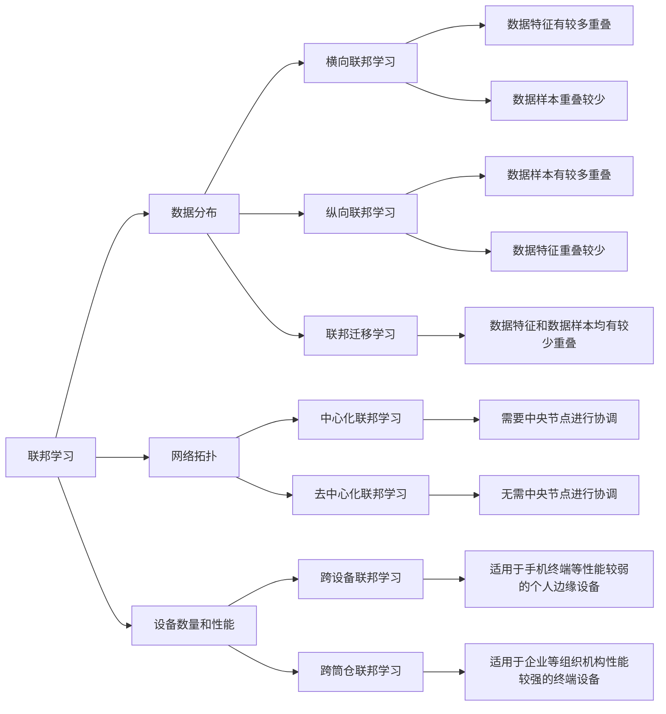
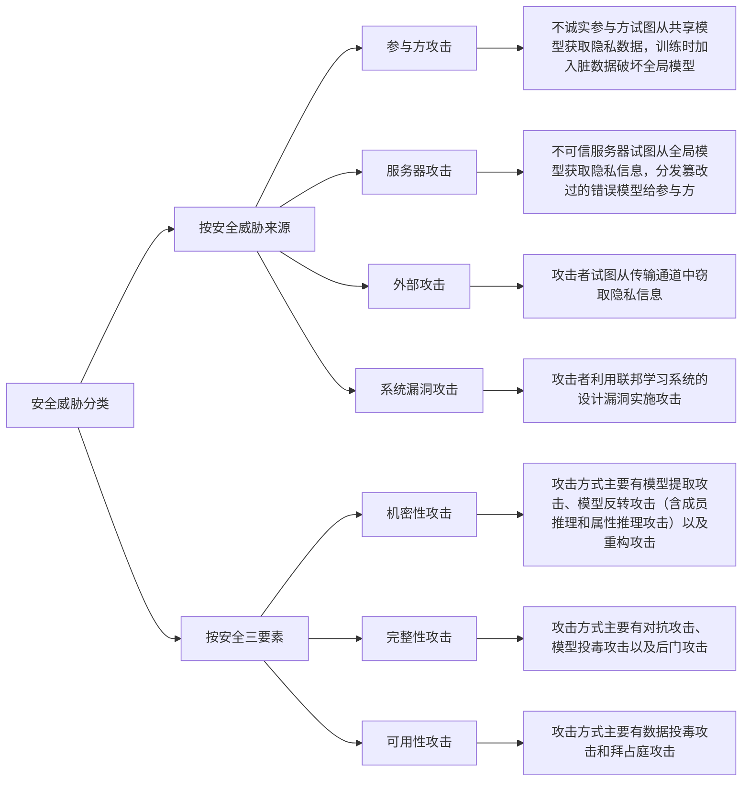

# 《联邦学习及其安全与隐私保护研究综述》

```txt
熊世强,何道敬,王振东,等. 联邦学习及其安全与隐私保护研究综述[J]. 计算机工程,2024,50(5):1-15. DOI:10.19678/j.issn.1000-3428.0067782.
```


## 联邦学习

**联邦学习定义:**

假设有$n$个提供数据参与模型训练的参与方，各参与方用$F_i$表示，各参与方所拥有的数据为$D_i$，其中，$i = \{1,2,\cdots,n\}$ ，使用各参与方的数据进行模型训练，传统的方法是将所有数据收集到一个中心节点，使用整合后的所有数据$D = D_1\cup D_2\cup\cdots\cup D_n$进行模型训练，该方式训练所得的模型记为$M_{sum}$、准确率记为$V_{sum}$ 。

在联邦学习中，各参与方$F_1,F_2,\cdots,F_n$分别使用各自的数据$D_1,D_2,\cdots,D_n$在各客户端本地进行局部模型训练，记聚合后的全局模型为$M_{fed}$、准确率为$V_{fed}$，其间任意参与方$F_i$都无法获知除本身以外的数据$D_i$ 。若存在非负实数$\delta$，满足$\vert V_{sum} - V_{fed}\vert < \delta$，则称模型$M_{fed}$的性能损失为$\delta$，其中，$\delta$​是一个足够小的浮点数，即表示通过 联邦学习方式训练所得的模型准确率应与传统将所有数据放在一起进行模型训练的方式的准确率相差不大。


**联邦学习分类：**



## 联邦学习安全

**安全三要素：**

+ 机密性：利用加密手段对数据信息进行加密处理，避免隐私信息泄露和非授权查看，在联邦学习中需要保证训练模型中的参数和数据等敏感信息不会被攻击者窃取
+ 完整性：指利用网络安全技术保障数据的完好无损，不能被非授权修改，在联邦学习中需要保证模型在训练和预测过程中不受到外界的干扰，能够保障结果的完整和正常输出
+ 可用性：指能够提供正常服务，保证服务不被中断，在联邦学习中需要保证训练出的模型能够被使用方正常使用。


 **联邦学习安全分类：**




## 隐私保护技术

