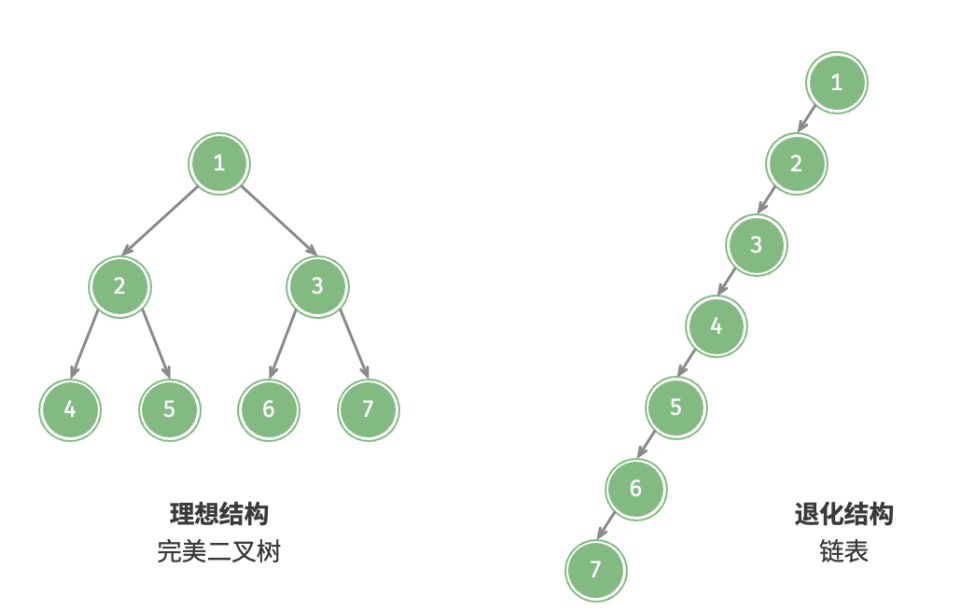
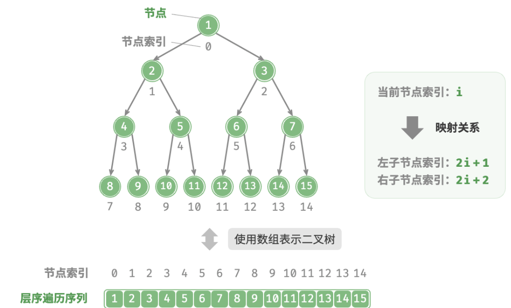
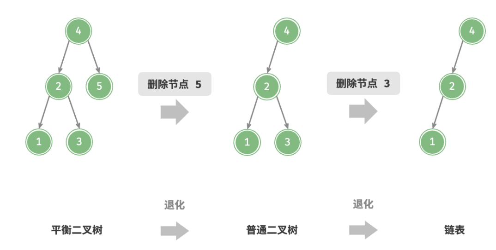
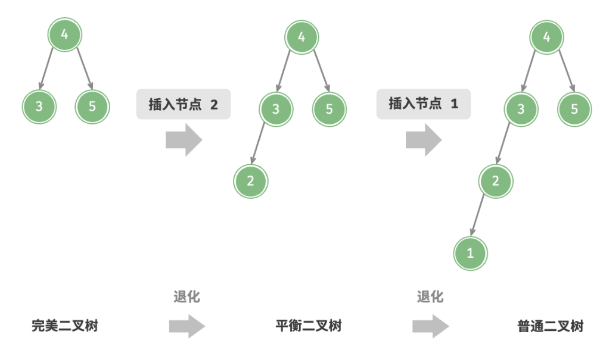
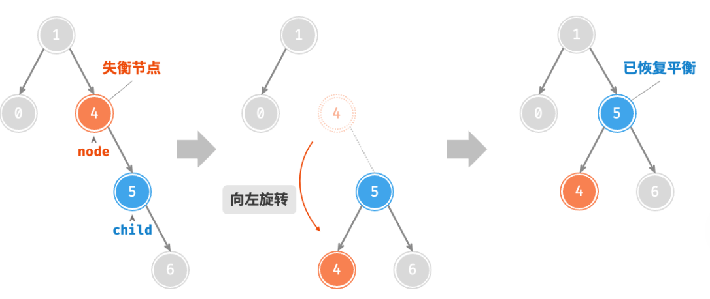
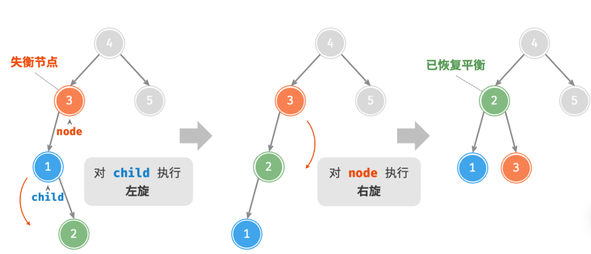
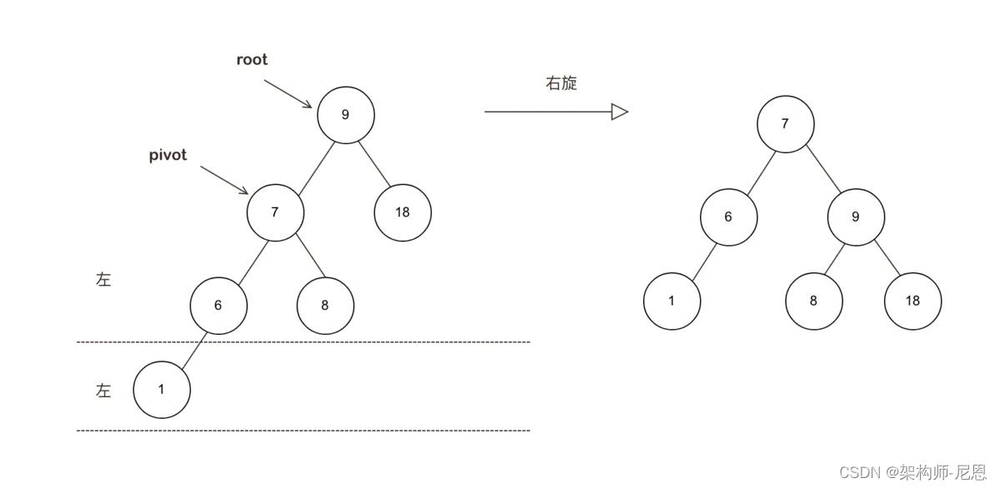

# 树

## 二叉树

根节点、叶节点、边、二叉树的高度、节点的深度、节点的高度：


节点所在的层：从顶至底递增，根节点所在层为 1 。

节点的度: 节点的子节点的数量。在二叉树中，度的取值范围是 0、1、2 。

### 二叉树基本操作

```java
/* 二叉树节点类 */
class TreeNode {
    int val;         // 节点值
    TreeNode left;   // 左子节点引用
    TreeNode right;  // 右子节点引用
    TreeNode(int x) { val = x; }
}

// 初始化节点
TreeNode n1 = new TreeNode(1);
TreeNode n2 = new TreeNode(2);
TreeNode n3 = new TreeNode(3);
TreeNode n4 = new TreeNode(4);
TreeNode n5 = new TreeNode(5);
// 构建节点之间的引用（指针）
n1.left = n2;
n1.right = n3;
n2.left = n4;
n2.right = n5;

// 插入与删除节点
TreeNode P = new TreeNode(0);
// 在 n1 -> n2 中间插入节点 P
n1.left = P;
P.left = n2;
// 删除节点 P
n1.left = n2;
```

### 二叉树类型

+ 完美二叉树


+ 完全二叉树

仅允许最底层的节点不完全填满，且最底层的节点必须从左至右依次连续填充。完美二叉树也是一棵完全二叉树。


+ 完满二叉树

除了叶节点之外，其余所有节点都有两个子节点。


+ 平衡二叉树

任意节点的左子树和右子树的高度之差的绝对值不超过 1 。


### 二叉树的退化



|  | 完美二叉树 | 链表 |
| --- | --- | --- |
| 第\(i\)层的节点数量 | \(2^{i - 1}\) | \(1\) |
| 高度为\(h\)的树的叶节点数量 | \(2^h\) | \(1\) |
| 高度为\(h\)的树的节点总数 | \(2^{h + 1} - 1\) | \(h + 1\) |
| 节点总数为\(n\)的树的高度 | \(\log_2(n + 1) - 1\) | \(n - 1\) |

## 二叉树的遍历

从物理结构的角度来看，树是一种基于链表的数据结构，因此其遍历方式是通过指针逐个访问节点。然而，树是一种非线性数据结构，这使得遍历树比遍历链表更加复杂，需要借助搜索算法来实现。

### 层序遍历


```java
/* 层序遍历 */
List<Integer> levelOrder(TreeNode root) {
    // 初始化队列，加入根节点
    Queue<TreeNode> queue = new LinkedList<>();
    queue.add(root);
    // 初始化一个列表，用于保存遍历序列
    List<Integer> list = new ArrayList<>();
    while (!queue.isEmpty()) {
        TreeNode node = queue.poll(); // 队列出队
        list.add(node.val);           // 保存节点值
        if (node.left != null)
            queue.offer(node.left);   // 左子节点入队
        if (node.right != null)
            queue.offer(node.right);  // 右子节点入队
    }
    return list;
}
```

时间复杂度： $O(n)$

空间复杂度： $O(n)$

### 前、中、后序遍历

前序、中序和后序遍历都属于深度优先遍历。


```java
/* 前序遍历 */
void preOrder(TreeNode root) {
    if (root == null)
        return;
    // 访问优先级：根节点 -> 左子树 -> 右子树
    list.add(root.val);
    preOrder(root.left);
    preOrder(root.right);
}

/* 中序遍历 */
void inOrder(TreeNode root) {
    if (root == null)
        return;
    // 访问优先级：左子树 -> 根节点 -> 右子树
    inOrder(root.left);
    list.add(root.val);
    inOrder(root.right);
}

/* 后序遍历 */
void postOrder(TreeNode root) {
    if (root == null)
        return;
    // 访问优先级：左子树 -> 右子树 -> 根节点
    postOrder(root.left);
    postOrder(root.right);
    list.add(root.val);
}
```

时间复杂度： $O(n)$

空间复杂度： $O(n)$

## 二叉树数组表示

+ 表示完美二叉树

若某节点的索引为 $i$ ，则该节点的左子节点索引为 $2i + 1$ ，右子节点索引为 $2i + 2$ ：



+ 表示任意二叉树

```java
Integer[] tree = { 1, 2, 3, 4, null, 6, 7, 8, 9, null, null, 12, null, null, 15 };
```


完全二叉树非常适合使用数组来表示。因为空值只出现在最底层且靠右的位置，因此所有`null` 一定出现在层序遍历序列的末尾。

基于数组表示的二叉树，常见的几种操作：给定某节点，获取它的值、左（右）子节点、父节点；获取前序遍历、中序遍历、后序遍历、层序遍历序列：
```java
/* 数组表示下的二叉树类 */
class ArrayBinaryTree {
    private List<Integer> tree;

    /* 构造方法 */
    public ArrayBinaryTree(List<Integer> arr) {
        tree = new ArrayList<>(arr);
    }

    /* 列表容量 */
    public int size() {
        return tree.size();
    }

    /* 获取索引为 i 节点的值 */
    public Integer val(int i) {
        // 若索引越界，则返回 null ，代表空位
        if (i < 0 || i >= size())
            return null;
        return tree.get(i);
    }

    /* 获取索引为 i 节点的左子节点的索引 */
    public Integer left(int i) {
        return 2 * i + 1;
    }

    /* 获取索引为 i 节点的右子节点的索引 */
    public Integer right(int i) {
        return 2 * i + 2;
    }

    /* 获取索引为 i 节点的父节点的索引 */
    public Integer parent(int i) {
        return (i - 1) / 2;
    }

    /* 层序遍历 */
    public List<Integer> levelOrder() {
        List<Integer> res = new ArrayList<>();
        // 直接遍历数组
        for (int i = 0; i < size(); i++) {
            if (val(i) != null)
                res.add(val(i));
        }
        return res;
    }

    /* 深度优先遍历 */
    private void dfs(Integer i, String order, List<Integer> res) {
        // 若为空位，则返回
        if (val(i) == null)
            return;
        // 前序遍历
        if ("pre".equals(order))
            res.add(val(i));
        dfs(left(i), order, res);
        // 中序遍历
        if ("in".equals(order))
            res.add(val(i));
        dfs(right(i), order, res);
        // 后序遍历
        if ("post".equals(order))
            res.add(val(i));
    }

    /* 前序遍历 */
    public List<Integer> preOrder() {
        List<Integer> res = new ArrayList<>();
        dfs(0, "pre", res);
        return res;
    }

    /* 中序遍历 */
    public List<Integer> inOrder() {
        List<Integer> res = new ArrayList<>();
        dfs(0, "in", res);
        return res;
    }

    /* 后序遍历 */
    public List<Integer> postOrder() {
        List<Integer> res = new ArrayList<>();
        dfs(0, "post", res);
        return res;
    }
}

```

## 二叉搜索树BST

二叉搜索树满足一下条件：
+ 对于根节点，左子树中所有节点的值<根节点的值<右子树中所有节点的值。
+ 任意节点的左、右子树也是二叉搜索树。

### 查找

二叉搜索树的查找操作与二分查找算法的工作原理一致，都是每轮排除一半情况。循环次数最多为二叉树的高度，当二叉树平衡时，时间复杂度为 $O(\log n)$ 。

```java
/* 查找节点 */
TreeNode search(int num) {
    TreeNode cur = root;
    // 循环查找，越过叶节点后跳出
    while (cur != null) {
        // 目标节点在 cur 的右子树中
        if (cur.val < num)
            cur = cur.right;
        // 目标节点在 cur 的左子树中
        else if (cur.val > num)
            cur = cur.left;
        // 找到目标节点，跳出循环
        else
            break;
    }
    // 返回目标节点
    return cur;
}
```

### 插入节点

时间复杂度为 $O(\log n)$ 。

二叉搜索树不允许存在重复节点。因此，若待插入节点在树中已存在，则不执行插入，直接返回。

需要借助节点 pre 保存上一轮循环的节点。这样在遍历至 None 时，可以获取到其父节点，从而完成节点插入操作。

```java
/* 插入节点 */
void insert(int num) {
    // 若树为空，则初始化根节点
    if (root == null) {
        root = new TreeNode(num);
        return;
    }
    TreeNode cur = root, pre = null;
    // 循环查找，越过叶节点后跳出
    while (cur != null) {
        // 找到重复节点，直接返回
        if (cur.val == num)
            return;
        pre = cur;
        // 插入位置在 cur 的右子树中
        if (cur.val < num)
            cur = cur.right;
        // 插入位置在 cur 的左子树中
        else
            cur = cur.left;
    }
    // 插入节点
    TreeNode node = new TreeNode(num);
    if (pre.val < num)
        pre.right = node;
    else
        pre.left = node;
}
```

### 删除节点

时间复杂度为 $O(\log n)$ 。

分三种情况：

+ 待删除节点为叶节点
 直接删除

+ 待删除节点有一个子节点
  直接删除，将子节点替换为当前节点

+ 待删除节点有两个子节点
  找到待删除节点的**右子树中的最小节**点或**左子树的最大节点**，将其值赋值给待删除节点。然后删除该最小节点。


```java
/* 删除节点 */
void remove(int num) {
    // 若树为空，直接提前返回
    if (root == null)
        return;
    TreeNode cur = root, pre = null;
    // 循环查找，越过叶节点后跳出
    while (cur != null) {
        // 找到待删除节点，跳出循环
        if (cur.val == num)
            break;
        pre = cur;
        // 待删除节点在 cur 的右子树中
        if (cur.val < num)
            cur = cur.right;
        // 待删除节点在 cur 的左子树中
        else
            cur = cur.left;
    }
    // 若无待删除节点，则直接返回
    if (cur == null)
        return;
    // 子节点数量 = 0 or 1
    if (cur.left == null || cur.right == null) {
        // 当子节点数量 = 0 / 1 时， child = null / 该子节点
        TreeNode child = cur.left != null ? cur.left : cur.right;
        // 删除节点 cur
        if (cur != root) {
            if (pre.left == cur)
                pre.left = child;
            else
                pre.right = child;
        } else {
            // 若删除节点为根节点，则重新指定根节点
            root = child;
        }
    }
    // 子节点数量 = 2
    else {
        // 获取中序遍历中 cur 的下一个节点
        TreeNode tmp = cur.right;
        while (tmp.left != null) {
            tmp = tmp.left;
        }
        // 递归删除节点 tmp
        remove(tmp.val);
        // 用 tmp 覆盖 cur
        cur.val = tmp.val;
    }
}
```

### 中序遍历有序

二叉树的中序遍历遵循“左->根->右”的遍历顺序，而二叉搜索树满足“左子节点<根节点<右子节点”的大小关系。

这意味着在二叉搜索树中进行中序遍历时，总是会优先遍历下一个最小节点，从而得出一个重要性质：**二叉搜索树的中序遍历序列是升序的。**

因此在二叉搜索树中获取有序数据仅需$O(n)$时间，无须进行额外的排序操作

### 二叉搜索树退化

如果在二叉搜索树中不断地插入和删除节点，可能导致二叉树退化为链表，这时各种操作的时间复杂度也会退化为 $O(n)$ 。





## AVL树

AVL 树既是二叉搜索树，也是平衡二叉树，同时满足这两类二叉树的所有性质，因此是一种平衡二叉搜索树（balanced binary search tree）。

AVL 树的相关操作需要获取节点高度，因此需要为节点类添加 height 变量。

“节点高度”是指从该节点到它的最远叶节点的距离，即所经过的“边”的数量。叶节点的高度为 0 ，空节点的高度为 -1
 
 节点的平衡因子（balance factor）定义为节点**左子树的高度减去右子树的高度**，同时规定空节点的平衡因子为 0 。

 ```java
 /* AVL 树节点类 */
class TreeNode {
    public int val;        // 节点值
    public int height;     // 节点高度
    public TreeNode left;  // 左子节点
    public TreeNode right; // 右子节点
    public TreeNode(int x) { val = x; }
}

/* 获取节点高度 */
int height(TreeNode node) {
    // 空节点高度为 -1 ，叶节点高度为 0
    return node == null ? -1 : node.height;
}

/* 更新节点高度 */
void updateHeight(TreeNode node) {
    // 节点高度等于最高子树高度 + 1
    node.height = Math.max(height(node.left), height(node.right)) + 1;
}

/* 获取平衡因子 */
int balanceFactor(TreeNode node) {
    // 空节点平衡因子为 0
    if (node == null)
        return 0;
    // 节点平衡因子 = 左子树高度 - 右子树高度
    return height(node.left) - height(node.right);
}

```

### AVL树旋转

AVL 树的特点在于“旋转”操作，它能够在不影响二叉树的中序遍历序列的前提下，使失衡节点重新恢复平衡。

将平衡因子绝对值 >1 的节点称为“失衡节点”。根据节点失衡情况的不同，旋转操作分为四种：右旋、左旋、先右旋后左旋、先左旋后右旋。

#### 右旋

如图下图，从底至顶看，二叉树中首个失衡节点是“节点 3”。关注以该失衡节点为根节点的子树，将该节点记为 node ，其左子节点记为 child ，执行“右旋”操作。完成右旋后，子树恢复平衡，并且仍然保持二叉搜索树的性质。


如下图，当节点 child 有右子节点（记为 grand_child ）时，需要在右旋中添加一步：将 grand_child 作为 node 的左子节点。


```java
/* 右旋操作 */
TreeNode rightRotate(TreeNode node) {
    TreeNode child = node.left;
    TreeNode grandChild = child.right;
    // 以 child 为原点，将 node 向右旋转
    child.right = node;
    node.left = grandChild;
    // 更新节点高度
    updateHeight(node);
    updateHeight(child);
    // 返回旋转后子树的根节点
    return child;
}
```

#### 左旋

与右旋同理：



节点 child 有左子节点（记为 grand_child ）时，需要在左旋中添加一步：将 grand_child 作为 node 的右子节点。


```java
/* 左旋操作 */
TreeNode leftRotate(TreeNode node) {
    TreeNode child = node.right;
    TreeNode grandChild = child.left;
    // 以 child 为原点，将 node 向左旋转
    child.left = node;
    node.right = grandChild;
    // 更新节点高度
    updateHeight(node);
    updateHeight(child);
    // 返回旋转后子树的根节点
    return child;
}
```

#### 先左旋后右旋



#### 先右旋后左旋


#### 旋转的选择

四种情况：


通过判断失衡节点的平衡因子以及较高一侧子节点的平衡因子的正负号，来确定失衡节点属于图中那种情况：

| 失衡节点的平衡因子 | 子节点的平衡因子 | 应采用的旋转方法 |
| ------------------ | ---------------- | ---------------- |
| > 1（左偏树）      | ≥ 0              | 右旋             |
| > 1（左偏树）      | < 0              | 先左旋后右旋     |
| < -1（右偏树）     | ≤ 0              | 左旋             |
| < -1（右偏树）     | > 0              | 先右旋后左旋     |

```java
/* 执行旋转操作，使该子树重新恢复平衡 */
TreeNode rotate(TreeNode node) {
    // 获取节点 node 的平衡因子
    int balanceFactor = balanceFactor(node);
    // 左偏树
    if (balanceFactor > 1) {
        if (balanceFactor(node.left) >= 0) {
            // 右旋
            return rightRotate(node);
        } else {
            // 先左旋后右旋
            node.left = leftRotate(node.left);
            return rightRotate(node);
        }
    }
    // 右偏树
    if (balanceFactor < -1) {
        if (balanceFactor(node.right) <= 0) {
            // 左旋
            return leftRotate(node);
        } else {
            // 先右旋后左旋
            node.right = rightRotate(node.right);
            return leftRotate(node);
        }
    }
    // 平衡树，无须旋转，直接返回
    return node;
}
```

### AVL树常用操作

#### 插入节点

在 AVL 树中插入节点后，从该节点到根节点的路径上可能会出现一系列失衡节点。因此需要从这个节点开始，自底向上执行旋转操作，使所有失衡节点恢复平衡。

```java
/* 插入节点 */
void insert(int val) {
    root = insertHelper(root, val);
}

/* 递归插入节点（辅助方法） */
TreeNode insertHelper(TreeNode node, int val) {
    if (node == null)
        return new TreeNode(val);
    /* 1. 查找插入位置并插入节点 */
    if (val < node.val)
        node.left = insertHelper(node.left, val);
    else if (val > node.val)
        node.right = insertHelper(node.right, val);
    else
        return node; // 重复节点不插入，直接返回
    updateHeight(node); // 更新节点高度
    /* 2. 执行旋转操作，使该子树重新恢复平衡 */
    node = rotate(node);
    // 返回子树的根节点
    return node;
}
```

#### 删除节点

```java
/* 删除节点 */
void remove(int val) {
    root = removeHelper(root, val);
}

/* 递归删除节点（辅助方法） */
TreeNode removeHelper(TreeNode node, int val) {
    if (node == null)
        return null;
    /* 1. 查找节点并删除 */
    if (val < node.val)
        node.left = removeHelper(node.left, val);
    else if (val > node.val)
        node.right = removeHelper(node.right, val);
    else {
        if (node.left == null || node.right == null) {
            TreeNode child = node.left != null ? node.left : node.right;
            // 子节点数量 = 0 ，直接删除 node 并返回
            if (child == null)
                return null;
            // 子节点数量 = 1 ，直接删除 node
            else
                node = child;
        } else {
            // 子节点数量 = 2 ，则将中序遍历的下个节点删除，并用该节点替换当前节点
            TreeNode temp = node.right;
            while (temp.left != null) {
                temp = temp.left;
            }
            node.right = removeHelper(node.right, temp.val);
            node.val = temp.val;
        }
    }
    updateHeight(node); // 更新节点高度
    /* 2. 执行旋转操作，使该子树重新恢复平衡 */
    node = rotate(node);
    // 返回子树的根节点
    return node;
}
```

#### 查找节点

AVL 树的节点查找操作与二叉搜索树一致

### 应用

组织和存储大型数据，适用于高频查找、低频增删的场景。

用于构建数据库中的索引系统。

## 红黑树RBT

AVL树可以保证二叉树的平衡，这就意味着AVL搜索的时候，它最坏情况的时间复杂度$O(logn)$，要低于普通二叉树BST和链表的最坏情况$O(n)$。


那么HashMap为什么选择用红黑树而不是AVL树？
+ 由于AVL树必须保证左右子树平衡，Max(最大树高-最小树高) <= 1，所以在插入的时候很容易出现不平衡的情况，一旦这样，就需要进行旋转以求达到平衡。正是由于这种严格的平衡条件，导致AVL需要花大量时间在调整上，故AVL树一般使用场景在于查询场景， 而不是 增加删除 频繁的场景。

+ 红黑树做了优化：
  + 红黑树继承了AVL可自平衡的优点。
  + 与AVL树相比，红黑树牺牲了部分平衡性，以换取插入/删除操作时较少的旋转操作，整体来说性能要优于AVL树，从而可以用于 增加删除 频繁的场景。
+ 红黑树复杂，但是他在最坏情况下运行时间是非常良好的，在实际应用中，红黑树的使用要多得多。

### 红黑树特性

在红黑树中，节点被标记为红色和黑色两种颜色。
+ 节点非黑即红
+ 根节点、叶子结点一定为黑色。
+ 每个红色节点的两个子节点都为黑色。(从每个叶子到根的所有路径上不能有两个连续的红色节点) 但是，黑色节点的孩子，可以是红色，也可以是黑色，
+ 从任意节点到其每个叶子的所有路径，都包含相同数目的黑色节点。(黑色平衡)
+ 叶子结点可以为空（AVL树的叶子结点不能为空）


基于以上原则，一般在插入节点时，会将新节点标记为红色。
> 红色破坏原则的可能性最小，如果是黑色, 很可能导致这条支路的黑色节点比其它支路的要多1，破坏了平衡

RBT有点属于一种**空间换时间**类型的优化，在avl的节点上，增加了 颜色属性的 数据，相当于 增加了空间的消耗。 通过颜色属性的增加， 换取后面平衡操作的次数 减少。

### 黑色完美平衡

> 红黑树的平衡条件，不是以整体的高度来约束的，而是以黑色节点的高度来约束的。


去掉红色节点，会得到一个四叉树， 从根节点到每一个叶子，高度相同，就是rbt的root到叶子的黑色路径长度。


### 红黑树恢复平衡的三个操作

#### 变色

节点的颜色由红变黑或由黑变红

#### 左旋

以某个结点作为支点(pivot)，其父节点旋转为自己的左子树（左旋），pivot的原左子树变成 原root节点的右子树，pivot的原右子树保持不变。


#### 右旋

以某个结点作为支点(pivot)，其父节点旋转为自己的右子树（右旋），pivot的原右子树变成 原root节点的左子树，pivot的原左子树保持不变。



### 插入节点


