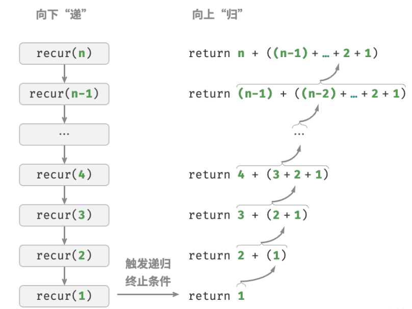
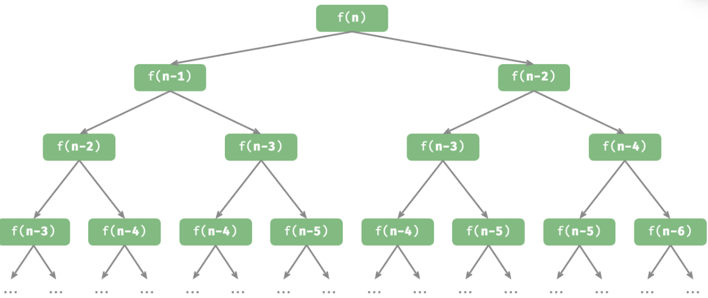
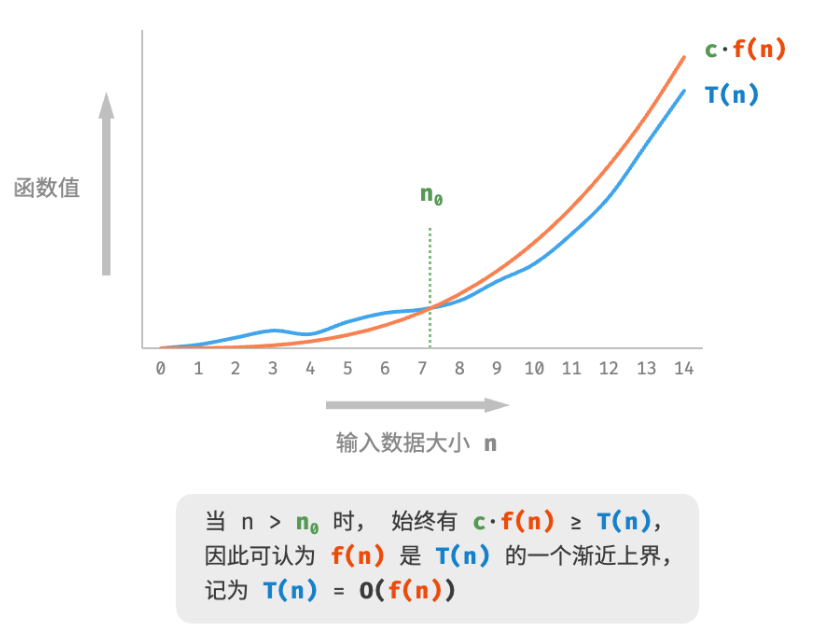

# 算法概述

它描述了随着输入数据大小的增加，算法执行所需时间和空间的增长趋势。

## 迭代和递归

迭代：“自下而上”地解决问题。从最基础的步骤开始，然后不断重复或累加这些步骤，直到任务完成。

递归：“自上而下”地解决问题。将原问题分解为更小的子问题，这些子问题和原问题具有相同的形式。接下来将子问题继续分解为更小的子问题，直到基本情况时停止（基本情况的解是已知的）。

以$f(n) = 1 + 2 + \cdots + n$ 为：
- 迭代：在循环中模拟求和过程，从 $1$ 遍历到 $n$，每轮执行求和操作，即可求得 $f(n)$。
- 递归：将问题分解为子问题 $f(n) = n + f(n - 1)$，不断（递归地）分解下去，直至基本情况 $f(1) = 1$ 时终止。

### 调用栈

递归函数每次调用自身时，系统都会为新开启的函数分配内存，以存储局部变量、调用地址和其他信息等。
函数的上下文数据都存储在称为“栈帧空间”的内存区域中，直至函数返回后才会被释放。因此，递归通常比迭代更加耗费内存空间。
递归调用函数会产生额外的开销。因此递归通常比循环的时间效率更低。

```java
/* 递归 */
int recur(int n) {
    // 终止条件
    if (n == 1)
        return 1;
    // 递：递归调用
    int res = recur(n - 1);
    // 归：返回结果
    return n + res;
}
```



### 尾递归

如果函数在返回前的最后一步才进行递归调用，则该函数可以被编译器或解释器优化，使其在空间效率上与迭代相当。这种情况被称为尾递归（tail recursion）。

普通递归，当函数返回到上一层级的函数后，需要继续执行代码，因此系统需要保存上一层调用的上下文。
尾递归，递归调用是函数返回前的最后一个操作，这意味着函数返回到上一层级后，无须继续执行其他操作，因此系统无须保存上一层函数的上下文。

```java
/* 尾递归 */
int tailRecur(int n, int res) {
    // 终止条件
    if (n == 0)
        return res;
    // 尾递归调用
    return tailRecur(n - 1, res + n);
}
```

> 许多编译器或解释器并不支持尾递归优化。如Python默认不支持尾递归优化，因此即使函数是尾递归形式，仍然可能会遇到栈溢出问题。

### 递归树

当处理分治相关的算法问题时，递归往往比迭代的思路更加直观、代码更加易读。

> 给定一个斐波那契数列 `0, 1, 1, 2, 3, 5, 8, 13,...`，求该数列的第 `n` 个数字。
> - 数列的前两个数字为 $f(1) = 0$ 和 $f(2) = 1$。  
> - 数列中的每个数字是前两个数字的和，即 $f(n) = f(n - 1) + f(n - 2)$。  

```java
/* 斐波那契数列：递归 */
int fib(int n) {
    // 终止条件 f(1) = 0, f(2) = 1
    if (n == 1 || n == 2)
        return n - 1;
    // 递归调用 f(n) = f(n-1) + f(n-2)
    int res = fib(n - 1) + fib(n - 2);
    // 返回结果 f(n)
    return res;
}
```



递归体现了“将问题分解为更小子问题”的思维范式，体现分治策略。

从算法角度看，搜索、排序、回溯、分治、动态规划等许多重要算法策略直接或间接地应用了这种思维方式。
从数据结构角度看，递归天然适合处理链表、树和图的相关问题，因为它们非常适合用分治思想进行分析。

### 两者区别

递归行为可以通过栈模式实现：
```java
/* 使用迭代模拟递归 */
int forLoopRecur(int n) {
    // 使用一个显式的栈来模拟系统调用栈
    Stack<Integer> stack = new Stack<>();
    int res = 0;
    // 递：递归调用
    for (int i = n; i > 0; i--) {
        // 通过“入栈操作”模拟“递”
        stack.push(i);
    }
    // 归：返回结果
    while (!stack.isEmpty()) {
        // 通过“出栈操作”模拟“归”
        res += stack.pop();
    }
    // res = 1+2+3+...+n
    return res;
}
```

迭代和递归在很多情况下可以互相转化，但不一定值得这样做，有以下两点原因。
+ 转化后的代码可能更加难以理解，可读性更差。
+ 对于某些复杂问题，模拟系统调用栈的行为可能非常困难。

## 时间复杂度

运行时间可以直观且准确地反映算法的效率。准确预估一段代码的运行时间，要考虑：
+ 确定运行平台，包括硬件配置、编程语言、系统环境等，这些因素都会影响代码的运行效率。
+ 评估各种计算操作所需的运行时间，例如加法操作 + 需要 1 ns ，乘法操作 * 需要 10 ns ，打印操作 print() 需要 5 ns 等。
+ 统计代码中所有的计算操作，并将所有操作的执行时间求和，从而得到运行时间。

但实际上，统计算法的运行时间不合理也不现实。

### 统计时间增长趋势

时间复杂度分析统计的不是算法运行时间，而是**算法运行时间随着数据量变大时的增长趋势。**

例子：
```java
// 算法 A 的时间复杂度：常数阶
void algorithm_A(int n) {
    System.out.println(0);
}
// 算法 B 的时间复杂度：线性阶
void algorithm_B(int n) {
  // 算法运行时间随着 n 增大呈线性增长
    for (int i = 0; i < n; i++) {
        System.out.println(0);
    }
}
// 算法 C 的时间复杂度：常数阶
void algorithm_C(int n) {
  // 需要循环 1000000 次，虽然运行时间很长，但它与输入数据 n 大小无关
    for (int i = 0; i < 1000000; i++) {
        System.out.println(0);
    }
}
```

相较于直接统计算法的运行时间
- 时间复杂度能够有效评估算法效率。如，算法 B 的运行时间呈线性增长，在 $n > 1$ 时比算法 A 更慢，在 $n > 1000000$ 时比算法 C 更慢。事实上，只要输入数据大小 $n$ 足够大，复杂度为“常数阶”的算法一定优于“线性阶”的算法，这正是时间增长趋势的含义。  

- 时间复杂度的推算方法更简便。显然，运行平台和计算操作类型都与算法运行时间的增长趋势无关。因此在时间复杂度分析中，可以简单地将所有计算操作的执行时间视为相同的“单位时间”，从而将“计算操作运行时间统计”简化为“计算操作数量统计”，这样一来估算难度就大大降低了。  

- 时间复杂度也存在一定的局限性。例如，尽管算法 A 和 C 的时间复杂度相同，但实际运行时间差别很大。同样，尽管算法 B 的时间复杂度比 C 高，但在输入数据大小 $n$ 较小时，算法 B 明显优于算法 C 。对于此类情况，时常难以仅凭时间复杂度判断算法效率的高低。当然，尽管存在上述问题，复杂度分析仍然是评判算法效率最有效且常用的方法。  

### 函数渐进上界

将线性阶的时间复杂度记为 $O(n)$，这个数学符号称为**大 O 记号**，表示函数 $T(n)$ 的**渐近上界**。  

时间复杂度分析本质上是计算“操作数量 $T(n)$”的渐近上界。

> 数学定义：若存在正实数 $c$ 和实数 $n_0$，使得对于所有的 $n > n_0$，均有 $T(n) \leq c \cdot f(n)$，则可认为 $f(n)$ 给出了 $T(n)$ 的一个渐近上界，记为 $T(n) = O(f(n))$。

计算渐近上界就是寻找一个函数 $f(n)$，使得当 $n$ 趋向于无穷大时，$T(n)$ 和 $f(n)$ 处于相同的增长级别，仅相差一个常数系数 $c$。



### 计算方法

针对代码，逐行从上到下计算即可。然而，由于上述 $c \cdot f(n)$ 中的常数系数 $c$ 可以取任意大小，因此操作数量 $T(n)$ 中的各种系数、常数项都可以忽略。
  
例子：
```java
void algorithm(int n) {
    int a = 1;  // +0
    a = a + n;  // +0
    // +n
    for (int i = 0; i < 5 * n + 1; i++) {
        System.out.println(0);
    }
    // +n*n
    for (int i = 0; i < 2 * n; i++) {
        for (int j = 0; j < n + 1; j++) {
            System.out.println(0);
        }
    }
}
```
$T(n) = n + n^2$，时间复杂度由 $T(n)$ 中最高阶确定，因此时间复杂度为：$O(n^2)$。

### 常见阶数类型

$O(1) < O(\log n) < O(n) < O(n\log n) < O(n^2) < O(2^n) < O(n!)$  
常数阶 \( < \) 对数阶 \( < \) 线性阶 \( < \) 线性对数阶 \( < \) 平方阶 \( < \) 指数阶 \( < \) 阶乘阶  

### 最差、最佳、平均时间复杂度

算法的时间效率往往不是固定的，而是与输入数据的分布有关。
“最差时间复杂度” 对应函数渐近上界，使用大 \(O\) 记号表示。相应地，“最佳时间复杂度” 对应函数渐近下界，用 \(\Omega\) 记号表示。

例子：
- 当 `nums = [?, ?, ..., 1]` ，即当末尾元素是 `1` 时，需要完整遍历数组，达到最差时间复杂度 \(O(n)\)。  
- 当 `nums = [1, ?, ?, ...]` ，即当首个元素为 `1` 时，无论数组多长都不需要继续遍历，达到最佳时间复杂度 \(\Omega(1)\) 。  

在实际中很少使用最佳时间复杂度，因为通常只有在很小概率下才能达到，可能会带来一定的误导性。而最差时间复杂度更为实用，因为它给出了一个效率安全值，让我们可以放心地使用算法。

最差时间复杂度和最佳时间复杂度只出现于 “特殊的数据分布”，这些情况的出现概率可能很小，并不能真实地反映算法运行效率。相比之下，**平均时间复杂度** 可以体现算法在随机输入数据下的运行效率，用 \(\Theta\) 记号来表示。  

对于部分算法，可以简单地推算出随机数据分布下的平均情况。如上述示例，由于输入数组是被打乱的，因此元素 `1` 出现在任意索引的概率都是相等的，那么算法的平均循环次数就是数组长度的一半 \(n/2\)，平均时间复杂度为 \(\Theta(n/2) = \Theta(n)\)。  
但对于较为复杂的算法，计算平均时间复杂度往往比较困难，因为很难分析出在数据分布下的整体数学期望。在这种情况下，通常使用 **最差时间复杂度** 作为算法效率的评判标准。  

## 空间复杂度

空间复杂度用于衡量算法占用内存空间随着数据量变大时的增长趋势。

### 算法相关空间

算法在运行过程中使用的内存空间主要包括以下几种。
+ 输入空间：用于存储算法的输入数据。
+ 暂存空间：用于存储算法在运行过程中的变量、对象、函数上下文等数据。
+ 输出空间：用于存储算法的输出数据。

一般情况下，空间复杂度的统计范围是“暂存空间”加上“输出空间”。

暂存空间可以进一步划分为三个部分：
+ 暂存数据：用于保存算法运行过程中的各种常量、变量、对象等。
+ 栈帧空间：用于保存调用函数的上下文数据。系统在每次调用函数时都会在栈顶部创建一个栈帧，函数返回后，栈帧空间会被释放。
+ 指令空间：用于保存编译后的程序指令，在实际统计中通常忽略不计。

在分析一段程序的空间复杂度时，通常统计**暂存空间、栈帧空间和输出空间**三部分。

```java
/* 类 */
class Node {
    int val;
    Node next;
    Node(int x) { val = x; }
}

/* 函数 */
int function() {
    // 执行某些操作...
    return 0;
}

int algorithm(int n) {        // 输入数据
    final int a = 0;          // 暂存数据（常量）
    int b = 0;                // 暂存数据（变量）
    Node node = new Node(0);  // 暂存数据（对象）
    int c = function();       // 栈帧空间（调用函数）
    return a + b + c;         // 输出数据
}
```

### 计算方法

通常只关注最差空间复杂度。因为内存空间是一项硬性要求，必须确保在所有输入数据下都有足够的内存空间预留。
1. **以最差输入数据为准**：当 \(n \lt 10\) 时，空间复杂度为 \(O(1)\)；但当 \(n \gt 10\) 时，初始化的数组 `nums` 占用 \(O(n)\) 空间，因此最差空间复杂度为 \(O(n)\)。  

2. **以算法运行中的峰值内存为准**：例如，程序在执行最后一行之前，占用 \(O(1)\) 空间；当初始化数组 `nums` 时，程序占用 \(O(n)\) 空间，因此最差空间复杂度为 \(O(n)\)。  

```java
int function() {
    // 执行某些操作
    return 0;
}
/* 循环的空间复杂度为 O(1) */
void loop(int n) {
    for (int i = 0; i < n; i++) {
        function();
    }
}
/* 递归的空间复杂度为 O(n) */
void recur(int n) {
    if (n == 1) return;
    recur(n - 1);
}
```

函数 `loop()` 和 `recur()` 的时间复杂度都为 \(O(n)\)，但空间复杂度不同。  
- 函数 `loop()` 在循环中调用了 \(n\) 次 `function()`，每轮中的 `function()` 都返回并释放了栈帧空间，因此空间复杂度仍为 \(O(1)\)。  
- 递归函数 `recur()` 在运行过程中会同时存在 \(n\) 个未返回的 `recur()`，从而占用 \(O(n)\) 的栈帧空间。  

### 权衡时间和空间

在实际情况中，同时优化时间复杂度和空间复杂度通常非常困难。

降低时间复杂度通常需要以提升空间复杂度为代价，反之亦然。将牺牲内存空间来提升算法运行速度的思路称为“以空间换时间”；反之，则称为“以时间换空间”。

在大多数情况下，时间比空间更宝贵，因此“以空间换时间”通常是更常用的策略。