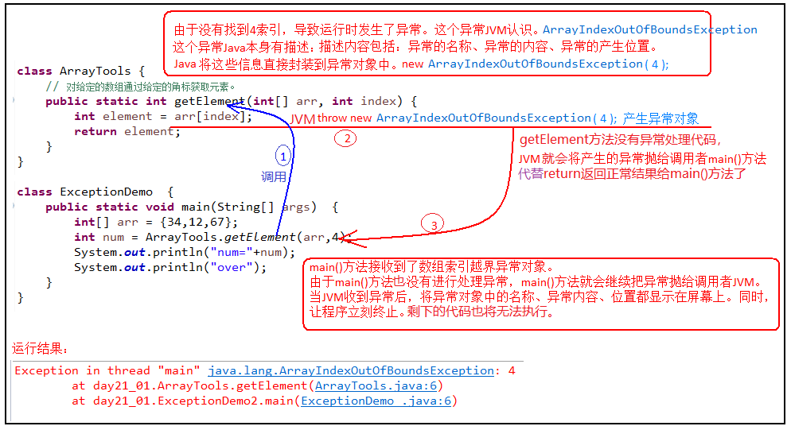
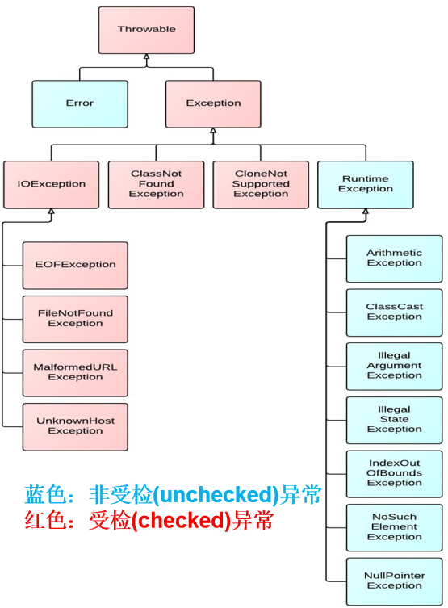
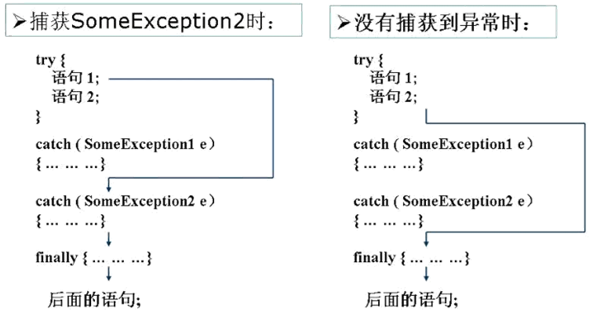
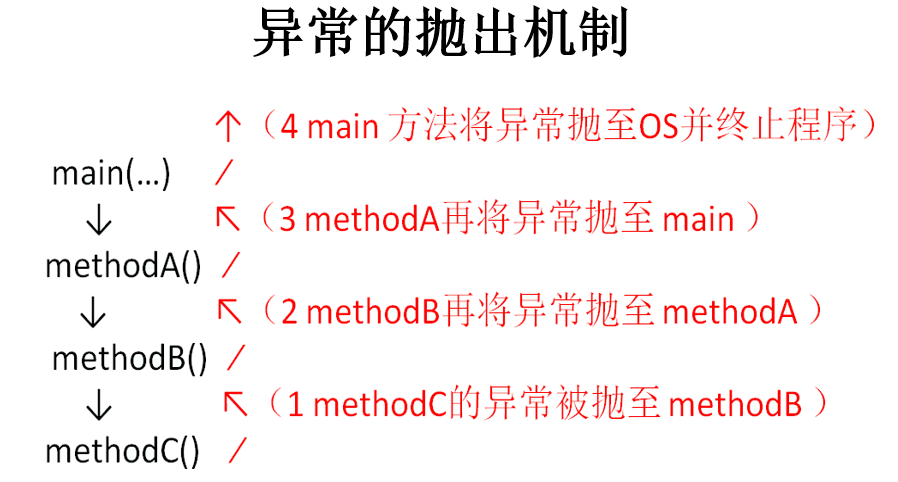

# 异常处理

异常是指程序在执行过程中，出现的非正常情况，如果不处理最终会导致JVM的非正常停止。

异常不是语法错误（语法错误，编译直接不通过，也不能运行。），而是代码逻辑错误。

Java中把不同的异常用不同的类表示，一旦发生某种异常，就`创建该异常类型的对象`，并且抛出（throw）。然后程序员可以捕获(catch)到这个异常对象，并处理；如果没有捕获(catch)这个异常对象，那么这个异常对象将会导致程序终止。


## Java异常体系
### Throwable
`java.lang.Throwable` 类是Java程序执行过程中发生的异常事件对应的类的根父类。

**Throwable中的常用方法：**

* `public void printStackTrace()`：打印异常的详细信息。

	包含了异常的类型、异常的原因、异常出现的位置、在开发和调试阶段都得使用printStackTrace。

* `public String getMessage()`：获取发生异常的原因。

### Error和Exception

Throwable可分为两类：Error和Exception。分别对应着`java.lang.Error`与`java.lang.Exception`两个类。

**Error：** Java虚拟机无法解决的严重问题。如：JVM系统内部错误、资源耗尽等严重情况。一般不编写针对性的代码进行处理。如：StackOverflowError（栈内存溢出）和OutOfMemoryError（堆内存溢出，简称OOM）。

**Exception:** 因编程错误或偶然的外在因素导致的一般性问题，需要使用针对性的代码进行处理，使程序继续运行。否则一旦发生异常，程序也会挂掉。如：空指针访问、试图读取不存在的文件、网络连接中断、数组角标越界。

### 编译时异常和运行时异常

**编译时期异常**（即checked异常、受检异常）：在代码编译阶段，编译器就能明确`警示`当前代码`可能发生（不是一定发生）`xx异常，并`明确督促`程序员提前编写处理它的代码。如果`没有编写`对应的异常处理代码，则编译器就会直接判定编译失败，从而不能生成字节码文件。通常，这类异常的发生不是由编写的代码引起的，或者不是靠加简单判断就可以避免的，如： FileNotFoundException（文件找不到异常）。

**运行时期异常**（即runtime异常、unchecked异常、非受检异常）：在代码编译阶段，编译器完全不做任何检查，无论该异常是否会发生，编译器都不给出任何提示。只有等代码运行起来并确实发生了xx异常，它才能被发现。通常，这类异常是由程序员的代码编写不当引起的，只要稍加判断，或者细心检查就可以避免。
+ **java.lang.RuntimeException** 类及它的子类都是运行时异常。



## 异常的处理

### try-catch-finally

- Java程序的执行过程中如出现异常，会生成一个异常类对象，该异常对象将被提交给Java运行时系统，这个过程称为`抛出(throw)异常`。
- 如果一个方法内抛出异常，该异常对象会被抛给调用者方法中处理。如果异常没有在调用者方法中处理，它继续被抛给这个调用方法的上层方法。这个过程将一直继续下去，直到异常被处理。这一过程称为`捕获(catch)异常`。
- 如果一个异常回到main()方法，并且main()也不处理，则程序运行终止。

当某段代码可能发生异常，不管这个异常是编译时异常（受检异常）还是运行时异常（非受检异常），都可以使用try块将它括起来，并在try块下面编写catch分支尝试捕获对应的异常对象。如果有多个catch分支，并且多个异常类型有父子类关系，必须保证小的子异常类型在上，大的父异常类型在下。

- 如果在程序运行时，try块中的代码没有发生异常，那么catch所有的分支都不执行。
- 如果在程序运行时，try块中的代码发生了异常，根据异常对象的类型，将从上到下选择第一个匹配的catch分支执行。此时try中发生异常的语句下面的代码将不执行，而整个try...catch之后的代码可以继续运行。
- 如果在程序运行时，try块中的代码发生了异常，但是所有catch分支都无法匹配（捕获）这个异常，那么JVM将会终止当前方法的执行，并把异常对象“抛”给调用者。如果调用者不处理，程序就挂了。


不论在try代码块中是否发生了异常事件，catch语句是否执行，catch语句是否有异常，catch语句中是否有return，finally块中的语句都会被执行。
finally语句和catch语句是可选的，但finally不能单独使用。



`RuntimeException`，这些类的异常即使没有使用try和catch捕获，Java自己也能捕获，并且编译通过 ( 但运行时会发生异常使得程序运行终止 )。所以，对于这类异常，可以不作处理，因为这类异常很普遍，若全处理可能会对程序的可读性和运行效率产生影响。

如果抛出的异常是IOException等类型的`非运行时异常`，则必须捕获，否则`编译错误`。也就是说，必须处理编译时异常，将异常进行捕捉，转化为运行时异常。

### throws

如果在编写方法体的代码时，某句代码可能发生某个`编译时异常`，不处理编译不通过，但是在当前方法体中可能`不适合处理`或`无法给出合理的处理方式`，则此方法应`显示地`声明抛出异常，表明该方法将不对这些异常进行处理，而由该方法的调用者负责处理。


如：
```java
public void readFile(String file)  throws FileNotFoundException,IOException {
	...
	// 读文件的操作可能产生FileNotFoundException或IOException类型的异常
	FileInputStream fis = new FileInputStream(file);
    //...
}
```

throws后面也可以写运行时异常类型，只不过运行时异常类型，写或不写对于编译器和程序执行来说都没有任何区别。如果写了，调用者调用该方法后，使用try...catch结构时，可以获得更多的信息，需要添加哪种catch分支。

**在方法重写中对throws的要求**

如果父类被重写方法的方法签名后面没有 “throws  编译时异常类型”，那么重写方法时，方法签名后面也不能出现“throws  编译时异常类型”。
如果父类被重写方法的方法签名后面有 “`throws  编译时异常类型`”，那么重写方法时，throws的编译时异常类型必须 <= 被重写方法throws的编译时异常类型，或者不throws编译时异常。
方法重写，对于“`throws 运行时异常类型`”没有要求。

```java
import java.io.IOException;

class Father{
    public void method()throws Exception{
        System.out.println("Father.method");
    }
}
class Son extends Father{
    @Override
    public void method() throws IOException,ClassCastException {
        System.out.println("Son.method");
    }
}
```

### 两种异常处理方式对比

主要指的是编译时异常。

- 如果程序代码中，涉及到资源的调用（流、数据库连接、网络连接等），则必须考虑使用try-catch-finally来处理，保证不出现内存泄漏。
- 如果父类被重写的方法没有throws异常类型，则子类重写的方法中如果出现异常，只能考虑使用try-catch-finally进行处理，不能throws。
- 开发中，方法a中依次调用了方法b,c,d等方法，方法b,c,d之间是递进关系。此时，如果方法b,c,d中有异常，我们通常选择使用throws，而方法a中通常选择使用try-catch-finally。

## 手动抛出异常对象：throw

Java 中异常对象的生成有两种方式：

- 由虚拟机**自动生成**：程序运行过程中，虚拟机检测到程序发生了问题，那么针对当前代码，就会在后台自动创建一个对应异常类的实例对象并抛出。

- 由开发人员**手动创建**：`new 异常类型([实参列表]);`，如果创建好的异常对象不抛出对程序没有任何影响，和创建一个普通对象一样，但是一旦throw抛出，就会对程序运行产生影响了，它下面的代码也不会再执行了。

throw语句抛出的异常对象，和JVM自动创建和抛出的异常对象一样。

- 如果是编译时异常类型的对象，同样需要使用throws或者try...catch处理，否则编译不通过。

- 如果是运行时异常类型的对象，编译器不提示。

- 可以抛出的异常必须是Throwable或其子类的实例。

```java
public class TestThrow {
    public static void main(String[] args) {
        try {
            System.out.println(max(4,2,31,1));
        } catch (Exception e) {
            e.printStackTrace();
        }
        try {
            System.out.println(max(4));
        } catch (Exception e) {
            e.printStackTrace();
        }
        try {
            System.out.println(max());
        } catch (Exception e) {
            e.printStackTrace();
        }
    }

    public static int max(int... nums){
        if(nums == null || nums.length==0){
            throw new IllegalArgumentException("没有传入任何整数，无法获取最大值");
        }
        int max = nums[0];
        for (int i = 1; i < nums.length; i++) {
            if(nums[i] > max){
                max = nums[i];
            }
        }
        return max;
    }
}
```

## 自定义异常

步骤：
+ 继承一个异常类型
  + 自定义一个编译时异常类型：自定义类继承`java.lang.Exception`。
  + 自定义一个运行时异常类型：自定义类继承`java.lang.RuntimeException`。

+ 提供至少两个构造器，一个是无参构造，一个是(String message)构造器。
+ 自定义异常需要提供`serialVersionUID`

自定义的异常只能通过throw抛出。抛出后由try..catch处理，也可以甩锅throws给调用者处理。

