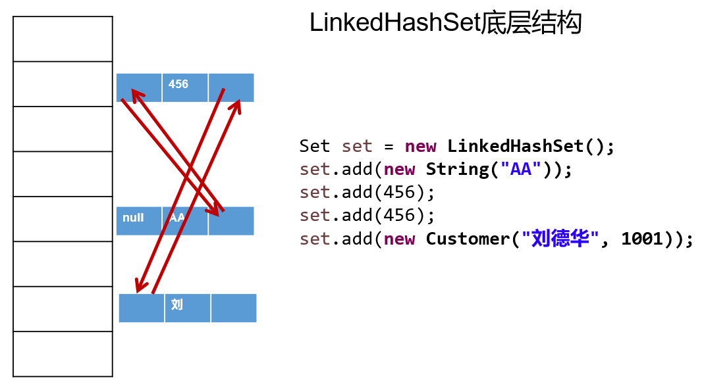
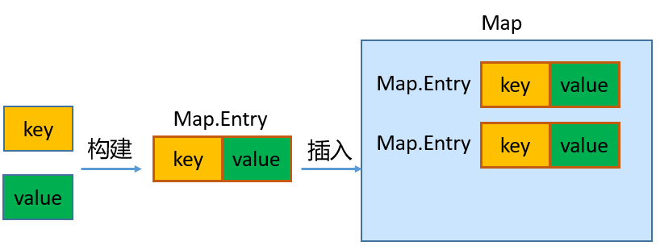

# 集合框架与泛型

Java 集合可分为 Collection 和 Map 两大体系：

- Collection接口：用于存储一个一个的数据，也称`单列数据集合`。
	- List子接口：用来存储有序的、可以重复的数据（"动态"数组）
		- 实现类：ArrayList(主要实现类)、LinkedList、Vector
  - Set子接口：用来存储无序的、不可重复的数据
	- 实现类：HashSet(主要实现类)、LinkedHashSet、TreeSet
- Map接口：用于存储具有映射关系“key-value对”的集合，即一对一对的数据，也称`双列数据集合`。
	- 实现类：HashMap(主要实现类)、LinkedHashMap、TreeMap、Hashtable、Properties

JDK提供的集合API位于`java.util`包内


## Collection接口

JDK不提供此接口的任何直接实现，而是提供更具体的子接口（如：Set和List）去实现，该接口里定义的方法既可用于操作 Set 集合，也可用于操作 List 集合。

Collection接口方法：
```java
（1）add(E obj)：添加元素对象到当前集合中
（2）addAll(Collection other)：添加other集合中的所有元素对象到当前集合中，即this = this ∪ other
（3）int size()：获取当前集合中实际存储的元素个数
（4）boolean isEmpty()：判断当前集合是否为空集合
（5）boolean contains(Object obj)：判断当前集合中是否存在一个与obj对象equals返回true的元素
（6）boolean containsAll(Collection coll)：判断coll集合中的元素是否在当前集合中都存在。即coll集合是否是当前集合的“子集”
（7）boolean equals(Object obj)：判断当前集合与obj是否相等
（8）void clear()：清空集合元素
（9） boolean remove(Object obj) ：从当前集合中删除第一个找到的与obj对象equals返回true的元素。
（10）boolean removeAll(Collection coll)：从当前集合中删除所有与coll集合中相同的元素。即this = this - this ∩ coll
（11）boolean retainAll(Collection coll)：从当前集合中删除两个集合中不同的元素，使得当前集合仅保留与coll集合中的元素相同的元素，即当前集合中仅保留两个集合的交集，即this  = this ∩ coll；
（12）Object[] toArray()：返回包含当前集合中所有元素的数组
（13）hashCode()：获取集合对象的哈希值
（14）iterator()：返回迭代器对象，用于集合遍历
```

### Iterator(迭代器)接口

#### Iterator接口

在程序开发中，经常需要遍历集合中的所有元素。JDK专门提供了一个接口`java.util.Iterator`。`Iterator`接口也是Java集合中的一员，但它与`Collection`、`Map`接口有所不同。
- Collection接口与Map接口主要用于`存储`元素
- `Iterator`，被称为迭代器接口，本身并不提供存储对象的能力，主要用于`遍历`Collection中的元素

Collection接口继承了java.lang.Iterable接口，该接口有一个iterator()方法，那么所有实现了Collection接口的集合类都有一个iterator()方法，用以返回一个实现了Iterator接口的对象。
- `public Iterator iterator()`: 获取集合对应的迭代器，用来遍历集合中的元素的。
- 集合对象每次调用iterator()方法都得到一个全新的迭代器对象，默认游标都在集合的第一个元素之前。

Iterator接口的常用方法如下：
- `public E next()`:返回迭代的下一个元素。
- `public boolean hasNext()`:如果仍有元素可以迭代，则返回 true。

在调用it.next()方法之前必须要调用it.hasNext()进行检测。若不调用，且下一条记录无效，直接调用it.next()会抛出`NoSuchElementException异常`。


使用Iterator迭代器删除元素：java.util.Iterator迭代器中有一个方法：void remove() ;
- 如果还未调用next()或在上一次调用 next() 方法之后已经调用了 remove() 方法，再调用remove()都会报IllegalStateException。
- Collection已经有remove(xx)方法了，为什么Iterator迭代器还要提供删除方法：因为迭代器的remove()可以按指定的条件进行删除。

```java
import org.junit.Test;

import java.util.ArrayList;
import java.util.Collection;
import java.util.Iterator;

public class TestIteratorRemove {
    @Test
    public void test01(){
        Collection coll = new ArrayList();
        coll.add(1);
        coll.add(2);
        coll.add(3);
        coll.add(4);
        coll.add(5);
        coll.add(6);

        Iterator iterator = coll.iterator();
        while(iterator.hasNext()){
            Integer element = (Integer) iterator.next();
            if(element % 2 == 0){
                iterator.remove();
            }
        }
        System.out.println(coll);
    }
}
```

在JDK8.0时，Collection接口有了removeIf 方法，即可以根据条件删除。

```java
import org.junit.Test;

import java.util.ArrayList;
import java.util.Collection;
import java.util.function.Predicate;

public class TestCollectionRemoveIf {
    @Test
    public void test01(){
        Collection coll = new ArrayList();
        coll.add("小李广");
        coll.add("扫地僧");
        coll.add("石破天");
        coll.add("佛地魔");
        System.out.println("coll = " + coll);

        coll.removeIf(new Predicate() {
            @Override
            public boolean test(Object o) {
                String str = (String) o;
                return str.contains("地");
            }
        });
        System.out.println("删除包含\"地\"字的元素之后coll = " + coll);
    }
}
```
#### foreach循环

foreach循环（增强for循环）是 JDK5.0 中定义的一个高级for循环，专门用来`遍历数组和集合`的，不要在遍历的过程中对集合元素进行增删操作。

```java
public void test01(){
	Collection coll = new ArrayList();
	coll.add("小李广");
	coll.add("扫地僧");
	coll.add("石破天");
	//foreach循环其实就是使用Iterator迭代器来完成元素的遍历的。
	for (Object o : coll) {
		System.out.println(o);
	}
}
```

对于集合的遍历，增强for的内部原理其实是个Iterator迭代器。

### List

List集合类中元素**有序**、且**可重复**，集合中的每个元素都有其对应的顺序索引。
通常使用`java.util.List`替代数组。

List接口的实现类常用的有：`ArrayList`、`LinkedList`和`Vector`。

#### List接口方法

List除了从Collection集合继承的方法外，List 集合里添加了一些`根据索引`来操作集合元素的方法。

```java
插入元素
void add(int index, Object ele):在index位置插入ele元素。
boolean addAll(int index, Collection eles):从index位置开始将eles中的所有元素添加进来。
获取元素
Object get(int index):获取指定index位置的元素
List subList(int fromIndex, int toIndex):返回从fromIndex到toIndex位置的子集合
获取元素索引
int indexOf(Object obj):返回obj在集合中首次出现的位置
int lastIndexOf(Object obj):返回obj在当前集合中末次出现的位置
删除和替换元素
Object remove(int index):移除指定index位置的元素，并返回此元素
Object set(int index, Object ele):设置指定index位置的元素为ele
```

#### ArrayList

ArrayList 是 List 接口的`主要实现类`。
本质上，ArrayList是一个数组实现。

Arrays.asList(…) 方法返回的 List 集合，既不是 ArrayList 实例，也不是 Vector 实例。 Arrays.asList(…) 返回值是一个固定长度的 List 集合

#### LinkedList

底层采用双向链表结构存储数据，对于频繁的插入或删除元素的操作，使用LinkedList。

特有方法：
```java
void addFirst(Object obj)
void addLast(Object obj)	
Object getFirst()
Object getLast()
Object removeFirst()
Object removeLast()
```

#### Vector

Vector 在JDK1.0就有了。大多数操作与ArrayList相同，区别之处在于Vector是**线程安全**的。

Vector比ArrayList慢，尽量避免使用。

特有方法：
```java
void addElement(Object obj)
void insertElementAt(Object obj,int index)
void setElementAt(Object obj,int index)
void removeElement(Object obj)
void removeAllElements()
```

### Set

Set接口相较于Collection接口没有提供额外的方法。

Set 集合不允许包含相同的元素，如果试把两个相同的元素加入同一个 Set 集合中，则添加操作失败。

Set集合支持的遍历方式和Collection集合一样：foreach和Iterator。

Set的常用实现类有：HashSet、TreeSet、LinkedHashSet。

#### HashSet

HashSet 是 Set 接口的主要实现类，大多数时候使用 Set 集合时都使用这个实现类。

HashSet 按 Hash 算法来存储集合中的元素，因此具有很好的存储、查找、删除性能。具有以下`特点`：
- 不能保证元素的排列顺序
- HashSet 不是线程安全的
- 集合元素可以是 null

HashSet 集合`判断两个元素相等的标准`：两个对象通过 `hashCode()` 方法得到的哈希值相等，并且两个对象的 `equals() `方法返回值为true。

对于存放在Set容器中的对象，**对应的类一定要重写hashCode()和equals(Object obj)方法**，以实现对象相等规则。即：“相等的对象必须具有相等的散列码”。

HashSet集合中元素的无序性，不等同于随机性。这里的无序性与元素的添加位置有关。在添加每一个元素到数组中时，具体的存储位置是由元素的hashCode()调用后返回的hash值决定的。导致在数组中每个元素不是依次紧密存放的，表现出一定的无序性。

##### HashSet添加元素的过程

1. 当向 HashSet 集合中存入一个元素时，HashSet 会调用该对象的 hashCode() 方法得到该对象的 hashCode值，然后根据 hashCode值，通过某个散列函数决定该对象在 HashSet 底层数组中的存储位置。
2. 如果要在数组中存储的位置上没有元素，则直接添加成功。
3. 如果要在数组中存储的位置上有元素，则继续比较：
   1. 如果两个元素的hashCode值不相等，则添加成功；
   2. 如果两个元素的hashCode()值相等，则会继续调用equals()方法：
      1. 如果equals()方法结果为false，则添加成功。
      2. 如果equals()方法结果为true，则添加失败。

> 第2步添加成功，元素会保存在底层数组中。
> 第3步两种添加成功的操作，由于该底层数组的位置已经有元素了，则会通过`链表`的方式继续链接，存储。

##### 重写hashCode()方法的原则

同一个对象多次调用 hashCode() 方法应该返回相同的值。

当两个对象的 equals() 方法比较返回 true 时，这两个对象的 hashCode() 方法的返回值也应相等。

对象中用作 equals() 方法比较的 Field，都应该用来计算 hashCode 值。

> 如果两个元素的 equals() 方法返回 true，但它们的 hashCode() 返回值不相等，hashSet 将会把它们存储在不同的位置，可以添加成功。

##### 重写equals()方法的原则

重写equals方法的时候要同时重写hashCode方法。通常参与计算hashCode的对象的属性也应该参与到equals()中进行计算。

#### LinkedHashSet

LinkedHashSet 根据元素的 hashCode 值来决定元素的存储位置，但它同时**使用双向链表维护元素的次序**，这使得元素看起来是以添加顺序保存的。

LinkedHashSet插入性能略低于 HashSet，但在迭代访问 Set 里的全部元素时有很好的性能。



#### TreeSet

TreeSet 是 SortedSet 接口的实现类，底层使用`红黑树`结构存储数据。TreeSet 可以按照添加的元素的指定的属性的大小顺序进行遍历（自然排序或定制排序），默认情况下，TreeSet 采用自然排序。

```java
public void test1(){
    //按照User的姓名的从小到大的顺序排列
    Comparator comparator = new Comparator() {
        @Override
        public int compare(Object o1, Object o2) {
            if(o1 instanceof User && o2 instanceof User){
                User u1 = (User)o1;
                User u2 = (User)o2;

                return u1.name.compareTo(u2.name);
            }
            throw new RuntimeException("输入的类型不匹配");
        }
    };
    TreeSet set = new TreeSet(comparator);

    set.add(new User("Tom",12));
    set.add(new User("Rose",23));
    set.add(new User("Jerry",2));
    set.add(new User("Eric",18));
    set.add(new User("Tommy",44));
    set.add(new User("Jim",23));
    set.add(new User("Maria",18));
    //set.add(new User("Maria",28));

    Iterator iterator = set.iterator();
    while(iterator.hasNext()){
        System.out.println(iterator.next());
    }
}
```
## Map接口

`java.util.Map`接口用于存储映射关系的对象（key-value）。
Map 中的 key 和  value 都可以是任何引用类型的数据。但常用String类作为Map的“键”。

Map接口的常用实现类：`HashMap`、`LinkedHashMap`、`TreeMap`和`Properties`。其中，HashMap是 Map 接口使用`频率最高`的实现类。

Map 中的 `key用Set来存放`，`不允许重复`，将对象作为键（Key）存储在Map中时，该对象所属的类必须重写hashCode()和equals()方法。

key 和 value 之间存在单向一对一关系，即通过指定的 key 总能找到唯一的、确定的 value，不同key对应的`value可以重复`。value所在的类要重写equals()方法。

key和value构成一个entry。所有的entry彼此之间是`无序的`、`不可重复的`。




### Map接口常用方法

```java
添加、修改操作：
Object put(Object key,Object value)：将指定key-value添加到(或修改)当前map对象中
void putAll(Map m):将m中的所有key-value对存放到当前map中
删除操作：
Object remove(Object key)：移除指定key的key-value对，并返回value
void clear()：清空当前map中的所有数据
元素查询的操作：
Object get(Object key)：获取指定key对应的value
boolean containsKey(Object key)：是否包含指定的key
boolean containsValue(Object value)：是否包含指定的value
int size()：返回map中key-value对的个数
boolean isEmpty()：判断当前map是否为空
boolean equals(Object obj)：判断当前map和参数对象obj是否相等
元视图操作的方法：
Set keySet()：返回所有key构成的Set集合
Collection values()：返回所有value构成的Collection集合
Set entrySet()：返回所有key-value对构成的Set集合
```

### HashMap

HashMap是线程不安全的。允许添加 null 键和 null 值。

存储数据采用的哈希表结构，底层使用`一维数组`+`单向链表`+`红黑树`进行key-value数据的存储。与HashSet一样，元素的存取顺序不能保证一致。

HashMap `判断两个key相等的标准`是：两个 key 的hashCode值相等，通过 equals() 方法返回 true。

HashMap `判断两个value相等的标准`是：两个 value 通过 equals() 方法返回 true。

```java
class CityMap{
	
	public static Map model = new HashMap();
	
	static {
		model.put("北京", new String[] {"北京"});
		model.put("上海", new String[] {"上海"});
		model.put("天津", new String[] {"天津"});
		model.put("重庆", new String[] {"重庆"});
		model.put("黑龙江", new String[] {"哈尔滨","齐齐哈尔","牡丹江","大庆","伊春","双鸭山","绥化"});
		model.put("吉林", new String[] {"长春","延边","吉林","白山","白城","四平","松原"});
		model.put("河北", new String[] {"石家庄","张家口","邯郸","邢台","唐山","保定","秦皇岛"});
	}
	
}

public class ProvinceTest {
	public static void main(String[] args) {
		
		Set keySet = CityMap.model.keySet();
		for(Object s : keySet) {
			System.out.print(s + "\t");
		}
		System.out.println();
		System.out.println("请选择你所在的省份：");
		Scanner scan = new Scanner(System.in);
		String province = scan.next();
		
		String[] citys = (String[])CityMap.model.get(province);
		for(String city : citys) {
			System.out.print(city + "\t");
		}
	}
	
}
```

### LinkedHashMap

存储数据采用的哈希表结构+双向链表结构，在HashMap存储结构的基础上，使用了一对**双向链表来记录添加元素的先后顺序**，可以保证遍历元素时，与添加的顺序一致。

### TreeMap

TreeMap存储 key-value 对时，需要根据 key-value 对进行排序（自然排序和定制排序）。TreeMap 可以保证所有的 key-value 对处于`有序状态`。
- TreeSet底层使用`红黑树`结构存储数据

### Hashtable

Hashtable在JDK1.0就提供了。不同于HashMap，Hashtable是线程安全的。
Hashtable实现原理和HashMap相同，功能相同。底层都使用哈希表结构（数组+单向链表），查询速度快。

与HashMap不同，Hashtable 不允许使用 null 作为 key 或 value。

**Hashtable和HashMap的区别：**
```
HashMap:底层是一个哈希表（jdk7:数组+链表;jdk8:数组+链表+红黑树）,是一个线程不安全的集合,执行效率高
Hashtable:底层也是一个哈希表（数组+链表）,是一个线程安全的集合,执行效率低

HashMap集合:可以存储null的键、null的值
Hashtable集合,不能存储null的键、null的值

Hashtable和Vector集合一样,在jdk1.2版本之后被更先进的集合(HashMap,ArrayList)取代了。所以HashMap是Map的主要实现类，Hashtable是Map的古老实现类。

Hashtable的子类Properties（配置文件）依然活跃在历史舞台
Properties集合是一个唯一和IO流相结合的集合
```

### Properties

Properties 类是 Hashtable 的子类，该对象用于处理属性文件。

由于属性文件里的 key、value 都是字符串类型，所以 Properties 中要求 key 和 value 都是字符串类型

存取数据时，建议使用setProperty(String key,String value)方法和getProperty(String key)方法

## Collections工具类

参考操作数组的工具类：Arrays。Collections 是一个操作 Set、List 和 Map 等集合的工具类。

### 常用方法

Collections 中提供了一系列静态的方法对集合元素进行排序、查询和修改等操作，还提供了对集合对象设置不可变、对集合对象实现同步控制等方法（均为static方法）：

```java
排序操作：
reverse(List)：反转 List 中元素的顺序。
shuffle(List)：对 List 集合元素进行随机排序。
sort(List)：根据元素的自然顺序对指定 List 集合元素按升序排序。
sort(List，Comparator)：根据指定的 Comparator 产生的顺序对 List 集合元素进行排序。
swap(List，int， int)：将指定 list 集合中的 i 处元素和 j 处元素进行交换。

查找
Object max(Collection)：根据元素的自然顺序，返回给定集合中的最大元素。
Object max(Collection，Comparator)：根据 Comparator 指定的顺序，返回给定集合中的最大元素。
Object min(Collection)：根据元素的自然顺序，返回给定集合中的最小元素。
Object min(Collection，Comparator)：根据 Comparator 指定的顺序，返回给定集合中的最小元素。
int binarySearch(List list,T key)在List集合中查找某个元素的下标，但是List的元素必须是T或T的子类对象，而且必须是可比较大小的，即支持自然排序的。而且集合也事先必须是有序的，否则结果不确定。
int binarySearch(List list,T key,Comparator c)在List集合中查找某个元素的下标，但是List的元素必须是T或T的子类对象，而且集合也事先必须是按照c比较器规则进行排序过的，否则结果不确定。
int frequency(Collection c，Object o)：返回指定集合中指定元素的出现次数。

复制、替换
void copy(List dest,List src)：将src中的内容复制到dest中。
boolean replaceAll(List list，Object oldVal，Object newVal)：使用新值替换 List 对象的所有旧值。
提供了多个unmodifiableXxx()方法，该方法返回指定 Xxx的不可修改的视图。

添加
boolean addAll(Collection  c,T... elements)将所有指定元素添加到指定 collection 中。

同步
Collections 类中提供了多个 synchronizedXxx() 方法，该方法可使将指定集合包装成线程同步的集合，从而可以解决多线程并发访问集合时的线程安全问题。
```

## 泛型

在JDK5.0之前只能把元素类型设计为Object，JDK5.0时Java引入了“参数化类型（Parameterized type）”的概念，允许在创建集合时指定集合元素的类型。

### 泛型的应用

如`java.lang.Comparable`接口和`java.util.Comparator`接口，是用于比较对象大小的接口。这两个接口只是限定了当一个对象大于另一个对象时返回正整数，小于返回负整数，等于返回0，但是并不确定是什么类型的对象比较大小。JDK5.0之前只能用Object类型表示，使用时既麻烦又不安全，因此 JDK5.0 给它们增加了泛型。

自从JDK5.0引入泛型的概念之后，对之前核心类库中的API做了很大的修改，例如：JDK5.0改写了集合框架中的全部接口和类、java.lang.Comparable接口、java.util.Comparator接口、Class类等。为这些接口、类增加了泛型支持，从而可以在声明变量、创建对象时传入类型实参。

泛型，也称为泛型参数，即参数的类型，只能使用引用数据类型进行赋值。（不能使用基本数据类型，可以使用包装类替换）

集合声明时，声明泛型参数。在使用集合时，可以具体指明泛型的类型。一旦指明，类或接口内部，凡是使用泛型参数的位置，都指定为具体的参数类型。如果没有指明的话，看做是Object类型或它的上界类型。

+ 集合中使用泛型

```java
@Test
public void test1(){
    //举例：将学生成绩保存在ArrayList中
    //标准写法：
    //ArrayList<Integer> list = new ArrayList<Integer>();
    //jdk7的新特性：类型推断
    ArrayList<Integer> list = new ArrayList<>();

    list.add(56); //自动装箱
    list.add(76);
    list.add(88);
    list.add(89);
    //当添加非Integer类型数据时，编译不通过
    //list.add("Tom");//编译报错

    Iterator<Integer> iterator = list.iterator();
    while(iterator.hasNext()){
        //不需要强转，直接可以获取添加时的元素的数据类型
        Integer score = iterator.next();
        System.out.println(score);
    }
}
```

```java
//泛型在Map中的使用
@Test
public void test2(){
    HashMap<String,Integer> map = new HashMap<>();

    map.put("Tom",67);
    map.put("Jim",56);
    map.put("Rose",88);
    //编译不通过
    //        map.put(67,"Jack");

    //遍历key集
    Set<String> keySet = map.keySet();
    for(String str:keySet){
        System.out.println(str);
    }

    //遍历value集
    Collection<Integer> values = map.values();
    Iterator<Integer> iterator = values.iterator();
    while(iterator.hasNext()){
        Integer value = iterator.next();
        System.out.println(value);
    }

    //遍历entry集
    Set<Map.Entry<String, Integer>> entrySet = map.entrySet();
    Iterator<Map.Entry<String, Integer>> iterator1 = entrySet.iterator();
    while(iterator1.hasNext()){
        Map.Entry<String, Integer> entry = iterator1.next();
        String key = entry.getKey();
        Integer value = entry.getValue();
        System.out.println(key + ":" + value);
    }

}
```

+ 比较器中实现泛型

```java
import java.util.Comparator;

class CircleComparator1 implements Comparator<Circle> {

    @Override
    public int compare(Circle o1, Circle o2) {
        //不再需要强制类型转换，代码更简洁
        return Double.compare(o1.getRadius(), o2.getRadius());
    }
}

//测试类
public class TestHasGeneric {
    public static void main(String[] args) {
        CircleComparator1 com = new CircleComparator1();
        System.out.println(com.compare(new Circle(1), new Circle(2)));

        //System.out.println(com.compare("圆1", "圆2"));
        //编译错误，因为"圆1", "圆2"不是Circle类型，是String类型，编译器提前报错，
        //而不是冒着风险在运行时再报错。
    }
}
```

### 自定义泛型结构

习惯写为`<T>`（T，可以替换成K，V等任意字母），`<T>`代表未知的数据类型，可以指定为`<String>`，`<Integer>`，`<Circle>`等。

声明类或接口时，在类名或接口名后面声明泛型类型，把这样的类或接口称为**泛型类**或**泛型接口**。
声明方法时，在修饰符与返回值类型之间声明类型变量，把声明了类型变量的方法，称为泛型方法。

```java
//例如：java.util.Arrays类中的
public static <T> List<T> asList(T... a){
    ....
}
```

#### 自定义泛型类、泛型接口

在声明完自定义泛型类以后，可以在类的内部（比如：属性、方法、构造器中）使用类的泛型。

子类继承泛型类或者实现类实现泛型接口时，也可以确定泛型结构中的泛型参数。如果给泛型类的子类也不确定泛型的类型，则可以继续使用泛型参数。并且还可以在现有的父类的泛型参数的基础上，新增泛型参数。

泛型类如果有多个参数，应将多个参数一起放在尖括号内。如`<E1,E2,E3>`。

从JDK7.0 开始，泛型的简化操作：`ArrayList<Fruit> flist = new ArrayList<>();`。

不能使用`E[] = new E[]`。但是可以：`E[] elements = (E[])new Object[capacity];`。

>  如：在ArrayList源码中声明：Object[] elementData，而非泛型参数类型数组。

不可以在静态方法中使用类的泛型。

异常类不能是带泛型的。

```java
class Person<T> {
    // 使用T类型定义变量
    private T info;
    // 使用T类型定义一般方法
    public T getInfo() {
        return info;
    }
    public void setInfo(T info) {
        this.info = info;
    }
    // 使用T类型定义构造器
    public Person() {
    }
    public Person(T info) {
        this.info = info;
    }
    // static的方法中不能声明泛型
    //public static void show(T t) {
    //
    //}
}
```

```java
class Father<T1, T2> {
}
// 子类不保留父类的泛型
// 1)没有类型 擦除
class Son1 extends Father {// 等价于class Son extends Father<Object,Object>{
}
// 2)具体类型
class Son2 extends Father<Integer, String> {
}
// 子类保留父类的泛型
// 1)全部保留
class Son3<T1, T2> extends Father<T1, T2> {
}
// 2)部分保留
class Son4<T2> extends Father<Integer, T2> {
}
```

#### 自定义泛型方法

方法也可以被泛型化，与其所在的类是否是泛型类没有关系。
泛型方法中的泛型参数在方法被调用时确定。
泛型方法可以根据需要，声明为static的。

```java
public static <T> void fromArrayToCollection(T[] a, Collection<T> c) {
    for (T o : a) {
        c.add(o);
    }
}

public static void main(String[] args) {
    Object[] ao = new Object[100];
    Collection<Object> co = new ArrayList<Object>();
    fromArrayToCollection(ao, co);

    String[] sa = new String[20];
    Collection<String> cs = new ArrayList<>();
    fromArrayToCollection(sa, cs);

    Collection<Double> cd = new ArrayList<>();
    // 下面代码中T是Double类，但sa是String类型，编译错误。
    // fromArrayToCollection(sa, cd);
    // 下面代码中T是Object类型，sa是String类型，可以赋值成功。
    fromArrayToCollection(sa, co);
}
```

### 通配符的使用

#### 通配符?

当声明一个变量/形参时，这个变量/形参的类型是一个泛型类或泛型接口，如果仍无法确定这个泛型类或泛型接口的类型变量<T>的具体类型，此时考虑使用类型通配符 `?` 。

+ 使用例子

```java
public List<?> getElements() {
    if (condition) {
        return Arrays.asList("a", "b"); // List<String>
    } else {
        return Arrays.asList(1, 2);     // List<Integer>
    }
}
```

+ 通配符 `?`写操作

将任意元素加入到其中不是类型安全的：
```java
Collection<?> c = new ArrayList<String>();

c.add(new String("hello")); // 编译时错误
```
Java 编译器为了保证类型安全，不允许往使用通配符定义的集合里添加元素（唯一的例外是null,因为它是所有引用类型的默认值）。

+ 使用注意

编译错误：泛型方法返回值类型前面的<>中不能使用?

```java
public static <?> void test(ArrayList<?> list){
}
```

编译错误：不能用在泛型类的声明上

```java
class GenericTypeClass<?>{
}
```

编译错误：不能用在创建对象上，右边属于创建集合对象

```java
ArrayList<?> list2 = new ArrayList<?>();
```


#### 有限制的通配符

通配符指定上限：`<? extends 类/接口 >`
- 使用时指定的类型必须是继承某个类，或者实现某个接口，即<= 

通配符指定下限：`<? super 类/接口 >`
- 使用时指定的类型必须是操作的类或接口，或者是操作的类的父类或接口的父接口，即>=


### 泛型擦除


