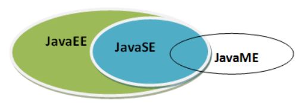
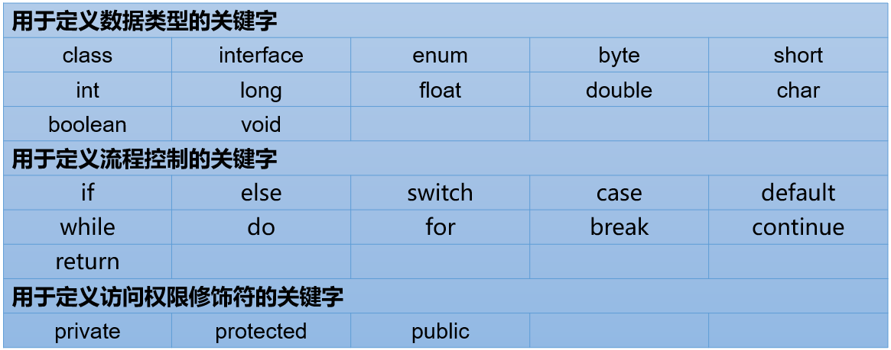
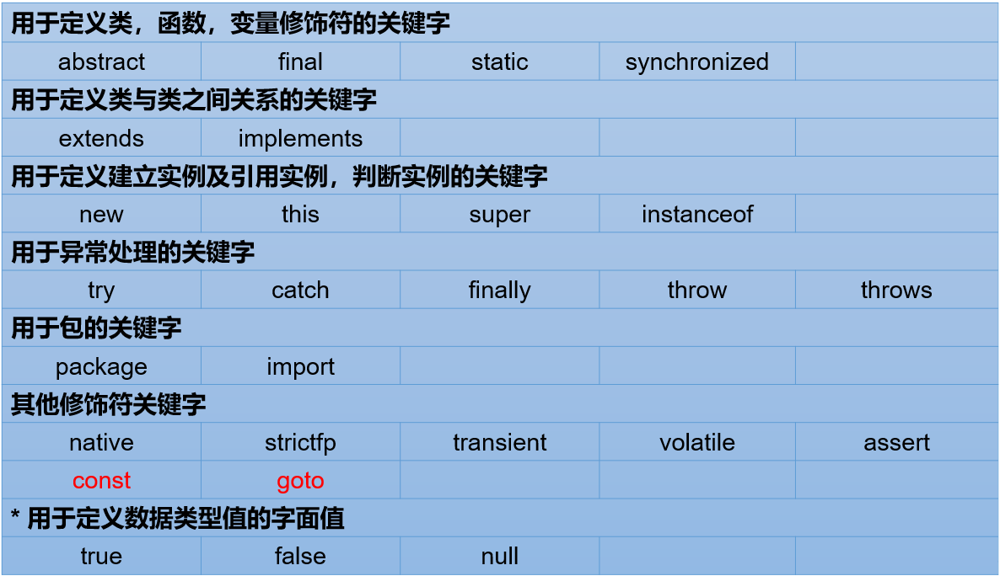

# Java基础语法

## 概述

Java 长期支持版本：

+ 8
+ 11（JDK 安装取消独立 JRE 安装包）
+ 17

Java 技术体系：

+ Java SE：定位个人计算机的应用开发。
+ Java EE：是JavaSE的扩展，增加了用于服务器开发的类库，定位在服务器端的Web应用开发。
+ Java ME：是JavaSE的内伸，精简了JavaSE 的核心类库，同时也提供自己的扩展类，支持Java程序运行在移动终端（手机、机顶盒）上的平台，即定位在消费性电子产品的应用开发。（安卓开发 ≠ Java ME 开发）




Java 开发环境

+ JDK  (`J`ava `D`evelopment `K`it)：是Java程序开发工具包，包含`JRE` 和开发人员使用的工具。
    - JDK = JRE + 开发工具集（例如Javac编译工具等）
+ JRE  (`J`ava `R`untime `E`nvironment) ：是Java程序的运行时环境，包含`JVM` 和运行时所需要的`核心类库`。
    - JRE = JVM + Java SE标准类库


Java 程序运行

+ Java程序开发三步骤：编写、编译、运行。
    1. 将 Java 代码编写到扩展名为 .java 的源文件中
    2. 通过 javac.exe 命令对该 java 文件进行编译，生成一个或多个字节码文件
    3. 通过 java.exe 命令对生成的 class 文件进行运行


+ 一个源文件中可以有多个类，编译后会生成多个.class字节码文件。但是一个源文件只能有一个public的类，并且要求源文件名必须与类名一致。


Java 核心机制：JVM

+ JVM（`J`ava `V`irtual `M`achine ，Java虚拟机）：是一个虚拟的计算机，是Java程序的运行环境。JVM具有指令集并使用不同的存储区域，负责执行指令，管理数据、内存、寄存器。正是因为有了JVM，才使得Java程序具备了跨平台性。


## 变量与运算符
### 关键字




+ 全部关键字都是小写字母
+ const 和 goto 是保留字
+ true 、false、null 是字面量，不是关键字


### 标识符

+ 命名规则

> 由26个英文字母大小写，0-9 ，_或 $ 组成  
>
> 数字不可以开头。
>
> 不可以使用关键字和保留字，但能包含关键字和保留字。
>
> Java中严格区分大小写，长度无限制。
>
> 标识符不能包含空格。


+ 命名规范

> 包名：多单词组成时所有字母都小写：xxxyyyzzz
>
> 类名、接口名：多单词组成时，所有单词的首字母大写：XxxYyyZzz
>
> 变量名、方法名：多单词组成时，第一个单词首字母小写，第二个单词开始每个单词首字母大写：xxxYyyZzz
>
> 常量名：所有字母都大写。多单词时每个单词用下划线连接：XXX_YYY_ZZZ


### Java 变量数据类型


+ 给变量赋的值类型必须与变量声明的类型一致或兼容


#### 基本数据类型
+ **整数类型：byte、short、int、long**


定义long类型的变量，赋值时需要以"`l`"或"`L`"作为后缀。

Java程序中变量通常声明为int型，除非不足以表示较大的数，才使用long。

Java的整型常量默认为 int 型。


+ **浮点类型：float、double**


定义float类型的变量，赋值时需要以"`f`"或"`F`"作为后缀。

Java 的浮点型常量默认为double型。

如果需要精确数字计算或保留指定位数的精度，需要使用BigDecimal类。


+ **字符类型：char**
    - char 型数据占2字节
    - Java中的所有字符都使用Unicode编码，故一个字符可以存储一个字母，一个汉字 ...
    - 字符表示：
        * 使用单引号：`char c1 = '9';`
        * 直接使用 Unicode值来表示字符型常量：`\u0023` 表示 `'#'`
        * 转义字符

| 转义字符 | 说明 | Unicode表示方式 |
| --- | --- | --- |
| `\n` | 换行符 | \u000a |
| `\t` | 制表符 | \u0009 |
| `\"` | 双引号 | \u0022 |
| `\'` | 单引号 | \u0027 |
| `\\` | 反斜线 | \u005c |
| `\b` | 退格符 | \u0008 |
| `\r` | 回车符 | \u000d |

char类型是可以进行运算的。因为它都对应有Unicode码，可以看做是一个数值。


+ **布尔类型：boolean**
    - 只有两个值：true、false （不可以使用 0、1 代替）
    - Java虚拟机中没有任何供boolean值专用的字节码指令，Java语言表达所操作的boolean值，在编译之后都使用java虚拟机中的int数据类型来代替：true用1表示，false用0表示。
    - 写法建议：`if ( isFlag = = true )` ---> `if (isFlag)`或者`if ( !isFlag)`


### 基本数据类型变量间运算规则
boolean 类型不参与

#### 自动类型提升
将取值范围小（或容量小）的类型自动提升为取值范围大（或容量大）的类型 。


+ 当把存储范围小的值（常量值、变量的值、表达式计算的结果值）赋值给了存储范围大的变量时

```java
int i = 'A';//char自动升级为int，其实就是把字符的编码值赋值给i变量了
double d = 10;//int自动升级为double
long num = 1234567; //右边的整数常量值如果在int范围呢，编译和运行都可以通过，这里涉及到数据类型转换

//byte bigB = 130;//错误，右边的整数常量值超过byte范围
long bigNum = 12345678912L;//右边的整数常量值如果超过int范围，必须加L，显式表示long类型。否则编译不通过
```

+ 当存储范围小的数据类型与存储范围大的数据类型变量一起混合运算时，会按照其中最大的类型运算。

```java
int i = 1;
byte b = 1;
double d = 1.0;

double sum = i + b + d;//混合运算，升级为double
```

+ 当byte,short,char数据类型的变量进行算术运算时，按照int类型处理。

```java
byte b1 = 1;
byte b2 = 2;
byte b3 = b1 + b2;//编译报错，b1 + b2自动升级为int

char c1 = '0';
char c2 = 'A';
int i = c1 + c2;//至少需要使用int类型来接收
System.out.println(c1 + c2);//113 
```

#### 强制类型转换
将取值范围大（或容量大）的类型强制转换成取值范围小（或容量小）的类型。

+ 当把存储范围大的值（常量值、变量的值、表达式计算的结果值）强制转换为存储范围小的变量时，可能会损失精度或溢出。

```java
int i = (int)3.14;//损失精度  //3

double d = 1.2;
int num = (int)d;//损失精度  //1

int i = 200;
byte b = (byte)i;//溢出  //-56
```

+ 当某个值想要提升数据类型时，也可以使用强制类型转换。这种情况的强制类型转换是没有风险的。

```java
int i = 1;
int j = 2;
double bigger = (double)(i/j); //0.0
```

+ 声明long类型变量时，可以出现省略后缀的情况。float则不同

```java
long l1 = 123L;
long l2 = 123;//如何理解呢？ 此时可以看做是int类型的123自动类型提升为long类型

//long l3 = 123123123123; //报错，因为123123123123超出了int的范围。
long l4 = 123123123123L;


//float f1 = 12.3; //报错，因为12.3看做是double，不能自动转换为float类型
float f2 = 12.3F;
float f3 = (float)12.3;
```


判断能否通过编译：

```java
1）short  s = 5;
   s = s-2;                     //判断：no
2） byte b = 3;
    b = b + 4;                  //判断：no
    b = (byte)(b+4);            //判断：yes
3）char c = ‘a’;
   int  i = 5;
   float d = .314F;
   double result = c+i+d;       //判断：yes
4） byte b = 5;
    short s = 3;
    short t = s + b;            //判断：no

```

#### 基本数据类型与 String 的转换
String 是引用数据类型，使用 `" "`表示字符串。

运算规则：

+ 任意八种基本数据类型的数据与String类型只能进行连接“+”运算，且结果一定也是String类型

```java
System.out.println("" + 1 + 2);//12

int num = 10;
boolean b1 = true;
String s1 = "abc";

String s2 = s1 + num + b1;
System.out.println(s2);//abc10true

//String s3 = num + b1 + s1;//编译不通过，因为int类型不能与boolean运算
String s4 = num + (b1 + s1);//编译通过
```

+ String类型不能通过强制类型()转换，转为其他的类型

```java
String str = "123";
// int num = (int)str;//错误的

int num = Integer.parseInt(str);//正确
```

### 运算符
+ 按功能分类：

| 分类 | 运算符 |
| --- | --- |
| 算术运算符（7个） | +、-、*、/、%、++、-- |
| 赋值运算符（12个） | =、+=、-=、*=、/=、%=、>>=、<<=、>>>=、&=、|=、^=等 |
| 比较(或关系)运算符（6个） | >、>=、<、<=、==、!= |
| 逻辑运算符（6个） | &、|、^、!、&&、|| |
| 位运算符（7个） | &、|、^、~、<<、>>、>>> |
| 条件运算符（1个） | (条件表达式)?结果1:结果2 |
| Lambda运算符（1个） | ->（第18章时讲解） |


+ 按操作个数分类

| 分类 | 运算符 |
| --- | --- |
| 一元运算符（单目运算符） | 正号（+）、负号（-）、++、--、!、~ |
| 二元运算符（双目运算符） | 除了一元和三元运算符剩下的都是二元运算符 |
| 三元运算符 （三目运算符） | (条件表达式)?结果1:结果2 |


+ 注意：
    - ++和-- ，在前是先运算后取值，在后是先取值后运算。
    
    	- ```java
    		a=2;b=++a // a=3 b=3
    		    
    		a=2;b=a++ // a=3 b=2
    		```
    
    - instanceof 检查是否是类的对象。
    
    - `^ `：当符号左右两边布尔值不同时，结果为true。当两边布尔值相同时，结果为false。
    
    - `&&`  和` || ` 是短路操作，建议使用。
    
+ 运算符优先级：使用 `()` 控制。


## 流程控制语句
+ **顺序语句**
+ **分支语句**
    - `if ...  else if ... else ...`
    - `switch-case`

```java
switch(表达式){
    case 常量值1:
        语句块1;
        //break;
    case 常量值2:
        语句块2;
        //break; 
    // ...
   [default:
        语句块n+1;
        break;
   ]
}
```


根据switch中表达式的值，依次匹配各个case。如果表达式的值等于某个case中的常量值，则执行对应case中的执行语句。执行完此case的执行语句以后，如果遇到break，则执行break并跳出当前的switch-case结构，如果没有遇到break，则会继续执行当前case之后的其它case中的执行语句（即 case穿透），直到遇到break关键字或执行完所有的case及default的执行语句，跳出当前的switch-case结构

使用注意：

> switch(表达式)中表达式的值必须是下述几种类型之一：byte，short，char，int，枚举 (jdk 5.0)，String (jdk 7.0)；
>
> case子句中的值必须是常量，不能是变量名或不确定的表达式值或范围；
>
> 同一个switch语句，所有case子句中的常量值互不相同；
>
> default子句是可选的，位置也是灵活的。当没有匹配的case时，执行default语句。


+ **循环语句**
    - for
    - while
    - do ... while
    - 无限循环：`while(true)` , `for(;;)`
    - break 关键字：结束 当前循环结构
    - continue 关键字：结束 当次循环结构


## Scanner：键盘输入功能的实现
```java
//① 导包
import java.util.Scanner;

public class ScannerTest1 {

    public static void main(String[] args) {
        //② 创建Scanner的对象
        //Scanner是一个引用数据类型，它的全名称是java.util.Scanner
        //也把scanner变量叫做scanner对象
        Scanner scanner = new Scanner(System.in);//System.in默认代表键盘输入
        
        //③根据提示，调用Scanner的方法，获取不同类型的变量
        System.out.print("请输入你的网名：");
        String name = scanner.next();

        System.out.print("请输入你的年龄：");
        int age = scanner.nextInt();

        System.out.print("请输入你的体重：");
        double weight = scanner.nextDouble();

        System.out.print("你是否单身（true/false)：");
        boolean isSingle = scanner.nextBoolean();

        System.out.print("请输入你的性别：");
        char gender = scanner.next().charAt(0);//先按照字符串接收，然后再取字符串的第一个字符

        System.out.println("你的基本情况如下：");
        System.out.println("网名：" + name + "\n年龄：" + age + "\n体重：" + weight + 
                           "\n单身：" + isSingle + "\n性别：" + gender);
        
        //④ 关闭资源
        scanner.close();
    }
}
```


## 如何获取一个随机数
1. Math类的random()的调用，会返回一个[0,1)范围的一个double型值
2. Math.random() * 100 ---> [0,100)  、(int)(Math.random() * 100)---> [0,99] 、 (int)(Math.random() * 100) + 5 ----> [5,104]
3. 如何获取`[a,b]`范围内的随机整数：`(int)(Math.random() * (b - a + 1)) + a`


## IDEA 调试


## 数组
数组是引用数据类型（所以用 new 创建数组对象），数组中的元素可以是 基本/引用 数据类型。

数组一旦初始化完成，其长度就是确定的，不能修改。

数组 arr 的长度：`arr.length`；索引范围：`[0, arr.length-1]`

### 一维数组
+ 一维数组的声明：`int[] arr;`   `int arr1[];`

+ 声明数组时不能指定其长度：`int a[5]; //非法`

+ 初始化：
    - 静态初始化：数组变量的初始化和数组元素的赋值操作同时进行
        * 如：`int[] arr = new int[]{1,2,3,4,5};`  、 ` int[] arr = {1,2,3,4,5}; //这种方式必须写一行`
        
    - 动态初始化：只确定了元素的个数（即数组的长度），而元素值此时只是默认值
        * 如：`int[] arr = new int[5];`
        
    - 错误写法：
    
        - ```java
            int[] arr;
            arr = {1,2,3,4,5};//错误
            
            int[] arr1 = new int[5]{1,2,3,4,5};//错误，后面有{}指定元素列表，就不需要在[]中指定元素个数了。
            ```

+ 数组元素默认值：

    

### 一维数组内存分析

#### JVM 的内存划分


| 区域名称 | 作用 |
| --- | --- |
| 虚拟机栈 | 用于存储正在执行的每个Java方法的局部变量表等。局部变量表存放了编译期可知长度   的各种基本数据类型、对象引用，方法执行完，自动释放。 |
| 堆内存 | 存储对象（包括数组对象），new来创建的都存储在堆内存。 |
| 方法区 | 存储已被虚拟机加载的类信息、常量、（静态变量）、即时编译器编译后的代码等数据。 |
| 本地方法栈 | 当程序中调用了native的本地方法时，本地方法执行期间的内存区域 |
| 程序计数器 | 程序计数器是CPU中的寄存器，它包含每一个线程下一条要执行的指令的地址 |


#### 一维数组在内存中的存储


### 二维数组
+ 声明：`int[][] grades;` ` int[] grades[];`    `int grades[][]`

+ 注意：`int[] x, y[]; //x是一维数组，y是二维数组`

+ 初始化：
    - 静态初始化：该二维数组中有三个一维数组
        * `int[][] arr = new int[][]{{3,8,2},{2,7},{9,0,1,6}};`
        
        * `int[][] arr = {{1,2,3},{4,5,6},{7,8,9,10}};//必须在一句完成`
        
        * 错误写法
        
        	* ```java
        		arr = new int[3][3]{{1,2,3},{4,5,6},{7,8,9,10}};//错误，静态初始化右边new 数据类型[][]中不能写数字
        		```
    
    + 动态初始化：
    	+ 行列数确定：`int[][] arr = new int[3][2]; //3 个一维数组，每个一维数组 2 个元素`
    	  + 元素都有默认值。
    	+ 行数确定，列数不确定：`int[][] arr = new int[3][];`
    		+ 每个一维数组默认为 null，
    	
    	* 错误写法：
    	
    		* ```java
    			int[][]arr = new int[][3]; //非法
    			```


### 二维数组内存分析


### Arrays工具类
java.util.Arrays类即为操作数组的工具类，包含了用来操作数组（比如排序和搜索）的各种方法。

### 数组中常见的异常
+ 数组角标越界异常
+ 空指针异常


