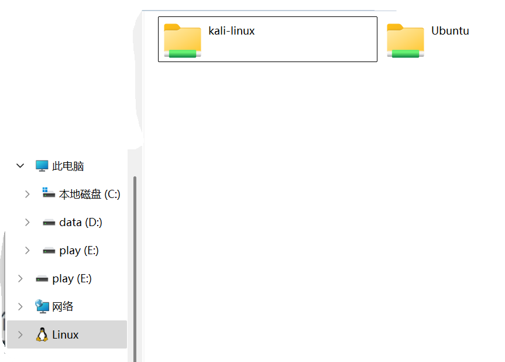
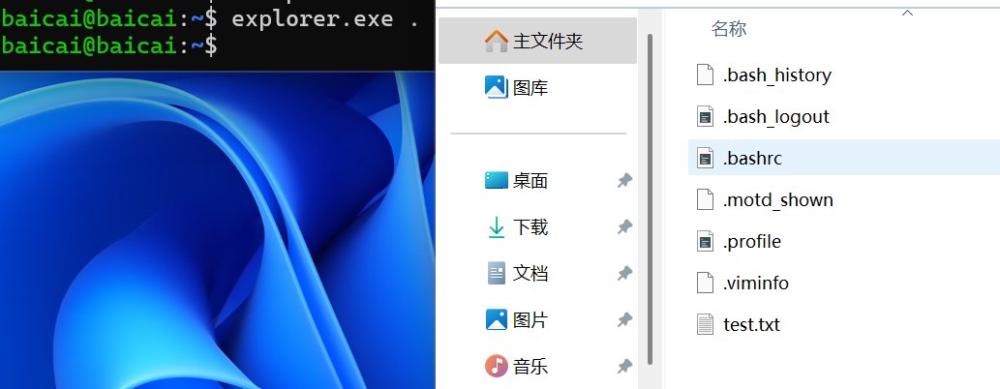
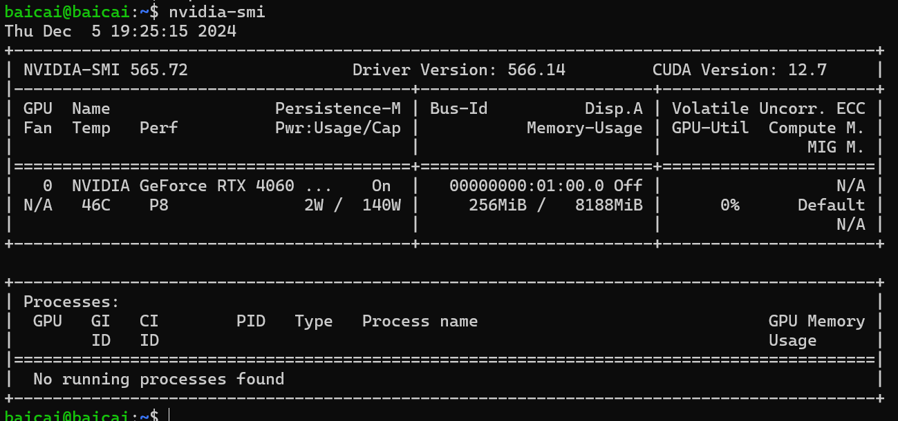

# WSL2安装

## win11安装linux子系统

+ 进入终端管理员
+ `wsl --install --web-download`默认安装ubuntu
+ 查看可以安装的linux版本：`wsl --list --online`
+ 安装制定linux：`wsl --install kali-linux --web-download`
+ 设置账号baicai，密码123456

## 查看安装的linux子系统

+ `wsl --list -v`，前面带*表示当前的默认子系统，state表示子系统是否在运行
+ 修改默认子系统：`wsl --set-default 子系统名字`

## 启动linux子系统
+ `wsl -d 子系统名字`，输入`exit`退出子系统

## 卸载子系统
+ `wsl --unregister  子系统名字`

## 备份子系统
+ `wsl --export 子系统名字  压缩包名字`，如`wsl --export ubuntu ubuntu.tar`

## 导入linux子系统
+ `wsl --import 导入后的linux子系统名字  目的路径  压缩包路径`，比如`wsl --import ubuntu2 D:/wsl  C:\Users\zhang\Desktop\ubuntu.tar`
+ 导入成功后，就在D:/wsl 下产生 .vdhx镜像文件（hyper-V文件），linux子系统的文件都存在这个镜像文件里面了

## linux子系统和win11共享文件
+ linux子系统查看win11文件
    - 在linux子系统中输入`df -h`，就能看到挂载卷，可以看到C、D、E盘都被挂载进来了，这种方式IO性能不好，对于频繁使用的文件，最好还是拷贝到linux子系统中。
+ win11查看linux子系统文件



## 命令
+ 在linux子系统中可以运行win程序




+ 在win的命令行可以使用linux命令


## wslg
+ 允许linux中带UI的程序直接以win窗口形式打开

## 显卡直通




## wsl的高级配置
+ .wslconfig & wsl.conf

+ .wslconfig是win上的文件，对于所有的linux子系统生效

+ wsl.conf在linux子系统里面的，只对某个linux子系统生效

+ 更改完配置后，需要在PowerShell使用 `wsl --shutdown`把linux子系统关闭并等待8秒后重启生效

+ 比如在Ubuntu启动systemd，
    - 在Ubuntu子系统中`sudo vim /etc/wsl.conf`
    
    - 添加：
    
    	- ```shell
    		[boot]
    		systemd=true
    		```
    
    + 在PowerShell中输入 `wsl --shutdown`（关闭所有wsl），等待8秒
    
    + 进入Ubuntu子系统，输入`systemctl`，输入一下内容表示配置成功
    


    


+ 比如配置网络
    - Windows电脑IP为10.11.44.15，但是wsl ip地址为172.25.18.117，想让Windows和WSL共享相同的IP地址
    - 在win用户目录(`C:\Users\zhang`)新建文件 .wslconfig，用记事本打开并添加`networkingMode=mirrored`
    - 在PowerShell中输入 `wsl --shutdown`（关闭所有wsl），等待8秒
    - 再次进入wsl就能看到ip地址为10.11.44.15


## xshell远程连接wsl
+ 卸载ssh server ：`sudo apt-get remove openssh-server`
+ 安装ssh server ：`sudo apt-get install openssh-server`
+ 修改ssh server配置：`sudo vim /etc/ssh/sshd_config`

```shell
Port 2222  #默认的是22，但是windows有自己的ssh服务，也是监听的22端口，所以这里要改一下
UsePrivilegeSeparation no
PasswordAuthentication yes #允许密码登录
AllowUsers baicai demo1 # 这里添加了用户baicai demo1 允许ssh登录
```

+ 启动ssh server ：`sudo service ssh --full-restart`

