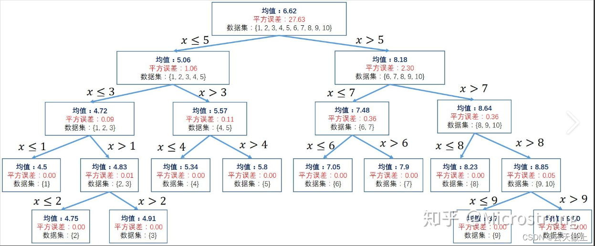
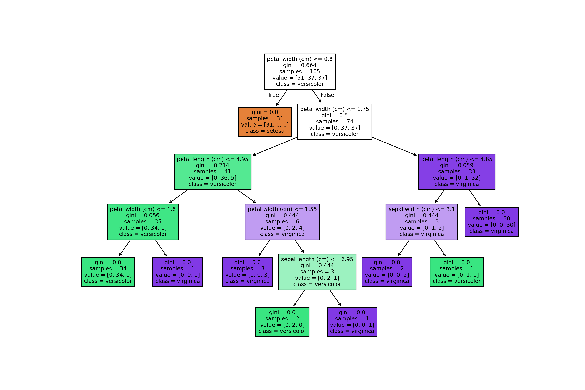
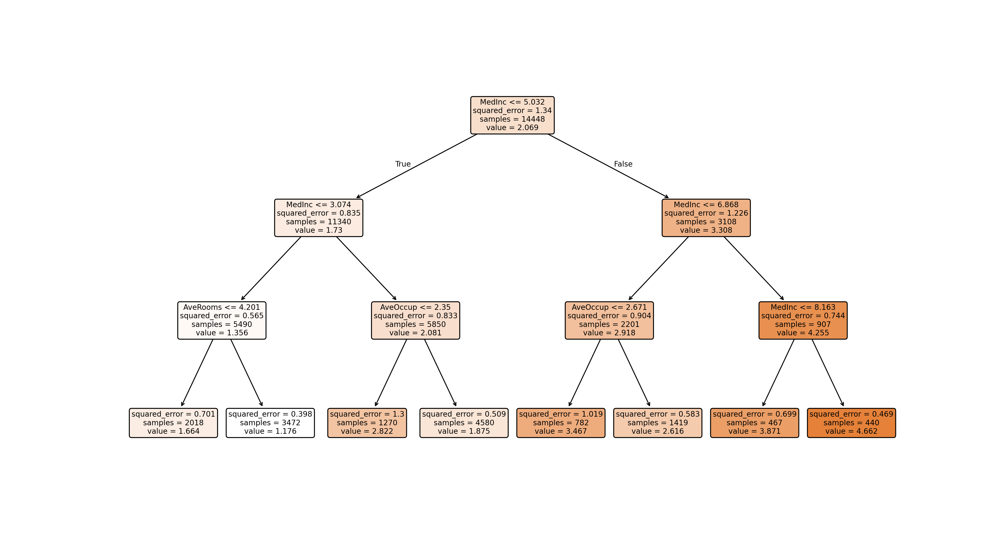

# 决策树

一种通过树形结构进行决策分析的分类方法

## 信息熵和条件熵

熵帮助我们度量数据的混乱程度或不确定性，从而指导如何选择最优的划分属性。

### 信息熵的理解
信息熵是对数据集中不确定性或混乱程度的度量。在一个数据集中，如果各类别的样本数量大致相等，那么该数据集的熵值较高，表示不确定性较大；反之，如果某个类别的样本数量占据绝对优势，那么熵值较低，表示不确定性较小。因此，信息熵可以用来评估数据集的纯度。

设X是一个有限值的离散随机变量，其概率分布为：$P(X = x_i)=p_i, i = 1,2,\cdots,n$

假设变量$x$的随机取值为$X = x_1,x_2,\cdots,x_n$，每一种取值的概率分布分别是$p_1,p_2,p_i$，则变量$X$的熵为：

$H(X)=-\sum_{i = 1}^{n}p_i\log_2 p_i$

假设有一个抛硬币的随机事件，其中正面朝上的概率为$P(\text{正面}) = 0.5$，反面朝上的概率为$P(\text{反面}) = 0.5$。那么，这个随机事件的信息熵为：

$H(\text{硬币}) = -(0.5 * \log_2(0.5) + 0.5 * \log_2(0.5)) = -(0.5 * (-1) + 0.5 * (-1)) = 1$

信息熵为1表示这个随机事件的不确定性为1，也就是说，我们无法确定硬币的哪一面会朝上，因为正面和反面的概率都是0.5。 

### 条件熵
条件熵是在给定某个随机变量取值的情况下，另一个随机变量的不确定性度量。在决策树中，条件熵用于评估在给定某个特征条件下数据集的纯度。通过比较划分前后数据集的条件熵变化，我们可以选择出能够最大程度降低不确定性的划分属性。

条件熵（Conditional Entropy）表示在已知某一随机变量$Y$的条件下，另一随机变量$X$的不确定性。其公式为：

$H(X|Y)=\sum P(y) * H(X|y)=\sum P(y) * [-\sum P(x|y) * \log_2 P(x|y)]$

其中，$P(y)$表示随机变量$Y$取值为$y$的概率，$P(x|y)$表示在$Y$取值为$y$的条件下，$X$取值为$x$的条件概率。 

假设有一个天气和穿衣的随机事件。其中，天气有两种状态：晴天和雨天，记为W = {晴, 雨}；穿衣有三种选择：短袖、长袖和雨衣，记为C = {短袖, 长袖, 雨衣}。我们关心的是，在知道天气的情况下，穿衣选择的不确定性是多少。

假设已知：

```plain
P(W=晴) = 0.6, P(W=雨) = 0.4
P(C=短袖|W=晴) = 0.8, P(C=长袖|W=晴) = 0.1, P(C=雨衣|W=晴) = 0.1
P(C=短袖|W=雨) = 0.1, P(C=长袖|W=雨) = 0.2, P(C=雨衣|W=雨) = 0.7
```

可以计算条件熵H(C|W)。这里需要分别计算晴天和雨天下的条件熵，然后按照天气的概率加权求和。

```plain
H(C|W=晴) = - (0.8 * log2(0.8) + 0.1 * log2(0.1) + 0.1 * log2(0.1))
H(C|W=雨) = - (0.1 * log2(0.1) + 0.2 * log2(0.2) + 0.7 * log2(0.7))
H(C|W) = 0.6 * H(C|W=晴) + 0.4 * H(C|W=雨)
```

条件熵H(C|W)表示在知道天气的条件下，穿衣选择的不确定性。这个值会比不考虑天气时的信息熵H要小，因为天气信息提供了关于穿衣选择的额外信息。

### 经典的决策树算法
| 算法 | 支持模型 | 树结构 | 特征选择 | 连续值处理 | 缺失值处理 | 剪枝 | 特征属性多次使用 |
| --- | --- | --- | --- | --- | --- | --- | --- |
| ID3 | 分类 | 多叉树 | **信息增益** | 不支持 | 不支持 | 不支持 | 不支持 |
| C4.5 | 分类 | 多叉树 | **信息增益率** | 支持 | 支持 | 支持 | 不支持 |
| CART | 分类、回归 | 二叉树 | **基尼指数、均方差** | 支持 | 支持 | 支持 | 支持 |


ID3算法采用信息增益作为划分标准，它选择信息增益最大的属性作为划分属性。然而，ID3算法倾向于选择取值较多的属性进行划分，可能导致过拟合问题。

C4.5算法是ID3算法的改进版，它采用信息增益率作为划分标准，克服了ID3算法中信息增益偏向选择取值较多的属性的缺点。此外，C4.5算法还增加了剪枝操作，进一步提高了模型的泛化能力。

CART算法则采用Gini系数作为划分标准，既可以用于分类问题也可以用于回归问题。CART算法生成的决策树是二叉树，每个非叶节点只有两个分支，因此更加简洁易懂。

## ID3
信息增益是ID3算法中用于选择划分属性的标准。它表示划分前后数据集的信息熵的差值，差值越大说明划分效果越好。信息增益的计算基于经验熵（香农熵）的概念。

$\text{Gain}(S,A) = E(S) - E(S,A)$

下面将使用贷款申请样本的数据表来进行具体说明，数据示例如下：

| ID | 年龄 | 有工作 | 有自己的房子 | 信贷情况 | 类别 |
| --- | --- | --- | --- | --- | --- |
| 1 | 青年 | 否 | 否 | 一般 | 否 |
| 2 | 青年 | 否 | 否 | 好 | 否 |
| 3 | 青年 | 是 | 否 | 好 | 是 |
| 4 | 青年 | 是 | 否 | 一般 | 是 |
| 5 | 青年 | 否 | 否 | 一般 | 否 |
| 6 | 中年 | 否 | 否 | 一般 | 否 |
| 7 | 中年 | 否 | 否 | 好 | 否 |
| 8 | 中年 | 是 | 是 | 好 | 是 |
| 9 | 中年 | 否 | 是 | 非常好 | 是 |
| 10 | 中年 | 否 | 是 | 非常好 | 是 |
| 11 | 老年 | 否 | 是 | 非常好 | 是 |
| 12 | 老年 | 否 | 是 | 好 | 是 |
| 13 | 老年 | 是 | 否 | 好 | 是 |
| 14 | 老年 | 是 | 否 | 非常好 | 是 |
| 15 | 老年 | 否 | 否 | 一般 | 否 |


先对数据集进行属性标注。

```json
{
"年龄": {"青年":0, "中年":1, "老年":2},
"有工作": {"否":0, "是":1},
"有自己的房子": {"否":0, "是":1},
"信贷情况": {"一般":0, "好":1, "非常好":2},
"类别": {"否":"no", "是":"yes"}
}
```

```python
# 数据集
dataSet=[[0, 0, 0, 0, 'no'],
            [0, 0, 0, 1, 'no'],
            [0, 1, 0, 1, 'yes'],
            [0, 1, 1, 0, 'yes'],
            [0, 0, 0, 0, 'no'],
            [1, 0, 0, 0, 'no'],
            [1, 0, 0, 1, 'no'],
            [1, 1, 1, 1, 'yes'],
            [1, 0, 1, 2, 'yes'],
            [1, 0, 1, 2, 'yes'],
            [2, 0, 1, 2, 'yes'],
            [2, 0, 1, 1, 'yes'],
            [2, 1, 0, 1, 'yes'],
            [2, 1, 0, 2, 'yes'],
            [2, 0, 0, 0, 'no']]
labels=['年龄','有工作','有自己的房子','信贷情况']
```


### 计算经验熵
经验熵（香农熵）用于度量数据集的纯度或不确定性。对于包含K个类别的数据集D，其经验熵H(D)的计算公式如下：

$H(D)=-\sum (P(D_i)*\log_2 P(D_i))$

其中，$P(D_i)$表示数据集D中第i个类别样本所占的比例，$\sum$表示对所有类别求和。经验熵越小，说明数据集的纯度越高。 


### 计算信息增益
信息增益表示划分前后数据集信息熵的差值。对于属性A，其在数据集D上的信息增益$\text{Gain}(D,A)$的计算公式如下：

$\text{Gain}(D,A)=H(D)-\sum(|D_v|/|D|*H(D_v))$

其中，$D_v$表示根据属性A的某个取值将数据集D划分得到的子集，$|D_v|$表示子集$D_v$的样本数，$|D|$表示数据集$D$的样本总数。信息增益越大，说明使用属性A进行划分所获得的"纯度提升"越大。 

### 树的生成
1. 从根节点开始，计算所有属性的信息增益。
2. 选择信息增益最大的属性作为划分属性，根据该属性的不同取值将数据集划分为多个子集。
3. 对每个子集递归执行步骤1和步骤2，直到满足停止条件（如所有样本属于同一类别或没有属性可用）为止。
4. 通过上述步骤，可以得到一个完整的决策树。

### 完整代码
```python
from math import log
import operator
import pickle


def calcShannonEnt(dataSet):
    # 统计数据数量
    numEntries = len(dataSet)
    # 存储每个label出现次数
    label_counts = {}
    # 统计label出现次数
    for featVec in dataSet:
        current_label = featVec[-1]
        if current_label not in label_counts:  # 提取label信息
            label_counts[current_label] = 0  # 如果label未在dict中则加入
        label_counts[current_label] += 1  # label计数

    shannon_ent = 0  # 经验熵
    # 计算经验熵
    for key in label_counts:
        prob = float(label_counts[key]) / numEntries
        shannon_ent -= prob * log(prob, 2)
    return shannon_ent


def splitDataSet(data_set, axis, value):
    ret_dataset = []
    for feat_vec in data_set:
        if feat_vec[axis] == value:
            reduced_feat_vec = feat_vec[:axis]
            reduced_feat_vec.extend(feat_vec[axis + 1:])
            ret_dataset.append(reduced_feat_vec)
    return ret_dataset


def chooseBestFeatureToSplit(dataSet):
    # 特征数量
    num_features = len(dataSet[0]) - 1
    # 计算数据香农熵
    base_entropy = calcShannonEnt(dataSet)
    # 信息增益
    best_info_gain = 0.0
    # 最优特征索引值
    best_feature = -1
    # 遍历所有特征
    for i in range(num_features):
        # 获取dataset第i个特征
        feat_list = [exampel[i] for exampel in dataSet]
        # 创建set集合，元素不可重合
        unique_val = set(feat_list)
        # 经验条件熵
        new_entropy = 0.0
        # 计算信息增益
        for value in unique_val:
            # sub_dataset划分后的子集
            sub_dataset = splitDataSet(dataSet, i, value)
            # 计算子集的概率
            prob = len(sub_dataset) / float(len(dataSet))
            # 计算经验条件熵
            new_entropy += prob * calcShannonEnt(sub_dataset)
        # 信息增益
        info_gain = base_entropy - new_entropy
        # 打印每个特征的信息增益
        print("第%d个特征的信息增益为%.3f" % (i, info_gain))
        # 计算信息增益
        if info_gain > best_info_gain:
            # 更新信息增益
            best_info_gain = info_gain
            # 记录信息增益最大的特征的索引值
            best_feature = i
    print("最优索引值：" + str(best_feature))
    print()
    return best_feature


def majority_cnt(class_list):
    class_count = {}
    # 统计class_list中每个元素出现的次数
    for vote in class_list:
        if vote not in class_count:
            class_count[vote] = 0
            class_count[vote] += 1
        # 根据字典的值降序排列
        sorted_class_count = sorted(class_count.items(), key=operator.itemgetter(1), reverse=True)
    return sorted_class_count[0][0]


def creat_tree(dataSet, labels, featLabels):
    # 取分类标签(是否放贷：yes or no)
    class_list = [exampel[-1] for exampel in dataSet]
    # 如果类别完全相同则停止分类
    if class_list.count(class_list[0]) == len(class_list):
        return class_list[0]
    # 遍历完所有特征时返回出现次数最多的类标签
    if len(dataSet[0]) == 1:
        return majority_cnt(class_list)
    # 选择最优特征
    best_feature = chooseBestFeatureToSplit(dataSet)
    # 最优特征的标签
    best_feature_label = labels[best_feature]
    featLabels.append(best_feature_label)
    # 根据最优特征的标签生成树
    my_tree = {best_feature_label: {}}
    # 删除已使用标签
    del(labels[best_feature])
    # 得到训练集中所有最优特征的属性值
    feat_value = [exampel[best_feature] for exampel in dataSet]
    # 去掉重复属性值
    unique_vls = set(feat_value)
    for value in unique_vls:
        my_tree[best_feature_label][value] = creat_tree(splitDataSet(dataSet, best_feature, value), labels, featLabels)
    return my_tree

# 获取树的广度
def get_num_leaves(my_tree):
    num_leaves = 0
    first_str = next(iter(my_tree))
    second_dict = my_tree[first_str]
    for key in second_dict.keys():
        if type(second_dict[key]).__name__ == 'dict':
            num_leaves += get_num_leaves(second_dict[key])
        else:
                num_leaves += 1
    return num_leaves

# 获取树的深度
def get_tree_depth(my_tree):
    max_depth = 0       # 初始化决策树深度
    firsr_str = next(iter(my_tree))     # python3中myTree.keys()返回的是dict_keys,不在是list,所以不能使用myTree.keys()[0]的方法获取结点属性，可以使用list(myTree.keys())[0]
    second_dict = my_tree[firsr_str]    # 获取下一个字典
    for key in second_dict.keys():
        if type(second_dict[key]).__name__ == 'dict':     # 测试该结点是否为字典，如果不是字典，代表此结点为叶子结点
            this_depth = 1 + get_tree_depth(second_dict[key])
        else:
            this_depth = 1
        if this_depth > max_depth:
            max_depth = this_depth      # 更新层数
    return max_depth


def classify(input_tree, feat_labels, test_vec):
    # 获取决策树节点
    first_str = next(iter(input_tree))
    # 下一个字典
    second_dict = input_tree[first_str]
    feat_index = feat_labels.index(first_str)

    for key in second_dict.keys():
        if test_vec[feat_index] == key:
            if type(second_dict[key]).__name__ == 'dict':
                class_label = classify(second_dict[key], feat_labels, test_vec)
            else:
                class_label = second_dict[key]
    return class_label


def storeTree(input_tree, filename):
    # 存储树
    with open(filename, 'wb') as fw:
        pickle.dump(input_tree, fw)


def grabTree(filename):
    # 读取树
    fr = open(filename, 'rb')
    return pickle.load(fr)


if __name__ == "__main__":
    # 数据集
    dataSet = [[0, 0, 0, 0, 'no'],
               [0, 0, 0, 1, 'no'],
               [0, 1, 0, 1, 'yes'],
               [0, 1, 1, 0, 'yes'],
               [0, 0, 0, 0, 'no'],
               [1, 0, 0, 0, 'no'],
              # [1, 0, 0, 0, 'yes'],
               [1, 0, 0, 1, 'no'],
               [1, 1, 1, 1, 'yes'],
               [1, 0, 1, 2, 'yes'],
               [1, 0, 1, 2, 'yes'],
               [2, 0, 1, 2, 'yes'],
               [2, 0, 1, 1, 'yes'],
               [2, 1, 0, 1, 'yes'],
               [2, 1, 0, 2, 'yes'],
               [2, 0, 0, 0, 'no']]
    # 分类属性
    labels = ['年龄', '有工作', '有自己的房子', '信贷情况']

    print(dataSet)
    print()
    print(calcShannonEnt(dataSet))
    print()

    featLabels = []
    myTree = creat_tree(dataSet, labels, featLabels)
    print(myTree)
    print(get_tree_depth(myTree))
    print(get_num_leaves(myTree))

    #测试数据
    testVec = [0, 1, 1, 1]
    result = classify(myTree, featLabels, testVec)

    if result == 'yes':
        print('放贷')
    if result == 'no':
        print('不放贷')

    # 存储树
    storeTree(myTree,'classifierStorage.txt')

    # 读取树
    myTree2 = grabTree('classifierStorage.txt')
    print(myTree2)

    testVec2 = [1, 0]
    result2 = classify(myTree2, featLabels, testVec)
    if result2 == 'yes':
        print('放贷')
    if result2 == 'no':
        print('不放贷')

```


### ID3优缺点
算法原理简单易懂，生成的决策树易于理解。

缺点：

+ 只能处理离散型属性，对于连续型属性需要进行额外的处理。
+ 在划分属性时偏向于选择取值较多的属性，这可能导致生成的决策树过于复杂，出现过拟合现象。
+ 没有考虑剪枝操作，生成的决策树可能存在冗余分支，影响预测性能。


为了克服这些缺点，提出了C4.5算法等改进版本，通过引入对连续型属性的处理、使用信息增益率代替信息增益作为划分标准以及引入剪枝操作等方式来优化决策树的生成过程。


## C4.5
### 信息增益率
设有限个样本集合S ，根据条件属性A划分S所得子集为$S_1,S_2,\cdots,S_n$，则定义A划分样本集S的信息增益率为：

$\text{GainRate}(S,A)=\text{Gain}(S,A)/IV(A)$

其中，$\text{Gain}(S,A)$的计算公式为$\text{Gain}(S,A) = E(S) - E(S,A)$，$IV(A)$如下：

$IV(A)=-\sum_{j = 1}^{v}\frac{|S_j|}{|S|}\log_2(\frac{|S_j|}{|S|})$

称为属性A的 "固有值" ，属性A的取值数目越多，即v越大，则IV(A)的值通常会越大。通过引入固有值的概念，信息增益率能够平衡属性取值多样性和信息增益之间的关系，从而选择出更具代表性的划分属性。 


### 剪枝
引入了剪枝操作来避免决策树过拟合。剪枝操作分为预剪枝和后剪枝两种。

预剪枝是在决策树生成过程中提前停止树的生长，通过设定一些停止条件（如节点中样本数少于某个阈值、信息增益小于某个阈值等）来限制树的深度。这种方法简单有效，但可能由于过早停止树的生长而导致欠拟合。

后剪枝是在决策树生成完成后对其进行修剪，通过删除一些子树或叶子节点来简化树的结构。C4.5算法采用了一种基于错误率降低的剪枝策略，通过计算删除某个子树前后的错误率变化来决定是否进行剪枝。这种方法能够保留更多的有用信息，但计算复杂度较高。

通过剪枝操作，C4.5算法能够在保证一定性能的前提下简化决策树的结构，提高模型的泛化能力。

### ID3&C4.5
ID3和C4.5算法在决策树生成过程中有着明显的不同。ID3算法采用信息增益作为划分标准，容易偏向于选择取值较多的属性，可能导致生成的决策树过于复杂。而C4.5算法通过引入信息增益率和剪枝操作，有效克服了这些问题，能够生成更加简洁、有效的决策树。

在实际应用中，C4.5算法通常能够取得比ID3算法更好的性能。它不仅能够处理离散型属性，还能通过离散化处理来应对连续型属性。此外，C4.5算法的剪枝操作能够有效防止过拟合，提高模型的泛化能力。因此，在需要构建决策树模型时，C4.5算法通常是一个更好的选择。

虽然C4.5算法在很多方面都有所改进，但它仍然是一种基于启发式规则的算法，其性能受到数据集特性的影响。在实际应用中，需要根据具体问题和数据集特点来选择合适的算法和参数设置。

## CART
CART（Classification and Regression Trees）（分类回归树）分为分类树和回归树算法是一种应用广泛的决策树学习算法，既可以用于分类也可以用于回归。

是回归时还是分类树，只和预测的值有关，跟样本的某一特征是否连续无关。

sklearn中的决策树算法 DecisionTreeRegressor、DecisionTreeClassifier 使用的都是CART算法


### CART树
CART树是一种二叉树，这意味着每个非叶子节点都有两个子节点。对于分类问题，CART树采用二分类的方式，每次将数据划分为两个子集；对于回归问题，CART树则是将输出值划分为连续型的值。CART分类树利用基尼指数进行二分

CART回归树：



### 分类树划分选择—Gini系数
Gini系数表示样本集合的不确定性，其值越小表示集合的纯度越高。对于含有K个类别的样本集合D，其Gini系数的计算公式为：

$\text{Gini}(S)=\sum_{i = 1}^{k}p_i(1 - p_i)=1 - \sum_{i = 1}^{k}(p_i)^2$

当对一个属性进行划分时，希望划分后的子集的Gini系数之和最小，即不确定性最小。

假设有一个包含10个样本的集合，其中5个属于类别A，3个属于类别B，2个属于类别C。那么该集合的Gini系数为：

$\text{Gini}(D)=1 - (5/10)^2 - (3/10)^2 - (2/10)^2 = 0.48$

如果根据某个属性将集合划分为两个子集D1和D2，那么划分后的Gini系数之和为：

$\text{Gini}_{split}=(N1/N)*\text{Gini}(D1)+(N2/N)*\text{Gini}(D2)$

其中，N1和N2分别是子集D1和D2的样本数，N是总样本数。需要找到使$\text{Gini}_{split}$最小的划分方式。 


### 回归树划分选择—loss函数
CART回归树预测回归连续型数据，假设X与Y分别示输入和输出变量，并且Y是连续变量，在训练数据集所在的输入空间中，递归的将每个区域划分为两个子区域并决定每个子区域上的输出值，构建二叉决策树。$D = (x_1, y_1), (x_2, y_2), \cdots, (x_n, y_n) $

既然是回归树，存在俩问题：

+ 如何选择划分点？
+ 如何决定树中叶子节点的输出值？


### CART优缺点
优点：

+ 既可以用于分类也可以用于回归，具有广泛的应用场景。
+ 能够生成易于理解的决策树，方便进行特征解释和可视化。
+ 对缺失值不敏感，能够处理包含缺失值的数据集。

缺点：

+ 容易过拟合，特别是在没有剪枝的情况下。
+ 对噪声数据较为敏感，可能生成复杂的决策树。


与ID3和C4.5算法相比，CART算法采用了二叉树结构和Gini系数作为划分标准，使得决策树更加简洁和高效。同时，CART算法还支持回归问题，具有更广泛的应用范围。

+ 划分标准的差异：ID3使用信息增益偏向特征值多的特征；C4.5使用信息增益率克服信息增益的缺点，偏向于特征值小的特征；CART使用基尼指数克服C4.5需要求log的巨大计算量，偏向于特征值较多的特征。
+ 使用场景的差异：ID3和C4.5都只能用于分类问题，CART可以用于分类和回归问题；ID3和C4.5是多叉树，速度较慢，CART是二叉树，计算速度很快；
+ 样本数据的差异：ID3只能处理离散数据且缺失值敏感，C4.5和CART可以处理连续性数据且有多种方式处理缺失值；从样本量考虑的话，小样本建议C4.5、大样本建议CART。C4.5处理过程中需对数据集进行多次扫描排序，处理成本耗时较高，而CART本身是一种大样本的统计方法，小样本处理下泛化误差较大；
+ 样本特征的差异：ID3和C4.5层级之间只使用一次特征，CART可多次重复使用特征；
+ 剪枝策略的差异：ID3没有剪枝策略，C4.5是通过悲观剪枝策略来修正树的准确性，而 CART是通过代价复杂度剪枝。


### 对连续型属性的处理
对于连续型属性，CART算法采用二分法进行处理。具体做法是对连续属性进行排序，考虑相邻属性值的平均值作为划分点，然后选择使划分后子集Gini系数之和最小的划分点进行划分。


## 分类案例
```python
from sklearn.datasets import load_iris
from sklearn.model_selection import train_test_split
from sklearn.tree import DecisionTreeClassifier
from sklearn.metrics import accuracy_score

# 加载鸢尾花数据集
iris = load_iris()
X = iris.data
y = iris.target

# 划分训练集和测试集
X_train, X_test, y_train, y_test = train_test_split(X, y, test_size=0.3, random_state=42)
# 接下来，创建决策树分类器对象，并使用训练数据对其进行训练。

# 创建决策树分类器对象
clf = DecisionTreeClassifier()
# 使用训练数据对分类器进行训练
clf.fit(X_train, y_train)
# 训练完成后，使用测试数据对模型进行评估，并计算分类准确率。

# 使用测试数据进行预测
y_pred = clf.predict(X_test)

# 计算分类准确率
accuracy = accuracy_score(y_test, y_pred)
print("Accuracy:", accuracy) # Accuracy: 1.0

```

上述使用clf=DecisionTreeClassifier()函数的时候设置参数max_depth=1，其实DecisionTreeClassifier是一个用于构建决策树模型的Python库。以下是该函数的参数解释：

criterion（标准化度量）：指定使用哪种标准化度量方法，可选值包括"entropy"（信息熵）和"gini"（基尼系数）。默认值为"entropy"。

min_samples_leaf（叶子节点最小样本数）：如果一个叶子节点的样本数小于这个值，则将其视为噪声点，并在训练集中删除。默认值为3。

max_depth（最大深度）：指定决策树中的最大深度。深度越大，越容易过拟合，推荐树的深度为5-20之间。默认值为None。

random_state（随机种子）：用于生成均匀分布的随机数。如果不提供，则会使用当前时间作为随机种子。默认值为None。

如果将上述函数的参数设置为2，即clf=DecisionTreeClassifier(max_depth=2)，那么预测的精度就会发生改变，这是由于树的深度越大，越容易发生过拟合。


绘制决策树：

```python
import matplotlib.pyplot as plt
from sklearn import tree

# 绘制决策树
fig, axes = plt.subplots(nrows=1, ncols=1, figsize=(12, 8), dpi=300)
tree.plot_tree(clf,
               feature_names=iris.feature_names,
               class_names=iris.target_names,
               filled=True, fontsize=8)
plt.show()

```




## 回归案例
```python
from sklearn.datasets import fetch_california_housing
from sklearn.model_selection import train_test_split
from sklearn.tree import DecisionTreeRegressor
from sklearn.metrics import mean_squared_error
import matplotlib.pyplot as plt
from sklearn import tree

# 加载加利福尼亚住房数据
housing = fetch_california_housing()
X = housing.data
y = housing.target

# 划分训练集和测试集
X_train, X_test, y_train, y_test = train_test_split(X, y, test_size=0.3, random_state=42)

# 创建决策树回归器对象，并限制树的深度避免过于复杂
regressor = DecisionTreeRegressor(random_state=42, max_depth=3)

# 使用训练数据对回归器进行训练
regressor.fit(X_train, y_train)

# 使用测试数据进行预测
y_pred = regressor.predict(X_test)

# 计算均方误差
mse = mean_squared_error(y_test, y_pred)
print("Mean Squared Error:", mse) # Mean Squared Error: 0.6325363214073455

# 绘制决策树回归模型
# 与分类决策树的可视化类似，但需要注意的是，回归树的叶子节点输出的是具体的数值。
fig, axes = plt.subplots(nrows=1, ncols=1, figsize=(15, 8), dpi=300)
tree.plot_tree(regressor,
               feature_names=housing.feature_names,
               filled=True,
               rounded=True,
               fontsize=8)
plt.show()

```



