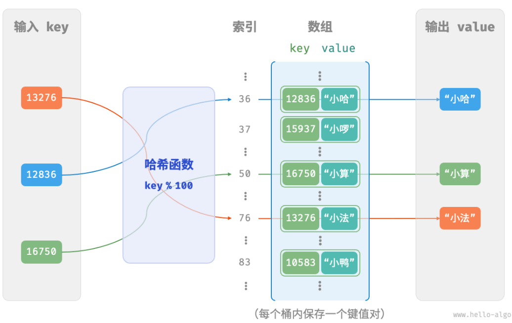
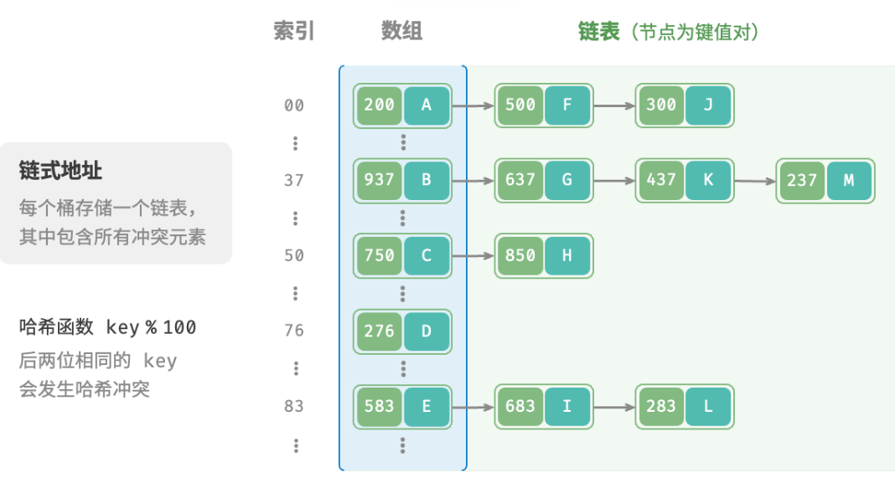
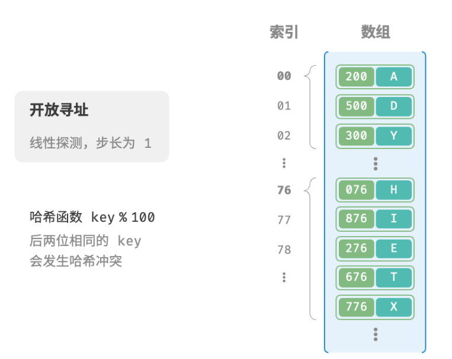

# 哈希表

## 哈希表

在哈希表中增删查改的时间复杂度都为 $O(1)$ 。

### 哈希表的简单实现

仅用一个数组来实现哈希表。数组中的每个空位称为桶（bucket），每个桶可存储一个键值对。因此，查询操作就是找到 key 对应的桶，并在桶中获取 value 。哈希函数的作用是将一个较大的输入空间映射到一个较小的输出空间。在哈希表中，输入空间是所有 key ，输出空间是所有桶（数组索引）。哈希函数的计算分为两步：
+ 通过某种哈希算法 hash() 计算得到哈希值。
+ 将哈希值对桶数量（数组长度）capacity 取模，从而获取该 key 对应的数组索引 index 。

```java
index = hash(key) % capacity
```
随后利用 index 在哈希表中访问对应的桶，从而获取 value 。

> 设数组长度 capacity = 100、哈希算法 hash(key) => key ，哈希函数为 key % 100 。



```java
/* 键值对 */
class Pair {
    public int key;
    public String val;

    public Pair(int key, String val) {
        this.key = key;
        this.val = val;
    }
}

/* 基于数组实现的哈希表 */
class ArrayHashMap {
    private List<Pair> buckets;

    public ArrayHashMap() {
        // 初始化数组，包含 100 个桶
        buckets = new ArrayList<>();
        for (int i = 0; i < 100; i++) {
            buckets.add(null);
        }
    }

    /* 哈希函数 */
    private int hashFunc(int key) {
        int index = key % 100;
        return index;
    }

    /* 查询操作 */
    public String get(int key) {
        int index = hashFunc(key);
        Pair pair = buckets.get(index);
        if (pair == null)
            return null;
        return pair.val;
    }

    /* 添加操作 */
    public void put(int key, String val) {
        Pair pair = new Pair(key, val);
        int index = hashFunc(key);
        buckets.set(index, pair);
    }

    /* 删除操作 */
    public void remove(int key) {
        int index = hashFunc(key);
        // 置为 null ，代表删除
        buckets.set(index, null);
    }

    /* 获取所有键值对 */
    public List<Pair> pairSet() {
        List<Pair> pairSet = new ArrayList<>();
        for (Pair pair : buckets) {
            if (pair != null)
                pairSet.add(pair);
        }
        return pairSet;
    }

    /* 获取所有键 */
    public List<Integer> keySet() {
        List<Integer> keySet = new ArrayList<>();
        for (Pair pair : buckets) {
            if (pair != null)
                keySet.add(pair.key);
        }
        return keySet;
    }

    /* 获取所有值 */
    public List<String> valueSet() {
        List<String> valueSet = new ArrayList<>();
        for (Pair pair : buckets) {
            if (pair != null)
                valueSet.add(pair.val);
        }
        return valueSet;
    }

    /* 打印哈希表 */
    public void print() {
        for (Pair kv : pairSet()) {
            System.out.println(kv.key + " -> " + kv.val);
        }
    }
}
```

### 哈希冲突与扩容

存在多个输入对应相同的输出，即哈希冲突，可以通过扩容哈希表来减少哈希冲突。

类似于数组扩容，哈希表扩容需将所有键值对从原哈希表迁移至新哈希表，非常耗时；并且由于哈希表容量 capacity 改变，需要通过哈希函数来重新计算所有键值对的存储位置，这进一步增加了扩容过程的计算开销。

负载因子（load factor）是哈希表的一个重要概念，其定义为哈希表的元素数量除以桶数量，用于衡量哈希冲突的严重程度，也常作为哈希表扩容的触发条件。在 Java 中，当负载因子超过0.75时，系统会将哈希表扩容至原先的2倍。

## 哈希冲突

哈希表扩容简单粗暴且有效，但效率太低，因为哈希表扩容需要进行大量的数据搬运与哈希值计算。为了提升效率，可以采用以下策略：
+ 改良哈希表数据结构，使得哈希表可以在出现哈希冲突时正常工作。
  + 哈希表的结构改良方法主要包括“**链式地址**”和“**开放寻址**”。
+ 仅在必要时，即当哈希冲突比较严重时，才执行扩容操作。

### 链式地址

在原始哈希表中，每个桶仅能存储一个键值对。链式地址将单个元素转换为链表，将键值对作为链表节点，将所有发生冲突的键值对都存储在同一链表中。



以下用动态数组替代链表实现：

```java
/* 链式地址哈希表 */
class HashMapChaining {
    int size; // 键值对数量
    int capacity; // 哈希表容量
    double loadThres; // 触发扩容的负载因子阈值
    int extendRatio; // 扩容倍数
    List<List<Pair>> buckets; // 桶数组

    /* 构造方法 */
    public HashMapChaining() {
        size = 0;
        capacity = 4;
        loadThres = 2.0 / 3.0;
        extendRatio = 2;
        buckets = new ArrayList<>(capacity);
        for (int i = 0; i < capacity; i++) {
            buckets.add(new ArrayList<>());
        }
    }

    /* 哈希函数 */
    int hashFunc(int key) {
        return key % capacity;
    }

    /* 负载因子 */
    double loadFactor() {
        return (double) size / capacity;
    }

    /* 查询操作 */
    String get(int key) {
        int index = hashFunc(key);
        List<Pair> bucket = buckets.get(index);
        // 遍历桶，若找到 key ，则返回对应 val
        for (Pair pair : bucket) {
            if (pair.key == key) {
                return pair.val;
            }
        }
        // 若未找到 key ，则返回 null
        return null;
    }

    /* 添加操作 */
    void put(int key, String val) {
        // 当负载因子超过阈值时，执行扩容
        if (loadFactor() > loadThres) {
            extend();
        }
        int index = hashFunc(key);
        List<Pair> bucket = buckets.get(index);
        // 遍历桶，若遇到指定 key ，则更新对应 val 并返回
        for (Pair pair : bucket) {
            if (pair.key == key) {
                pair.val = val;
                return;
            }
        }
        // 若无该 key ，则将键值对添加至尾部
        Pair pair = new Pair(key, val);
        bucket.add(pair);
        size++;
    }

    /* 删除操作 */
    void remove(int key) {
        int index = hashFunc(key);
        List<Pair> bucket = buckets.get(index);
        // 遍历桶，从中删除键值对
        for (Pair pair : bucket) {
            if (pair.key == key) {
                bucket.remove(pair);
                size--;
                break;
            }
        }
    }

    /* 扩容哈希表 */
    void extend() {
        // 暂存原哈希表
        List<List<Pair>> bucketsTmp = buckets;
        // 初始化扩容后的新哈希表
        capacity *= extendRatio;
        buckets = new ArrayList<>(capacity);
        for (int i = 0; i < capacity; i++) {
            buckets.add(new ArrayList<>());
        }
        size = 0;
        // 将键值对从原哈希表搬运至新哈希表
        for (List<Pair> bucket : bucketsTmp) {
            for (Pair pair : bucket) {
                put(pair.key, pair.val);
            }
        }
    }

    /* 打印哈希表 */
    void print() {
        for (List<Pair> bucket : buckets) {
            List<String> res = new ArrayList<>();
            for (Pair pair : bucket) {
                res.add(pair.key + " -> " + pair.val);
            }
            System.out.println(res);
        }
    }
}
```

### 开放寻址

开放寻址不引入额外的数据结构，而是通过“多次探测”来处理哈希冲突，探测方式主要包括**线性探测、平方探测和多次哈希**等。

#### 线性探测

插入元素：通过哈希函数计算桶索引，若发现桶内已有元素，则从冲突位置向后线性遍历（步长通常为 1 ），直至找到空桶，将元素插入其中。

查找元素：若发现哈希冲突，则使用相同步长向后进行线性遍历，直到找到对应元素，返回 value 即可；如果遇到空桶，说明目标元素不在哈希表中，返回 None 。



线性探测容易产生“聚集现象”。数组中连续被占用的位置越长，这些连续位置发生哈希冲突的可能性越大，从而进一步促使该位置的聚堆生长，形成恶性循环，最终导致增删查改操作效率劣化。

不能在开放寻址哈希表中直接删除元素。这是因为删除元素会在数组内产生一个空桶 None ，而当查询元素时，线性探测到该空桶就会返回，因此在该空桶之下的元素都无法再被访问到，程序可能误判这些元素不存在。
为了解决该问题，可以采用懒删除（lazy deletion）机制：它不直接从哈希表中移除元素，而是利用一个常量 TOMBSTONE 来标记这个桶。在该机制下，None 和 TOMBSTONE 都代表空桶，都可以放置键值对。但不同的是，线性探测到 TOMBSTONE 时应该继续遍历，因为其之下可能还存在键值对。
然而，懒删除可能会加速哈希表的性能退化。这是因为每次删除操作都会产生一个删除标记，随着 TOMBSTONE 的增加，搜索时间也会增加，因为线性探测可能需要跳过多个 TOMBSTONE 才能找到目标元素。
为此，考虑在线性探测中记录遇到的首个 TOMBSTONE 的索引，并将搜索到的目标元素与该 TOMBSTONE 交换位置。这样做的好处是当每次查询或添加元素时，元素会被移动至距离理想位置（探测起始点）更近的桶，从而优化查询效率。

使用环形数组实现：
```java
/* 开放寻址哈希表 */
class HashMapOpenAddressing {
    private int size; // 键值对数量
    private int capacity = 4; // 哈希表容量
    private final double loadThres = 2.0 / 3.0; // 触发扩容的负载因子阈值
    private final int extendRatio = 2; // 扩容倍数
    private Pair[] buckets; // 桶数组
    private final Pair TOMBSTONE = new Pair(-1, "-1"); // 删除标记

    /* 构造方法 */
    public HashMapOpenAddressing() {
        size = 0;
        buckets = new Pair[capacity];
    }

    /* 哈希函数 */
    private int hashFunc(int key) {
        return key % capacity;
    }

    /* 负载因子 */
    private double loadFactor() {
        return (double) size / capacity;
    }

    /* 搜索 key 对应的桶索引 */
    private int findBucket(int key) {
        int index = hashFunc(key);
        int firstTombstone = -1;
        // 线性探测，当遇到空桶时跳出
        while (buckets[index] != null) {
            // 若遇到 key ，返回对应的桶索引
            if (buckets[index].key == key) {
                // 若之前遇到了删除标记，则将键值对移动至该索引处
                if (firstTombstone != -1) {
                    buckets[firstTombstone] = buckets[index];
                    buckets[index] = TOMBSTONE;
                    return firstTombstone; // 返回移动后的桶索引
                }
                return index; // 返回桶索引
            }
            // 记录遇到的首个删除标记
            if (firstTombstone == -1 && buckets[index] == TOMBSTONE) {
                firstTombstone = index;
            }
            // 计算桶索引，越过尾部则返回头部
            index = (index + 1) % capacity;
        }
        // 若 key 不存在，则返回添加点的索引
        return firstTombstone == -1 ? index : firstTombstone;
    }

    /* 查询操作 */
    public String get(int key) {
        // 搜索 key 对应的桶索引
        int index = findBucket(key);
        // 若找到键值对，则返回对应 val
        if (buckets[index] != null && buckets[index] != TOMBSTONE) {
            return buckets[index].val;
        }
        // 若键值对不存在，则返回 null
        return null;
    }

    /* 添加操作 */
    public void put(int key, String val) {
        // 当负载因子超过阈值时，执行扩容
        if (loadFactor() > loadThres) {
            extend();
        }
        // 搜索 key 对应的桶索引
        int index = findBucket(key);
        // 若找到键值对，则覆盖 val 并返回
        if (buckets[index] != null && buckets[index] != TOMBSTONE) {
            buckets[index].val = val;
            return;
        }
        // 若键值对不存在，则添加该键值对
        buckets[index] = new Pair(key, val);
        size++;
    }

    /* 删除操作 */
    public void remove(int key) {
        // 搜索 key 对应的桶索引
        int index = findBucket(key);
        // 若找到键值对，则用删除标记覆盖它
        if (buckets[index] != null && buckets[index] != TOMBSTONE) {
            buckets[index] = TOMBSTONE;
            size--;
        }
    }

    /* 扩容哈希表 */
    private void extend() {
        // 暂存原哈希表
        Pair[] bucketsTmp = buckets;
        // 初始化扩容后的新哈希表
        capacity *= extendRatio;
        buckets = new Pair[capacity];
        size = 0;
        // 将键值对从原哈希表搬运至新哈希表
        for (Pair pair : bucketsTmp) {
            if (pair != null && pair != TOMBSTONE) {
                put(pair.key, pair.val);
            }
        }
    }

    /* 打印哈希表 */
    public void print() {
        for (Pair pair : buckets) {
            if (pair == null) {
                System.out.println("null");
            } else if (pair == TOMBSTONE) {
                System.out.println("TOMBSTONE");
            } else {
                System.out.println(pair.key + " -> " + pair.val);
            }
        }
    }
}
```

#### 平方探测

平方探测与线性探测类似，都是开放寻址的常见策略之一。当发生冲突时，平方探测是跳过“探测次数的平方”的步数，即1、4、9 ...步。

平方探测通过跳过探测次数平方的距离，试图缓解线性探测的聚集效应。
平方探测会跳过更大的距离来寻找空位置，有助于数据分布得更加均匀。

然而，平方探测仍然存在聚集现象，即某些位置比其他位置更容易被占用。由于平方的增长，平方探测可能不会探测整个哈希表，这意味着即使哈希表中有空桶，平方探测也可能无法访问到它。

#### 多次哈希

多次哈希方法使用多个哈希函数 $f_1(x)$、$f_2(x)$、$f_3(x)$、$\dots$ 进行探测。
- **插入元素**：若哈希函数 $f_1(x)$ 出现冲突，则尝试 $f_2(x)$，以此类推，直到找到空位后插入元素。  
- **查找元素**：在相同的哈希函数顺序下进行查找，直到找到目标元素时返回；若遇到空位或已尝试所有哈希函数，说明哈希表中不存在该元素，则返回 None 。  

多次哈希方法不易产生聚集，但多个哈希函数会带来额外的计算量。

开放寻址（线性探测、平方探测和多次哈希）哈希表都存在“**不能直接删除元素**”的问题。

## 哈希算法

无论是开放寻址还是链式地址，只能保证哈希表可以在发生冲突时正常工作，而无法减少哈希冲突的发生。

键值对的分布情况由哈希函数决定：
```java
index = hash(key) % capacity
```

当哈希表容量 capacity 固定时，哈希算法 hash() 决定了输出值，进而决定了键值对在哈希表中的分布情况。

这意味着，为了降低哈希冲突的发生概率，应当将注意力集中在哈希算法 hash() 的设计上。

### 哈希算法的目标

哈希算法应具备以下特点:
+ 确定性：对于相同的输入，哈希算法应始终产生相同的输出。
+ 效率高：计算哈希值开销越小，哈希表的实用性越高。
+ 均匀分布：哈希算法应使得键值对均匀分布在哈希表中，降低哈希冲突的概率。

### 哈希算法的设计

简单的哈希算法：
+ 加法哈希：对输入的每个字符的 ASCII 码进行相加，将得到的总和作为哈希值。
+ 乘法哈希：利用乘法的不相关性，每轮乘以一个常数，将各个字符的 ASCII 码累积到哈希值中。
+ 异或哈希：将输入数据的每个元素通过异或操作累积到一个哈希值中。
+ 旋转哈希：将每个字符的 ASCII 码累积到一个哈希值中，每次累积之前都会对哈希值进行旋转操作。

```java
/* 加法哈希 */
int addHash(String key) {
    long hash = 0;
    final int MODULUS = 1000000007;
    for (char c : key.toCharArray()) {
        hash = (hash + (int) c) % MODULUS;
    }
    return (int) hash;
}

/* 乘法哈希 */
int mulHash(String key) {
    long hash = 0;
    final int MODULUS = 1000000007;
    for (char c : key.toCharArray()) {
        hash = (31 * hash + (int) c) % MODULUS;
    }
    return (int) hash;
}

/* 异或哈希 */
int xorHash(String key) {
    int hash = 0;
    final int MODULUS = 1000000007;
    for (char c : key.toCharArray()) {
        hash ^= (int) c;
    }
    return hash & MODULUS;
}

/* 旋转哈希 */
int rotHash(String key) {
    long hash = 0;
    final int MODULUS = 1000000007;
    for (char c : key.toCharArray()) {
        hash = ((hash << 4) ^ (hash >> 28) ^ (int) c) % MODULUS;
    }
    return (int) hash;
}
```

可以看到，每种哈希算法的最后一步都是对大质数 1000000007 取模，以确保哈希值在合适的范围内。使用大质数作为模数，可以最大化地保证哈希值的均匀分布。因为质数不与其他数字存在公约数，可以减少因取模操作而产生的周期性模式，从而避免哈希冲突。

> 假设选择合数 9 作为模数，它可以被 3 整除，那么所有可以被 3 整除的 key 都会被映射到0、3、6这三个哈希值。加重哈希冲突。

$$
\begin{align*}
\text{modulus} &= 9 \\
\text{key} &= \{0, 3, 6, 9, 12, 15, 18, 21, 24, 27, 30, 33, \dots\} \\
\text{hash} &= \{0, 3, 6, 0, 3, 6, 0, 3, 6, 0, 3, 6, \dots\} \\
\end{align*}
$$


> 假设选择质数13，输出的哈希值的均匀性会明显提升。

$$
\begin{align*}
\text{modulus} &= 13 \\
\text{key} &= \{0, 3, 6, 9, 12, 15, 18, 21, 24, 27, 30, 33, \dots\} \\
\text{hash} &= \{0, 3, 6, 9, 12, 2, 5, 8, 11, 1, 4, 7, \dots\} \\
\end{align*}
$$


### 常见哈希算法

在实际中，通常会用一些标准哈希算法，例如 MD5、SHA-1、SHA-2 和 SHA-3 等。它们可以将任意长度的输入数据映射到恒定长度的哈希值。

|          | MD5                             | SHA-1            | SHA-2                        | SHA-3                |
| -------- | ------------------------------- | ---------------- | ---------------------------- | -------------------- |
| 推出时间 | 1992                            | 1995             | 2002                         | 2008                 |
| 输出长度 | 128 bit                         | 160 bit          | 256/512 bit                  | 224/256/384/512 bit  |
| 哈希冲突 | 较多                            | 较多             | 很少                         | 很少                 |
| 安全等级 | 低，已被成功攻击                | 低，已被成功攻击 | 高                           | 高                   |
| 应用     | 已被弃用，仍用于数据完整性检查  | 已被弃用         | 加密货币交易验证、数字签名等 | 较 SHA-2 的实现开销更低、计算效率更高，可用于替代 SHA-2     |