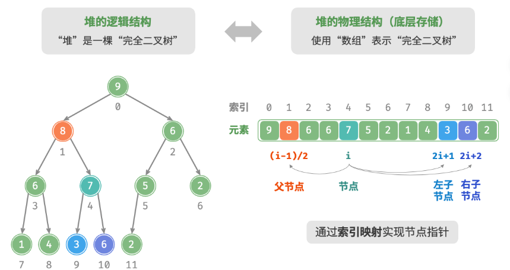

# 堆

堆（heap）是一种满足特定条件的完全二叉树，主要可分为两种类型：
+ 小顶堆：任意节点的值 ≤ 其子节点的值。
+ 大顶堆：任意节点的值 ≥ 其子节点的值。

> 将二叉树的根节点称为“堆顶”，将底层最靠右的节点称为“堆底”

## 堆常用操作

堆通常用于实现优先队列，大顶堆相当于元素按从大到小的顺序出队的优先队列

| 方法名     | 描述                                     | 时间复杂度 |
| ---------- | ---------------------------------------- | ---------- |
| push()     | 元素入堆                                 | $O(\log n)$ |
| pop()      | 堆顶元素出堆                             | $O(\log n)$ |
| peek()     | 访问堆顶元素（对于大/小顶堆分别为最大/小值） | $O(1)$      |
| size()     | 获取堆的元素数量                         | $O(1)$      |
| isEmpty()  | 判断堆是否为空                           | $O(1)$      |

```java
/* 初始化堆 */
// 初始化小顶堆
Queue<Integer> minHeap = new PriorityQueue<>();
// 初始化大顶堆（使用 lambda 表达式修改 Comparator 即可）
Queue<Integer> maxHeap = new PriorityQueue<>((a, b) -> b - a);

/* 元素入堆 */
maxHeap.offer(1);
maxHeap.offer(3);
maxHeap.offer(2);
maxHeap.offer(5);
maxHeap.offer(4);

/* 获取堆顶元素 */
int peek = maxHeap.peek(); // 5

/* 堆顶元素出堆 */
// 出堆元素会形成一个从大到小的序列
peek = maxHeap.poll(); // 5
peek = maxHeap.poll(); // 4
peek = maxHeap.poll(); // 3
peek = maxHeap.poll(); // 2
peek = maxHeap.poll(); // 1

/* 获取堆大小 */
int size = maxHeap.size();

/* 判断堆是否为空 */
boolean isEmpty = maxHeap.isEmpty();

/* 输入列表并建堆 */
minHeap = new PriorityQueue<>(Arrays.asList(1, 3, 2, 5, 4));
```

### 堆的实现

#### 堆的存储与表示



```java
/* 获取左子节点的索引 */
int left(int i) {
    return 2 * i + 1;
}

/* 获取右子节点的索引 */
int right(int i) {
    return 2 * i + 2;
}

/* 获取父节点的索引 */
int parent(int i) {
    return (i - 1) / 2; // 向下整除
}
/* 访问堆顶元素 */
int peek() {
    return maxHeap.get(0);
}
```

#### 入堆

给定元素 val ，将其添加到堆底，由于 val 可能大于堆中其他元素，堆的成立条件可能已被破坏，因此需要修复从插入节点到根节点的路径上的各个节点，这个操作被称为堆化。
考虑从入堆节点开始，从底至顶执行堆化。比较插入节点与其父节点的值，如果插入节点更大，则将它们交换。然后继续执行此操作，从底至顶修复堆中的各个节点，直至越过根节点或遇到无须交换的节点时结束。

```java
/* 元素入堆 */
void push(int val) {
    // 添加节点
    maxHeap.add(val);
    // 从底至顶堆化
    siftUp(size() - 1);
}

/* 从节点 i 开始，从底至顶堆化 */
void siftUp(int i) {
    while (true) {
        // 获取节点 i 的父节点
        int p = parent(i);
        // 当“越过根节点”或“节点无须修复”时，结束堆化
        if (p < 0 || maxHeap.get(i) <= maxHeap.get(p))
            break;
        // 交换两节点
        swap(i, p);
        // 循环向上堆化
        i = p;
    }
}
```

#### 出堆

堆顶元素是二叉树的根节点，即列表首元素。如果直接从列表中删除首元素，那么二叉树中所有节点的索引都会发生变化，这将使得后续使用堆化进行修复变得困难。为了尽量减少元素索引的变动，采用以下操作步骤：
1. 最交换堆顶元素与堆底元素（交换根节点与右叶节点）。
2. 交换完成后，将堆底从列表中删除。
3. 从根节点开始，从顶至底执行堆化。

```java
/* 元素出堆 */
int pop() {
    // 判空处理
    if (isEmpty())
        throw new IndexOutOfBoundsException();
    // 交换根节点与最右叶节点（交换首元素与尾元素）
    swap(0, size() - 1);
    // 删除节点
    int val = maxHeap.remove(size() - 1);
    // 从顶至底堆化
    siftDown(0);
    // 返回堆顶元素
    return val;
}

/* 从节点 i 开始，从顶至底堆化 */
void siftDown(int i) {
    while (true) {
      //最大堆
        // 判断节点 i, l, r 中值最大的节点，记为 ma
        int l = left(i), r = right(i), ma = i;
        if (l < size() && maxHeap.get(l) > maxHeap.get(ma))
            ma = l;
        if (r < size() && maxHeap.get(r) > maxHeap.get(ma))
            ma = r;
        // 若节点 i 最大或索引 l, r 越界，则无须继续堆化，跳出
        if (ma == i)
            break;
        // 交换两节点
        swap(i, ma);
        // 循环向下堆化
        i = ma;
    }
}
```

## 建堆操作

### 借助入堆操作实现

首先创建一个空堆，然后遍历列表，依次对每个元素执行“入堆操作”，即先将元素添加至堆的尾部，再对该元素执行“从底至顶”堆化。
每当一个元素入堆，堆的长度就加一。由于节点是从顶到底依次被添加进二叉树的，因此堆是“自上而下”构建的。
设元素数量为 $n$ ，每个元素的入堆操作使用$O(\log n)$时间，因此该建堆方法的时间复杂度为 $O(n \log n)$。

### 借助遍历堆化实现

将列表所有元素原封不动地添加到堆中。倒序遍历堆（层序遍历的倒序），依次对每个非叶节点执行“从顶至底堆化”。每当堆化一个节点后，以该节点为根节点的子树就形成一个合法的子堆。而由于是倒序遍历，因此堆是“自下而上”构建的。
之所以选择倒序遍历，是因为这样能够保证当前节点之下的子树已经是合法的子堆，这样堆化当前节点才是有效的。
由于叶节点没有子节点，因此它们天然就是合法的子堆，无须堆化。

```java
/* 构造方法，根据输入列表建堆 */
MaxHeap(List<Integer> nums) {
    // 将列表元素原封不动添加进堆
    maxHeap = new ArrayList<>(nums);
    // 堆化除叶节点以外的其他所有节点
    for (int i = parent(size() - 1); i >= 0; i--) {
        siftDown(i);
    }
}
```

### 复杂度分析

假设完全二叉树的节点数量为 $n$，则叶节点数量为 $(n + 1)/2$，其中 $/$ 为向下整除。因此需要堆化的节点数量为 $(n - 1)/2$。  
在从顶至底堆化的过程中，每个节点最多堆化到叶节点，因此最大迭代次数为二叉树高度 $\log n$。  

将上述两者相乘，可得到建堆过程的时间复杂度为 $O(n \log n)$。但这个估算结果并不准确，因为没有考虑到二叉树底层节点数量远多于顶层节点的性质。

假设给定一个节点数量为 $n$、高度为 $h$ 的 “完美二叉树”：


节点“从顶至底堆化”的最大迭代次数等于该节点到叶节点的距离，而该距离正是“节点高度”。因此可以对各层的“节点数量 × 节点高度”求和，得到所有节点的堆化迭代次数的总和。  

$$ T(h) = 2^0 h + 2^1 (h - 1) + 2^2 (h - 2) + \cdots + 2^{(h-1)} \times 1 = O(2^h) $$  

高度为 $h$ 的完美二叉树的节点数量为 $n = 2^{h+1} - 1$，易得复杂度为 $O(2^h) = O(n)$。以上推算表明，输入列表并建堆的时间复杂度为 $O(n)$。  

## top-k问题

用堆实现：
1. 初始化一个小顶堆，其堆顶元素最小。  
2. 先将数组的前 $k$ 个元素依次入堆。  
3. 从第 $k + 1$ 个元素开始，若当前元素大于堆顶元素，则将堆顶元素出堆，并将当前元素入堆。  
4. 遍历完成后，堆中保存的就是最大的 $k$ 个元素。

```java
/* 基于堆查找数组中最大的 k 个元素 */
Queue<Integer> topKHeap(int[] nums, int k) {
    // 初始化小顶堆
    Queue<Integer> heap = new PriorityQueue<Integer>();
    // 将数组的前 k 个元素入堆
    for (int i = 0; i < k; i++) {
        heap.offer(nums[i]);
    }
    // 从第 k+1 个元素开始，保持堆的长度为 k
    for (int i = k; i < nums.length; i++) {
        // 若当前元素大于堆顶元素，则将堆顶元素出堆、当前元素入堆
        if (nums[i] > heap.peek()) {
            heap.poll();
            heap.offer(nums[i]);
        }
    }
    return heap;
}
```

总共执行了 $n$ 轮入堆和出堆，堆的最大长度为 $k$，因此时间复杂度为 $O(n \log k)$。该方法的效率很高，当 $k$ 较小时，时间复杂度趋向 $O(n)$；当 $k$ 较大时，时间复杂度不会超过 $O(n \log n)$。  

该方法适用于动态数据流的使用场景。在不断加入数据时，可以持续维护堆内的元素，从而实现最大的 $k$ 个元素的动态更新。  


