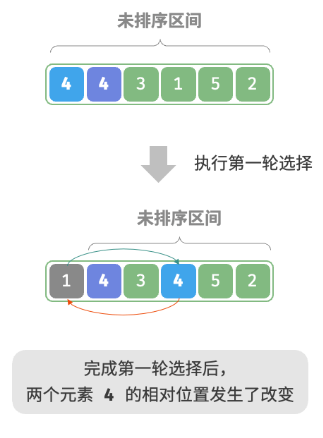
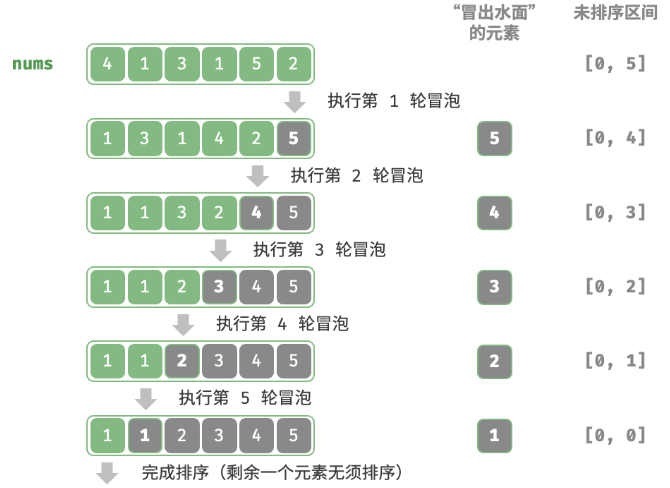
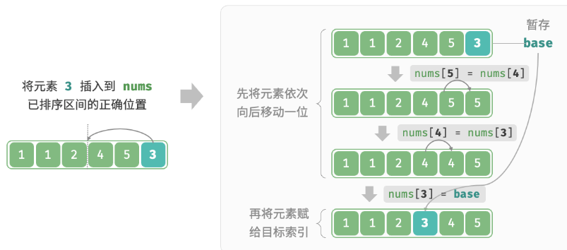
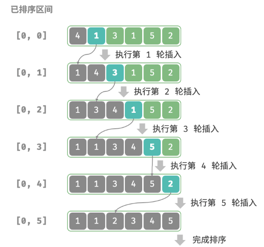
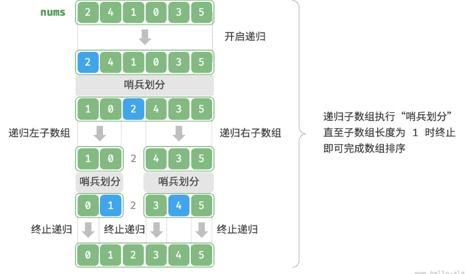
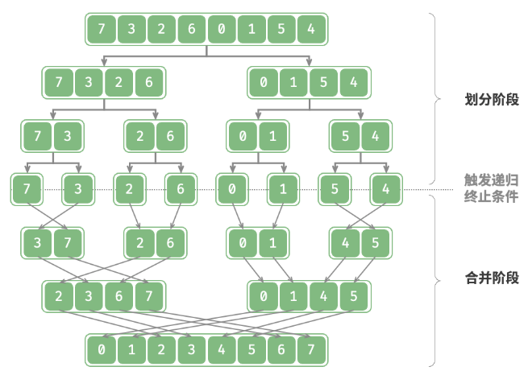

# 排序

## 选择

开启一个循环，每轮从未排序区间选择最小的元素，将其放到已排序区间的末尾。

1. 初始状态下，所有元素未排序，即未排序（索引）区间为 $[0, n - 1]$。  
2. 选取区间 $[0, n - 1]$ 中的最小元素，将其与索引 0 处的元素交换。完成后，数组前 1 个元素已排序。  
3. 选取区间 $[1, n - 1]$ 中的最小元素，将其与索引 1 处的元素交换。完成后，数组前 2 个元素已排序。  
4. 以此类推。经过 $n - 1$ 轮选择与交换后，数组前 $n - 1$ 个元素已排序。  
5. 仅剩的一个元素必定是最大元素，无须排序，因此数组排序完成。

时间复杂度：$O(n^2)$ ，空间复杂度：$O(1)$。
是不稳定排序，因为在交换时，可能会改变相等元素的相对顺序。




```java
/* 选择排序 */
void selectionSort(int[] nums) {
    int n = nums.length;
    // 外循环：未排序区间为 [i, n-1]
    for (int i = 0; i < n - 1; i++) {
        // 内循环：找到未排序区间内的最小元素
        int k = i;
        for (int j = i + 1; j < n; j++) {
            if (nums[j] < nums[k])
                k = j; // 记录最小元素的索引
        }
        // 将该最小元素与未排序区间的首个元素交换
        int temp = nums[i];
        nums[i] = nums[k];
        nums[k] = temp;
    }
}
```

## 冒泡

从数组最左端开始向右遍历，依次比较相邻元素大小，如果“左元素 > 右元素”就交换二者。遍历完成后，最大的元素会被移动到数组的最右端。

  

时间复杂度：$O(n^2)$ ，空间复杂度：$O(1)$。
是稳定排序。

```java
/* 冒泡排序 */
void bubbleSort(int[] nums) {
    // 外循环：未排序区间为 [0, i]
    for (int i = nums.length - 1; i > 0; i--) {
        // 内循环：将未排序区间 [0, i] 中的最大元素交换至该区间的最右端
        for (int j = 0; j < i; j++) {
            if (nums[j] > nums[j + 1]) {
                // 交换 nums[j] 与 nums[j + 1]
                int tmp = nums[j];
                nums[j] = nums[j + 1];
                nums[j + 1] = tmp;
            }
        }
    }
}
```

如果某轮“冒泡”中没有执行任何交换操作，说明数组已经完成排序，可直接返回结果。因此，可以增加一个标志位 flag 来监测这种情况

```java
/* 冒泡排序（标志优化） */
void bubbleSortWithFlag(int[] nums) {
    // 外循环：未排序区间为 [0, i]
    for (int i = nums.length - 1; i > 0; i--) {
        boolean flag = false; // 初始化标志位
        // 内循环：将未排序区间 [0, i] 中的最大元素交换至该区间的最右端
        for (int j = 0; j < i; j++) {
            if (nums[j] > nums[j + 1]) {
                // 交换 nums[j] 与 nums[j + 1]
                int tmp = nums[j];
                nums[j] = nums[j + 1];
                nums[j + 1] = tmp;
                flag = true; // 记录交换元素
            }
        }
        if (!flag)
            break; // 此轮“冒泡”未交换任何元素，直接跳出
    }
}
```

## 插入

在未排序区间选择一个基准元素，将该元素与其左侧已排序区间的元素逐一比较大小，并将该元素插入到正确的位置。

时间复杂度：$O(n^2)$ ，空间复杂度：$O(1)$。
是稳定排序。

尽管插入排序的时间复杂度更高，但在数据量较小的情况下，插入排序通常更快。速排序这类$O(\log n)$的算法属于基于分治策略的排序算法，往往包含更多单元计算操作。而在数据量较小时，$n^2$和$n \log n$ 的数值比较接近，复杂度不占主导地位，每轮中的单元操作数量起到决定性作用。
Java的内置排序函数采用了插入排序，大致思路为：对于长数组，采用基于分治策略的排序算法，例如快速排序；对于短数组，直接使用插入排序。


虽然冒泡排序、选择排序和插入排序的时间复杂度都为 $O(n^2)$，但在实际情况中，插入排序的使用频率显著高于冒泡排序和选择排序
- 冒泡排序基于元素交换实现，需要借助一个临时变量，共涉及 3 个单元操作；插入排序基于元素赋值实现，仅需 1 个单元操作。因此，冒泡排序的计算开销通常比插入排序更高。  
- 选择排序在任何情况下的时间复杂度都为 $O(n^2)$。如果给定一组部分有序的数据，插入排序通常比选择排序效率更高。  
- 选择排序不稳定，无法应用于多级排序。  






```java
/* 插入排序 */
void insertionSort(int[] nums) {
    // 外循环：已排序区间为 [0, i-1]
    for (int i = 1; i < nums.length; i++) {
        int base = nums[i], j = i - 1;
        // 内循环：将 base 插入到已排序区间 [0, i-1] 中的正确位置
        while (j >= 0 && nums[j] > base) {
            nums[j + 1] = nums[j]; // 将 nums[j] 向右移动一位
            j--;
        }
        nums[j + 1] = base;        // 将 base 赋值到正确位置
    }
}
```

## 快排

选择数组中的某个元素作为“基准数”，将所有小于基准数的元素移到其左侧，而大于基准数的元素移到其右侧。

1. 选取数组最左端元素作为基准数，初始化两个指针 `i` 和 `j` 分别指向数组的两端。  
2. 设置一个循环，在每轮中使用 `i`（`j`）分别寻找第一个比基准数大（小）的元素，然后交换这两个元素。  
3. 循环执行步骤 2. ，直到 `i` 和 `j` 相遇时停止，最后将基准数交换至两个子数组的分界线。  

哨兵划分完成后，原数组被划分成三部分：左子数组、基准数、右子数组，且满足“左子数组任意元素 $\leq$ 基准数 $\leq$ 右子数组任意元素”。因此接下来只需对这两个子数组进行排序。  

时间复杂度为 $O(n\log n)$，在平均情况下，哨兵划分的递归层数为 $\log n$，每层中的总循环数为 $n$，总体使用 $O(n\log n)$ 时间。在最差情况下，每轮哨兵划分操作都将长度为 $n$ 的数组划分为长度为 $0$ 和 $n - 1$ 的两个子数组，此时递归层数达到 $n$，每层中的循环数为 $n$，总体使用 $O(n^2)$ 时间。
空间复杂度为 $O(n)$，在输入数组完全倒序的情况下，达到最差递归深度 $n$，使用 $O(n)$ 栈帧空间。排序操作是在原数组上进行的，未借助额外数组。 
非稳定排序：在哨兵划分的最后一步，基准数可能会被交换至相等元素的右侧。 



```java
/* 元素交换 */
void swap(int[] nums, int i, int j) {
    int tmp = nums[i];
    nums[i] = nums[j];
    nums[j] = tmp;
}

/* 哨兵划分 */
int partition(int[] nums, int left, int right) {
    // 以 nums[left] 为基准数
    int i = left, j = right;
    while (i < j) {
        while (i < j && nums[j] >= nums[left])
            j--;          // 从右向左找首个小于基准数的元素
        while (i < j && nums[i] <= nums[left])
            i++;          // 从左向右找首个大于基准数的元素
        swap(nums, i, j); // 交换这两个元素
    }
    swap(nums, i, left);  // 将基准数交换至两子数组的分界线
    return i;             // 返回基准数的索引
}

/* 快速排序 */
void quickSort(int[] nums, int left, int right) {
    // 子数组长度为 1 时终止递归
    if (left >= right)
        return;
    // 哨兵划分
    int pivot = partition(nums, left, right);
    // 递归左子数组、右子数组
    quickSort(nums, left, pivot - 1);
    quickSort(nums, pivot + 1, right);
}
```

虽然快排的平均时间复杂度与 归并 、堆排序相同，但是通常快排的效率更高：
- 出现最差情况的概率很低：虽然快速排序的最差时间复杂度为 $O(n^2)$，没有归并排序稳定，但在绝大多数情况下，快速排序能在 $O(n\log n)$ 的时间复杂度下运行。
- 缓存使用效率高：在执行哨兵划分操作时，系统可将整个子数组加载到缓存，因此访问元素的效率较高。而像“堆排序”这类算法需要跳跃式访问元素，从而缺乏这一特性。
- 复杂度的常数系数小：在上述三种算法中，快速排序的比较、赋值、交换等操作的总数量最少。这与“插入排序”比“冒泡排序”更快的原因类似。 

> 基准数优化

快速排序在某些输入下的时间效率可能降低。假设输入数组是完全倒序的，由于选择最左端元素作为基准数，那么在哨兵划分完成后，基准数被交换至数组最右端，导致左子数组长度为 $n - 1$、右子数组长度为 $0$。如此递归下去，每轮哨兵划分后都有一个子数组的长度为 $0$，分治策略失效，快速排序退化为“冒泡排序”的近似形式。  
为了尽量避免这种情况发生，可以优化哨兵划分中的基准数的选取策略。例如可以随机选取一个元素作为基准数。然而，如果运气不佳，每次都选到不理想的基准数，效率仍然不尽如人意。    
为了进一步改进，可以在数组中选取三个候选元素（通常为数组的首、尾、中点元素），并将这三个候选元素的中位数作为基准数。这样一来，基准数“既不太小也不太大”的概率将大幅提升。当然还可以选取更多候选元素，以进一步提高算法的稳健性。采用这种方法后，时间复杂度劣化至 $O(n^2)$ 的概率大大降低。

```java
/* 选取三个候选元素的中位数 */
int medianThree(int[] nums, int left, int mid, int right) {
    int l = nums[left], m = nums[mid], r = nums[right];
    if ((l <= m && m <= r) || (r <= m && m <= l))
        return mid; // m 在 l 和 r 之间
    if ((m <= l && l <= r) || (r <= l && l <= m))
        return left; // l 在 m 和 r 之间
    return right;
}

/* 哨兵划分（三数取中值） */
int partition(int[] nums, int left, int right) {
    // 选取三个候选元素的中位数
    int med = medianThree(nums, left, (left + right) / 2, right);
    // 将中位数交换至数组最左端
    swap(nums, left, med);
    // 以 nums[left] 为基准数
    int i = left, j = right;
    while (i < j) {
        while (i < j && nums[j] >= nums[left])
            j--;          // 从右向左找首个小于基准数的元素
        while (i < j && nums[i] <= nums[left])
            i++;          // 从左向右找首个大于基准数的元素
        swap(nums, i, j); // 交换这两个元素
    }
    swap(nums, i, left);  // 将基准数交换至两子数组的分界线
    return i;             // 返回基准数的索引
}
```

> 递归深度优化

在某些输入下，快速排序可能占用空间较多。以完全有序的输入数组为例，设递归中的子数组长度为 $m$，每轮哨兵划分操作都将产生长度为 $0$ 的左子数组和长度为 $m - 1$ 的右子数组，这意味着每一层递归调用减少的问题规模非常小（只减少一个元素），递归树的高度会达到 $n - 1$，此时需要占用 $O(n)$ 大小的栈帧空间。  

为了防止栈帧空间的累积，可以在每轮哨兵排序完成后，比较两个子数组的长度，仅对较短的子数组进行递归。由于较短子数组的长度不会超过 $n/2$，因此这种方法能确保递归深度不超过 $\log n$，从而将最差空间复杂度优化至 $O(\log n)$。

```java
/* 快速排序（递归深度优化） */
void quickSort(int[] nums, int left, int right) {
    // 子数组长度为 1 时终止
    while (left < right) {
        // 哨兵划分操作
        int pivot = partition(nums, left, right);
        // 对两个子数组中较短的那个执行快速排序
        if (pivot - left < right - pivot) {
            quickSort(nums, left, pivot - 1); // 递归排序左子数组
            left = pivot + 1; // 剩余未排序区间为 [pivot + 1, right]
        } else {
            quickSort(nums, pivot + 1, right); // 递归排序右子数组
            right = pivot - 1; // 剩余未排序区间为 [left, pivot - 1]
        }
    }
}
```

## 归并

归并排序是一种基于分治策略的排序算法
+ 划分阶段：通过递归不断地将数组从中点处分开，将长数组的排序问题转换为短数组的排序问题。
+ 合并阶段：当子数组长度为 1 时终止划分，开始合并，持续地将左右两个较短的有序数组合并为一个较长的有序数组，直至结束。

归并和二叉树的后序遍历顺序是一致的：先递归左子数组，再递归右子数组，最后处理合并。



时间复杂度为 $O(n \log n)$：划分产生高度为 $\log n$ 的递归树，每层合并的总操作数量为 $n$，因此总体时间复杂度为 $O(n \log n)$。
空间复杂度：$O(n)$。
稳定排序。


```java
/* 合并左子数组和右子数组 */
void merge(int[] nums, int left, int mid, int right) {
    // 左子数组区间为 [left, mid], 右子数组区间为 [mid+1, right]
    // 创建一个临时数组 tmp ，用于存放合并后的结果
    int[] tmp = new int[right - left + 1];
    // 初始化左子数组和右子数组的起始索引
    int i = left, j = mid + 1, k = 0;
    // 当左右子数组都还有元素时，进行比较并将较小的元素复制到临时数组中
    while (i <= mid && j <= right) {
        if (nums[i] <= nums[j])
            tmp[k++] = nums[i++];
        else
            tmp[k++] = nums[j++];
    }
    // 将左子数组和右子数组的剩余元素复制到临时数组中
    while (i <= mid) {
        tmp[k++] = nums[i++];
    }
    while (j <= right) {
        tmp[k++] = nums[j++];
    }
    // 将临时数组 tmp 中的元素复制回原数组 nums 的对应区间
    for (k = 0; k < tmp.length; k++) {
        nums[left + k] = tmp[k];
    }
}

/* 归并排序 */
void mergeSort(int[] nums, int left, int right) {
    // 终止条件
    if (left >= right)
        return; // 当子数组长度为 1 时终止递归
    // 划分阶段
    int mid = left + (right - left) / 2; // 计算中点
    mergeSort(nums, left, mid); // 递归左子数组
    mergeSort(nums, mid + 1, right); // 递归右子数组
    // 合并阶段
    merge(nums, left, mid, right);
}
```

## 堆排序

可以使用之前建堆和元素出堆操作：输入数组并建立小顶堆，此时最小元素位于堆顶。不断执行出堆操作，依次记录出堆元素，即可得到从小到大排序的序列。但需要借助一个额外数组来保存弹出的元素，比较浪费空间。

堆排序流程：


