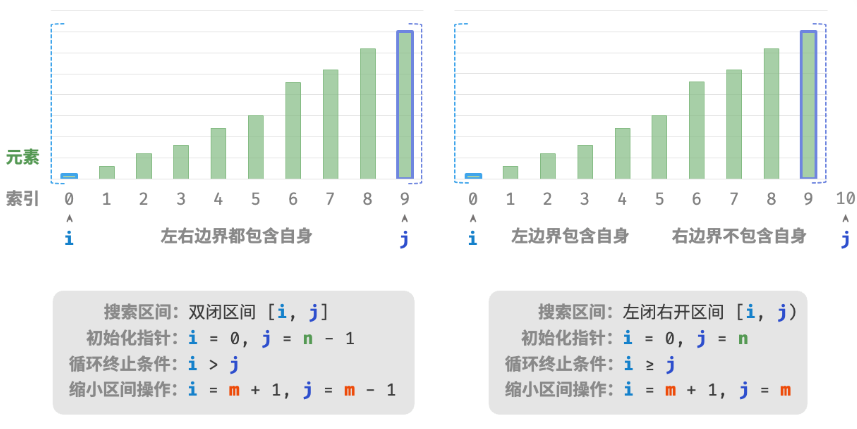
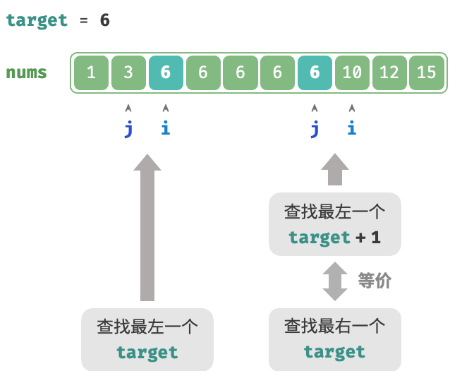
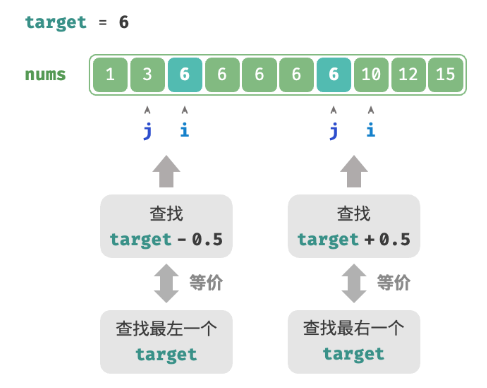
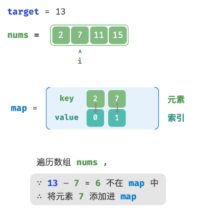

# 搜索

## 二分查找

基于分治策略的高效搜索算法。它利用数据的有序性，每轮缩小一半搜索范围，直至找到目标元素或搜索区间为空为止。

时间复杂度：$O(\log n)$。
空间复杂度：$O(1)$。

### 实现

```java
/* 二分查找（双闭区间） */
int binarySearch(int[] nums, int target) {
    // 初始化双闭区间 [0, n-1] ，即 i, j 分别指向数组首元素、尾元素
    int i = 0, j = nums.length - 1;
    // 循环，当搜索区间为空时跳出（当 i > j 时为空）
    while (i <= j) {
        int m = i + (j - i) / 2; // 计算中点索引 m
        if (nums[m] < target) // 此情况说明 target 在区间 [m+1, j] 中
            i = m + 1;
        else if (nums[m] > target) // 此情况说明 target 在区间 [i, m-1] 中
            j = m - 1;
        else // 找到目标元素，返回其索引
            return m;
    }
    // 未找到目标元素，返回 -1
    return -1;
}
```

> 在计算m中，由于 $ i $ 和 $ j $ 都是 `int` 类型，因此 $ i + j $ 可能会超出 `int` 类型的取值范围。为了避免大数越界，通常采用公式 $ m = \lfloor i + \frac{(j - i)}{2} \rfloor $ 来计算中点。

除了上述双闭区间外，常见的区间表示还有“左闭右开”区间，定义为 $[0, n)$。在该表示下，区间 $[i, j)$ 在 $i = j$ 时为空。

```java
/* 二分查找（左闭右开区间） */
int binarySearchLCRO(int[] nums, int target) {
    // 初始化左闭右开区间 [0, n) ，即 i, j 分别指向数组首元素、尾元素+1
    int i = 0, j = nums.length;
    // 循环，当搜索区间为空时跳出（当 i = j 时为空）
    while (i < j) {
        int m = i + (j - i) / 2; // 计算中点索引 m
        if (nums[m] < target) // 此情况说明 target 在区间 [m+1, j) 中
            i = m + 1;
        else if (nums[m] > target) // 此情况说明 target 在区间 [i, m) 中
            j = m;
        else // 找到目标元素，返回其索引
            return m;
    }
    // 未找到目标元素，返回 -1
    return -1;
}
```


> 由于“双闭区间”表示中的左右边界都被定义为闭区间，因此通过指针和指针 缩小区间的操作也是对称的。这样更不容易出错，因此一般建议采用“双闭区间”的写法。

### 优点和缺陷  

二分查找的时间效率高且无须额外空间。相较于需要借助额外空间的搜索算法（例如哈希查找），二分查找更加节省空间。  

缺点：  
- 二分查找仅适用于有序数据。若输入数据无序，为了使用二分查找而专门进行排序，得不偿失。因为排序算法的时间复杂度通常为 $O(n \log n)$，比线性查找和二分查找都更高。
- 二分查找仅适用于数组。二分查找需要跳跃式（非连续地）访问元素，而在链表中执行跳跃式访问的效率较低，因此不适合应用在链表或基于链表实现的数据结构。  
- 小数据量下，线性查找性能更佳。在线性查找中，每轮只需 1 次判断操作；而在二分查找中，需要 1 次加法、1 次除法、1～3 次判断操作、1 次加法（减法），共 4～6 个单元操作；因此，当数据量 $n$ 较小时，线性查找反而比二分查找更快。


## 二分查找插入点

> 给定一个长度为n的有序数组 nums 和一个元素 target ，将 target 插入数组 nums 中，并保持其有序性。若数组中已存在元素 target ，则插入到其左方。返回插入后 target 在数组中的索引

```java
/* 二分查找插入点（无重复元素） */
int binarySearchInsertionSimple(int[] nums, int target) {
    int i = 0, j = nums.length - 1; // 初始化双闭区间 [0, n-1]
    while (i <= j) {
        int m = i + (j - i) / 2; // 计算中点索引 m
        if (nums[m] < target) {
            i = m + 1; // target 在区间 [m+1, j] 中
        } else if (nums[m] > target) {
            j = m - 1; // target 在区间 [i, m-1] 中
        } else {
            return m; // 找到 target ，返回插入点 m
        }
    }
    // 未找到 target ，返回插入点 i
    return i;
}
```

1. 当数组中包含 target 时，插入点的索引是否是该元素的索引？

将 target 插入到相等元素的左边，这意味着新插入的 target 替换了原来 target 的位置。也就是说，当数组包含 target 时，插入点的索引就是该 target 的索引。  

2. 当数组中不存在 target 时，插入点是哪个元素的索引？

当 `nums[m] < target` 时 `i` 移动，这意味着指针 `i` 在向大于等于 target 的元素靠近。同理，指针 `j` 始终在向小于等于 target 的元素靠近。  
因此二分结束时一定有：`i` 指向首个大于 target 的元素，`j` 指向首个小于 target 的元素。因此当数组不包含 target 时，插入索引为 `i` 。

> 存在重复元素的情况：

执行二分查找，得到任意一个 target 的索引，记为 K。从索引 K开始，向左进行线性遍历，当找到最左边的 target 时返回。时间复杂度为 $O(n)$，当数组中存在很多target时，线性遍历的效率较低。优化：
+ 当 `nums[m] < target` 或 `nums[m] > target` 时，说明还没有找到 `target`，因此采用普通二分查找的缩小区间操作，从而使指针 `i` 和 `j` 向 `target` 靠近。  
+ 当 `nums[m] == target` 时，说明小于 `target` 的元素在区间 `[i, m - 1]` 中，因此采用 `j = m - 1` 来缩小区间，从而使指针 `j` 向小于 `target` 的元素靠近。  

```java
/* 二分查找插入点（存在重复元素） */
int binarySearchInsertion(int[] nums, int target) {
    int i = 0, j = nums.length - 1; // 初始化双闭区间 [0, n-1]
    while (i <= j) {
        int m = i + (j - i) / 2; // 计算中点索引 m
        if (nums[m] < target) {
            i = m + 1; // target 在区间 [m+1, j] 中
        } else if (nums[m] > target) {
            j = m - 1; // target 在区间 [i, m-1] 中
        } else {
            j = m - 1; // 首个小于 target 的元素在区间 [i, m-1] 中
        }
    }
    // 返回插入点 i
    return i;
}
```

## 二分查找边界

> 给定一个长度为 n的有序数组 nums ，其中可能包含重复元素。返回数组中最左一个元素 target 的索引。若数组中不包含该元素，则返回 -1。

考虑通过查找插入点的函数实现查找左边界。数组中可能不包含 `target` ，这种情况可能导致:  
- 插入点的索引 `i` 越界。  
- 元素 `nums[i]` 与 `target` 不相等。  

当遇到以上两种情况时，直接返回 `-1` 即可。

>  查找左边界

```java
/* 二分查找最左一个 target */
int binarySearchLeftEdge(int[] nums, int target) {
    // 等价于查找 target 的插入点
    int i = binary_search_insertion.binarySearchInsertion(nums, target);
    // 未找到 target ，返回 -1
    if (i == nums.length || nums[i] != target) {
        return -1;
    }
    // 找到 target ，返回索引 i
    return i;
}
```

>  查找右边界

可以利用查找最左元素的函数来查找最右元素：将查找最右一个 target 转化为查找最左一个 target + 1。



```java
/* 二分查找最右一个 target */
int binarySearchRightEdge(int[] nums, int target) {
    // 转化为查找最左一个 target + 1
    int i = binarySearchLeftEdge(nums, target + 1);
    // j 指向最右一个 target ，i 指向首个大于 target 的元素
    int j = i - 1;
    // 未找到 target ，返回 -1
    if (j == -1 || nums[j] != target) {
        return -1;
    }
    // 找到 target ，返回索引 j
    return j;
}
```

> 转化为查找元素

当数组不包含 `target` 时，最终 `i` 和 `j` 会分别指向首个大于、小于 `target` 的元素。  
因此可以构造一个数组中不存在的元素，用于查找左右边界。  
- 查找最左一个 `target` ：可以转化为查找 `target - 0.5` ，并返回指针 `i` 。  
- 查找最右一个 `target` ：可以转化为查找 `target + 0.5` ，并返回指针 `j` 。  



## 哈希优化策略

在算法题中，常通过将线性查找替换为哈希查找来降低算法的时间复杂度。

> 给定一个整数数组 nums 和一个目标元素 target ，在数组中搜索“和”为 target 的两个元素，并返回它们的数组索引。返回任意一个解即可。

可以考虑双层循环，时间复杂度为 $O(n^2)$ ，空间复杂度为 $O(1)$ 。


```java
/* 方法一：暴力枚举 */
int[] twoSumBruteForce(int[] nums, int target) {
    int size = nums.length;
    // 两层循环，时间复杂度为 O(n^2)
    for (int i = 0; i < size - 1; i++) {
        for (int j = i + 1; j < size; j++) {
            if (nums[i] + nums[j] == target)
                return new int[] { i, j };
        }
    }
    return new int[0];
}
```

借助一个哈希表，键值对分别为数组元素和元素索引。循环遍历数组:



+ 判断数字 target - nums[i] 是否在哈希表中，若是，则直接返回这两个元素的索引。
+ 则将键值对 nums[i] 和索引 i 添加进哈希表。

```java
/* 方法二：辅助哈希表 */
int[] twoSumHashTable(int[] nums, int target) {
    int size = nums.length;
    // 辅助哈希表，空间复杂度为 O(n)
    Map<Integer, Integer> dic = new HashMap<>();
    // 单层循环，时间复杂度为 O(n)
    for (int i = 0; i < size; i++) {
        if (dic.containsKey(target - nums[i])) {
            return new int[] { dic.get(target - nums[i]), i };
        }
        dic.put(nums[i], i);
    }
    return new int[0];
}
```

这种借助hash表的方法，时间复杂度为 $O(n)$ ，空间复杂度为 $O(n)$ 。空间换时间。

## 搜索算法

搜索算法用于在数据结构（例如数组、链表、树或图）中搜索一个或一组满足特定条件的元素。

搜索算法可根据实现思路分为以下两类。
+ 通过遍历数据结构来定位目标元素，例如数组、链表、树和图的遍历等。
+ 利用数据组织结构或数据包含的先验信息，实现高效元素查找，例如二分查找、哈希查找和二叉搜索树查找等。

### 暴力搜索

暴力搜索通过遍历数据结构的每个元素来定位目标元素。  

- “线性搜索”适用于数组和链表等线性数据结构。
- “广度优先搜索”和“深度优先搜索”是图和树的两种遍历策略。广度优先搜索从初始节点开始逐层搜索，由近及远地访问各个节点。深度优先搜索从初始节点开始，沿着一条路径走到头，再回溯并尝试其他路径，直到遍历完整整个数据结构。  

暴力搜索的优点是简单且通用性好，无须对数据做预处理和借助额外的数据结构。  
然而，此类算法的时间复杂度为 $ O(n) $，其中 $ n $ 为元素数量，因此在数据量较大的情况下性能较差。

### 自适应搜索

自适应搜索利用数据的特有属性（例如有序性）来优化搜索过程，从而更高效地定位目标元素。  

- “二分查找”利用数据的有序性实现高效查找，仅适用于数组。  
- “哈希查找”利用哈希表将搜索数据和目标数据建立为键值对映射，从而实现查询操作。  
- “树查找”在特定的树结构（例如二叉搜索树）中，基于比较节点值来快速排除节点，从而定位目标元素。  

此类算法的优点是效率高，时间复杂度可达到 $ O(\log n) $ 甚至 $ O(1) $。  
然而，使用这些算法往往需要对数据进行预处理。例如，二分查找需要预先对数组进行排序，哈希查找和树查找都需要借助额外的数据结构，维护这些数据结构也需要额外的时间和空间开销。

