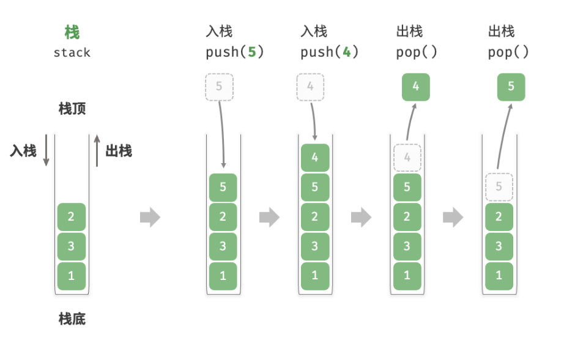
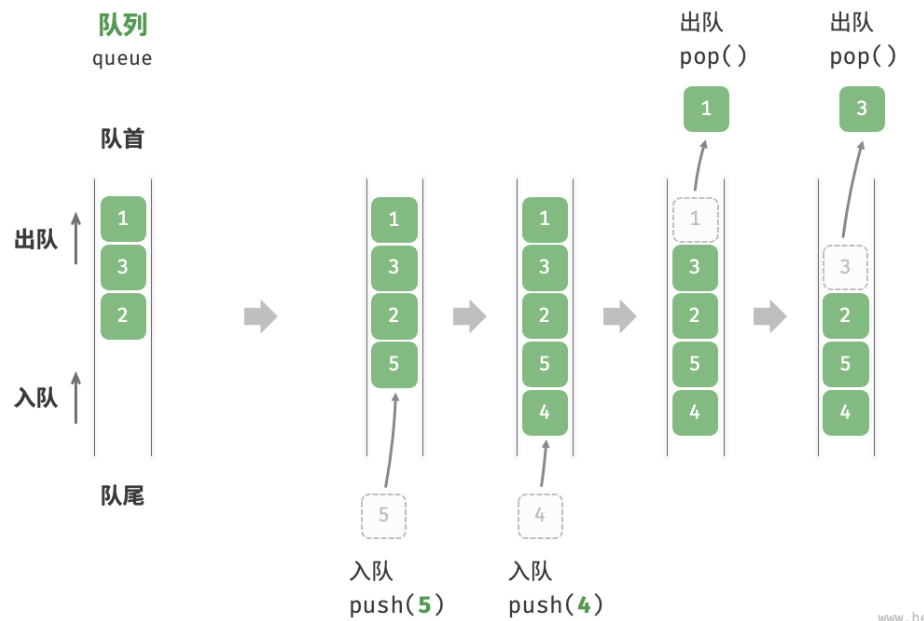
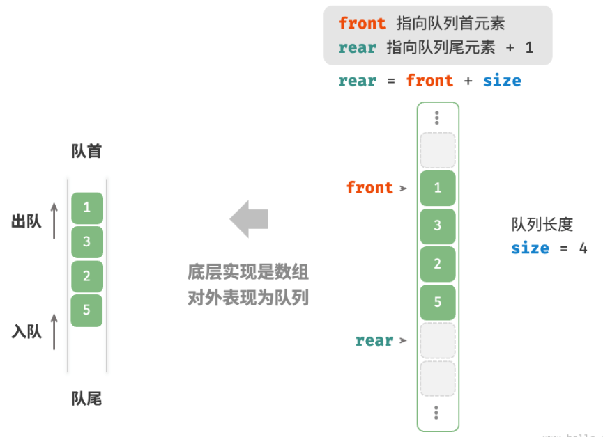
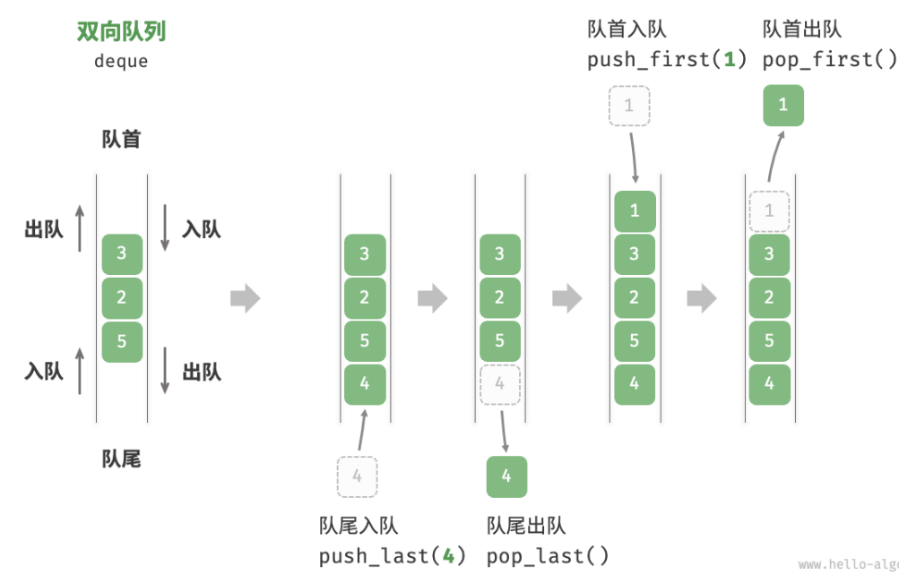
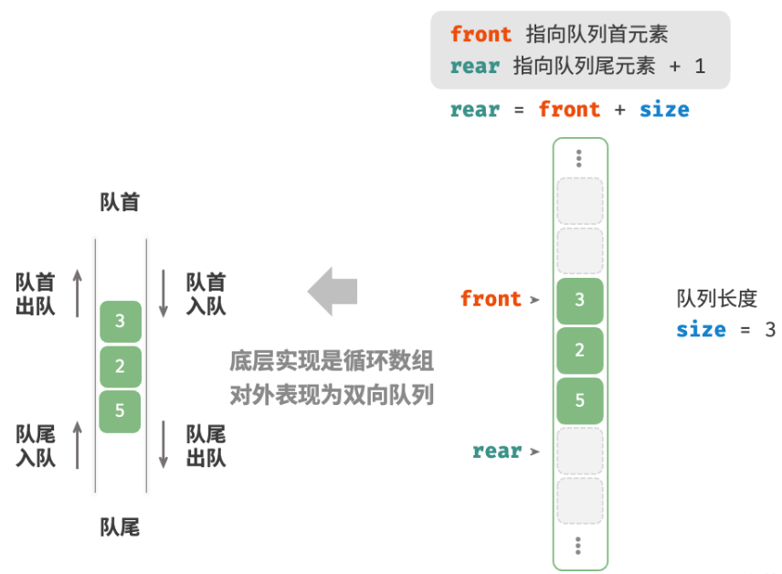

# 栈和队列

## 栈

先入后出。



常见操作：入栈push()、出栈pop()、访问栈顶元素peek()，时间复杂度都为 $O(1)$ 。

### 基于链表的实现

将元素插入链表头部，这种节点插入方法被称为“头插法”。而对于出栈操作，只需将头节点从链表中删除即可。

```java
/* 基于链表实现的栈 */
class LinkedListStack {
    private ListNode stackPeek; // 将头节点作为栈顶
    private int stkSize = 0; // 栈的长度

    public LinkedListStack() {
        stackPeek = null;
    }

    /* 获取栈的长度 */
    public int size() {
        return stkSize;
    }

    /* 判断栈是否为空 */
    public boolean isEmpty() {
        return size() == 0;
    }

    /* 入栈 */
    public void push(int num) {
        ListNode node = new ListNode(num);
        node.next = stackPeek;
        stackPeek = node;
        stkSize++;
    }

    /* 出栈 */
    public int pop() {
        int num = peek();
        stackPeek = stackPeek.next;
        stkSize--;
        return num;
    }

    /* 访问栈顶元素 */
    public int peek() {
        if (isEmpty())
            throw new IndexOutOfBoundsException();
        return stackPeek.val;
    }
}
```

### 基于动态数组实现

由于入栈的元素可能会源源不断地增加，因此使用动态数组，无须自行处理数组扩容问题

```java
/* 基于数组实现的栈 */
class ArrayStack {
    private ArrayList<Integer> stack;

    public ArrayStack() {
        // 初始化列表（动态数组）
        stack = new ArrayList<>();
    }

    /* 获取栈的长度 */
    public int size() {
        return stack.size();
    }

    /* 判断栈是否为空 */
    public boolean isEmpty() {
        return size() == 0;
    }

    /* 入栈 */
    public void push(int num) {
        stack.add(num);
    }

    /* 出栈 */
    public int pop() {
        if (isEmpty())
            throw new IndexOutOfBoundsException();
        return stack.remove(size() - 1);
    }

    /* 访问栈顶元素 */
    public int peek() {
        if (isEmpty())
            throw new IndexOutOfBoundsException();
        return stack.get(size() - 1);
    }
}
```

## 队列

先入先出。



常用操作：入队push()、出队pop()、访问队头元素peek()，时间复杂度都为 $O(1)$ 。

### 基于链表实现

```java
/* 基于链表实现的队列 */
class LinkedListQueue {
    private ListNode front, rear; // 头节点 front ，尾节点 rear
    private int queSize = 0;

    public LinkedListQueue() {
        front = null;
        rear = null;
    }

    /* 获取队列的长度 */
    public int size() {
        return queSize;
    }

    /* 判断队列是否为空 */
    public boolean isEmpty() {
        return size() == 0;
    }

    /* 入队 */
    public void push(int num) {
        // 在尾节点后添加 num
        ListNode node = new ListNode(num);
        // 如果队列为空，则令头、尾节点都指向该节点
        if (front == null) {
            front = node;
            rear = node;
        // 如果队列不为空，则将该节点添加到尾节点后
        } else {
            rear.next = node;
            rear = node;
        }
        queSize++;
    }

    /* 出队 */
    public int pop() {
        int num = peek();
        // 删除头节点
        front = front.next;
        queSize--;
        return num;
    }

    /* 访问队首元素 */
    public int peek() {
        if (isEmpty())
            throw new IndexOutOfBoundsException();
        return front.val;
    }
}
```

### 基于数组的实现

环形数组实现：



```java
/* 基于环形数组实现的队列 */
class ArrayQueue {
    private int[] nums; // 用于存储队列元素的数组
    private int front; // 队首指针，指向队首元素
    private int queSize; // 队列长度

    public ArrayQueue(int capacity) {
        nums = new int[capacity];
        front = queSize = 0;
    }

    /* 获取队列的容量 */
    public int capacity() {
        return nums.length;
    }

    /* 获取队列的长度 */
    public int size() {
        return queSize;
    }

    /* 判断队列是否为空 */
    public boolean isEmpty() {
        return queSize == 0;
    }

    /* 入队 */
    public void push(int num) {
        if (queSize == capacity()) {
            System.out.println("队列已满");
            return;
        }
        // 计算队尾指针，指向队尾索引 + 1
        // 通过取余操作实现 rear 越过数组尾部后回到头部
        int rear = (front + queSize) % capacity();
        // 将 num 添加至队尾
        nums[rear] = num;
        queSize++;
    }

    /* 出队 */
    public int pop() {
        int num = peek();
        // 队首指针向后移动一位，若越过尾部，则返回到数组头部
        front = (front + 1) % capacity();
        queSize--;
        return num;
    }

    /* 访问队首元素 */
    public int peek() {
        if (isEmpty())
            throw new IndexOutOfBoundsException();
        return nums[front];
    }
}
```

## 双向队列

允许在头部和尾部执行元素的添加或删除操作。



常见操作：将元素添加至队首push_first()、将元素添加至队尾push_last()、删除队首元素pop_first()、删除队尾元素pop_last()、访问队首元素peek_first()、访问队尾元素peek_last()，时间复杂度都为 $O(1)$

### 基于双向链表实现

```java
/* 双向链表节点 */
class ListNode {
    int val; // 节点值
    ListNode next; // 后继节点引用
    ListNode prev; // 前驱节点引用

    ListNode(int val) {
        this.val = val;
        prev = next = null;
    }
}

/* 基于双向链表实现的双向队列 */
class LinkedListDeque {
    private ListNode front, rear; // 头节点 front ，尾节点 rear
    private int queSize = 0; // 双向队列的长度

    public LinkedListDeque() {
        front = rear = null;
    }

    /* 获取双向队列的长度 */
    public int size() {
        return queSize;
    }

    /* 判断双向队列是否为空 */
    public boolean isEmpty() {
        return size() == 0;
    }

    /* 入队操作 */
    private void push(int num, boolean isFront) {
        ListNode node = new ListNode(num);
        // 若链表为空，则令 front 和 rear 都指向 node
        if (isEmpty())
            front = rear = node;
        // 队首入队操作
        else if (isFront) {
            // 将 node 添加至链表头部
            front.prev = node;
            node.next = front;
            front = node; // 更新头节点
        // 队尾入队操作
        } else {
            // 将 node 添加至链表尾部
            rear.next = node;
            node.prev = rear;
            rear = node; // 更新尾节点
        }
        queSize++; // 更新队列长度
    }

    /* 队首入队 */
    public void pushFirst(int num) {
        push(num, true);
    }

    /* 队尾入队 */
    public void pushLast(int num) {
        push(num, false);
    }

    /* 出队操作 */
    private int pop(boolean isFront) {
        if (isEmpty())
            throw new IndexOutOfBoundsException();
        int val;
        // 队首出队操作
        if (isFront) {
            val = front.val; // 暂存头节点值
            // 删除头节点
            ListNode fNext = front.next;
            if (fNext != null) {
                fNext.prev = null;
                front.next = null;
            }
            front = fNext; // 更新头节点
        // 队尾出队操作
        } else {
            val = rear.val; // 暂存尾节点值
            // 删除尾节点
            ListNode rPrev = rear.prev;
            if (rPrev != null) {
                rPrev.next = null;
                rear.prev = null;
            }
            rear = rPrev; // 更新尾节点
        }
        queSize--; // 更新队列长度
        return val;
    }

    /* 队首出队 */
    public int popFirst() {
        return pop(true);
    }

    /* 队尾出队 */
    public int popLast() {
        return pop(false);
    }

    /* 访问队首元素 */
    public int peekFirst() {
        if (isEmpty())
            throw new IndexOutOfBoundsException();
        return front.val;
    }

    /* 访问队尾元素 */
    public int peekLast() {
        if (isEmpty())
            throw new IndexOutOfBoundsException();
        return rear.val;
    }
}
```

### 基于数组实现

基于循环数组实现：



```java
/* 基于环形数组实现的双向队列 */
class ArrayDeque {
    private int[] nums; // 用于存储双向队列元素的数组
    private int front; // 队首指针，指向队首元素
    private int queSize; // 双向队列长度

    /* 构造方法 */
    public ArrayDeque(int capacity) {
        this.nums = new int[capacity];
        front = queSize = 0;
    }

    /* 获取双向队列的容量 */
    public int capacity() {
        return nums.length;
    }

    /* 获取双向队列的长度 */
    public int size() {
        return queSize;
    }

    /* 判断双向队列是否为空 */
    public boolean isEmpty() {
        return queSize == 0;
    }

    /* 计算环形数组索引 */
    private int index(int i) {
        // 通过取余操作实现数组首尾相连
        // 当 i 越过数组尾部后，回到头部
        // 当 i 越过数组头部后，回到尾部
        return (i + capacity()) % capacity();
    }

    /* 队首入队 */
    public void pushFirst(int num) {
        if (queSize == capacity()) {
            System.out.println("双向队列已满");
            return;
        }
        // 队首指针向左移动一位
        // 通过取余操作实现 front 越过数组头部后回到尾部
        front = index(front - 1);
        // 将 num 添加至队首
        nums[front] = num;
        queSize++;
    }

    /* 队尾入队 */
    public void pushLast(int num) {
        if (queSize == capacity()) {
            System.out.println("双向队列已满");
            return;
        }
        // 计算队尾指针，指向队尾索引 + 1
        int rear = index(front + queSize);
        // 将 num 添加至队尾
        nums[rear] = num;
        queSize++;
    }

    /* 队首出队 */
    public int popFirst() {
        int num = peekFirst();
        // 队首指针向后移动一位
        front = index(front + 1);
        queSize--;
        return num;
    }

    /* 队尾出队 */
    public int popLast() {
        int num = peekLast();
        queSize--;
        return num;
    }

    /* 访问队首元素 */
    public int peekFirst() {
        if (isEmpty())
            throw new IndexOutOfBoundsException();
        return nums[front];
    }

    /* 访问队尾元素 */
    public int peekLast() {
        if (isEmpty())
            throw new IndexOutOfBoundsException();
        // 计算尾元素索引
        int last = index(front + queSize - 1);
        return nums[last];
    }
}
```
