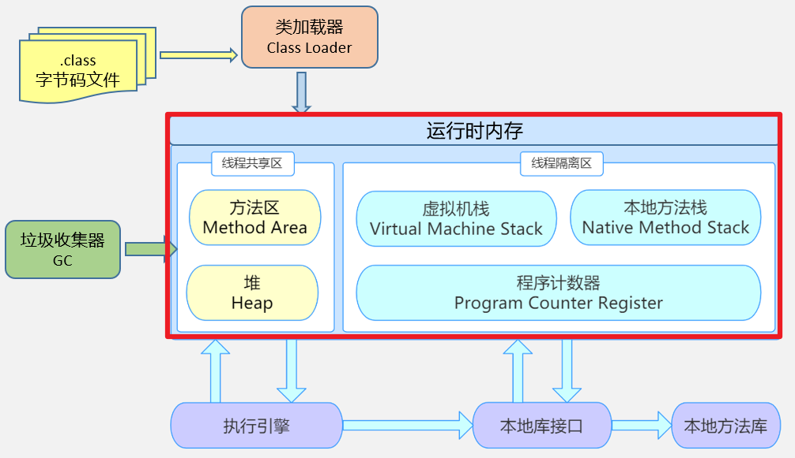
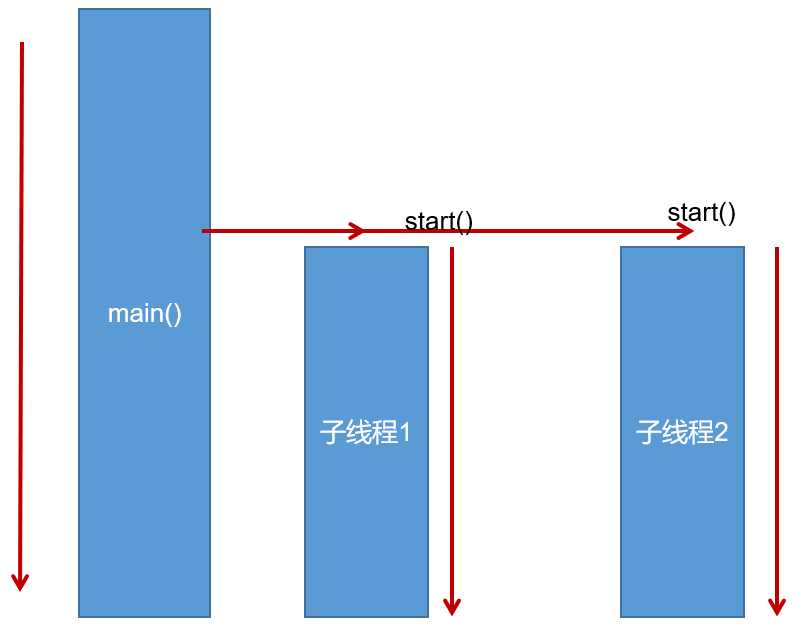
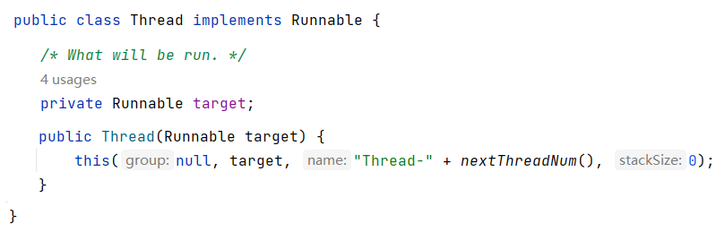
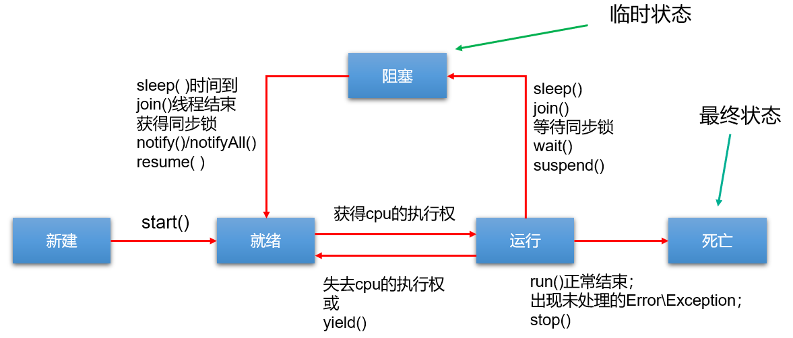
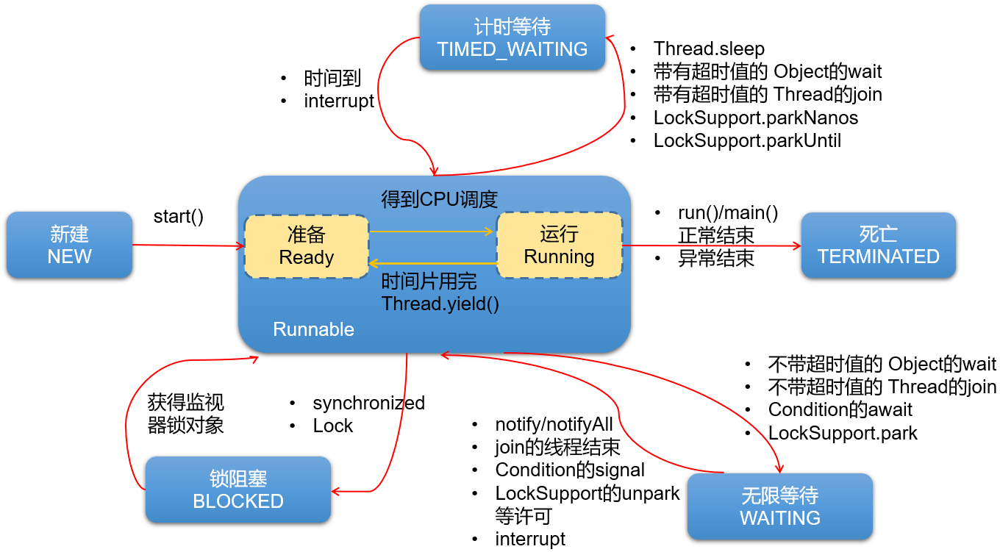

# 多线程

## 概念

**进程**：程序的一次执行过程。

+ 进程是 操作系统调度和分配资源的最小单位 （亦是系统运行程序的基本单位），系统在运行时会为每个进程分配不同的内存区域。

**线程**：进程可进一步细化为线程，线程是程序内部的一条执行路径，一个进程中至少有一个线程。
+ 线程是CPU调度和执行的最小单位。
+ 一个进程中的多个线程共享相同的内存单元，它们从同一个堆中分配对象，可以访问相同的变量和对象。这就使得线程间通信更简便、高效。但多个线程操作共享的系统资源可能就会带来安全的隐患。




**并行**：指在同一时刻，有`多条指令`在`多个CPU`上`同时`执行。


**并发**：即在一段时间内，有`多条指令`在`单个CPU`上`快速轮换、交替`执行，使得在宏观上具有多个进程同时执行的效果。
+ 在单核 CPU 系统中，每一时刻只能有一个程序执行，即微观上这些程序是分时的交替运行，只不过是给人的感觉是同时运行，那是因为分时交替运行的时间是非常短的。
+ 而在多核 CPU 系统中，则这些可以`并发`执行的程序便可以分配到多个CPU上，实现多任务并行执行，即利用每个处理器来处理一个可以并发执行的程序，这样多个程序便可以同时执行。


## 创建和启动线程

- Java语言的JVM允许程序运行多个线程，使用`java.lang.Thread`类代表**线程**，所有的线程对象都必须是Thread类或其子类的实例。
	- 每个线程都是通过某个特定Thread对象的run()方法来完成操作的，因此把run()方法体称为`线程执行体`。
	- 通过该Thread对象的start()方法来启动这个线程，而非直接调用run()
	- 要想实现多线程，必须在主线程中创建新的线程对象。

### 方式1：继承Thread类

```java
//自定义线程类
// 1.继承Thread类
public class MyThread extends Thread {
    //定义指定线程名称的构造方法
    public MyThread(String name) {
        //调用父类的String参数的构造方法，指定线程的名称
        super(name);
    }
    /**
     * 2.重写run方法，完成该线程执行的逻辑
     */
    @Override
    public void run() {
        for (int i = 0; i < 10; i++) {
            System.out.println(getName()+"：正在执行！"+i);
        }
    }
}
```

```java
public class TestMyThread {
    public static void main(String[] args) {
        //创建自定义线程对象1
        MyThread mt1 = new MyThread("子线程1");
        //开启子线程1
        mt1.start();
        
        //创建自定义线程对象2
        MyThread mt2 = new MyThread("子线程2");
        //开启子线程2
        mt2.start();
        
        //在主方法中执行for循环
        for (int i = 0; i < 10; i++) {
            System.out.println("main线程！"+i);
        }
    }
}
```


### 方式2：实现Runnable接口

```java
// 1.实现Runnable接口
public class MyRunnable implements Runnable {
    // 2.重写run方法，完成该线程执行的逻辑
    @Override
    public void run() {
        for (int i = 0; i < 20; i++) {
            System.out.println(Thread.currentThread().getName() + " " + i);
        }
    }
}
```

```java
public class TestMyRunnable {
    public static void main(String[] args) {
        //3.创建Runnable实现类的实例
        MyRunnable mr = new MyRunnable();
        //4.以此实例作为Thread的target参数来创建Thread对象
        // 该Thread对象才是真正
的线程对象。
        Thread t = new Thread(mr, "长江");
        //5.调用线程对象的start()方法
        t.start();
        for (int i = 0; i < 20; i++) {
            System.out.println("黄河 " + i);
        }
    }
}
```
所有的多线程代码都是通过运行Thread的start()方法来运行的。

Runnable对象仅仅作为Thread对象的target，Runnable实现类里包含的run()方法仅作为线程执行体。
而实际的线程对象依然是Thread实例，只是该Thread线程负责执行其target的run()方法。



### 转换成匿名内部类方式

```java
new Thread("新的线程！"){
	@Override
	public void run() {
		for (int i = 0; i < 10; i++) {
			System.out.println(getName()+"：正在执行！"+i);
		}
	}
}.start();

```

```java
new Thread(new Runnable(){
	@Override
	public void run() {
		for (int i = 0; i < 10; i++) {
			System.out.println(Thread.currentThread().getName()+"：" + i);
		}
	}
}).start();
```

### JDK5.0新增的创建线程方式

#### 方式三：实现Callable接口

与使用Runnable相比，Callable功能更强大些
- 相比run()方法，可以有返回值
- 方法可以抛出异常
- 支持泛型的返回值（需要借助FutureTask类，获取返回结果）

Future接口
- 可以对具体Runnable、Callable任务的执行结果进行取消、查询是否完成、获取结果等。
- FutureTask是Futrue接口的唯一的实现类
- FutureTask 同时实现了Runnable, Future接口。它既可以作为Runnable被线程执行，又可以作为Future得到Callable的返回值

缺点：在获取分线程执行结果的时候，当前线程（或是主线程）受阻塞，效率较低。

```java
/*
 * 创建多线程的方式三：实现Callable （jdk5.0新增的）
 */
//1.创建一个实现Callable的实现类
class NumThread implements Callable {
    //2.实现call方法，将此线程需要执行的操作声明在call()中
    @Override
    public Object call() throws Exception {
        int sum = 0;
        for (int i = 1; i <= 100; i++) {
            if (i % 2 == 0) {
                System.out.println(i);
                sum += i;
            }
        }
        return sum;
    }
}


public class CallableTest {
    public static void main(String[] args) {
        //3.创建Callable接口实现类的对象
        NumThread numThread = new NumThread();

        //4.将此Callable接口实现类的对象作为传递到FutureTask构造器中，创建FutureTask的对象
        FutureTask futureTask = new FutureTask(numThread);
        //5.将FutureTask的对象作为参数传递到Thread类的构造器中，创建Thread对象，并调用start()
        new Thread(futureTask).start();


//      接收返回值
        try {
            //6.获取Callable中call方法的返回值
            //get()返回值即为FutureTask构造器参数Callable实现类重写的call()的返回值。
            Object sum = futureTask.get();
            System.out.println("总和为：" + sum);
        } catch (InterruptedException e) {
            e.printStackTrace();
        } catch (ExecutionException e) {
            e.printStackTrace();
        }
    }

}
```

#### 方式四：使用线程池

JDK5.0之前，必须手动自定义线程池。从JDK5.0开始，Java内置线程池相关的API。在java.util.concurrent包下提供了线程池相关API：`ExecutorService` 和 `Executors`。
- `ExecutorService`：真正的线程池接口。常见子类ThreadPoolExecutor
	- `void execute(Runnable command)` ：执行任务/命令，没有返回值，一般用来执行Runnable
	- `<T> Future<T> submit(Callable<T> task)`：执行任务，有返回值，一般又来执行Callable
	- `void shutdown()` ：关闭连接池
- `Executors`：一个线程池的工厂类，通过此类的静态工厂方法可以创建多种类型的线程池对象。
	- `Executors.newCachedThreadPool()`：创建一个可根据需要创建新线程的线程池
	- `Executors.newFixedThreadPool(int nThreads)`; 创建一个可重用固定线程数的线程池
	- `Executors.newSingleThreadExecutor()` ：创建一个只有一个线程的线程池
	- `Executors.newScheduledThreadPool(int corePoolSize)`：创建一个线程池，它可安排在给定延迟后运行命令或者定期地执行。

```java
class NumberThread implements Runnable{

    @Override
    public void run() {
        for(int i = 0;i <= 100;i++){
            if(i % 2 == 0){
                System.out.println(Thread.currentThread().getName() + ": " + i);
            }
        }
    }
}

class NumberThread1 implements Runnable{

    @Override
    public void run() {
        for(int i = 0;i <= 100;i++){
            if(i % 2 != 0){
                System.out.println(Thread.currentThread().getName() + ": " + i);
            }
        }
    }
}

class NumberThread2 implements Callable {
    @Override
    public Object call() throws Exception {
        int evenSum = 0;//记录偶数的和
        for(int i = 0;i <= 100;i++){
            if(i % 2 == 0){
                evenSum += i;
            }
        }
        return evenSum;
    }

}

public class ThreadPoolTest {

    public static void main(String[] args) {
        //1. 提供指定线程数量的线程池
        ExecutorService service = Executors.newFixedThreadPool(10);
        ThreadPoolExecutor service1 = (ThreadPoolExecutor) service;
//        //设置线程池的属性
//        System.out.println(service.getClass());//ThreadPoolExecutor
        service1.setMaximumPoolSize(50); //设置线程池中线程数的上限

        //2.执行指定的线程的操作。需要提供实现Runnable接口或Callable接口实现类的对象
        service.execute(new NumberThread());//适合适用于Runnable
        service.execute(new NumberThread1());//适合适用于Runnable

        try {
            Future future = service.submit(new NumberThread2());//适合使用于Callable
            System.out.println("总和为：" + future.get());
        } catch (Exception e) {
            e.printStackTrace();
        }
        //3.关闭连接池
        service.shutdown();
    }

}
```


## Thread类

### 构造器

```txt
public Thread() :分配一个新的线程对象。
public Thread(String name) :分配一个指定名字的新的线程对象。
public Thread(Runnable target) :指定创建线程的目标对象，它实现了Runnable接口中的run方法
public Thread(Runnable target,String name) :分配一个带有指定目标新的线程对象并指定名字。

```

### 常用方法

```txt
public void run() :此线程要执行的任务在此处定义代码。
public void start() :导致此线程开始执行; Java虚拟机调用此线程的run方法。
public String getName() :获取当前线程名称。
public void setName(String name)：设置该线程名称。
public static Thread currentThread() :返回对当前正在执行的线程对象的引用。在Thread子类中就是this，通常用于主线程和Runnable实现类
public static void sleep(long millis) :使当前正在执行的线程以指定的毫秒数暂停（暂时停止执行）。
public static void yield()：yield只是让当前线程暂停一下，让系统的线程调度器重新调度一次，希望优先级与当前线程相同或更高的其他线程能够获得执行机会，但是这个不能保证，完全有可能的情况是，当某个线程调用了yield方法暂停之后，线程调度器又将其调度出来重新执行。
public final boolean isAlive()：测试线程是否处于活动状态。如果线程已经启动且尚未终止，则为活动状态。 
void join() ：等待该线程终止。 
void join(long millis) ：等待该线程终止的时间最长为 millis 毫秒。如果millis时间到，将不再等待。 
void join(long millis, int nanos) ：等待该线程终止的时间最长为 millis 毫秒 + nanos 纳秒。 
public final void stop()：`已过时`，不建议使用。强行结束一个线程的执行，直接进入死亡状态。run()即刻停止，可能会导致一些清理性的工作得不到完成，如文件，数据库等的关闭。同时，会立即释放该线程所持有的所有的锁，导致数据得不到同步的处理，出现数据不一致的问题。
void suspend() / void resume() : 这两个操作就好比播放器的暂停和恢复。二者必须成对出现，否则非常容易发生死锁。suspend()调用会导致线程暂停，但不会释放任何锁资源，导致其它线程都无法访问被它占用的锁，直到调用resume()。`已过时`，不建议使用。
```

### 线程优先级

每个线程都有一定的优先级，同优先级线程组成先进先出队列（先到先服务），使用分时调度策略。优先级高的线程采用抢占式策略，获得较多的执行机会。每个线程默认的优先级都与创建它的父线程具有相同的优先级。

- Thread类的三个优先级常量：
	- MAX_PRIORITY（10）：最高优先级 
	- NORM_PRIORITY （5）：普通优先级，默认情况下main线程具有普通优先级。
	- MIN _PRIORITY （1）：最低优先级

* public final int getPriority() ：返回线程优先级 
* public final void setPriority(int newPriority) ：改变线程的优先级，范围在[1,10]之间。

### 守护线程

守护线程在后台运行的，它的任务是为其他线程提供服务的。JVM的垃圾回收线程就是典型的守护线程。

如果所有非守护线程都死亡，那么守护线程自动死亡。

调用setDaemon(true)方法可将指定线程设置为守护线程。必须在线程启动之前设置，否则会报IllegalThreadStateException异常。

调用isDaemon()可以判断线程是否是守护线程。

## 多线程的生命周期

### JDK1.5之前：5种状态



程序只能对新建状态的线程调用start()，并且只能调用一次，如果对非新建状态的线程，如已启动的线程或已死亡的线程调用start()都会报错IllegalThreadStateException异常。

如果处于就绪状态的线程获得了CPU资源时，开始执行run()方法的线程体代码，则该线程处于运行状态。如果计算机只有一个CPU核心，在任何时刻只有一个线程处于运行状态，如果计算机有多个核心，将会有多个线程并行(Parallel)执行。

### JDK1.5之后：6种状态




## 线程安全

### 同步机制：synchronized

Java中提供了同步机制(**synchronized**)来解决多线程并发访问一个资源的安全性问题。

同步机制的原理，其实就相当于给某段代码加“锁”，任何线程想要执行这段代码，都要先获得“锁”，称它为同步锁。哪个线程获得了“同步锁”对象之后，”同步锁“对象就会记录这个线程的ID，这样其他线程就只能等待了，除非这个线程”释放“了锁对象，其他线程才能重新获得/占用”同步锁“对象。

synchronized 关键字可以用于某个区块前面，表示只对这个区块的资源实行互斥访问。
synchronized 关键字直接修饰方法，表示同一时刻只有一个线程能进入这个方法，其他线程在外面等着。

```java
synchronized(同步锁){
     需要同步操作的代码
}

public synchronized void method(){
    可能会产生线程安全问题的代码
}
```

**同步锁对象**可以是任意类型，但是必须保证竞争“同一个共享资源”的多个线程必须使用同一个“同步锁对象”。

对于同步代码块来说，同步锁对象是由程序员手动指定的（很多时候也是指定为this或类名.class），但是对于同步方法来说，同步锁对象只能是默认的：

- 静态方法：当前类的Class对象（类名.class）

- 非静态方法：this

### 火车站售票案例

100张火车票，3个窗口售卖。

+ 静态方法加锁

```java
class TicketSaleThread extends Thread{
    private static int ticket = 100;
    public void run(){//直接锁这里，肯定不行，会导致，只有一个窗口卖票
        while (ticket > 0) {
            saleOneTicket();
        }
    }

    public synchronized static void saleOneTicket(){//锁对象是TicketSaleThread类的Class对象，而一个类的Class对象在内存中肯定只有一个
        if(ticket > 0) {//不加条件，相当于条件判断没有进入锁管控，线程安全问题就没有解决
            System.out.println(Thread.currentThread().getName() + "卖出一张票，票号:" + ticket);
            ticket--;
        }
    }
}
public class SaleTicketDemo3 {
    public static void main(String[] args) {
        TicketSaleThread t1 = new TicketSaleThread();
        TicketSaleThread t2 = new TicketSaleThread();
        TicketSaleThread t3 = new TicketSaleThread();

        t1.setName("窗口1");
        t2.setName("窗口2");
        t3.setName("窗口3");

        t1.start();
        t2.start();
        t3.start();
    }
}
```

+ 非静态方法加锁

```java
public class SaleTicketDemo4 {
    public static void main(String[] args) {
        TicketSaleRunnable tr = new TicketSaleRunnable();
        Thread t1 = new Thread(tr, "窗口一");
        Thread t2 = new Thread(tr, "窗口二");
        Thread t3 = new Thread(tr, "窗口三");

        t1.start();
        t2.start();
        t3.start();
    }
}

class TicketSaleRunnable implements Runnable {
    private int ticket = 100;

    public void run() {//直接锁这里，肯定不行，会导致，只有一个窗口卖票
        while (ticket > 0) {
            saleOneTicket();
        }
    }

    public synchronized void saleOneTicket() {//锁对象是this，这里就是TicketSaleRunnable对象，因为上面3个线程使用同一个TicketSaleRunnable对象，所以可以
        if (ticket > 0) {//不加条件，相当于条件判断没有进入锁管控，线程安全问题就没有解决
            System.out.println(Thread.currentThread().getName() + "卖出一张票，票号:" + ticket);
            ticket--;
        }
    }
}
```

+ 同步代码块

```java
public class SaleTicketDemo5 {
    public static void main(String[] args) {
        //2、创建资源对象
        Ticket ticket = new Ticket();

        //3、启动多个线程操作资源类的对象
        Thread t1 = new Thread("窗口一") {
            public void run() {//不能给run()直接加锁，因为t1,t2,t3的三个run方法分别属于三个Thread类对象，
                // run方法是非静态方法，那么锁对象默认选this，那么锁对象根本不是同一个
                while (true) {
                    synchronized (ticket) {
                        ticket.sale();
                    }
                }
            }
        };
        Thread t2 = new Thread("窗口二") {
            public void run() {
                while (true) {
                    synchronized (ticket) {
                        ticket.sale();
                    }
                }
            }
        };
        Thread t3 = new Thread(new Runnable() {
            public void run() {
                while (true) {
                    synchronized (ticket) {
                        ticket.sale();
                    }
                }
            }
        }, "窗口三");


        t1.start();
        t2.start();
        t3.start();
    }
}

//1、编写资源类
class Ticket {
    private int ticket = 1000;

    public void sale() {//也可以直接给这个方法加锁，锁对象是this，这里就是Ticket对象
        if (ticket > 0) {
            System.out.println(Thread.currentThread().getName() + "卖出一张票，票号:" + ticket);
            ticket--;
        } else {
            throw new RuntimeException("没有票了");
        }
    }

    public int getTicket() {
        return ticket;
    }
}
```

### 单例模式的线程安全问题

懒汉式存在线程安全问题。

```java
public class LazyOne {
    private static LazyOne instance;

    private LazyOne(){}

    //方式1：
    public static synchronized LazyOne getInstance1(){
        if(instance == null){
            instance = new LazyOne();
        }
        return instance;
    }
    //方式2：
    public static LazyOne getInstance2(){
        synchronized(LazyOne.class) {
            if (instance == null) {
                instance = new LazyOne();
            }
            return instance;
        }
    }
    //方式3：
    public static LazyOne getInstance3(){
        if(instance == null){
            synchronized (LazyOne.class) {
                try {
                    Thread.sleep(10);//加这个代码，暴露问题
                } catch (InterruptedException e) {
                    e.printStackTrace();
                }
                if(instance == null){
                    instance = new LazyOne();
                }
            }
        }

        return instance;
    }
    /*
    注意：上述方式3中，有指令重排问题
    1. mem = allocate(); 为单例对象分配内存空间
    2. instance = mem;   instance引用现在非空，但还未初始化
    3. ctorSingleton(instance); 为单例对象通过instance调用构造器

    执行2、3的执行顺序可能会变化，假设A执行完了2，还没执行3，此时B判断instance!=null ，但是此时instance还没初始化，那么此时B访问instance就出现问题了。

    从JDK2开始，分配空间、初始化、调用构造器会在线程的工作存储区一次性完成，然后复制到主存储区。但是需要   
    volatile关键字，避免指令重排。
    */
    
}
```

更好地解决方案：**使用内部类**

```java
package com.atguigu.single.lazy;

public class LazySingle {
    private LazySingle(){}
    
    public static LazySingle getInstance(){
        return Inner.INSTANCE;
    }
    
    private static class Inner{
        static final LazySingle INSTANCE = new LazySingle();
    }
    
}
```
内部类只有在外部类被调用才加载，产生INSTANCE实例；又不用加锁。

### 死锁

不同的线程分别占用对方需要的同步资源不放弃，都在等待对方放弃自己需要的同步资源，就形成了线程的死锁。

**诱发死锁的原因：**

- 互斥条件
- 占用且等待
- 不可抢夺（或不可抢占）
- 循环等待

### JDK5.0新特性：Lock

Lock通过显式定义同步锁对象来实现同步。同步锁使用Lock对象充当。
java.util.concurrent.locks.Lock接口是控制多个线程对共享资源进行访问的工具。锁提供了对共享资源的独占访问，每次只能有一个线程对Lock对象加锁，线程开始访问共享资源之前应先获得Lock对象。
在实现线程安全的控制中，比较常用的是`ReentrantLock`，可以显式加锁、释放锁。
+ ReentrantLock类实现了 Lock 接口，它拥有与 synchronized 相同的并发性和内存语义，但是添加了类似锁投票、定时锁等候和可中断锁等候的一些特性。此外，它还提供了在激烈争用情况下更佳的性能。

Lock锁也称同步锁，加锁与释放锁方法，如下：

* public void lock() :加同步锁。
* public void unlock() :释放同步锁。

如果同步代码有异常，要将unlock()写入finally语句块。

```java
import java.util.concurrent.locks.ReentrantLock;

class Window implements Runnable{
	int ticket = 100;
    //1. 创建Lock的实例，必须确保多个线程共享同一个Lock实例
	private final ReentrantLock lock = new ReentrantLock();
	public void run(){
		
		while(true){
			try{
                //2. 调动lock()，实现需共享的代码的锁定
				lock.lock();
				if(ticket > 0){
					try {
						Thread.sleep(10);
					} catch (InterruptedException e) {
						e.printStackTrace();
					}
					System.out.println(ticket--);
				}else{
					break;
				}
			}finally{
                //3. 调用unlock()，释放共享代码的锁定
				lock.unlock();
			}
		}
	}
}

public class ThreadLock {
	public static void main(String[] args) {
		Window t = new Window();
		Thread t1 = new Thread(t);
		Thread t2 = new Thread(t);
		
		t1.start();
		t2.start();
	}
}
```

### synchronized与Lock的对比

Lock是显式锁,手动开启和关闭锁。synchronized是隐式锁，出了作用域、遇到异常等自动解锁

Lock只有代码块锁，synchronized有代码块锁和方法锁。

使用Lock锁，JVM将花费较少的时间来调度线程，性能更好。并且具有更好的扩展性（提供更多的子类）。

## 线程间的通信

### 等待唤醒机制

在一个线程满足某个条件时，就进入等待状态（`wait() / wait(time)`）， 等待其他线程执行完他们的指定代码过后再将其唤醒（`notify()`）;或可以指定wait的时间，等时间到了自动唤醒；在有多个线程进行等待时，如果需要，可以使用 `notifyAll()`来唤醒所有的等待线程。wait/notify 就是线程间的一种协作机制。

例：使用两个线程打印 1-100。线程1, 线程2 交替打印

```java
class Communication implements Runnable {
    int i = 1;
    public void run() {
        while (true) {
            synchronized (this) {
                notify();
                if (i <= 100) {
                    System.out.println(Thread.currentThread().getName() + ":" + i++);
                } else
                    break;
                try {
                    wait(); //释放this
                } catch (InterruptedException e) {
                    e.printStackTrace();
                }
            }
        }
    }
}
```
wait方法与notify方法必须要由`同一个锁对象调用`。因为对应的锁对象可以通过notify唤醒使用同一个锁对象调用的wait方法后的线程。
> 在这里wait和notify的锁对象就是this；wait()其实是this.wait(); ...


wait方法与notify方法是属于Object类的方法的。因为锁对象可以是任意对象，而任意对象的所属类都是继承了Object类的。

wait方法与notify方法必须要在`同步代码块`或者是`同步函数`中使用。因为：必须要`通过锁对象`调用这2个方法。否则会报java.lang.IllegalMonitorStateException异常。

### 生产者和消费者问题

等待唤醒机制可以解决经典的“生产者与消费者”的问题,生产者和消费者问题也叫做有限缓冲问题。

```java
public class ConsumerProducerTest {
	public static void main(String[] args) {
		Clerk clerk = new Clerk();
		Producer p1 = new Producer(clerk);
		
		Consumer c1 = new Consumer(clerk);
		Consumer c2 = new Consumer(clerk);
		
		p1.setName("生产者1");
		c1.setName("消费者1");
		c2.setName("消费者2");
		
		p1.start();
		c1.start();
		c2.start();
	}
}

//生产者
class Producer extends Thread{
	private Clerk clerk;
	
	public Producer(Clerk clerk){
		this.clerk = clerk;
	}
	
	@Override
	public void run() {
		while(true){
			
			try {
				Thread.sleep(40);
			} catch (InterruptedException e) {
				e.printStackTrace();
			}
			
			//要求clerk去增加产品
			clerk.addProduct();
		}
	}
}

//消费者
class Consumer extends Thread{
	private Clerk clerk;
	
	public Consumer(Clerk clerk){
		this.clerk = clerk;
	}
	@Override
	public void run() {
		while(true){
			
			try {
				Thread.sleep(90);
			} catch (InterruptedException e) {
				e.printStackTrace();
			}
			
			//要求clerk去减少产品
			clerk.minusProduct();
		}
	}
}

//资源类
class Clerk {
	private int productNum = 0;//产品数量
	private static final int MAX_PRODUCT = 20;
	private static final int MIN_PRODUCT = 1;
	
	//增加产品
	public synchronized void addProduct() {
		if(productNum < MAX_PRODUCT){
			productNum++;
			System.out.println(Thread.currentThread().getName() + 
					"生产了第" + productNum + "个产品");
			//唤醒消费者
			this.notifyAll();
		}else{
			
			try {
				this.wait();
			} catch (InterruptedException e) {
				e.printStackTrace();
			}
		}
	}

	//减少产品
	public synchronized void minusProduct() {
		if(productNum >= MIN_PRODUCT){
			System.out.println(Thread.currentThread().getName() + 
					"消费了第" + productNum + "个产品");
			productNum--;
			
			//唤醒生产者
			this.notifyAll();
		}else{
			
			try {
				this.wait();
			} catch (InterruptedException e) {
				e.printStackTrace();
			}
		}
	}
	
}
```

### 区分sleep()和wait()

相同点：一旦执行，都会使得当前线程结束执行状态，进入阻塞状态。

不同点：

 ① 定义方法所属的类：sleep():Thread中定义。  wait():Object中定义

② 使用范围的不同：sleep()可以在任何需要使用的位置被调用； wait():必须使用在同步代码块或同步方法中

③ 都在同步结构中使用的时候，是否释放同步监视器的操作不同：sleep():不会释放同步监视器 ;wait():会释放同步监视器

④ 结束等待的方式不同：sleep()：指定时间一到就结束阻塞。 wait():可以指定时间也可以无限等待直到notify或notifyAll。

### 是否释放锁的操作

任何线程进入同步代码块、同步方法之前，必须先获得对同步监视器的锁定。

**释放锁的操作**

当前线程的同步方法、同步代码块执行结束。

当前线程在同步代码块、同步方法中遇到break、return终止了该代码块、该方法的继续执行。

当前线程在同步代码块、同步方法中出现了未处理的Error或Exception，导致当前线程异常结束。

当前线程在同步代码块、同步方法中执行了锁对象的wait()方法，当前线程被挂起，并释放锁。

**不会释放锁的操作**

线程执行同步代码块或同步方法时，程序调用Thread.sleep()、Thread.yield()方法暂停当前线程的执行。

线程执行同步代码块时，其他线程调用了该线程的suspend()方法将该该线程挂起，该线程不会释放锁（同步监视器）。

- 应尽量避免使用suspend()和resume()来控制线程。

