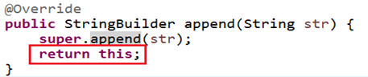

# 常用类

## String

字符串String类型本身是final声明的，意味着不能继承String。且String字符串是常量，它们的值在创建之后不能更改，因此一旦对字符串进行修改，就会产生新对象。

在JDK8中，String对象的字符内容是存储在一个字符数组value[]中的；但是在JDK9中，底层使用byte[]数组。

### String的内存结构

因为字符串对象设计为不可变，那么所以字符串有常量池来保存很多常量对象。

JDK6中，字符串常量池在方法区。JDK7开始，就移到堆空间。


String str1 = “abc”; 与 String str2 = new String(“abc”);的区别：str2 首先指向堆中的一个字符串对象，然后堆中字符串的value数组指向常量池中常量对象的value数组。


常量+常量：结果是常量池。且常量池中不会存在相同内容的常量。
常量与变量 或 变量与变量：结果在堆中。
拼接后调用intern方法：返回值在常量池中。

```java
@Test
public void test01(){
	String s1 = "hello";
	String s2 = "world";
	String s3 = "helloworld";
		
	String s4 = s1 + "world";//s4字符串内容也helloworld，s1是变量，"world"常量，变量 + 常量的结果在堆中
	String s5 = s1 + s2;//s5字符串内容也helloworld，s1和s2都是变量，变量 + 变量的结果在堆中
	String s6 = "hello" + "world";//常量+ 常量 结果在常量池中，因为编译期间就可以确定结果
		
	System.out.println(s3 == s4);//false
	System.out.println(s3 == s5);//false
	System.out.println(s3 == s6);//true
}

@Test
public void test02(){
	final String s1 = "hello";
	final String s2 = "world";
	String s3 = "helloworld";
	
	String s4 = s1 + "world";//s4字符串内容也helloworld，s1是常量，"world"常量，常量+常量结果在常量池中
	String s5 = s1 + s2;//s5字符串内容也helloworld，s1和s2都是常量，常量+ 常量 结果在常量池中
	String s6 = "hello" + "world";//常量+ 常量 结果在常量池中，因为编译期间就可以确定结果
		
	System.out.println(s3 == s4);//true
	System.out.println(s3 == s5);//true
	System.out.println(s3 == s6);//true
}

@Test
public void test03(){
	String s1 = "hello";
	String s2 = "world";
	String s3 = "helloworld";
		
	String s4 = (s1 + "world").intern();//把拼接的结果放到常量池中
	String s5 = (s1 + s2).intern();
		
	System.out.println(s3 == s4);//true
	System.out.println(s3 == s5);//true
}

@Test
public void test04(){
String str = "hello";
    String str2 = "world";
    String str3 ="helloworld";
    
    // concat方法拼接，哪怕是两个常量对象拼接，结果也是在堆。
    String str4 = "hello".concat("world");
    String str5 = "hello"+"world";
    
    System.out.println(str3 == str4);//false
    System.out.println(str3 == str5);//true
}
```

```java
public class TestString {
    String str = new String("good");
    char[] ch = { 't', 'e', 's', 't' };

    public void change(String str, char ch[]) {
        str = "test ok";
        ch[0] = 'b';
    }
    public static void main(String[] args) {
        TestString ex = new TestString();
        ex.change(ex.str, ex.ch);
        System.out.print(ex.str + " and ");
        System.out.println(ex.ch); // good and best
    }
}
```

### String常用API

#### 构造器

```java
public String() ：初始化新创建的 String对象，以使其表示空字符序列。
String(String original)： 初始化一个新创建的 `String` 对象，使其表示一个与参数相同的字符序列；换句话说，新创建的字符串是该参数字符串的副本。
public String(char[] value) ：通过当前参数中的字符数组来构造新的String。
public String(char[] value,int offset, int count) ：通过字符数组的一部分来构造新的String。
public String(byte[] bytes) ：通过使用平台的**默认字符集**解码当前参数中的字节数组来构造新的String。
public String(byte[] bytes,String charsetName) ：通过使用指定的字符集解码当前参数中的字节数组来构造新的String。
```

#### String和其他类型的转换

```java
字符串 --> 基本数据类型、包装类：
Integer包装类的public static int parseInt(String s)：可以将由“数字”字符组成的字符串转换为整型。
类似地，使用java.lang包中的Byte、Short、Long、Float、Double类调相应的类方法可以将由“数字”字符组成的字符串，转化为相应的基本数据类型。

基本数据类型、包装类 --> 字符串：
调用String类的public String valueOf(int n)可将int型转换为字符串
相应的valueOf(byte b)、valueOf(long l)、valueOf(float f)、valueOf(double d)、valueOf(boolean b)可由参数的相应类型到字符串的转换。

字符数组 -->  字符串：
String 类的构造器：String(char[]) 和 String(char[]，int offset，int length) 分别用字符数组中的全部字符和部分字符创建字符串对象。 

字符串 -->  字符数组：
public char[] toCharArray()：将字符串中的全部字符存放在一个字符数组中的方法。
public void getChars(int srcBegin, int srcEnd, char[] dst, int dstBegin)：提供了将指定索引范围内的字符串存放到数组中的方法。

字符串 --> 字节数组：（编码）
public byte[] getBytes() ：使用平台的默认字符集将此 String 编码为 byte 序列，并将结果存储到一个新的 byte 数组中。
public byte[] getBytes(String charsetName) ：使用指定的字符集将此 String 编码到 byte 序列，并将结果存储到新的 byte 数组。

字节数组 --> 字符串：（解码）
String(byte[])：通过使用平台的默认字符集解码指定的 byte 数组，构造一个新的 String。
String(byte[]，int offset，int length) ：用指定的字节数组的一部分，即从数组起始位置offset开始取length个字节构造一个字符串对象。
String(byte[], String charsetName ) 或 new String(byte[], int, int,String charsetName )：解码，按照指定的编码方式进行解码。
```

#### 常用方法

```java
（1）boolean isEmpty()：字符串是否为空
（2）int length()：返回字符串的长度
（3）String concat(xx)：拼接
（4）boolean equals(Object obj)：比较字符串是否相等，区分大小写
（5）boolean equalsIgnoreCase(Object obj)：比较字符串是否相等，不区分大小写
（6）int compareTo(String other)：比较字符串大小，区分大小写，按照Unicode编码值比较大小
（7）int compareToIgnoreCase(String other)：比较字符串大小，不区分大小写
（8）String toLowerCase()：将字符串中大写字母转为小写
（9）String toUpperCase()：将字符串中小写字母转为大写
（10）String trim()：去掉字符串前后空白符
（11）public String intern()：结果在常量池中共享
（11）boolean contains(xx)：是否包含xx
（12）int indexOf(xx)：从前往后找当前字符串中xx，即如果有返回第一次出现的下标，要是没有返回-1
（13）int indexOf(String str, int fromIndex)：返回指定子字符串在此字符串中第一次出现处的索引，从指定的索引开始
（14）int lastIndexOf(xx)：从后往前找当前字符串中xx，即如果有返回最后一次出现的下标，要是没有返回-1
（15）int lastIndexOf(String str, int fromIndex)：返回指定子字符串在此字符串中最后一次出现处的索引，从指定的索引开始反向搜索。
（16）String substring(int beginIndex) ：返回一个新的字符串，它是此字符串的从beginIndex开始截取到最后的一个子字符串。 
（17）String substring(int beginIndex, int endIndex) ：返回一个新字符串，它是此字符串从beginIndex开始截取到endIndex(不包含)的一个子字符串。 
（18）char charAt(index)：返回[index]位置的字符
（19）char[] toCharArray()： 将此字符串转换为一个新的字符数组返回
（20）static String valueOf(char[] data)  ：返回指定数组中表示该字符序列的 String
（21）static String valueOf(char[] data, int offset, int count) ： 返回指定数组中表示该字符序列的 String
（22）static String copyValueOf(char[] data)： 返回指定数组中表示该字符序列的 String
（23）static String copyValueOf(char[] data, int offset, int count)：返回指定数组中表示该字符序列的 String
（24）boolean startsWith(xx)：测试此字符串是否以指定的前缀开始 
（25）boolean startsWith(String prefix, int toffset)：测试此字符串从指定索引开始的子字符串是否以指定前缀开始
（26）boolean endsWith(xx)：测试此字符串是否以指定的后缀结束 
（27）String replace(char oldChar, char newChar)：返回一个新的字符串，它是通过用 newChar 替换此字符串中出现的所有 oldChar 得到的。 不支持正则。
（28）String replace(CharSequence target, CharSequence replacement)：使用指定的字面值替换序列替换此字符串所有匹配字面值目标序列的子字符串。 
（29）String replaceAll(String regex, String replacement)：使用给定的 replacement 替换此字符串所有匹配给定的正则表达式的子字符串。 
（30）String replaceFirst(String regex, String replacement)：使用给定的 replacement 替换此字符串匹配给定的正则表达式的第一个子字符串。 
```

## StringBuffer和StringBuilder

因为String对象是不可变对象，虽然可以共享常量对象，但是对于频繁字符串的修改和拼接操作，效率极低，空间消耗也比较高。因此，JDK又在java.lang包提供了可变字符序列StringBuffer和StringBuilder类型。

java.lang.StringBuffer代表`可变的字符序列`，JDK1.0中声明，可以对字符串内容进行增删，此时不会产生新的对象。比如：

StringBuilder 和 StringBuffer 非常类似，均代表可变的字符序列，而且提供相关功能的方法也一样。

区分String、StringBuffer、StringBuilder
- String:不可变的字符序列； 底层使用char[]数组存储(JDK8.0中)
- StringBuffer:可变的字符序列；线程安全（方法有synchronized修饰），效率低；底层使用char[]数组存储 (JDK8.0中)
- StringBuilder:可变的字符序列； jdk1.5引入，线程不安全的，效率高；底层使用char[]数组存储(JDK8.0中)

### StringBuffer和StringBuilder的API

```java
（1）StringBuffer append(xx)：提供了很多的append()方法，用于进行字符串追加的方式拼接
（2）StringBuffer delete(int start, int end)：删除[start,end)之间字符
（3）StringBuffer deleteCharAt(int index)：删除[index]位置字符
（4）StringBuffer replace(int start, int end, String str)：替换[start,end)范围的字符序列为str
（5）void setCharAt(int index, char c)：替换[index]位置字符
（6）char charAt(int index)：查找指定index位置上的字符
（7）StringBuffer insert(int index, xx)：在[index]位置插入xx
（8）int length()：返回存储的字符数据的长度
（9）StringBuffer reverse()：反转
（10）int indexOf(String str)：在当前字符序列中查询str的第一次出现下标
（11）int indexOf(String str, int fromIndex)：在当前字符序列[fromIndex,最后]中查询str的第一次出现下标
（12）int lastIndexOf(String str)：在当前字符序列中查询str的最后一次出现下标
（13）int lastIndexOf(String str, int fromIndex)：在当前字符序列[fromIndex,最后]中查询str的最后一次出现下标
（14）String substring(int start)：截取当前字符序列[start,最后]
（15）String substring(int start, int end)：截取当前字符序列[start,end)
（16）String toString()：返回此序列中数据的字符串表示形式
（17）void setLength(int newLength) ：设置当前字符序列长度为newLength
```
上面的(1)(2)(3)(4)(9)这些方法支持`方法链操作`。


### 效率测试

```java
public class TestString {
    public static void main(String[] args) {
        //初始设置
        long startTime = 0L;
        long endTime = 0L;
        String text = "";
        StringBuffer buffer = new StringBuffer("");
        StringBuilder builder = new StringBuilder("");

//开始对比
        startTime = System.currentTimeMillis();
        for (int i = 0; i < 20000; i++) {
            buffer.append(String.valueOf(i));
        }
        endTime = System.currentTimeMillis();
        System.out.println("StringBuffer的执行时间：" + (endTime - startTime)); //StringBuffer的执行时间：4

        startTime = System.currentTimeMillis();
        for (int i = 0; i < 20000; i++) {
            builder.append(String.valueOf(i));
        }
        endTime = System.currentTimeMillis();
        System.out.println("StringBuilder的执行时间：" + (endTime - startTime));// StringBuilder的执行时间：3

        startTime = System.currentTimeMillis();
        for (int i = 0; i < 20000; i++) {
            text = text + i;
        }
        endTime = System.currentTimeMillis();
        System.out.println("String的执行时间：" + (endTime - startTime)); // String的执行时间：276

    }
}
```

## 日期时间：java.time

在JDK8之前，使用的是 `java.util.Date`、`java.text.SimpleDateFormat`、`java.text.SimpleDateFormat`等,但是被JDK8 引入的java.time API替代。

`java.time`日期时间API包含：

* `java.time` – 包含值对象的基础包
* `java.time.chrono` – 提供对不同的日历系统的访问。
* `java.time.format` – 格式化和解析时间和日期
* `java.time.temporal` – 包括底层框架和扩展特性
* `java.time.zone` – 包含时区支持的类

例:
+ 本地日期时间类：`java.time.LocalDate`、`java.time.LocalTime`、`java.time.LocalDateTime`。
+ 瞬时：`java.time.Instant`，时间线上的一个瞬时点。 这可能被用来记录应用程序中的事件时间戳。
+ 日期时间格式化：`java.time.format.DateTimeFormatter`。
+ 指定时区的日期时间：`java.time.ZoneId`、`java.time.ZonedDateTime`。
+ 持续时间：`java.time.Duration`，用于计算两个“时间”间隔。
+ 日期间隔：`java.time.Period`，用于计算两个“日期”间隔。

多数情况下只会用到基础包和format包，其他的包用的很少。

## java比较器

### 自然排序：java.lang.Comparable

Comparable接口强行对实现它的每个类的对象进行整体排序。这种排序被称为类的自然排序。

实现 Comparable 的类必须实现 `compareTo(Object obj) `方法，两个对象即通过 compareTo(Object obj) 方法的返回值来比较大小。如果当前对象this大于形参对象obj，则返回正整数，如果当前对象this小于形参对象obj，则返回负整数，如果当前对象this等于形参对象obj，则返回零。

实现Comparable接口的对象列表（和数组）可以通过 Collections.sort 或 Arrays.sort进行自动排序。实现此接口的对象可以用作有序映射中的键或有序集合中的元素，无需指定比较器。

对于类 C 的每一个 e1 和 e2 来说，当且仅当 e1.compareTo(e2) == 0 与 e1.equals(e2) 具有相同的 boolean 值时，类 C 的自然排序才叫做与 equals 一致。建议`最好使自然排序与 equals 一致`。

```java
class Goods implements Comparable {
    private String name;
    private double price;

    //按照价格，比较商品的大小
    @Override
    public int compareTo(Object o) {
        if(o instanceof Goods) {
            Goods other = (Goods) o;
            if (this.price > other.price) {
                return 1;
            } else if (this.price < other.price) {
                return -1;
            }
            return 0;
        }
        throw new RuntimeException("输入的数据类型不一致");
    }

}
```

### 定制排序：java.util.Comparator

当元素的类型没有实现java.lang.Comparable接口而又不方便修改代码。或者如果一个类，实现了Comparable接口，也指定了两个对象的比较大小的规则，但是此时此刻不想按照它预定义的方法比较大小。就可以考虑java.util.Comparator接口，强行对多个对象进行整体排序的比较。
- 重写compare(Object o1,Object o2)方法，比较o1和o2的大小：如果方法返回正整数，则表示o1大于o2；如果返回0，表示相等；返回负整数，表示o1小于o2。
- 可以将 Comparator 传递给 sort 方法（如 Collections.sort 或 Arrays.sort），从而允许在排序顺序上实现精确控制。

```java
import java.util.Comparator;
//定义定制比较器类
public class StudentScoreComparator implements Comparator { 
    @Override
    public int compare(Object o1, Object o2) {
        Student s1 = (Student) o1;
        Student s2 = (Student) o2;
        int result = s1.getScore() - s2.getScore();
        return result != 0 ? result : s1.getId() - s2.getId();
    }
}
```
```java
public class TestStudent {
    public static void main(String[] args) {
        Student[] arr = new Student[5];
        arr[0] = new Student(3, "张三", 90, 23);
        arr[1] = new Student(1, "熊大", 100, 22);
        arr[2] = new Student(5, "王五", 75, 25);
        arr[3] = new Student(4, "李四", 85, 24);
        arr[4] = new Student(2, "熊二", 85, 18);


        System.out.println("所有学生：");
        for (int i = 0; i < arr.length; i++) {
            System.out.println(arr[i]);
        }

        System.out.println("按照成绩排序");
        StudentScoreComparator sc = new StudentScoreComparator();
        for (int i = 1; i < arr.length; i++) {
            for (int j = 0; j < arr.length - i; j++) {
                if (sc.compare(arr[j], arr[j + 1]) > 0) {
                    Student temp = arr[j];
                    arr[j] = arr[j + 1];
                    arr[j + 1] = temp;
                }
            }
        }
		// 或者：Arrays.sort(arr, sc);
		
        for (int i = 0; i < arr.length; i++) {
            System.out.println(arr[i]);
        }
    }
}
```

## 系统相关类

### java.lang.System

System类代表系统，该类的构造器是private的，所以无法创建该类的对象。其内部的成员变量和成员方法都是`static的`，可以很方便地进行调用。

成员变量 `Scanner scan = new Scanner(System.in);`

- System类内部包含`in`、`out`和`err`三个成员变量，分别代表标准输入流(键盘输入)，标准输出流(显示器)和标准错误输出流(显示器)。

成员方法

- `native long currentTimeMillis()`：该方法的作用是返回当前的计算机时间，时间的表达格式为当前计算机时间和GMT时间(格林威治时间)1970年1月1号0时0分0秒所差的毫秒数。
- `void exit(int status)`：该方法的作用是退出程序。其中status的值为0代表正常退出，非零代表异常退出。使用该方法可以在图形界面编程中实现程序的退出功能等。
- `void gc()`：该方法的作用是请求系统进行垃圾回收。至于系统是否立刻回收，则取决于系统中垃圾回收算法的实现以及系统执行时的情况。
- `String getProperty(String key)`：该方法的作用是获得系统中属性名为key的属性对应的值。系统中常见的属性名以及属性的作用如下表所示：

| 属性名       | 属性说明                 |
| ------------ | ------------------------ |
| java.version | Java 运行时环境版本      |
| java.home    | Java 安装目录            |
| os.name      | 操作系统的名称           |
| os.version   | 操作系统的版本           |
| user.name    | 用户的账户名称           |
| user.home    | 用户的主目录             |
| user.dir     | 用户的当前工作目录       |

+ `static void arraycopy(Object src, int srcPos, Object dest, int destPos, int length)`： 从指定源数组中复制一个数组，复制从指定的位置开始，到目标数组的指定位置结束。

```java
import org.junit.Test;
import java.util.Arrays;

public class TestSystemArrayCopy {
    @Test
    public void test01(){
        int[] arr1 = {1,2,3,4,5};
        int[] arr2 = new int[10];
        System.arraycopy(arr1,0,arr2,3,arr1.length);
        System.out.println(Arrays.toString(arr1)); // [1, 2, 3, 4, 5]
        System.out.println(Arrays.toString(arr2)); // [0, 0, 0, 1, 2, 3, 4, 5, 0, 0]
    }

    @Test
    public void test02(){
        int[] arr = {1,2,3,4,5};
        System.arraycopy(arr,0,arr,1,arr.length-1);
        System.out.println(Arrays.toString(arr)); //[1, 1, 2, 3, 4]
    }

    @Test
    public void test03(){
        int[] arr = {1,2,3,4,5};
        System.arraycopy(arr,1,arr,0,arr.length-1);
        System.out.println(Arrays.toString(arr)); //[2, 3, 4, 5, 5]
    }
}
```


### java.lang.Runtime

每个 Java 应用程序都有一个 `Runtime` 类实例，使应用程序能够与其运行的环境相连接。

`public static Runtime getRuntime()`： 返回与当前 Java 应用程序相关的运行时对象。应用程序不能创建自己的 Runtime 类实例。

`public long totalMemory()`：返回 Java 虚拟机中初始化时的内存总量。此方法返回的值可能随时间的推移而变化，这取决于主机环境。默认为物理电脑内存的1/64。

`public long maxMemory()`：返回 Java 虚拟机中最大程度能使用的内存总量。默认为物理电脑内存的1/4。

`public long freeMemory()`：回 Java 虚拟机中的空闲内存量。调用 gc 方法可能导致 freeMemory 返回值的增加。


## 数学相关类

`java.lang.Math` 类包含用于执行基本数学运算的方法，如初等指数、对数、平方根和三角函数。类似这样的工具类，其所有方法均为静态方法，并且不会创建对象，调用起来非常简单。

`java.math.BigInteger`可以表示 不可变的任意精度的整数 ，对于要求数字精度比较高，要使用到java.math.BigDecimal类。

`java.util.Random`类用于产生随机数。


