# 面向对象OOP


类的成员：成员变量、方法、构造器、代码块

OOP 三大特征：封装、继承、多态

## 对象内存解析

直接打印对象名或数组名 都是显示“类型@对象的hashCode值"，所以说类、数组都是引用数据类型，引用数据类型的变量中存储的是对象的地址，或者说指向堆中对象的首地址。

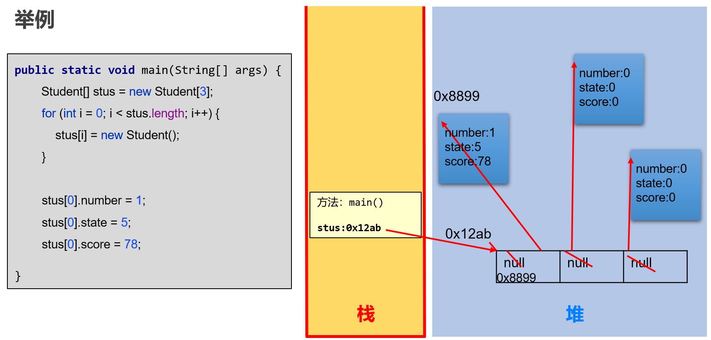

在 JDK8 中，静态变量存储在堆中。

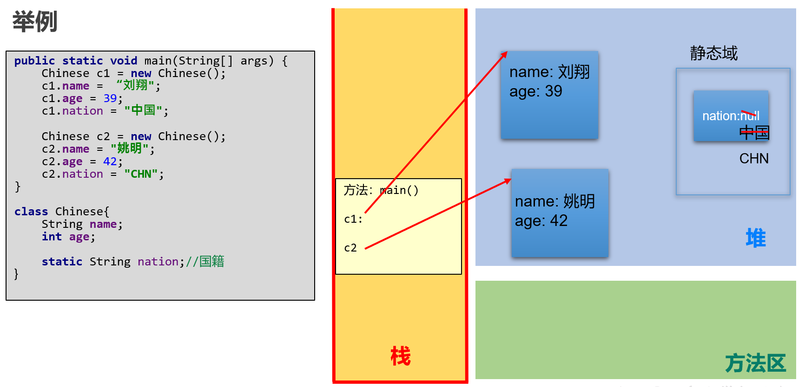

## 成员变量
+ 可用权限修饰符：public,protected,缺省, private
+ 其他修饰符：static、final
+ 可以不赋值（使用默认值）

### 成员变量 VS 局部变量
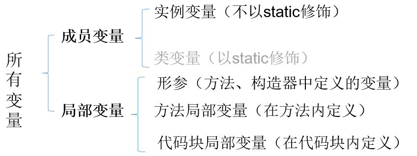

| 不同点 | 成员变量 | 局部变量 |
| --- | --- | --- |
| 声明位置和方式 | 类中方法外 | 在方法体{}中或方法的形参列表、代码块中 |
| 在内存中存储的位置 | 堆 | 栈 |
| 生命周期 | 和对象的生命周期一样，随着对象的创建而存在，随着对象被GC回收而消亡， 而且每一个对象的实例变量是独立的。 | 和方法调用的生命周期一样，每一次方法<br/>被调用而在存在，随着方法执行的结束而消亡， 而且每一次方法调用都是独立。 |
| 作用域 | 通过对象就可以使用，本类中直接调用，其他类中“对象.实例变量” | 出了作用域就不能使用 |
| 修饰符 | public,protected,缺省, private,final,volatile,transient等 | final |
| 默认值 | 有默认值 | 没有，必须手动初始化。<br/>形参靠实参初始化 |


### 实例变量赋值顺序

1. 声明成员变量的默认初始化  
2. 显式初始化、多个初始化块依次被执行（同级别下按先后顺序执行）  
3. 构造器再对成员进行初始化操作  
4. 通过`对象.属性` 或`对象.方法` 的方式，可多次给属性赋值  


## 方法
+ 方法=方法头+方法体
    - 方法头：`[修饰符] 返回值类型 方法名([形参列表])[throws 异常列表] `，也称为方法签名
+ 权限修饰符：public、protected、缺省、 private
+ 其他修饰符：static、abstract、native、final、synchronized等

### 方法调用内存分析
+ 方法没有被调用的时候，都在方法区中的字节码文件(.class)中存储。
+ 方法被调用的时候，需要进入到栈内存中运行。方法每调用一次就会在栈中有一个入栈动作，即给当前方法开辟一块独立的内存区域，用于存储当前方法的局部变量的值。
+ 当方法执行结束后，会释放该内存，称为出栈，如果方法有返回值，就会把结果返回调用处，如果没有返回值，就直接结束，回到调用处继续执行下一条指令。

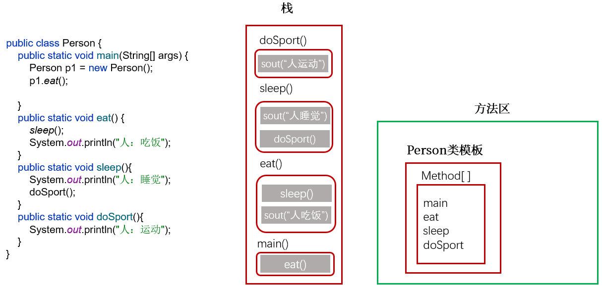

```java
public class TransferTest3 {
    public static void main(String args[]) {
        TransferTest3 test = new TransferTest3();
        test.first();
    }
    public void first() {
        int i = 5;
        Value v = new Value();
        v.i = 25;
        second(v, i);
        System.out.println(v.i);
    }
    public void second(Value v, int i) {
        i = 0;
        v.i = 20;
        Value val = new Value();
        v = val;
        System.out.println(v.i + " " + i);
    }
}
class Value {
    int i = 15;
}
```

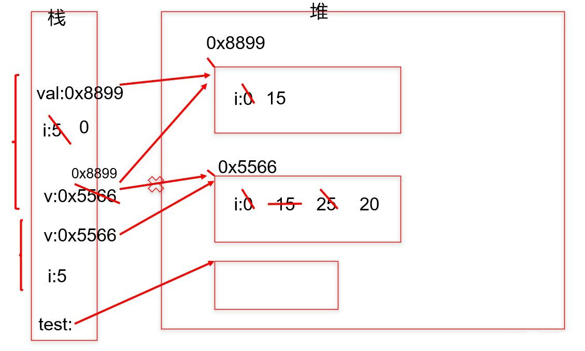


### 方法的重载
重载：在同一个类中，允许存在一个以上的同名方法，只要它们的参数列表（参数个数、类型、顺序）不同即可。

与修饰符、返回值类型无关，只看参数列表。

### 可变个数的形参
`public static void test(int a ,String...books);`

+ 方法参数部分指定类型的参数个数是可变多个：0个，1个或多个
+ 可变个数形参的方法与同名的方法之间，彼此构成重载
+ 可变参数方法的使用与方法参数部分使用数组是一致的，二者不能同时声明，否则报错。
+ 方法的参数部分有可变形参，需要放在形参声明的最后
+ 在一个方法的形参中，最多只能声明一个可变个数的形参

### 方法的参数传递机制
只有一种值传递

+ 形参是基本数据类型：将实参基本数据类型变量的“数据值”传递给形参，本身不受影响
+ 形参是引用数据类型：将实参引用数据类型变量的“地址值”传递给形参

题：

```java
public class Test {
    public static void main (String [] args) {
        int a = 10;
        int b = 10;
        method (a,b);// 需要在 method 方法被调用之后，仅打印出 a=100,b=200，请写出 method 方法的代码
        System.out.println ("a="+a);
        System.out.println ("b="+b);
    }
}
// 代码编写处
```

```java
//法一：
public static void method(int a, int b) {
    a = a * 10;
    b = b * 20;
    System.out.println(a);
    System.out.println(b);
    System.exit(0);
}

//法二：
public static void method(int a, int b) {
    PrintStream ps = new PrintStream(System.out) {
        @Override
        public void println(String x) {
            if ("a=10".equals(x)) {
                x = "a=100";
            } else if ("b=10".equals(x)) {
                x = "b=200";
            }
            super.println(x);
        }
    };
    System.setOut(ps);
}
```

### 方法的重写
父类的所有方法子类都会继承，子类可以对从父类中继承来的方法进行改造，称为方法的重写。也称为方法的重置、覆盖。

#### 方法重写的要求
1. 子类重写的方法必须和父类被重写的方法具有相同的方法名称、参数列表。
2. 子类重写的方法的返回值类型不能大于父类被重写的方法的返回值类型。
    1. 如果返回值类型是基本数据类型和void，那么必须是相同
3. 子类重写的方法使用的访问权限不能小于父类被重写的方法的访问权限。
    1. 父类私有方法不能重写   
    2. 跨包的父类缺省的方法也不能重写
4. 子类方法抛出的异常不能大于父类被重写方法的异常
5. 子类与父类中同名同参数的方法必须同时声明为非static的(即为重写)，或者同时声明为static的（不是重写）。因为static方法是属于类的，子类无法覆盖父类的方法。

```java
class Parent {
    public static void staticMethod() {
        System.out.println("Parent's static method");
    }

    public void instanceMethod() {
        System.out.println("Parent's instance method");
    }
}

class Child extends Parent {
    // 这是静态方法隐藏，并非重写
    public static void staticMethod() {
        System.out.println("Child's static method");
    }

    // 这是方法重写
    @Override
    public void instanceMethod() {
        System.out.println("Child's instance method");
    }
}

public class Main {
    public static void main(String[] args) {
        Parent.staticMethod(); // Parent's static method
        Child.staticMethod();   // Child's static method

        Parent parent = new Child();
        parent.instanceMethod();     // Child's instance method
        parent.staticMethod();       // Parent's static method

        Child child = ( Child) parent;
        child.staticMethod(); // Child's static method
    }
}
```

## 构造器
在new对象的时候为实例变量赋值。

+ 构造器名必须与它所在的类名必须相同。
+ 构造器没有返回值，所以不需要返回值类型，也不需要void，也不能有return语句返回值
+ 构造器的修饰符只能是权限修饰符，不能被其他任何修饰。

当没有显式的声明类中的构造器时，系统会默认提供一个无参的构造器并且该构造器的修饰符默认与类的修饰符相同：

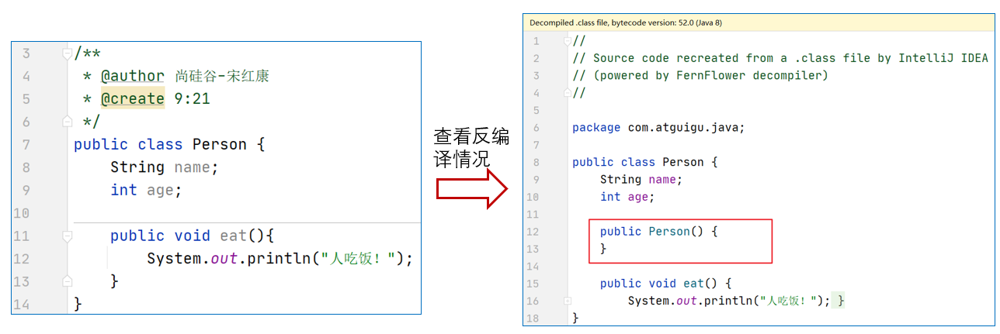

+ 当显式定义类的构造器以后，系统就不再提供默认的无参的构造器了。
+ 在类中，至少会存在一个构造器。
+ 构造器是可以重载的。


## 代码块

如果成员变量想要初始化的值不是一个硬编码的常量值，而是需要通过复杂的计算或读取文件、或读取运行环境信息等方式才能获取的一些值，此时，可以考虑代码块（或初始化块）。

### 静态代码块
为静态变量初始化，可以直接在静态变量的声明后面直接赋值，也可以使用静态代码块。

为静态变量初始化，可以直接在静态变量的声明后面直接赋值，也可以使用静态代码块。

静态代码块的执行要先于非静态代码块。

静态代码块随着类的加载而加载，且只执行一次。

### 非静态代码块
如果多个重载的构造器有公共代码，并且这些代码都是先于构造器其他代码执行的，那么可以将这部分代码抽取到非静态代码块中，减少冗余代码。

若有多个非静态的代码块，那么按照从上到下的顺序依次执行。

每次创建对象的时候，都会执行一次。且先于构造器执行。


## 对象数组
### 对象数组内存解析
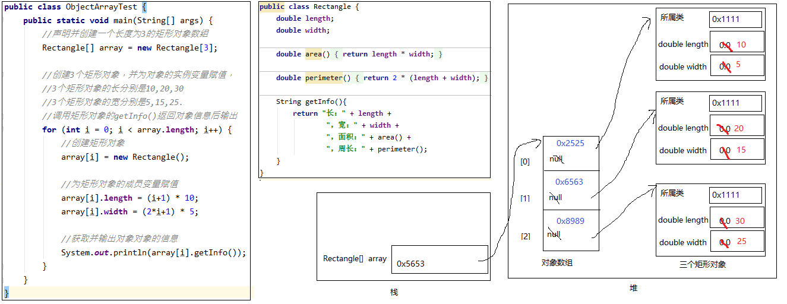


## Object 类的使用
`java.lang.Object`是所有其它类的父类。

### Object 类的方法
#### equals()
Object类源码中equals()方法实现是“==”

`==`：

+ 比较基本值：判断值相等
+ 比较引用类型：判断是否指向同一个对象
    - 用“==”进行比较时，符号两边的`数据类型必须兼容`(可自动转换的基本数据类型除外)，否则编译出错

当用equals()方法进行比较时，对类File、String、Date及包装类，是比较类型及内容而不考虑引用的是否是同一个对象；

+ 原因：在这些类中重写了Object类的equals()方法。

当自定义使用equals()时，可以重写。用于比较两个对象的“内容”是否都相等。


#### toString()
默认情况下，toString()返回的是“对象的运行时类型 @ 对象的hashCode值的十六进制形式"。

如果直接System.out.println(对象)，默认会自动调用这个对象的toString()。


#### clone()
创建并返回当前对象的一个副本。


#### getClass()
获取对象的运行时类型。


#### hashCode()
返回每个对象的hash值。


### native 关键字的理解
使用native关键字说明这个方法是原生函数，也就是这个方法是用`C/C++`等非Java语言实现的，并且`被编译成了DLL`，由Java去调用。


## 关键字：package、import
### package
package用于指明该文件中定义的类、接口等结构所在的包：`package 顶层包名.子包名 ;`

一个 java 文件只能有一个 package 语句，且作为第一条语句。

### JDK 中主要的包介绍
+ `java.lang` ----包含一些Java语言的核心类，如String、Math、Integer、 System和Thread，提供常用功能
+ `java.net` ----包含执行与网络相关的操作的类和接口。 
+ `java.io` ----包含能提供多种输入/输出功能的类。 
+ `java.util` ----包含一些实用工具类，如定义系统特性、接口的集合框架类、使用与日期日历相关的函数。 
+ `java.text` ----包含了一些java格式化相关的类 
+ `java.sql` ----包含了java进行JDBC数据库编程的相关类/接口 
+ `java.awt` ----包含了构成抽象窗口工具集（abstract window toolkits）的多个类，这些类被用来构建和管理应用程序的图形用户界面(GUI)。

### import
`import 包名.类名;`

+ import语句，声明在包的声明和类的声明之间。
+ 使用`a.*` ，表示可以导入a包下的所有的结构。如：使用java.util.*，一次性导入util包下所有的类或接口。
+ 如果导入的类或接口是`java.lang`包下的，或者当前包下的，则可以省略此import语句。
+ 如果在代码中使用不同包下的同名的类，那么就需要使用类的全类名的方式指明调用的是哪个类。


## 关键字：this、super
### this
在实例方法内部使用，表示调用该方法的对象。

在构造器内部使用，表示该构造器正在初始化的对象。

this 可以调用的结构：成员变量、实例方法、构造器。

#### this 使用场景：
一般省略，如果要区分成员变量和局部变量，需使用 this 来区分。

同一个类中构造器的相互调用，this 必须放在首行：

+ this() ：调用本类的无参构造
+ this(实参列表)：调用本类的有参构造
+ 不能出现递归调用

### super
在 java 类中可以使用 super 调用父类的属性、成员方法、父类构造器。尤其是当父子类出现同名的成员时，用 super 表明是父类的成员。

super和this的用法相似，this代表本类对象的引用，super代表父类的内存空间的标识。

#### super 使用场景：
子类中调用父类被重写的方法。

```java
public class Phone {
    public void showNum(){
        System.out.println("来电显示号码");
    }
}

public class SmartPhone extends Phone{
    
    public void showNum(){
        System.out.println("显示来电姓名");
        System.out.println("显示头像");

        //保留父类的功能
        super.showNum();//此处必须加super.，否则就是无限递归，那么就会栈内存溢出
    }
}
```

子类中调用父类同名的成员变量。

子类构造器中调用父类构造器：

+ 子类不会继承父类构造器，只能通过 super(形参列表) 的方式调用父类指定的构造器
+ 必须声明在构造器的首行（在构造器的首行，this 和 super 只能二选一）
+ 如果在子类构造器的首行既没有显示调用 this(形参列表)，也没有显式调用 super(形参列表) ，  则子类此构造器默认调用 super() ，即调用父类中空参的构造器。
+ 从上面就能看出：
    - 子类的任何一个构造器中，要么会调用本类中重载的构造器，要么会调用父类的构造器。
    - 一个类中声明有n个构造器，最多有n-1个构造器中使用了 this(形参列表) ，则剩下的那个一定使用 super(形参列表) 。
    - 如果子类构造器中既未显式调用父类或本类的构造器，且父类中又没有空参的构造器，则编译出错。

```java
class A{
	A(){
		System.out.println("A类无参构造器");
	}
}
class B extends A{
	B(){
		System.out.println("B类无参构造器");
	}
}
class Test{
    public static void main(String[] args){
        B b = new B();
        //A类显示声明一个无参构造，
		//B类显示声明一个无参构造，        
		//B类的无参构造中虽然没有写super()，但是仍然会默认调用A类的无参构造
        
        //输出: “A类无参构造器" "B类无参构造器"
    }
}
```

```java
class A{
	A(int a){
		System.out.println("A类有参构造器");
	}
}
class B extends A{
	B(){
		System.out.println("B类无参构造器");
	}
}
class Test{
    public static void main(String[] args){
        B b = new B();
        //A类显示声明一个有参构造，没有写无参构造，那么A类就没有无参构造了
		//B类显示声明一个无参构造，        
		//B类的无参构造没有super(...)，表示默认调用A类的无参构造
        //编译报错，因为A类没有无参构造
    }
}
```

```java
class A{
    A(){
        System.out.println("A类无参构造器");
    }
    A(int a){
        System.out.println("A类有参构造器");
    }
}
class B extends A{
    B(){
        //省略super，表示调用父类的无参构造
        System.out.println("B类无参构造器");
    }
    B(int a){
        super(a);//调用父类有参构造
        System.out.println("B类有参构造器");
    }
}
class Test{
    public static void main(String[] args){
        B b1 = new B(); // A类无参构造器  B类无参构造器
        B b2 = new B(10); //A类有参构造器  B类有参构造器
    }
}
```


### super 和 this 
表示意义：

+ 在构造器和非静态代码块中，表示正在 new 的对象。
+ 在实例方法中，表示调用当前方法的对象。

变量前面没有super.和this.

+ 在构造器、代码块、方法中如果出现使用某个变量，先查看是否是当前块声明的`局部变量`，
+ 如果不是局部变量，先从当前执行代码的`本类去找成员变量`
+ 如果从当前执行代码的本类中没有找到，会往上找`父类声明的成员变量`（权限修饰符允许在子类中访问的）

变量前面有this. 

+ 通过this找成员变量时，先从当前执行代码的本类去找成员变量
+ 如果从当前执行代码的本类中没有找到，会往上找父类声明的成员变量（权限修饰符允许在子类中访问的）

变量前面super. 

+ 通过super找成员变量，直接从当前执行代码的直接父类去找成员变量（权限修饰符允许在子类中访问的）
+ 如果直接父类没有，就去父类的父类中找（权限修饰符允许在子类中访问的）


## 关键字：static
可以修饰：属性、方法、代码块、内部类。

静态变量的默认值规则和实例变量一样。

当局部变量与静态变量`重名时`，使用“`类名.静态变量`”进行区分。

被修饰后的成员：

+ 随着类的加载而加载
+ 优先于对象存在
+ 修饰的成员，被所有对象所共享
+ 访问权限允许时，可不创建对象，直接被类调用

在 JDK6 中，静态变量存储在方法区。

### 单例设计模式
单例设计模式，就是采取一定的方法保证在整个的软件系统中，对某个类只能存在一个对象实例，并且该类只提供一个取得其对象实例的方法。

#### 饿汉式
```java
class Singleton {
    // 1.私有化构造器
    private Singleton() {
    }

    // 2.内部提供一个当前类的实例
    // 4.此实例也必须静态化
    private static Singleton single = new Singleton();

    // 3.提供公共的静态的方法，返回当前类的对象
    public static Singleton getInstance() {
        return single;
    }
}

```

#### 懒汉式
```java
class Singleton {
    // 1.私有化构造器
    private Singleton() {
    }
    // 2.内部提供一个当前类的实例
    // 4.此实例也必须静态化
    private static Singleton single;
    // 3.提供公共的静态的方法，返回当前类的对象
    public static Singleton getInstance() {
        if(single == null) {
            single = new Singleton();
        }
        return single;
    }
}

```

#### 懒汉式 vs 饿汉式
饿汉式：

+ 特点：`立即加载`，即在使用类的时候已经将对象创建完毕。
+ 优点：实现起来`简单`；没有多线程安全问题。
+ 缺点：当类被加载的时候，会初始化static的实例，静态变量被创建并分配内存空间，从这以后，这个static的实例便一直占着这块内存，直到类被卸载时，静态变量被摧毁，并释放所占有的内存。因此在某些特定条件下会`耗费内存`。

懒汉式：

+ 特点：`延迟加载`，即在调用静态方法时实例才被创建。
+ 优点：当类被加载的时候，static的实例未被创建并分配内存空间，当静态方法第一次被调用时，初始化实例变量，并分配内存，因此在某些特定条件下会`节约内存`。
+ 缺点：在多线程环境中，`线程不安全`，根本不能保证单例的唯一性。

### main 方法
JVM 调用 main 方法，因此 main 方法是 public、static 的，该方法接收一个String类型的数组参数，该数组中保存执行Java命令时传递给所运行的类的参数。 

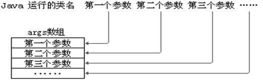

## 关键字：final
使用：

+ 修饰类：表示这个类不能被继承，没有子类。提高安全性，提高程序的可读性。
    - 如 String类、System类、StringBuffer类
+ 修饰方法：表示这个方法不能被子类重写。
+ 修饰变量：final修饰某个变量（成员或局部），一旦赋值，它的值就不能被修改，即常量。
    - 如果某个成员变量用final修饰后，没有set方法，并且必须初始化（可以显式赋值、或在初始化块赋值、实例变量还可以在构造器中赋值）

```java
public final class Test {
    public static int totalNumber = 5;
    public final int ID;   // 修饰实例变量

    public Test() {
        ID = ++totalNumber; // 可在构造器中给final修饰的实例变量赋值
    }
    public static void main(String[] args) {
        Test t = new Test();
        System.out.println(t.ID);

        final int MIN_SCORE ; // 修饰局部变量
        MIN_SCORE = 0;
        final int MAX_SCORE = 100;
        MAX_SCORE = 200; //非法
    }
}

```


## 子类对象实例化的全过程


## 封装
Java 通过权限修饰符来控制来实现封装，控制类或成员的可见性范围。

| 修饰符 | 本类内部 | 本包内 | 其他包的子类 | 其他包非子类 |
| --- | --- | --- | --- | --- |
| private | √ | × | × | × |
| 缺省 | √ | √ | × | × |
| protected | √ | √ | √ | × |
| public | √ | √ | √ | √ |


权限修饰符修饰的结构：

+ 外部类：public、缺省
+ 成员变量、成员方法、构造器、成员内部类：public、protected、缺省、private


### 4 种权限修饰符使用注意
+ 外部类挎包使用必须 public，否则缺省仅限于本包使用。
+ 如果是修饰成员
    - 本包下，可以是 public、protected、缺省
    - 挎包情况下：
        
        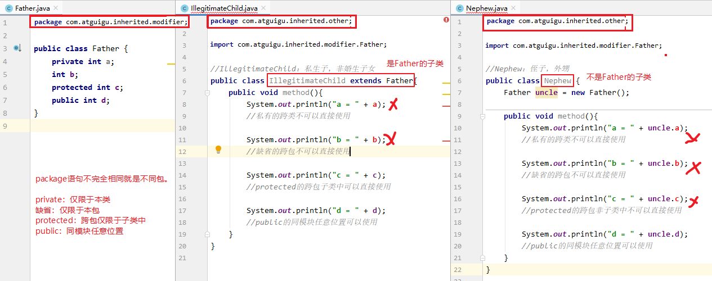
    - 跨包使用时，如果类的权限修饰符缺省，成员权限修饰符>类的权限修饰符也不行
        
        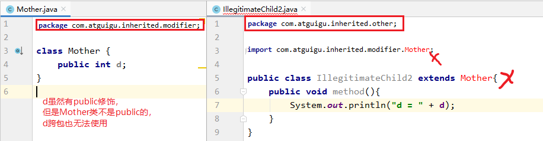


## 继承

子类也叫做派生类，父类也叫做超类、基类。

子类会继承父类所有的实例变量和实例方法，当子类对象调用方法时，编译器会先在子类模板中看该类是否有这个方法，如果没找到，会看它的父类甚至父类的父类是否声明了这个方法，找到了就停止，一直到根父类都没有找到，就会报编译错误。

子类会继承父类私有的成员变量，不能直接访问父类中私有的成员变量和方法，可通过继承get/set方法进行访问。

java 支持多层继承，所有的类默认继承Object。java 不支持多重继承，即一个子类只能继承一个父类，不能继承多个。但是一个父类可以有多个子类。

```java
public class A{}
class B extends A{}
class C extends B{} 	//ok

class D extends A,B...	//error
```

## 多态
java 多态的体现：父类（类、接口）的引用指向子类对象。即`父类类型 变量名 = 子类对象；`

### 多态的理解
Java引用变量有两个类型：`编译时类型`和`运行时类型`。编译时类型由`声明`该变量时使用的类型决定，运行时类型由`实际赋给该变量的对象`决定。

+ 若编译时类型和运行时类型不一致，就出现了对象的多态性(Polymorphism)
+ 多态的使用前提：① 类的继承关系  ② 方法的重写

变量引用的子类对象不同，执行的方法就不同（重写），实现动态绑定。但是该变量不能访问子类中添加的属性和方法。

注意：

+ 静态方法是和类绑定在一起的，并不依赖于对象实例。所以，静态方法的调用是由引用变量的编译时类型决定的，和运行时类型没有关系。
+ 静态方法不具备多态性。虽然子类可以定义和父类同名的静态方法，但这只是对父类静态方法的隐藏（隐藏是针对静态方法，编译时就会根据引用变量的类型来确定调用哪个方法），而不是重写（重写是针对实例方法，运行时会根据对象的实际类型来决定调用哪个方法）。
+ 成员变量不具备多态性，即使子类里定义了与父类完全相同的实例变量，这个实例变量依然不可能覆盖父类中定义的实例变量。

```java
public class TestVariable {
    public static void main(String[] args) {
        Base b = new Sub();
        System.out.println(b.a); //1
        System.out.println(((Sub)b).a); //2

        Sub s = new Sub();
        System.out.println(s.a); //2 
        System.out.println(((Base)s).a); //1
    }
}
class Base{
    int a = 1;
}
class Sub extends Base{
    int a = 2;
}
```


### 向上转型和向下转型
一个对象在new的时候创建是哪个类型的对象，它从头至尾都不会变。即这个对象的运行时类型，本质的类型用于不会变。但是，把这个对象赋值给不同类型的变量时，这些变量的编译时类型却不同。

父类不能访问子类特有的方法，如果想要调用子类特有方法，需要做类型转换。


+ 向上转型：
    - 编译时按照左边变量的类型处理，就只能调用父类中有的变量和方法。
    - 运行时，仍然是对象本身的类型，所以执行的方法是子类重写的方法体。
    - 一定是安全的，且自动完成。
+ 向下转型：
    - 向下转型可能会发生ClassCastException，为了安全，需通过isInstanceof关键字进行判断

```java
public class TestInstanceof {
    public static void main(String[] args) {
        Pet[] pets = new Pet[2];
        pets[0] = new Dog();//多态引用，向上转型
        pets[0].setNickname("小白");
        pets[1] = new Cat();//多态引用，向上转型
        pets[1].setNickname("雪球");

        for (int i = 0; i < pets.length; i++) {
            pets[i].eat();

            if(pets[i] instanceof Dog){
                
                // 向下转型
                Dog dog = (Dog) pets[i];
                dog.watchHouse();
            }else if(pets[i] instanceof Cat){

                // 向下转型
                Cat cat = (Cat) pets[i];
                cat.catchMouse();
            }
        }
    }
}
```


## 抽象类和抽象方法
被 abstract 修饰的类为抽象类，被 abstract 修饰的没有方法体的方法叫做抽象方法。

```java
abstract class Animal {
    public abstract void eat();
}

class Cat extends Animal {
    public void eat (){
        System.out.println("小猫吃鱼和猫粮");
    }
}

public class CatTest {
    public static void main(String[] args) {
        // 创建子类对象
        Cat c = new Cat();

        // 调用eat方法
        c.eat();
    }
}
```

此时的方法重写，是子类对父类抽象方法的完成实现，将这种方法重写也叫做实现方法。

抽象类不能创建对象，一般是子类继承抽象类并实现抽象类的所有抽象方法 提供方法体实现，如果子类没有全部重写抽象方法，则子类也应为抽象类。

抽象类中，也有构造方法，是供子类创建对象时，初始化父类成员变量使用的。

抽象类中，不一定包含抽象方法（目的就是不想让调用者创建该类对象），但是有抽象方法的类必定是抽象类。

不能用 abstract 修饰变量、代码块、构造器、私有方法、静态方法、final 修饰的方法、final 修饰的类。


## 接口
接口的定义与定义类方式相似，但是使用 `interface` 关键字。它也会被编译成.class文件，但一定要明确它并不是类，而是另外一种引用数据类型。

> 引用数据类型：数组，类，枚举，接口，注解。
>

### 接口的成员
在JDK8.0 之前，接口中只允许出现：

1. 公共的静态的常量：其中`public static final`可以省略
2. 公共的抽象的方法：其中`public abstract`可以省略

在JDK8.0 时，接口中允许声明`默认方法`和`静态方法`：

3. 公共的默认的方法：其中public 可以省略，建议保留，但是default不能省略
4. 公共的静态的方法：其中public 可以省略，建议保留，但是static不能省略

> `静态方法`：因为之前的标准类库设计中，有很多Collection/Colletions或者Path/Paths这样成对的接口和类，后面的类中都是静态方法，而这些静态方法都是为前面的接口服务的，那么这样设计一对API，不如把静态方法直接定义到接口中使用和维护更方便。
>
> `默认方法`：（1）要在已有的老版接口中提供新方法时，如果添加抽象方法，就会涉及到原来使用这些接口的类就会有问题，那么为了保持与旧版本代码的兼容性，只能允许在接口中定义默认方法实现。比如：Java8中对Collection、List、Comparator等接口提供了丰富的默认方法。（2）当接口的某个抽象方法，在很多实现类中的实现代码是一样的，此时将这个抽象方法设计为默认方法更为合适，那么实现类就可以选择重写，也可以选择不重写。
>

在JDK9.0 时，接口又增加了：

5. 私有方法

> 因为有了默认方法和静态方法这样具有具体实现的方法，那么就可能出现多个方法由共同的代码可以抽取，而这些共同的代码抽取出来的方法又只希望在接口内部使用，所以就增加了私有方法。
>


接口中没有构造器，没有初始化块，因为接口中没有成员变量需要动态初始化。 

```java
public interface USB3{
    //静态常量
    long MAX_SPEED = 500*1024*1024;//500MB/s

    //抽象方法
    void in();
    void out();

    //默认方法
    default void start(){
        System.out.println("开始");
    }
    default void stop(){
        System.out.println("结束");
    }

    //静态方法
    static void show(){
        System.out.println("USB 3.0可以同步全速地进行读写操作");
    }
}
```

### 接口的使用规则
接口不能创建对象，但是可以被类实现（`implements` ）。

接口的实现类：

+ 必须重写接口中所有抽象方法。（如果实现类是抽象类则不需要）
+ 默认方法可以选择保留，也可以重写。
    - 重写时，default单词就不要再写了，它只用于在接口中表示默认方法，到类中就没有默认方法的概念了
+ 接口中的静态方法不能被继承也不能被重写

接口的多实现：一个类可以同时继承一个父类并实现多个接口。

+ 如果抽象方法有重名，只需要重写一次。

接口的多继承：一个接口能继承另一个或者多个接口，接口的继承也使用 `extends` 关键字，子接口继承父接口的方法。

```java
public interface UsbC extends Chargeable,USB3 {
    void reverse();
}
```

接口与实现类对象构成多态引用。

接口的静态方法不能被继承，也不能被重写。接口的静态方法只能通过“接口名.静态方法名”进行调用。

> 类的静态方法可以被继承，不能被重写。
>

对于接口的抽象方法、默认方法，只能通过实现类对象才可以调用。


### JDK8 中相关冲突问题
#### 默认方法冲突
当一个类，既继承一个父类，又实现若干个接口时，父类中的成员方法与接口中的方法重名，子类就近选择执行父类的成员方法。

```java
class Parent {
    public void display() {
        System.out.println("Parent's display method");
    }
}

interface MyInterface {
    default void display(){
        System.out.println("MyInterface's default display method");
    }
}

class Child extends Parent implements MyInterface {
    // 无需显式实现display()方法，因为父类已经提供了具体实现
}

class Child2 extends Parent implements MyInterface{
    @Override
    public void display() {
        //  保留父接口的默认方法
        MyInterface.super.display();
        System.out.println("Child2's display method");
    }
}

public class Main {
    public static void main(String[] args) {
        Child child = new Child();
        child.display(); // 输出：Parent's display method

        // 通过接口引用调用
        MyInterface obj = child;
        obj.display(); // 同样输出：Parent's display method

        Child2 child2 = new Child2();
        child2.display(); // 输出：MyInterface's default display method \n Child2's display method
    }
}
```

当一个类同时实现了多个父接口，而多个父接口中包含方法签名相同的默认方法时，选择保留其中一个，通过“`接口名.super.方法名`"的方法选择保留哪个接口的默认方法。

```java
interface InterfaceA {
    default void display() {
        System.out.println("InterfaceA's display method");
    }
}

interface InterfaceB {
    default void display() {
        System.out.println("InterfaceB's display method");
    }
}

class MyClass implements InterfaceA, InterfaceB {
    @Override
    public void display() {
        InterfaceA.super.display(); // 选择使用InterfaceA的默认实现
    }
}

public class Main {
    public static void main(String[] args) {
        MyClass obj = new MyClass();
        obj.display(); // 输出：InterfaceA's display method
    }
}
```

当一个子接口同时继承了多个接口，而多个父接口中包含方法签名相同的默认方法时，子接口需要显式解决冲突。与类不同，接口不能通过`super`调用父接口的默认方法，但可以重新声明该方法为抽象方法（强制实现类重写），或提供新的默认实现。

>  子类重写默认方法时，default 不能保留；子接口重写默认方法时，default 可以保留。
>

```java
interface ParentA {
    default void show() {
        System.out.println("ParentA's show");
    }
}

interface ParentB {
    default void show() {
        System.out.println("ParentB's show");
    }
}

// 方式1：重新声明为抽象方法
interface ChildInterface1 extends ParentA, ParentB {
    void show(); // 强制实现类重写
}

// 方式2：提供新的默认实现
interface ChildInterface2 extends ParentA, ParentB {
    @Override
    default void show() {
        System.out.println("ChildInterface2's show");
    }
}

// 实现类（针对ChildInterface1）
class Impl1 implements ChildInterface1 {
    @Override
    public void show() {
        System.out.println("Impl1's show");
    }
}

// 实现类（针对ChildInterface2）
class Impl2 implements ChildInterface2 {
    // 无需重写show()，使用ChildInterface2的默认实现
}

public class Main {
    public static void main(String[] args) {
        Impl1 obj1 = new Impl1();
        obj1.show(); // 输出：Impl1's show

        Impl2 obj2 = new Impl2();
        obj2.show(); // 输出：ChildInterface2's show
    }
}
```

#### 常量冲突问题
当子类继承父类又实现父接口，而父类中存在与父接口常量同名的成员变量，并且该成员变量名在子类中仍然可见。

当子类同时实现多个接口，而多个接口存在相同同名常量。

需要显式指定。

```java
class SuperClass {
    int x = 1;
}
interface SuperInterface {
    int x = 2;
    int y = 2;
}
interface MotherInterface {
    int x = 3;
}

public class Main extends SuperClass implements SuperInterface,MotherInterface {
    public static void main(String[] args) {
        new Main().func();
    }
    public  void func(){
//        System.out.println("x = " + x);//报错，模糊不清
        System.out.println("super.x = " + super.x); //super.x = 1
        System.out.println("SuperInterface.x = " + SuperInterface.x); //SuperInterface.x = 2
        System.out.println("MotherInterface.x = " + MotherInterface.x); //MotherInterface.x = 3
        System.out.println("y = " + y);//没有重名问题，可以直接访问 //y = 2
    }
}
```


### 接口 vs 抽象类

| No.  | 区别点       | 抽象类                                   | 接口                                        |
| ---- | ------------ | ---------------------------------------- | ------------------------------------------- |
| 1    | 定义         | 可以包含抽象方法的类                     | 主要是抽象方法和全局常量的集合              |
| 2    | 组成         | 构造方法、抽象方法、普通方法、常量、变量 | 常量、抽象方法、(jdk8.0:默认方法、静态方法) |
| 3    | 使用         | 子类继承抽象类(extends)                  | 子类实现接口(implements)                    |
| 4    | 关系         | 抽象类可以实现多个接口                   | 接口不能继承抽象类，但允许继承多个接口      |
| 5    | 常见设计模式 | 模板方法                                 | 简单工厂、工厂方法、代理模式                |
| 6    | 对象         | 都通过对象的多态性产生实例化对象         |                                             |
| 7    | 局限         | 抽象类有单继承的局限                     | 接口没有此局限                              |
| 8    | 实际         | 作为一个模板                             | 是作为一个标准或是表示一种能力              |

如果抽象类和接口都可以使用的话，优先使用接口，因为避免单继承的局限。


## 内部类
当一个事物A的内部，还有一个部分需要一个完整的结构B进行描述，而这个内部的完整的结构B又只为外部事物A提供服务，不在其他地方单独使用，那么整个内部的完整结构B最好使用内部类。

内部类分类：

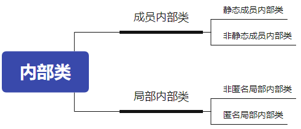

### 成员内部类
成员内部类中不使用外部类的非静态成员，那么通常将内部类声明为静态内部类，否则声明为非静态内部类。

成员内部类作为`类的成员的角色`，和外部类不同，Inner class还可以声明为private或protected；可以调用外部类的结构（在静态内部类中不能使用外部类的非静态成员），Inner class 可以声明为static的，但此时就不能再使用外层类的非static的成员变量；

成员内部类作为`类的角色`，可以在内部定义属性、方法、构造器等结构，可以继承自己的想要继承的父类，实现自己想要实现的父接口们，和外部类的父类和父接口无关。可以声明为abstract类 ，因此可以被其它的内部类继承；可以声明为final的，表示不能被继承。编译以后生成OuterClass$InnerClass.class字节码文件（也适用于局部内部类）

外部类访问成员内部类的成员，需要“内部类.成员”或“内部类对象.成员”的方式。

成员内部类可以直接使用外部类的所有成员，包括私有的数据。

```java
public class TestMemberInnerClass {
    public static void main(String[] args) {
        //创建静态内部类实例，并调用方法
        Outer.StaticInner inner = new Outer.StaticInner();
        inner.inFun();
        //调用静态内部类静态方法
        Outer.StaticInner.inMethod();

        System.out.println("*****************************");

        //创建非静态内部类实例（方式1），并调用方法
        Outer outer = new Outer();
        Outer.NoStaticInner inner1 = outer.new NoStaticInner();
        inner1.inFun();

        //创建非静态内部类实例（方式2）
        Outer.NoStaticInner inner2 = outer.getNoStaticInner();
        inner1.inFun();
    }
}
class Outer{
    private static String a = "外部类的静态a";
    private static String b  = "外部类的静态b";
    private String c = "外部类对象的非静态c";
    private String d = "外部类对象的非静态d";

    static class StaticInner{
        private static String a ="静态内部类的静态a";
        private String c = "静态内部类对象的非静态c";
        public static void inMethod(){
            System.out.println("Inner.a = " + a); // Inner.a = 静态内部类的静态a
            System.out.println("Outer.a = " + Outer.a); // Outer.a = 外部类的静态a
            System.out.println("b = " + b); // b = 外部类的静态b
        }
        public void inFun(){
            System.out.println("Inner.inFun"); // Inner.inFun
            System.out.println("Outer.a = " + Outer.a); // Outer.a = 外部类的静态a
            System.out.println("Inner.a = " + a); // Inner.a = 静态内部类的静态a
            System.out.println("b = " + b); // b = 外部类的静态b
            System.out.println("c = " + c); // c = 静态内部类对象的非静态c
//            System.out.println("d = " + d);//不能访问外部类的非静态成员
        }
    }

    class NoStaticInner{
        private String a = "非静态内部类对象的非静态a";
        private String c = "非静态内部类对象的非静态c";

        public void inFun(){
            System.out.println("NoStaticInner.inFun"); // NoStaticInner.inFun
            System.out.println("Outer.a = " + Outer.a); // Outer.a = 外部类的静态a
            System.out.println("a = " + a); // a = 非静态内部类对象的非静态a
            System.out.println("b = " + b); // b = 外部类的静态b
            System.out.println("Outer.c = " + Outer.this.c); // Outer.c = 外部类对象的非静态c
            System.out.println("c = " + c); // c = 非静态内部类对象的非静态c
            System.out.println("d = " + d); // d = 外部类对象的非静态d
        }
    }
    public NoStaticInner getNoStaticInner(){
        return new NoStaticInner();
    }
}

```

### 局部内部类
#### 非匿名局部内部类
编译后有自己的独立的字节码文件，只不过在内部类名前面冠以外部类名、$符号、编号。

+ 这里有编号是因为同一个外部类中，不同的方法中存在相同名称的局部内部类

和成员内部类不同的是，它前面不能有权限修饰符等

局部内部类如同局部变量一样，有作用域

局部内部类中是否能访问外部类的非静态的成员，取决于所在的方法

```java

public class TestLocalInner {
    public static void main(String[] args) {
        Outer.outMethod();
        System.out.println("-------------------");

        Outer out = new Outer();
        out.outTest();
        System.out.println("-------------------");

        Runner runner = Outer.getRunner();
        runner.run();

    }
}
class Outer{

    public static void outMethod(){
        System.out.println("Outer.outMethod");
        final String c = "局部变量c";
        class Inner{
            public void inMethod(){
                System.out.println("Inner.inMethod");
                System.out.println(c); // 局部变量c
            }
        }

        Inner in = new Inner();
        in.inMethod();
    }

    public void outTest(){
        class Inner{
            public void inMethod1(){
                System.out.println("Inner.inMethod1"); // Inner.inMethod1
            }
        }

        Inner in = new Inner();
        in.inMethod1();
    }

    public static Runner getRunner(){
        class LocalRunner implements Runner{
            @Override
            public void run() {
                System.out.println("LocalRunner.run");
            }
        }
        return new LocalRunner();
    }

}
interface Runner{
    void run();
}
```

#### 匿名内部类
如果实现类的一次性的，不需要取名字，可以使用匿名内部类的方式。

```java
interface A{
	void method();
}
public class Test{
    public static void test(A a){
    	a.method();
    }
    
    public static void main(String[] args){
        // 匿名内部类的对象作为实参
    	test(new A(){
			@Override
			public void method() {
				System.out.println("aaaa");
			}
    	});

        // 使用匿名内部类的对象直接调用方法
        new A(){
			@Override
			public void a() {
				System.out.println("aaaa");
			}
    	}.a();
    }   
}
```

## 枚举类
枚举类型本质上也是一种类，只不过是这个类的对象是有限的、固定的几个，不能让用户随意创建。

> 若枚举只有一个对象，则可以作为一种单例模式的实现方式。
>

在 JDK5 之前，需要自定义枚举类型；在 JDK5 之后，java 支持 enum 关键字来快速定义枚举类型。

### 自定义枚举类
1. `私有化`类的构造器，保证不能在类的外部创建其对象
2. 在类的内部创建枚举类的实例。声明为：`public static final` ，对外暴露这些常量对象
3. 对象如果有`实例变量`，应该声明为`private final`（建议，不是必须），并在构造器中初始化

```java
class Season{
    private final String SEASONNAME;//季节的名称
    private final String SEASONDESC;//季节的描述
    private Season(String seasonName,String seasonDesc){
        this.SEASONNAME = seasonName;
        this.SEASONDESC = seasonDesc;
    }
    public static final Season SPRING = new Season("春天", "春暖花开");
    public static final Season SUMMER = new Season("夏天", "夏日炎炎");
    public static final Season AUTUMN = new Season("秋天", "秋高气爽");
    public static final Season WINTER = new Season("冬天", "白雪皑皑");

    @Override
    public String toString() {
        return "Season{" +
                "SEASONNAME='" + SEASONNAME + '\'' +
                ", SEASONDESC='" + SEASONDESC + '\'' +
                '}';
    }
}
```

### enum 关键字定义枚举类
枚举类的常量对象列表必须在枚举类的首行，系统会自动添加 public static final 修饰。

如果常量对象列表后面没有其他代码，那么`;`可以省略，否则不可以省略。

编译器给枚举类默认提供的是private的无参构造，如果枚举类需要的是无参构造，就不需要声明，写常量对象列表时也不用加参数

如果枚举类需要的是有参构造，需要手动定义，有参构造的private可以省略，调用有参构造的方法就是在常量对象名后面加(实参列表)就可以。

枚举类默认继承的是java.lang.Enum类，因此不能再继承其他的类型。

JDK5.0 之后switch，提供支持枚举类型，case后面可以写枚举常量名，无需添加枚举类作为限定。

```java
public enum SeasonEnum {
    SPRING("春天","春风又绿江南岸"),
    SUMMER("夏天","映日荷花别样红"),
    AUTUMN("秋天","秋水共长天一色"),
    WINTER("冬天","窗含西岭千秋雪");

    private final String seasonName;
    private final String seasonDesc;
    
    private SeasonEnum(String seasonName, String seasonDesc) {
        this.seasonName = seasonName;
        this.seasonDesc = seasonDesc;
    }
    public String getSeasonName() {
        return seasonName;
    }
    public String getSeasonDesc() {
        return seasonDesc;
    }
}

```

#### enum 中常用方法
`String toString()`: 默认返回的是常量名（对象名），可重写。

`static 枚举类型[] values()`:返回枚举类型的对象数组。该方法可以很方便地遍历所有的枚举值，是一个静态方法

`static 枚举类型 valueOf(String name)`：可以把一个字符串转为对应的枚举类对象。要求字符串必须是枚举类对象的“名字”。如不是，会有运行时异常：IllegalArgumentException。

`String name()`:得到当前枚举常量的名称。建议优先使用toString()。

`int ordinal()`:返回当前枚举常量的次序号，默认从0开始


### 实现接口的枚举类
和普通 Java 类一样，枚举类可以实现一个或多个接口。

若每个枚举值在调用实现的接口方法呈现相同的行为方式，则只要统一实现该方法即可。

若需要每个枚举值在调用实现的接口方法呈现出不同的行为方式，则可以让每个枚举值分别来实现该方法。

```java
interface Info{
	void show();
}

//使用enum关键字定义枚举类
enum Season1 implements Info{
	//1. 创建枚举类中的对象,声明在enum枚举类的首位
	SPRING("春天","春暖花开"){
		public void show(){
			System.out.println("春天");
		}
	},
	SUMMER("夏天","夏日炎炎"){
		public void show(){
			System.out.println("夏天");
		}
	},
	AUTUMN("秋天","秋高气爽"){
		public void show(){
			System.out.println("秋天");
		}
	},
	WINTER("冬天","白雪皑皑"){
		public void show(){
			System.out.println("冬天");
		}
	};
	
	//2. 声明每个对象拥有的属性:private final修饰
	private final String SEASON_NAME;
	private final String SEASON_DESC;
	
	//3. 私有化类的构造器
	private Season1(String seasonName,String seasonDesc){
		this.SEASON_NAME = seasonName;
		this.SEASON_DESC = seasonDesc;
	}
	
	public String getSEASON_NAME() {
		return SEASON_NAME;
	}

	public String getSEASON_DESC() {
		return SEASON_DESC;
	}
}
```

## 注解
从 JDK5.0 引入。

注解（ Annotation） 可以像修饰符一样被使用，可用于修饰包、类、构造器、方法、成员变量、参数、局部变量的声明。还可以添加一些参数值，这些信息被保存在 Annotation 的 “name=value” 对中。

注解可以在类编译、运行时进行加载，体现不同的功能。

> 注释是给程序员看的；注解是可以被编译器或其他程序读取的，程序可以根据注解的不同，做出相应的处理。
>

框架 = 注解 + 反射 + 设计模式。


### 常见注解的作用
+ 生成文档相关的注解

```java
/**
 * @author 李白
 * @version 1.0
 * @see Math.java
 */
public class JavadocTest {
	/**
	 * 程序的主方法，程序的入口
	 * @param args String[] 命令行参数
	 */
	public static void main(String[] args) {
	}
	
	/**
	 * 求圆面积的方法
	 * @param radius double 半径值
	 * @return double 圆的面积
	 */
	public static double getArea(double radius){
		return Math.PI * radius * radius;
	}
}

```

+ 在编译时进行格式检查
    - `@Override`: 限定重写父类方法，该注解只能用于方法
    - `@Deprecated`: 用于表示所修饰的元素(类，方法等)已过时。通常是因为所修饰的结构危险或存在更好的选择
    - `@SuppressWarnings`: 抑制编译器警告
+ 跟踪代码依赖性，实现替代配置文件功能
    - Servlet3.0提供了注解，使得不再需要在web.xml文件中进行Servlet的部署。
    - Spring框架中关于“事务”的管理使用了注解


### 元注解
JDK1.5在java.lang.annotation包定义了4个标准的meta-annotation类型，用来对其它 annotation类型作说明。

1. @Target：用于描述注解的使用范围
    1. 可以通过枚举类型ElementType的10个常量对象来指定：TYPE，METHOD，CONSTRUCTOR，PACKAGE.....
2. @Retention：用于描述注解的生命周期
    1. 可以通过枚举类型RetentionPolicy的3个常量对象来指定：SOURCE（源代码）、CLASS（字节码）、RUNTIME（运行时）
    2. 唯有RUNTIME阶段才能被反射读取到。
3. @Documented：表明这个注解应该被 javadoc工具记录。
4. @Inherited：允许子类继承父类中的注解


### 自定义注解
+ 自定义注解可以通过四个元注解@Retention,@Target，@Inherited,@Documented，分别说明它的声明周期，使用位置，是否被继承，是否被生成到API文档中。
+ Annotation 的成员在 Annotation 定义中以无参数有返回值的抽象方法的形式来声明，我们又称为配置参数。返回值类型只能是八种基本数据类型、String类型、Class类型、enum类型、Annotation类型、以上所有类型的数组
+ 可以使用 default 关键字为抽象方法指定默认返回值
+ 如果定义的注解含有抽象方法，那么使用时必须指定返回值，除非它有默认值。格式是“方法名 = 返回值”，如果只有一个抽象方法需要赋值，且方法名为value，可以省略“value=”，所以如果注解只有一个抽象方法成员，建议使用方法名value。

```java
import java.lang.annotation.*;
import java.lang.reflect.Method;

@Retention(RetentionPolicy.RUNTIME)
@Target(ElementType.METHOD)
@interface Test {
    boolean enabled() default true;
}

class Calculator {
    @Test(enabled = true)
    public int add(int a, int b) {
        return a + b;
    }
    
    @Test(enabled = false)
    public int divide(int a, int b) {
        return a / b;
    }
}

public class Main {
    public static void main(String[] args) throws Exception {
        Calculator calc = new Calculator();
        Class<?> clazz = calc.getClass();

        // 遍历类的所有声明方法
        for (Method method : clazz.getDeclaredMethods()) {
            // 检查方法是否有@Test注解
            if (method.isAnnotationPresent(Test.class)) {
                // 获取方法上的@Test注解实例
                Test test = method.getAnnotation(Test.class);

                // 根据注解配置决定是否执行测试
                if (test.enabled()) {
                    System.out.println("执行测试: " + method.getName());

                    // 通过反射调用测试方法
                    Object result = method.invoke(calc, 10, 5);
                    System.out.println("结果: " + result);
                } else {
                    System.out.println("跳过测试: " + method.getName());
                }
            }
        }
    }
}    
```

## 包装类
Java针对八种基本数据类型定义了相应的引用类型：包装类（封装类）。

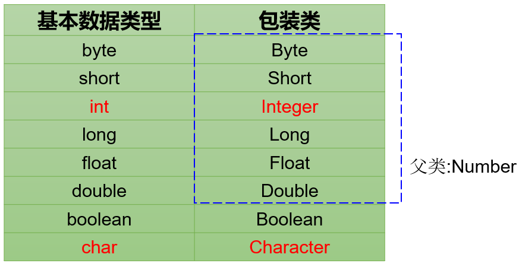

### 自定义包装类
```java
public class MyInteger {
    int value;

    public MyInteger() {
    }

    public MyInteger(int value) {
        this.value = value;
    }

    @Override
    public String toString() {
        return String.valueOf(value);
    }
}

```

### 基本数据类型、包装类、字符串间的转换
装箱：基本数据类型 --- >  包装类 

```java
// 使用构造器这种方法在JDK9已经弃用，建议使用valueOf()
Integer obj1 = new Integer(4);//使用构造函数函数
Float f = new Float(“4.56”);
Long l = new Long(“asdf”);  //NumberFormatException

Integer obj2 = Integer.valueOf(4);//使用包装类中的valueOf方法
```

拆箱：包装对象 --- > 基本数值

```java
Integer obj = new Integer(4);
int num1 = obj.intValue();
```

从JDK5.0 开始，基本类型与包装类的装箱、拆箱动作可以自动完成。

```java
Integer i = 4;//自动装箱。相当于Integer i = Integer.valueOf(4);
i = i + 5;//等号右边：将i对象转成基本数值(自动拆箱) i.intValue() + 5;
//加法运算完成后，再次装箱，把基本数值转成对象。

// 注意：只能与自己对应的类型之间才能实现自动装箱与拆箱。
Double d = 1;//错误的，1是int类型
```

基本数据类型 --- >  字符串

```java
int a=1;
String s = String.valueOf(a);

//或者
String str = a + "";
```

字符串 ---  >  基本数据类型

```java

// 方式1：使用包装类的parseXxx方法
int intValue1 = Integer.parseInt("123");
long longValue1 = Long.parseLong("9876543210");
double doubleValue1 = Double.parseDouble("3.14159");
boolean booleanValue1 = Boolean.parseBoolean("true");

// 方式2：使用包装类的valueOf方法（自动拆箱）
int intValue2 = Integer.valueOf("456");
long longValue2 = Long.valueOf("1234567890");
double doubleValue2 = Double.valueOf("2.71828");
boolean booleanValue2 = Boolean.valueOf("false");

// 方式3：通过包装类的构造器（自动拆箱，Java 9+已弃用，建议使用valueOf）
int intValue3 = new Integer("789");  // 已弃用的写法
double doubleValue3 = new Double("1.618");  // 已弃用的写法

```

总结：

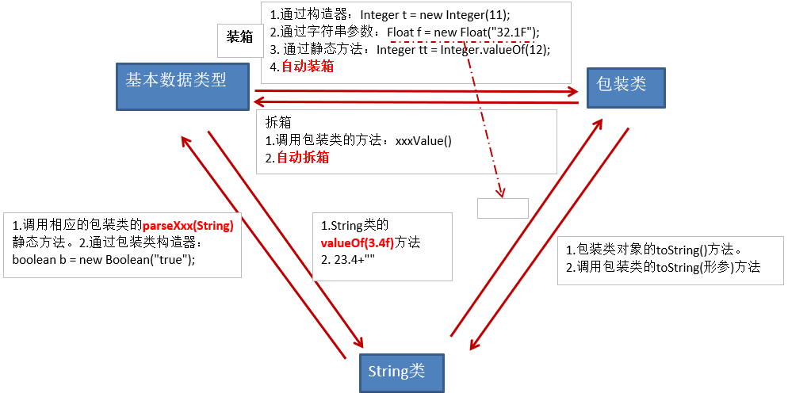

### 包装类对象的特点
#### 包装类缓存对象
| 包装类 | 缓存对象 |
| --- | --- |
| Byte | -128~127 |
| Short | -128~127 |
| Integer | -128~127 |
| Long | -128~127 |
| Float | 没有 |
| Double | 没有 |
| Character | 0~127 |
| Boolean | true和false |


```java
Integer a = 1;
Integer b = 1;
System.out.println(a == b);//true

Integer i = 128;
Integer j = 128;
System.out.println(i == j);//false

Integer m = new Integer(1);//新new的在堆中 // 在JDK9+已弃用
Integer n = 1;//这个用的是缓冲的常量对象，在方法区
System.out.println(m == n);//false

Integer x = new Integer(1);//新new的在堆中
Integer y = new Integer(1);//另一个新new的在堆中
System.out.println(x == y);//false

Double d1 = 1.0;
Double d2 = 1.0;
System.out.println(d1==d2);//false 比较地址，没有缓存对象，每一个都是新new的
```

#### 类型转换问题
```java
Integer i = 1000;
double j = 1000;
System.out.println(i==j);//true  
// 会先将i自动拆箱为int，然后根据基本数据类型“自动类型转换”规则，转为double比较
```

```java
Integer i = 1000;
int j = 1000;
System.out.println(i==j);//true 会自动拆箱，按照基本数据类型进行比较
```

```java
Integer i = 1;
Double d = 1.0
System.out.println(i==d);//编译报错
//  不同类型的变量不能直接使用==进行比较
```

#### 包装类对象不可变
这意味着一旦对象被创建，其内部的值就不能被修改。

```java
public class TestExam {
	public static void main(String[] args) {
		int i = 1;
		Integer j = new Integer(2);
		Circle c = new Circle();
		change(i,j,c);
		System.out.println("i = " + i);//1
		System.out.println("j = " + j);//2
		System.out.println("c.radius = " + c.radius);//10.0
	}
	
	/*
	 * 方法的参数传递机制：
	 * （1）基本数据类型：形参的修改完全不影响实参
	 * （2）引用数据类型：通过形参修改对象的属性值，会影响实参的属性值
	 * 这类Integer等包装类对象是“不可变”对象，即一旦修改，就是新对象，和实参就无关了
	 */
	public static void change(int a ,Integer b,Circle c ){
		a += 10;
//		b += 10;//等价于  b = new Integer(b+10);
		c.radius += 10;
		/*c = new Circle();
		c.radius+=10;*/
	}
}
class Circle{
	double radius;
}
```

